# Design Document

## Fase 1 — Fondasi, Database & Microservices
**Platform:** EduNusa E-Learning  
**Status:** ✅ Selesai Diimplementasikan  
**Versi Dokumen:** 1.0.0  
**Tanggal:** 2025

---

## Overview

Fase 1 membangun seluruh tulang punggung infrastruktur platform EduNusa. Setiap keputusan desain di fase ini bersifat permanen dan menjadi kontrak arsitektur bagi semua fase berikutnya. Ada empat prinsip desain yang tidak boleh dilanggar:

1. **UUID v4 Everywhere** — Tidak ada integer auto-increment sebagai primary key di level manapun.
2. **Strict Entity Separation** — `users`, `mentors`, dan `admins` adalah tiga namespace yang sepenuhnya independen.
3. **Zero Direct DB Access** — Hanya `e-learning-internal` yang boleh menyentuh MySQL. Semua service lain wajib lewat HTTP.
4. **Isolated Bridge Network** — Komunikasi antar-service terjadi di dalam jaringan Docker privat, tidak pernah terekspos publik.

Dokumen ini adalah referensi tunggal (*single source of truth*) untuk memahami bagaimana keenam service dan satu database MySQL bekerja bersama sebagai satu sistem terpadu.

---

## Architecture

### System Architecture Overview (C4-Style)

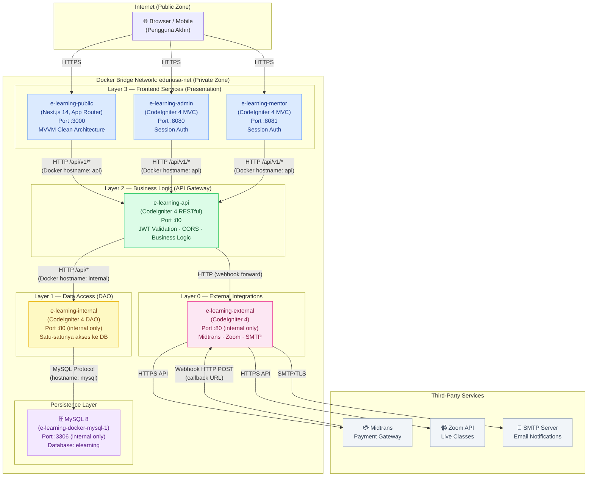

### Penjelasan Setiap Service

| Service | Teknologi | Port | Tanggung Jawab |
|---|---|---|---|
| **e-learning-public** | Next.js 14, App Router, TypeScript | 3000 | Portal siswa: landing page, katalog kursus, ruang belajar, dashboard siswa. MVVM Clean Architecture. |
| **e-learning-admin** | CodeIgniter 4 MVC, PHP 8.2 | 8080 | Backoffice untuk Superadmin, Finance, dan Academic Manager. Session-based auth. |
| **e-learning-mentor** | CodeIgniter 4 MVC, PHP 8.2 | 8081 | Portal instruktur untuk manajemen kursus, kurikulum, dan keuangan. Session-based auth terisolasi. |
| **e-learning-api** | CodeIgniter 4 RESTful, PHP 8.2 | 80 | API Gateway: validasi JWT, business logic, sanitasi input, CORS, orchestrasi request ke internal. |
| **e-learning-internal** | CodeIgniter 4 DAO, PHP 8.2 | 80 | Data Access Layer satu-satunya. Direct MySQL connection. Menyediakan RESTful API ke service lain. |
| **e-learning-external** | CodeIgniter 4, PHP 8.2 | 80 | Integrasi pihak ketiga: Midtrans, Zoom, SMTP. Satu-satunya service yang boleh memanggil API eksternal. |
| **MySQL 8** | MySQL 8.0, Docker | 3306 | Database tunggal terpusat. Hanya `internal` yang boleh membuka koneksi langsung. |

---

## Components and Interfaces

### Docker Compose Architecture

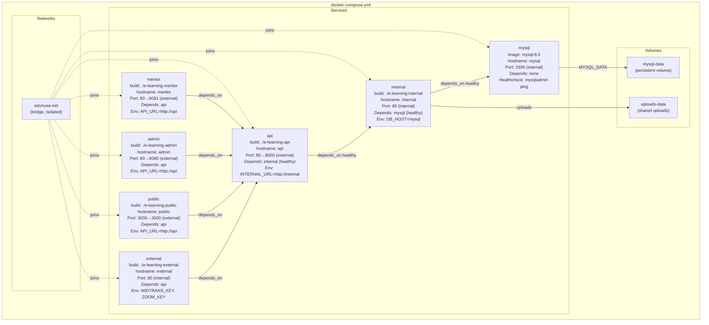

**Konfigurasi Docker Compose yang Direkomendasikan:**

```yaml
# docker-compose.yml
version: '3.8'

networks:
  edunusa-net:
    driver: bridge
    ipam:
      config:
        - subnet: 172.20.0.0/16

volumes:
  mysql-data:
    driver: local
  uploads-data:
    driver: local

services:
  mysql:
    image: mysql:8.0
    container_name: e-learning-docker-mysql-1
    hostname: mysql
    restart: unless-stopped
    environment:
      MYSQL_ROOT_PASSWORD: ${DB_ROOT_PASSWORD}
      MYSQL_DATABASE: elearning
      MYSQL_CHARSET: utf8mb4
      MYSQL_COLLATION: utf8mb4_unicode_ci
    volumes:
      - mysql-data:/var/lib/mysql
      - ./schema_uuid.sql:/docker-entrypoint-initdb.d/schema_uuid.sql:ro
    networks:
      - edunusa-net
    healthcheck:
      test: ["CMD", "mysqladmin", "ping", "-h", "localhost", "-u", "root", "-p${DB_ROOT_PASSWORD}"]
      interval: 10s
      timeout: 5s
      retries: 5
    # CATATAN PRODUKSI: Port 3306 TIDAK di-expose ke host
    # Hanya expose di development untuk debugging:
    # ports:
    #   - "127.0.0.1:3306:3306"

  internal:
    build:
      context: ./e-learning-internal
      dockerfile: Dockerfile
    container_name: e-learning-internal
    hostname: internal
    restart: unless-stopped
    environment:
      CI_ENVIRONMENT: production
      database.default.hostname: mysql
      database.default.database: elearning
      database.default.username: ${DB_USERNAME}
      database.default.password: ${DB_PASSWORD}
    volumes:
      - uploads-data:/var/www/html/public/uploads
    networks:
      - edunusa-net
    depends_on:
      mysql:
        condition: service_healthy
    healthcheck:
      test: ["CMD", "curl", "-f", "http://localhost/health"]
      interval: 15s
      timeout: 5s
      retries: 3

  api:
    build:
      context: ./e-learning-api
      dockerfile: Dockerfile
    container_name: e-learning-api
    hostname: api
    restart: unless-stopped
    environment:
      CI_ENVIRONMENT: production
      JWT_SECRET: ${JWT_SECRET}
      INTERNAL_BASE_URL: http://internal
    ports:
      - "8000:80"
    networks:
      - edunusa-net
    depends_on:
      internal:
        condition: service_healthy

  external:
    build:
      context: ./e-learning-external
      dockerfile: Dockerfile
    container_name: e-learning-external
    hostname: external
    restart: unless-stopped
    environment:
      CI_ENVIRONMENT: production
      MIDTRANS_SERVER_KEY: ${MIDTRANS_SERVER_KEY}
      MIDTRANS_CLIENT_KEY: ${MIDTRANS_CLIENT_KEY}
      ZOOM_API_KEY: ${ZOOM_API_KEY}
      SMTP_HOST: ${SMTP_HOST}
      INTERNAL_BASE_URL: http://internal
      API_BASE_URL: http://api
    networks:
      - edunusa-net
    depends_on:
      - api

  public:
    build:
      context: ./e-learning-public
      dockerfile: Dockerfile
    container_name: e-learning-public
    hostname: public
    restart: unless-stopped
    environment:
      NEXT_PUBLIC_API_URL: ${PUBLIC_API_URL}
      API_INTERNAL_URL: http://api
    ports:
      - "3000:3000"
    networks:
      - edunusa-net
    depends_on:
      - api

  admin:
    build:
      context: ./e-learning-admin
      dockerfile: Dockerfile
    container_name: e-learning-admin
    hostname: admin
    restart: unless-stopped
    environment:
      CI_ENVIRONMENT: production
      API_BASE_URL: http://api
    ports:
      - "8080:80"
    networks:
      - edunusa-net
    depends_on:
      - api

  mentor:
    build:
      context: ./e-learning-mentor
      dockerfile: Dockerfile
    container_name: e-learning-mentor
    hostname: mentor
    restart: unless-stopped
    environment:
      CI_ENVIRONMENT: production
      API_BASE_URL: http://api
    ports:
      - "8081:80"
    networks:
      - edunusa-net
    depends_on:
      - api
```

### Startup Dependency Chain

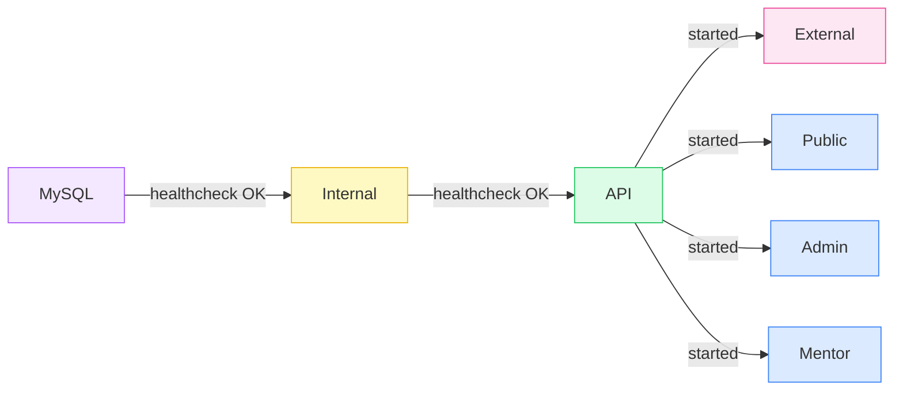

---

## Data Models

### Entity Relationship Diagram

```mermaid
erDiagram
    %% ====================================
    %% IDENTITY ENTITIES
    %% ====================================
    users {
        CHAR_36 id PK "UUID v4"
        VARCHAR_150 name "NOT NULL"
        VARCHAR_150 email UK "NOT NULL UNIQUE"
        VARCHAR_255 password "bcrypt hash"
        ENUM role "student|parent|general|pending"
        VARCHAR_255 photo
        VARCHAR_20 phone
        TINYINT_1 is_active "DEFAULT 1"
        VARCHAR_100 remember_token
        DATETIME created_at
        DATETIME updated_at
        DATETIME deleted_at "soft delete"
    }

    admins {
        CHAR_36 id PK "UUID v4"
        VARCHAR_150 name "NOT NULL"
        VARCHAR_150 email UK "NOT NULL UNIQUE"
        VARCHAR_255 password "bcrypt hash"
        ENUM role "superadmin|finance|academic"
        VARCHAR_255 photo
        VARCHAR_20 phone
        TINYINT_1 is_active "DEFAULT 1"
        DATETIME created_at
        DATETIME updated_at
        DATETIME deleted_at "soft delete"
    }

    mentors {
        CHAR_36 id PK "UUID v4"
        VARCHAR_150 name "NOT NULL"
        VARCHAR_150 email UK "NOT NULL UNIQUE"
        VARCHAR_255 password "bcrypt hash"
        VARCHAR_255 photo
        VARCHAR_20 phone
        TEXT bio
        TINYINT_1 is_active "DEFAULT 1"
        DATETIME created_at
        DATETIME updated_at
        DATETIME deleted_at "soft delete"
    }

    user_profiles {
        CHAR_36 id PK "UUID v4"
        CHAR_36 user_id UK "FK → users.id"
        DATE date_of_birth
        TEXT address
        VARCHAR_100 city
        VARCHAR_100 province
        DATETIME created_at
        DATETIME updated_at
    }

    %% ====================================
    %% CURRICULUM ENTITIES
    %% ====================================
    categories {
        CHAR_36 id PK "UUID v4"
        VARCHAR_255 name "NOT NULL"
        VARCHAR_255 slug UK "NOT NULL UNIQUE"
        VARCHAR_255 icon
        CHAR_36 parent_id "FK → categories.id (self-ref)"
        TINYINT_1 is_active "DEFAULT 1"
        TIMESTAMP created_at
        TIMESTAMP updated_at
    }

    courses {
        CHAR_36 id PK "UUID v4"
        VARCHAR_255 title "NOT NULL"
        VARCHAR_255 slug UK "NOT NULL UNIQUE"
        TEXT description
        TEXT full_description
        VARCHAR_255 thumbnail
        VARCHAR_500 trailer_url
        DECIMAL_10_2 price "DEFAULT 0.00"
        ENUM level "beginner|intermediate|advanced|all"
        ENUM status "draft|published|archived"
        CHAR_36 instructor_id "FK → mentors.id"
        CHAR_36 category_id "FK → categories.id"
        TIMESTAMP created_at
        TIMESTAMP updated_at
    }

    course_sections {
        CHAR_36 id PK "UUID v4"
        CHAR_36 course_id "FK → courses.id"
        VARCHAR_255 title "NOT NULL"
        INT order_index "DEFAULT 0"
        TIMESTAMP created_at
        TIMESTAMP updated_at
        DATETIME deleted_at "soft delete"
    }

    lessons {
        CHAR_36 id PK "UUID v4"
        CHAR_36 section_id "FK → course_sections.id"
        VARCHAR_255 title "NOT NULL"
        ENUM type "video|pdf|article"
        TEXT content
        INT duration "seconds"
        BOOLEAN is_free "DEFAULT FALSE"
        INT order_index "DEFAULT 0"
        TIMESTAMP created_at
        TIMESTAMP updated_at
        DATETIME deleted_at "soft delete"
    }

    %% ====================================
    %% TRANSACTION ENTITIES
    %% ====================================
    orders {
        CHAR_36 id PK "UUID v4"
        VARCHAR_100 order_code UK "TRX-... format"
        CHAR_36 user_id "FK → users.id"
        CHAR_36 course_id "FK → courses.id"
        DECIMAL_10_2 amount "NOT NULL"
        ENUM status "pending|paid|failed|expired|refunded"
        VARCHAR_100 payment_method
        DATETIME payment_date
        VARCHAR_500 midtrans_token
        DATETIME expired_at
        TIMESTAMP created_at
        TIMESTAMP updated_at
    }

    enrollments {
        CHAR_36 id PK "UUID v4"
        CHAR_36 user_id "FK → users.id"
        CHAR_36 course_id "FK → courses.id"
        CHAR_36 order_id "FK → orders.id"
        DATETIME enrolled_at
        TIMESTAMP created_at
        TIMESTAMP updated_at
    }

    mentor_earnings {
        CHAR_36 id PK "UUID v4"
        CHAR_36 mentor_id "FK → mentors.id"
        CHAR_36 order_id "FK → orders.id"
        CHAR_36 course_id "FK → courses.id"
        DECIMAL_10_2 gross_amount "NOT NULL"
        DECIMAL_5_2 commission_rate "DEFAULT 70.00"
        DECIMAL_10_2 net_amount "NOT NULL"
        ENUM status "pending|disbursed"
        TIMESTAMP created_at
        TIMESTAMP updated_at
    }

    payroll_periods {
        CHAR_36 id PK "UUID v4"
        CHAR_36 mentor_id "FK → mentors.id"
        DATE period_start "NOT NULL"
        DATE period_end "NOT NULL"
        DECIMAL_10_2 total_amount "DEFAULT 0.00"
        ENUM status "draft|processing|paid"
        DATETIME paid_at
        TIMESTAMP created_at
        TIMESTAMP updated_at
    }

    %% ====================================
    %% ACADEMIC ENTITIES
    %% ====================================
    lesson_progress {
        CHAR_36 id PK "UUID v4"
        CHAR_36 user_id "FK → users.id"
        CHAR_36 lesson_id "FK → lessons.id"
        CHAR_36 course_id "FK → courses.id"
        BOOLEAN is_completed "DEFAULT FALSE"
        DATETIME completed_at
        TIMESTAMP created_at
        TIMESTAMP updated_at
    }

    quizzes {
        CHAR_36 id PK "UUID v4"
        CHAR_36 course_id "FK → courses.id"
        CHAR_36 section_id "FK → course_sections.id"
        VARCHAR_255 title "NOT NULL"
        INT duration "minutes"
        INT passing_grade "DEFAULT 70"
        TIMESTAMP created_at
        TIMESTAMP updated_at
    }

    questions {
        CHAR_36 id PK "UUID v4"
        CHAR_36 quiz_id "FK → quizzes.id"
        TEXT question_text "NOT NULL"
        JSON options "array pilihan jawaban"
        VARCHAR_10 correct_answer "a/b/c/d"
        INT score_weight "DEFAULT 1"
        INT order_index "DEFAULT 0"
        TIMESTAMP created_at
        TIMESTAMP updated_at
    }

    quiz_attempts {
        CHAR_36 id PK "UUID v4"
        CHAR_36 quiz_id "FK → quizzes.id"
        CHAR_36 user_id "FK → users.id"
        DECIMAL_5_2 score "DEFAULT 0.00"
        BOOLEAN is_passed "DEFAULT FALSE"
        JSON answers "snapshot jawaban siswa"
        DATETIME started_at
        DATETIME completed_at
        TIMESTAMP created_at
        TIMESTAMP updated_at
    }

    %% ====================================
    %% RELATIONSHIPS
    %% ====================================
    users ||--o| user_profiles : "1:1 has profile"
    categories ||--o{ categories : "self-ref parent_id"
    mentors ||--o{ courses : "1:N teaches"
    categories ||--o{ courses : "1:N belongs to"
    courses ||--o{ course_sections : "1:N has sections"
    course_sections ||--o{ lessons : "1:N has lessons"
    users ||--o{ orders : "1:N places"
    courses ||--o{ orders : "1:N purchased via"
    users ||--o{ enrollments : "1:N enrolled in"
    courses ||--o{ enrollments : "1:N enrolls students"
    orders ||--o| enrollments : "1:1 grants access"
    orders ||--o| mentor_earnings : "1:1 generates commission"
    mentors ||--o{ mentor_earnings : "1:N earns from"
    mentors ||--o{ payroll_periods : "1:N receives payout"
    users ||--o{ lesson_progress : "1:N tracks"
    lessons ||--o{ lesson_progress : "1:N tracked by"
    courses ||--o{ quizzes : "1:N has quizzes"
    course_sections ||--o{ quizzes : "1:N has section quiz"
    quizzes ||--o{ questions : "1:N contains"
    quizzes ||--o{ quiz_attempts : "1:N attempted by"
    users ||--o{ quiz_attempts : "1:N attempts"
```

### DDL SQL Lengkap — Semua Tabel

```sql
-- ============================================================
-- EduNusa Database Schema
-- MySQL 8.0 | Charset: utf8mb4 | Collation: utf8mb4_unicode_ci
-- Arsitektur: Strict UUID v4 | Soft Delete | Audit Trail
-- ============================================================

DROP DATABASE IF EXISTS elearning;
CREATE DATABASE elearning
  CHARACTER SET utf8mb4
  COLLATE utf8mb4_unicode_ci;
USE elearning;

-- ------------------------------------------------------------
-- IDENTITY TABLES
-- Tiga entitas pengguna yang sepenuhnya TERPISAH.
-- Dilarang keras menggabungkan ke satu tabel.
-- ------------------------------------------------------------

CREATE TABLE users (
    id             CHAR(36)      NOT NULL,
    name           VARCHAR(150)  NOT NULL,
    email          VARCHAR(150)  NOT NULL,
    password       VARCHAR(255)  NOT NULL COMMENT 'bcrypt PASSWORD_DEFAULT',
    role           ENUM('student', 'parent', 'general', 'pending') NOT NULL DEFAULT 'pending',
    photo          VARCHAR(255)  DEFAULT NULL,
    phone          VARCHAR(20)   DEFAULT NULL,
    is_active      TINYINT(1)    NOT NULL DEFAULT 1,
    remember_token VARCHAR(100)  DEFAULT NULL,
    created_at     DATETIME      NOT NULL DEFAULT CURRENT_TIMESTAMP,
    updated_at     DATETIME      NOT NULL DEFAULT CURRENT_TIMESTAMP ON UPDATE CURRENT_TIMESTAMP,
    deleted_at     DATETIME      DEFAULT NULL COMMENT 'soft delete — NULL = aktif',
    PRIMARY KEY (id),
    UNIQUE KEY uq_users_email (email),
    KEY idx_users_role (role),
    KEY idx_users_deleted_at (deleted_at)
) ENGINE=InnoDB DEFAULT CHARSET=utf8mb4 COLLATE=utf8mb4_unicode_ci;

CREATE TABLE admins (
    id             CHAR(36)      NOT NULL,
    name           VARCHAR(150)  NOT NULL,
    email          VARCHAR(150)  NOT NULL,
    password       VARCHAR(255)  NOT NULL COMMENT 'bcrypt PASSWORD_DEFAULT',
    role           ENUM('superadmin', 'finance', 'academic') NOT NULL DEFAULT 'superadmin',
    photo          VARCHAR(255)  DEFAULT NULL,
    phone          VARCHAR(20)   DEFAULT NULL,
    is_active      TINYINT(1)    NOT NULL DEFAULT 1,
    remember_token VARCHAR(100)  DEFAULT NULL,
    created_at     DATETIME      NOT NULL DEFAULT CURRENT_TIMESTAMP,
    updated_at     DATETIME      NOT NULL DEFAULT CURRENT_TIMESTAMP ON UPDATE CURRENT_TIMESTAMP,
    deleted_at     DATETIME      DEFAULT NULL COMMENT 'soft delete',
    PRIMARY KEY (id),
    UNIQUE KEY uq_admins_email (email),
    KEY idx_admins_role (role),
    KEY idx_admins_deleted_at (deleted_at)
    -- CATATAN: Tidak ada FK ke users atau mentors (strict separation)
) ENGINE=InnoDB DEFAULT CHARSET=utf8mb4 COLLATE=utf8mb4_unicode_ci;

CREATE TABLE mentors (
    id             CHAR(36)      NOT NULL,
    name           VARCHAR(150)  NOT NULL,
    email          VARCHAR(150)  NOT NULL,
    password       VARCHAR(255)  NOT NULL COMMENT 'bcrypt PASSWORD_DEFAULT',
    photo          VARCHAR(255)  DEFAULT NULL,
    phone          VARCHAR(20)   DEFAULT NULL,
    bio            TEXT          DEFAULT NULL,
    is_active      TINYINT(1)    NOT NULL DEFAULT 1,
    remember_token VARCHAR(100)  DEFAULT NULL,
    created_at     DATETIME      NOT NULL DEFAULT CURRENT_TIMESTAMP,
    updated_at     DATETIME      NOT NULL DEFAULT CURRENT_TIMESTAMP ON UPDATE CURRENT_TIMESTAMP,
    deleted_at     DATETIME      DEFAULT NULL COMMENT 'soft delete',
    PRIMARY KEY (id),
    UNIQUE KEY uq_mentors_email (email),
    KEY idx_mentors_deleted_at (deleted_at)
    -- CATATAN: Tidak ada FK ke users atau admins (strict separation)
) ENGINE=InnoDB DEFAULT CHARSET=utf8mb4 COLLATE=utf8mb4_unicode_ci;

CREATE TABLE user_profiles (
    id            CHAR(36)      NOT NULL,
    user_id       CHAR(36)      NOT NULL,
    date_of_birth DATE          DEFAULT NULL,
    address       TEXT          DEFAULT NULL,
    city          VARCHAR(100)  DEFAULT NULL,
    province      VARCHAR(100)  DEFAULT NULL,
    created_at    DATETIME      NOT NULL DEFAULT CURRENT_TIMESTAMP,
    updated_at    DATETIME      NOT NULL DEFAULT CURRENT_TIMESTAMP ON UPDATE CURRENT_TIMESTAMP,
    PRIMARY KEY (id),
    UNIQUE KEY uq_user_profiles_user_id (user_id) COMMENT '1:1 dengan tabel users',
    CONSTRAINT fk_user_profiles_user
        FOREIGN KEY (user_id) REFERENCES users(id) ON DELETE CASCADE
) ENGINE=InnoDB DEFAULT CHARSET=utf8mb4 COLLATE=utf8mb4_unicode_ci;

-- ------------------------------------------------------------
-- CURRICULUM TABLES
-- Hierarki: categories → courses → course_sections → lessons
-- ------------------------------------------------------------

CREATE TABLE categories (
    id         CHAR(36)      NOT NULL,
    name       VARCHAR(255)  NOT NULL,
    slug       VARCHAR(255)  NOT NULL,
    icon       VARCHAR(255)  DEFAULT NULL COMMENT 'CSS class name (e.g. fa-code)',
    parent_id  CHAR(36)      DEFAULT NULL COMMENT 'NULL = kategori root; FK ke self = sub-kategori',
    is_active  TINYINT(1)    NOT NULL DEFAULT 1,
    created_at TIMESTAMP     NOT NULL DEFAULT CURRENT_TIMESTAMP,
    updated_at TIMESTAMP     NOT NULL DEFAULT CURRENT_TIMESTAMP ON UPDATE CURRENT_TIMESTAMP,
    PRIMARY KEY (id),
    UNIQUE KEY uq_categories_slug (slug),
    KEY idx_categories_parent_id (parent_id),
    KEY idx_categories_is_active (is_active),
    CONSTRAINT fk_categories_parent
        FOREIGN KEY (parent_id) REFERENCES categories(id) ON DELETE SET NULL
) ENGINE=InnoDB DEFAULT CHARSET=utf8mb4 COLLATE=utf8mb4_unicode_ci;

CREATE TABLE courses (
    id               CHAR(36)        NOT NULL,
    title            VARCHAR(255)    NOT NULL,
    slug             VARCHAR(255)    NOT NULL,
    description      TEXT            DEFAULT NULL,
    full_description TEXT            DEFAULT NULL,
    thumbnail        VARCHAR(255)    DEFAULT NULL,
    trailer_url      VARCHAR(500)    DEFAULT NULL,
    price            DECIMAL(10, 2)  NOT NULL DEFAULT 0.00,
    level            ENUM('beginner', 'intermediate', 'advanced', 'all') NOT NULL DEFAULT 'all',
    status           ENUM('draft', 'published', 'archived') NOT NULL DEFAULT 'draft',
    instructor_id    CHAR(36)        NOT NULL,
    category_id      CHAR(36)        DEFAULT NULL,
    created_at       TIMESTAMP       NOT NULL DEFAULT CURRENT_TIMESTAMP,
    updated_at       TIMESTAMP       NOT NULL DEFAULT CURRENT_TIMESTAMP ON UPDATE CURRENT_TIMESTAMP,
    PRIMARY KEY (id),
    UNIQUE KEY uq_courses_slug (slug),
    KEY idx_courses_status (status) COMMENT 'Digunakan untuk filter katalog published',
    KEY idx_courses_instructor_id (instructor_id),
    KEY idx_courses_category_id (category_id),
    CONSTRAINT fk_courses_instructor
        FOREIGN KEY (instructor_id) REFERENCES mentors(id) ON DELETE CASCADE,
    CONSTRAINT fk_courses_category
        FOREIGN KEY (category_id) REFERENCES categories(id) ON DELETE SET NULL
) ENGINE=InnoDB DEFAULT CHARSET=utf8mb4 COLLATE=utf8mb4_unicode_ci;

CREATE TABLE course_sections (
    id          CHAR(36)      NOT NULL,
    course_id   CHAR(36)      NOT NULL,
    title       VARCHAR(255)  NOT NULL,
    order_index INT           NOT NULL DEFAULT 0 COMMENT 'Urutan tampil dalam kursus',
    created_at  TIMESTAMP     NOT NULL DEFAULT CURRENT_TIMESTAMP,
    updated_at  TIMESTAMP     NOT NULL DEFAULT CURRENT_TIMESTAMP ON UPDATE CURRENT_TIMESTAMP,
    deleted_at  DATETIME      DEFAULT NULL COMMENT 'soft delete',
    PRIMARY KEY (id),
    KEY idx_sections_course_id (course_id),
    KEY idx_sections_order (course_id, order_index),
    CONSTRAINT fk_sections_course
        FOREIGN KEY (course_id) REFERENCES courses(id) ON DELETE CASCADE
) ENGINE=InnoDB DEFAULT CHARSET=utf8mb4 COLLATE=utf8mb4_unicode_ci;

CREATE TABLE lessons (
    id          CHAR(36)                        NOT NULL,
    section_id  CHAR(36)                        NOT NULL,
    title       VARCHAR(255)                    NOT NULL,
    type        ENUM('video', 'pdf', 'article') NOT NULL DEFAULT 'video',
    content     TEXT                            DEFAULT NULL COMMENT 'URL video / path PDF / teks artikel',
    duration    INT                             NOT NULL DEFAULT 0 COMMENT 'Durasi dalam detik',
    is_free     TINYINT(1)                      NOT NULL DEFAULT 0 COMMENT 'Free preview untuk non-enrolled',
    order_index INT                             NOT NULL DEFAULT 0 COMMENT 'Urutan tampil dalam seksi',
    created_at  TIMESTAMP                       NOT NULL DEFAULT CURRENT_TIMESTAMP,
    updated_at  TIMESTAMP                       NOT NULL DEFAULT CURRENT_TIMESTAMP ON UPDATE CURRENT_TIMESTAMP,
    deleted_at  DATETIME                        DEFAULT NULL COMMENT 'soft delete',
    PRIMARY KEY (id),
    KEY idx_lessons_section_id (section_id),
    KEY idx_lessons_order (section_id, order_index),
    KEY idx_lessons_is_free (is_free),
    CONSTRAINT fk_lessons_section
        FOREIGN KEY (section_id) REFERENCES course_sections(id) ON DELETE CASCADE
) ENGINE=InnoDB DEFAULT CHARSET=utf8mb4 COLLATE=utf8mb4_unicode_ci;

-- ------------------------------------------------------------
-- TRANSACTION TABLES
-- Alur: orders (pending) → paid → enrollments + mentor_earnings
-- ------------------------------------------------------------

CREATE TABLE orders (
    id              CHAR(36)        NOT NULL,
    order_code      VARCHAR(100)    NOT NULL COMMENT 'Format: TRX-{TIMESTAMP}-{RANDOM}',
    user_id         CHAR(36)        NOT NULL,
    course_id       CHAR(36)        NOT NULL,
    amount          DECIMAL(10, 2)  NOT NULL,
    status          ENUM('pending', 'paid', 'failed', 'expired', 'refunded') NOT NULL DEFAULT 'pending',
    payment_method  VARCHAR(100)    DEFAULT NULL,
    payment_date    DATETIME        DEFAULT NULL,
    midtrans_token  VARCHAR(500)    DEFAULT NULL COMMENT 'Snap token dari Midtrans',
    expired_at      DATETIME        DEFAULT NULL COMMENT 'Batas waktu pembayaran (1 jam)',
    created_at      TIMESTAMP       NOT NULL DEFAULT CURRENT_TIMESTAMP,
    updated_at      TIMESTAMP       NOT NULL DEFAULT CURRENT_TIMESTAMP ON UPDATE CURRENT_TIMESTAMP,
    PRIMARY KEY (id),
    UNIQUE KEY uq_orders_order_code (order_code),
    KEY idx_orders_user_id (user_id),
    KEY idx_orders_course_id (course_id),
    KEY idx_orders_status (status),
    CONSTRAINT fk_orders_user
        FOREIGN KEY (user_id) REFERENCES users(id) ON DELETE CASCADE,
    CONSTRAINT fk_orders_course
        FOREIGN KEY (course_id) REFERENCES courses(id) ON DELETE CASCADE
) ENGINE=InnoDB DEFAULT CHARSET=utf8mb4 COLLATE=utf8mb4_unicode_ci;

CREATE TABLE enrollments (
    id          CHAR(36)    NOT NULL,
    user_id     CHAR(36)    NOT NULL,
    course_id   CHAR(36)    NOT NULL,
    order_id    CHAR(36)    DEFAULT NULL COMMENT 'NULL jika enrollment manual/gratis',
    enrolled_at DATETIME    NOT NULL DEFAULT CURRENT_TIMESTAMP,
    created_at  TIMESTAMP   NOT NULL DEFAULT CURRENT_TIMESTAMP,
    updated_at  TIMESTAMP   NOT NULL DEFAULT CURRENT_TIMESTAMP ON UPDATE CURRENT_TIMESTAMP,
    PRIMARY KEY (id),
    UNIQUE KEY uq_enrollments_user_course (user_id, course_id) COMMENT 'Mencegah double enrollment di level DB',
    KEY idx_enrollments_user_id (user_id),
    KEY idx_enrollments_course_id (course_id),
    CONSTRAINT fk_enrollments_user
        FOREIGN KEY (user_id) REFERENCES users(id) ON DELETE CASCADE,
    CONSTRAINT fk_enrollments_course
        FOREIGN KEY (course_id) REFERENCES courses(id) ON DELETE CASCADE,
    CONSTRAINT fk_enrollments_order
        FOREIGN KEY (order_id) REFERENCES orders(id) ON DELETE SET NULL
) ENGINE=InnoDB DEFAULT CHARSET=utf8mb4 COLLATE=utf8mb4_unicode_ci;

CREATE TABLE mentor_earnings (
    id              CHAR(36)        NOT NULL,
    mentor_id       CHAR(36)        NOT NULL,
    order_id        CHAR(36)        NOT NULL,
    course_id       CHAR(36)        NOT NULL,
    gross_amount    DECIMAL(10, 2)  NOT NULL COMMENT 'Total pembayaran bruto dari siswa',
    commission_rate DECIMAL(5, 2)   NOT NULL DEFAULT 70.00 COMMENT 'Persentase komisi mentor (default 70%)',
    net_amount      DECIMAL(10, 2)  NOT NULL COMMENT 'gross_amount * (commission_rate / 100)',
    status          ENUM('pending', 'disbursed') NOT NULL DEFAULT 'pending',
    created_at      TIMESTAMP       NOT NULL DEFAULT CURRENT_TIMESTAMP,
    updated_at      TIMESTAMP       NOT NULL DEFAULT CURRENT_TIMESTAMP ON UPDATE CURRENT_TIMESTAMP,
    PRIMARY KEY (id),
    KEY idx_mentor_earnings_mentor_id (mentor_id),
    KEY idx_mentor_earnings_status (status),
    CONSTRAINT fk_mentor_earnings_mentor
        FOREIGN KEY (mentor_id) REFERENCES mentors(id) ON DELETE CASCADE,
    CONSTRAINT fk_mentor_earnings_order
        FOREIGN KEY (order_id) REFERENCES orders(id) ON DELETE CASCADE,
    CONSTRAINT fk_mentor_earnings_course
        FOREIGN KEY (course_id) REFERENCES courses(id) ON DELETE CASCADE
) ENGINE=InnoDB DEFAULT CHARSET=utf8mb4 COLLATE=utf8mb4_unicode_ci;

CREATE TABLE payroll_periods (
    id           CHAR(36)        NOT NULL,
    mentor_id    CHAR(36)        NOT NULL,
    period_start DATE            NOT NULL,
    period_end   DATE            NOT NULL,
    total_amount DECIMAL(10, 2)  NOT NULL DEFAULT 0.00,
    status       ENUM('draft', 'processing', 'paid') NOT NULL DEFAULT 'draft',
    paid_at      DATETIME        DEFAULT NULL,
    created_at   TIMESTAMP       NOT NULL DEFAULT CURRENT_TIMESTAMP,
    updated_at   TIMESTAMP       NOT NULL DEFAULT CURRENT_TIMESTAMP ON UPDATE CURRENT_TIMESTAMP,
    PRIMARY KEY (id),
    KEY idx_payroll_mentor_id (mentor_id),
    KEY idx_payroll_status (status),
    CONSTRAINT fk_payroll_mentor
        FOREIGN KEY (mentor_id) REFERENCES mentors(id) ON DELETE CASCADE
) ENGINE=InnoDB DEFAULT CHARSET=utf8mb4 COLLATE=utf8mb4_unicode_ci;

-- ------------------------------------------------------------
-- ACADEMIC TABLES
-- Progress tracking, kuis, soal, dan riwayat pengerjaan
-- ------------------------------------------------------------

CREATE TABLE lesson_progress (
    id           CHAR(36)    NOT NULL,
    user_id      CHAR(36)    NOT NULL,
    lesson_id    CHAR(36)    NOT NULL,
    course_id    CHAR(36)    NOT NULL,
    is_completed TINYINT(1)  NOT NULL DEFAULT 0,
    completed_at DATETIME    DEFAULT NULL,
    created_at   TIMESTAMP   NOT NULL DEFAULT CURRENT_TIMESTAMP,
    updated_at   TIMESTAMP   NOT NULL DEFAULT CURRENT_TIMESTAMP ON UPDATE CURRENT_TIMESTAMP,
    PRIMARY KEY (id),
    UNIQUE KEY uq_lesson_progress (user_id, lesson_id) COMMENT 'Satu entri per siswa per materi',
    KEY idx_progress_course_id (course_id),
    CONSTRAINT fk_progress_user
        FOREIGN KEY (user_id) REFERENCES users(id) ON DELETE CASCADE,
    CONSTRAINT fk_progress_lesson
        FOREIGN KEY (lesson_id) REFERENCES lessons(id) ON DELETE CASCADE,
    CONSTRAINT fk_progress_course
        FOREIGN KEY (course_id) REFERENCES courses(id) ON DELETE CASCADE
) ENGINE=InnoDB DEFAULT CHARSET=utf8mb4 COLLATE=utf8mb4_unicode_ci;

CREATE TABLE quizzes (
    id           CHAR(36)      NOT NULL,
    course_id    CHAR(36)      NOT NULL,
    section_id   CHAR(36)      DEFAULT NULL COMMENT 'NULL = kuis akhir kursus; NOT NULL = kuis seksi',
    title        VARCHAR(255)  NOT NULL,
    duration     INT           NOT NULL DEFAULT 0 COMMENT 'Durasi dalam menit; 0 = tanpa batas waktu',
    passing_grade INT          NOT NULL DEFAULT 70 COMMENT 'Nilai minimum kelulusan (0-100)',
    created_at   TIMESTAMP     NOT NULL DEFAULT CURRENT_TIMESTAMP,
    updated_at   TIMESTAMP     NOT NULL DEFAULT CURRENT_TIMESTAMP ON UPDATE CURRENT_TIMESTAMP,
    PRIMARY KEY (id),
    KEY idx_quizzes_course_id (course_id),
    CONSTRAINT fk_quizzes_course
        FOREIGN KEY (course_id) REFERENCES courses(id) ON DELETE CASCADE,
    CONSTRAINT fk_quizzes_section
        FOREIGN KEY (section_id) REFERENCES course_sections(id) ON DELETE SET NULL
) ENGINE=InnoDB DEFAULT CHARSET=utf8mb4 COLLATE=utf8mb4_unicode_ci;

CREATE TABLE questions (
    id             CHAR(36)      NOT NULL,
    quiz_id        CHAR(36)      NOT NULL,
    question_text  TEXT          NOT NULL,
    options        JSON          NOT NULL COMMENT 'Array JSON: [{"key":"a","text":"..."},{"key":"b","text":"..."}]',
    correct_answer VARCHAR(10)   NOT NULL COMMENT 'Kunci jawaban: a, b, c, atau d',
    score_weight   INT           NOT NULL DEFAULT 1 COMMENT 'Bobot nilai soal',
    order_index    INT           NOT NULL DEFAULT 0,
    created_at     TIMESTAMP     NOT NULL DEFAULT CURRENT_TIMESTAMP,
    updated_at     TIMESTAMP     NOT NULL DEFAULT CURRENT_TIMESTAMP ON UPDATE CURRENT_TIMESTAMP,
    PRIMARY KEY (id),
    KEY idx_questions_quiz_id (quiz_id),
    CONSTRAINT fk_questions_quiz
        FOREIGN KEY (quiz_id) REFERENCES quizzes(id) ON DELETE CASCADE
) ENGINE=InnoDB DEFAULT CHARSET=utf8mb4 COLLATE=utf8mb4_unicode_ci;

CREATE TABLE quiz_attempts (
    id           CHAR(36)        NOT NULL,
    quiz_id      CHAR(36)        NOT NULL,
    user_id      CHAR(36)        NOT NULL,
    score        DECIMAL(5, 2)   NOT NULL DEFAULT 0.00,
    is_passed    TINYINT(1)      NOT NULL DEFAULT 0,
    answers      JSON            DEFAULT NULL COMMENT 'Snapshot: {"q_id":"jawaban_user", ...}',
    started_at   DATETIME        DEFAULT NULL,
    completed_at DATETIME        DEFAULT NULL,
    created_at   TIMESTAMP       NOT NULL DEFAULT CURRENT_TIMESTAMP,
    updated_at   TIMESTAMP       NOT NULL DEFAULT CURRENT_TIMESTAMP ON UPDATE CURRENT_TIMESTAMP,
    PRIMARY KEY (id),
    KEY idx_attempts_quiz_id (quiz_id),
    KEY idx_attempts_user_id (user_id),
    CONSTRAINT fk_attempts_quiz
        FOREIGN KEY (quiz_id) REFERENCES quizzes(id) ON DELETE CASCADE,
    CONSTRAINT fk_attempts_user
        FOREIGN KEY (user_id) REFERENCES users(id) ON DELETE CASCADE
) ENGINE=InnoDB DEFAULT CHARSET=utf8mb4 COLLATE=utf8mb4_unicode_ci;
```

### Index Strategy

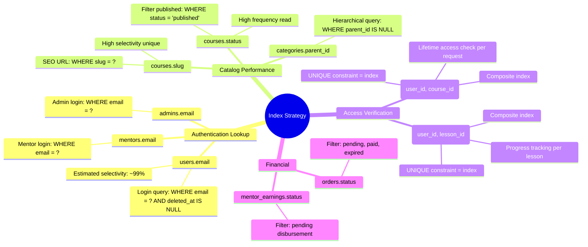

---

## API Flow Diagrams

### Alur 1: Registrasi User Baru (daftar → pending → onboarding → role definitif)

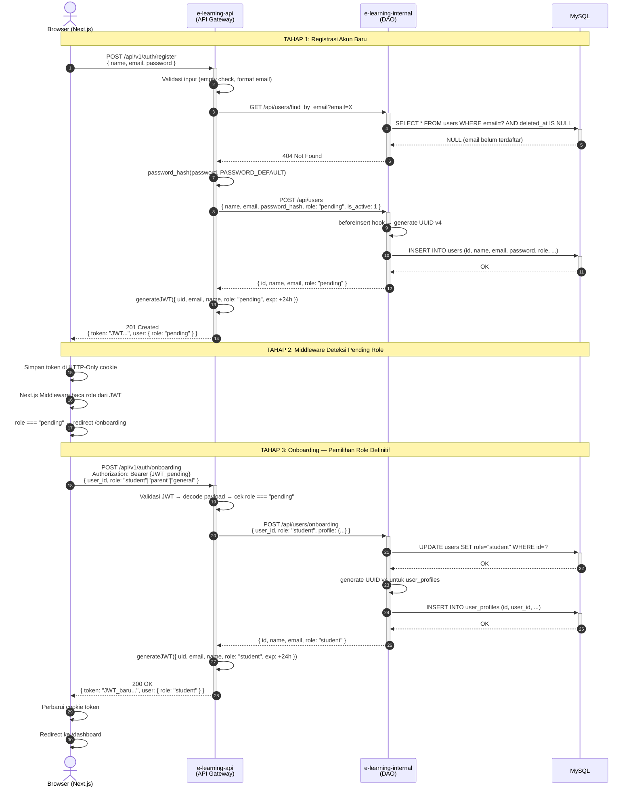

### Alur 2: Login & JWT Validation

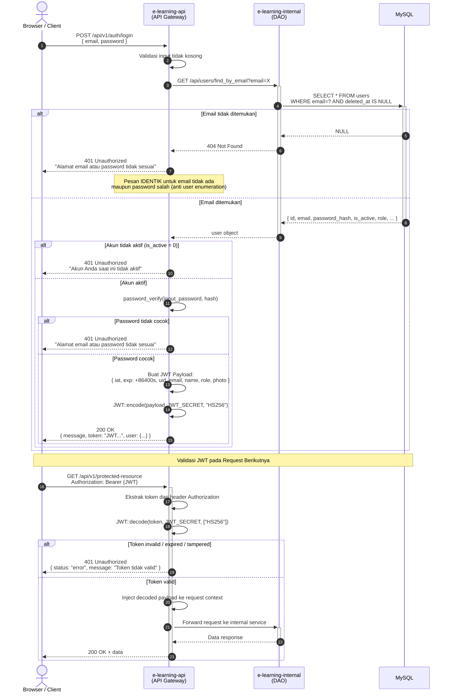

### Alur 3: Request Data Frontend → API → Internal → DB

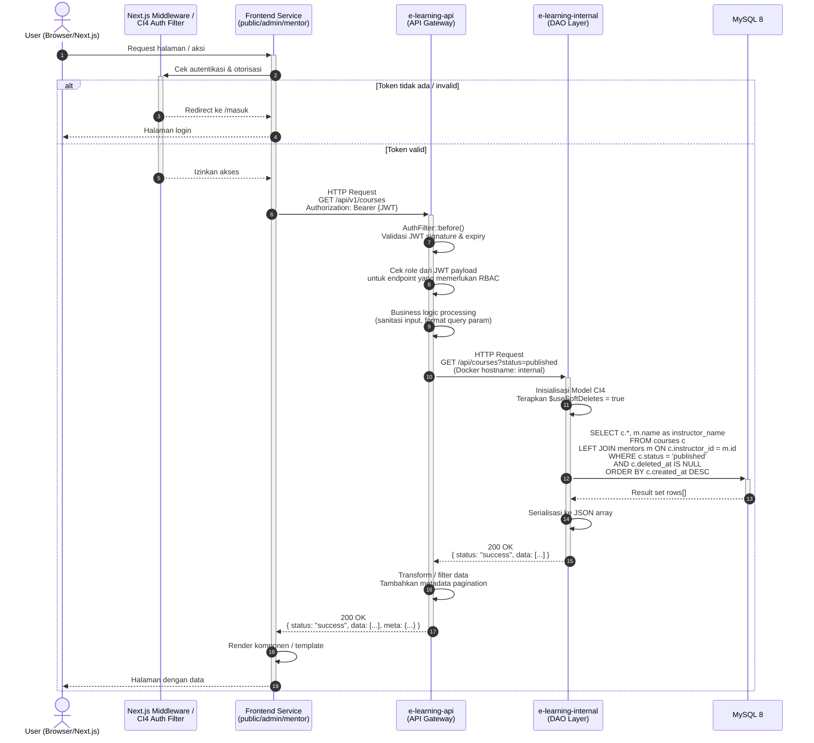

### Alur 4: Pembuatan Kursus oleh Mentor

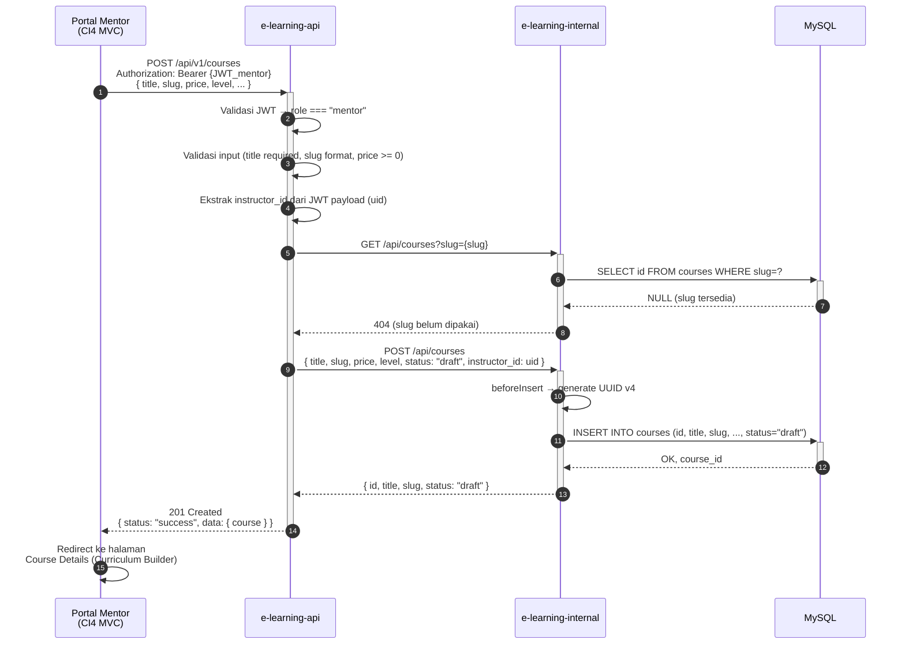

---

## MVVM Architecture (Next.js e-learning-public)

### Layer Diagram

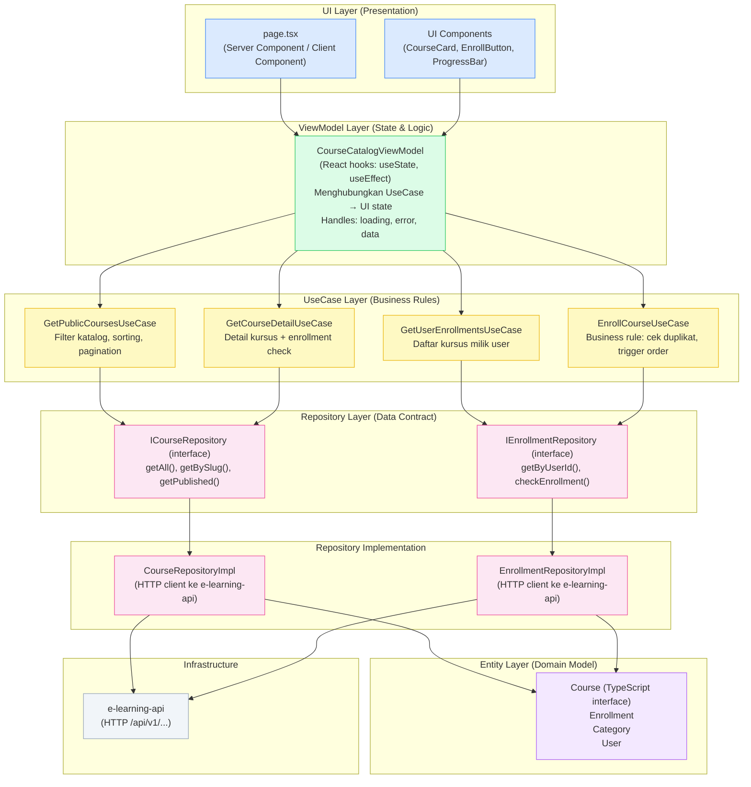

### Implementasi Konkret — Course Entity (TypeScript)

```typescript
// ============================================================
// LAYER 1: Entity (core/entities/Course.ts)
// Domain model murni — tidak bergantung pada framework apapun
// ============================================================
export interface Course {
  id: string;            // UUID v4
  title: string;
  slug: string;
  description: string | null;
  full_description: string | null;
  thumbnail: string | null;
  price: number;
  level: 'beginner' | 'intermediate' | 'advanced' | 'all';
  status: 'draft' | 'published' | 'archived';
  instructor_id: string; // FK ke mentors.id
  category_id: string | null;
  created_at: string;
  updated_at: string;
  // Relasi yang di-join dari API
  instructor_name?: string;
  category_name?: string;
}

export interface Enrollment {
  id: string;
  user_id: string;
  course_id: string;
  order_id: string | null;
  enrolled_at: string;
}

// ============================================================
// LAYER 2: Repository Interface (core/repositories/ICourseRepository.ts)
// Kontrak data — tidak peduli bagaimana data didapat
// ============================================================
export interface ICourseRepository {
  getAll(params?: { kategori?: string; search?: string }): Promise<Course[]>;
  getPublished(): Promise<Course[]>;
  getBySlug(slug: string): Promise<Course | null>;
  getById(id: string): Promise<Course | null>;
}

export interface IEnrollmentRepository {
  getByUserId(userId: string): Promise<Enrollment[]>;
  checkEnrollment(userId: string, courseId: string): Promise<boolean>;
  create(userId: string, courseId: string, orderId: string): Promise<Enrollment>;
}

// ============================================================
// LAYER 3: UseCase (core/usecases/GetPublicCoursesUseCase.ts)
// Business rules — filter katalog, hanya tampilkan yang published
// ============================================================
export class GetPublicCoursesUseCase {
  constructor(private courseRepo: ICourseRepository) {}

  async execute(params?: { kategori?: string; search?: string }): Promise<Course[]> {
    const courses = await this.courseRepo.getPublished();

    let filtered = courses;

    if (params?.kategori) {
      filtered = filtered.filter(c => c.category_id === params.kategori);
    }

    if (params?.search) {
      const query = params.search.toLowerCase();
      filtered = filtered.filter(c =>
        c.title.toLowerCase().includes(query) ||
        c.description?.toLowerCase().includes(query)
      );
    }

    return filtered;
  }
}

// ============================================================
// LAYER 4: Repository Implementation (infrastructure/repositories/CourseRepositoryImpl.ts)
// Implementasi konkret — memanggil e-learning-api
// ============================================================
export class CourseRepositoryImpl implements ICourseRepository {
  private baseUrl = process.env.API_INTERNAL_URL ?? '';

  async getPublished(): Promise<Course[]> {
    const res = await fetch(`${this.baseUrl}/api/v1/courses?status=published`, {
      next: { revalidate: 60 }, // ISR: cache 60 detik
    });
    if (!res.ok) throw new Error('Failed to fetch courses');
    const json = await res.json();
    return json.data as Course[];
  }

  async getBySlug(slug: string): Promise<Course | null> {
    const res = await fetch(`${this.baseUrl}/api/v1/courses/${slug}`, {
      next: { revalidate: 300 },
    });
    if (res.status === 404) return null;
    const json = await res.json();
    return json.data as Course;
  }

  // ... getAll, getById
}

// ============================================================
// LAYER 5: ViewModel (viewmodels/CourseCatalogViewModel.ts)
// State management — menghubungkan UseCase ke komponen React
// ============================================================
export function useCourseCatalogViewModel(params?: { kategori?: string }) {
  const [courses, setCourses] = useState<Course[]>([]);
  const [enrollments, setEnrollments] = useState<Enrollment[]>([]);
  const [isLoading, setIsLoading] = useState(true);
  const [error, setError] = useState<string | null>(null);

  const courseRepo = new CourseRepositoryImpl();
  const enrollRepo = new EnrollmentRepositoryImpl();
  const getCourses = new GetPublicCoursesUseCase(courseRepo);
  const getEnrollments = new GetUserEnrollmentsUseCase(enrollRepo);

  useEffect(() => {
    const load = async () => {
      setIsLoading(true);
      try {
        const [courseData, enrollData] = await Promise.all([
          getCourses.execute(params),
          getEnrollments.execute(),
        ]);
        setCourses(courseData);
        setEnrollments(enrollData);
      } catch (e) {
        setError('Gagal memuat data kursus');
      } finally {
        setIsLoading(false);
      }
    };
    load();
  }, [params?.kategori]);

  const isEnrolled = (courseId: string): boolean =>
    enrollments.some(e => e.course_id === courseId);

  return { courses, enrollments, isLoading, error, isEnrolled };
}
```

---

## Security Architecture

### JWT Token Structure & Validation Flow

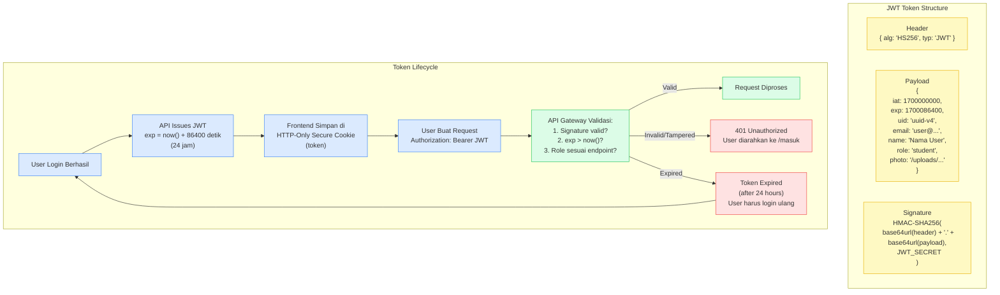

**Aturan Keamanan JWT:**

| Aspek | Implementasi |
|---|---|
| Algoritma | `HS256` (HMAC-SHA256) |
| Secret Key | Minimum 32 karakter, dari environment variable `JWT_SECRET` |
| Masa Berlaku | 86400 detik (24 jam) sejak `iat` |
| Penyimpanan di client | HTTP-Only Secure Cookie (terlindungi dari XSS) |
| Payload fields | `iat`, `exp`, `uid`, `email`, `name`, `role`, `photo` |
| **DILARANG** | Hardcode secret di source code, simpan di localStorage, commit `.env` ke git |

### Password Hashing Strategy

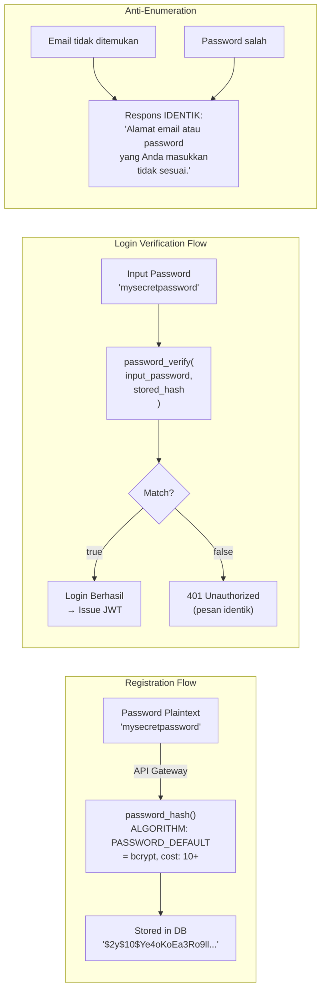

### CORS Configuration Strategy

```php
// app/Config/Cors.php — e-learning-api
// Hanya origin yang terdaftar yang diizinkan
$allowedOrigins = [
    'https://edunusa.edu.id',          // Production public
    'https://edunusa.console.edu.id',  // Production admin
    'https://teacher.edunusa.edu.id',  // Production mentor
    'http://localhost:3000',           // Development public
    'http://localhost:8080',           // Development admin
    'http://localhost:8081',           // Development mentor
];

// Headers yang diizinkan
$allowedHeaders = ['Content-Type', 'Authorization', 'X-Requested-With'];

// Methods yang diizinkan
$allowedMethods = ['GET', 'POST', 'PUT', 'DELETE', 'OPTIONS'];
```

### Service-to-Service Communication Security

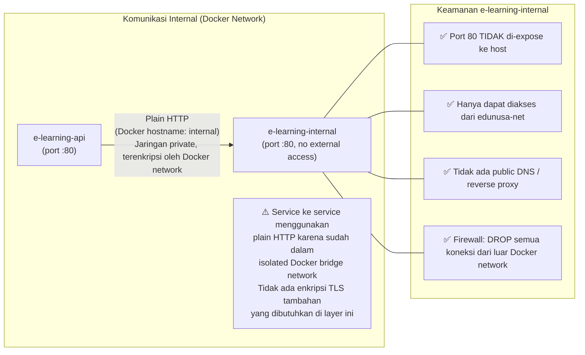

---

## UUID v4 Auto-Generation Flow

### Alur beforeInsert Hook

```mermaid
flowchart TD
    A["Client mengirim INSERT request\nke e-learning-internal\nPOST /api/users\n{ name, email, password }"] 
    --> B{"`id` sudah ada\ndalam payload?`"}

    B -->|"Ya (idempotent)"| C["Gunakan id yang diberikan\n(validasi panjang = 36 char)"]
    B -->|"Tidak"| D["generateUUID() dipanggil\noleh beforeInsert hook"]

    D --> E["Algoritma UUID v4:\nformat: xxxxxxxx-xxxx-4xxx-yxxx-xxxxxxxxxxxx\nbit 12-15 = 0100 (versi 4)\nbit 6-7 = 10 (variant RFC 4122)"]

    E --> F["PHP Implementation:\nsprintf('%04x%04x-%04x-%04x-%04x-%04x%04x%04x',\n  mt_rand(0, 0xffff), mt_rand(0, 0xffff),\n  mt_rand(0, 0xffff),\n  mt_rand(0, 0x0fff) | 0x4000,\n  mt_rand(0, 0x3fff) | 0x8000,\n  mt_rand(0, 0xffff), mt_rand(0, 0xffff), mt_rand(0, 0xffff)\n)"]

    F --> G["Validasi Hasil:\nstrlen(id) === 36?\npreg_match UUID v4 pattern?"]

    G -->|"Valid"| C
    G -->|"Invalid"| H["Lempar Exception:\nInvalidUUIDException\nRollback INSERT"]

    C --> I["INSERT statement dieksekusi ke MySQL\nINSERT INTO users (id, ...) VALUES (uuid, ...)"]
    I --> J["Response dikembalikan:\n{ id: 'xxxxxxxx-xxxx-4xxx-yxxx-xxxxxxxxxxxx', ... }"]
```

### Format Validasi UUID v4

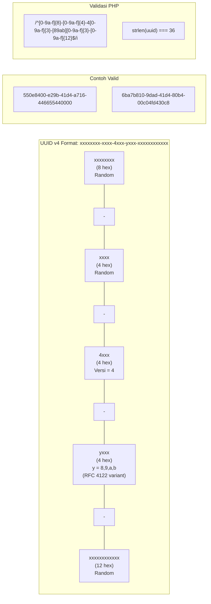

**Implementasi beforeInsert di semua Model CI4:**

```php
// app/Models/BaseInternalModel.php (shared trait)
<?php

namespace App\Models;

use CodeIgniter\Model;

abstract class BaseInternalModel extends Model
{
    protected $useAutoIncrement = false; // WAJIB false untuk UUID
    protected $useSoftDeletes   = true;
    protected $useTimestamps    = true;
    protected $beforeInsert     = ['generateUUID'];

    /**
     * Auto-generate UUID v4 sebelum INSERT.
     * Idempotent: jika id sudah ada di payload, tidak di-overwrite.
     */
    protected function generateUUID(array $data): array
    {
        if (empty($data['data']['id'])) {
            $uuid = $this->createUUIDv4();

            // Validasi panjang dan format
            if (strlen($uuid) !== 36) {
                throw new \RuntimeException('UUID generation failed: invalid length');
            }

            $data['data']['id'] = $uuid;
        }

        return $data;
    }

    private function createUUIDv4(): string
    {
        return sprintf(
            '%04x%04x-%04x-%04x-%04x-%04x%04x%04x',
            mt_rand(0, 0xffff), mt_rand(0, 0xffff), // time_low
            mt_rand(0, 0xffff),                      // time_mid
            mt_rand(0, 0x0fff) | 0x4000,             // time_hi_and_version (version 4)
            mt_rand(0, 0x3fff) | 0x8000,             // clock_seq (variant RFC 4122)
            mt_rand(0, 0xffff), mt_rand(0, 0xffff), mt_rand(0, 0xffff) // node
        );
    }
}
```

---

## RBAC Permission Matrix

### Tabel Permission Lengkap per Role per Resource

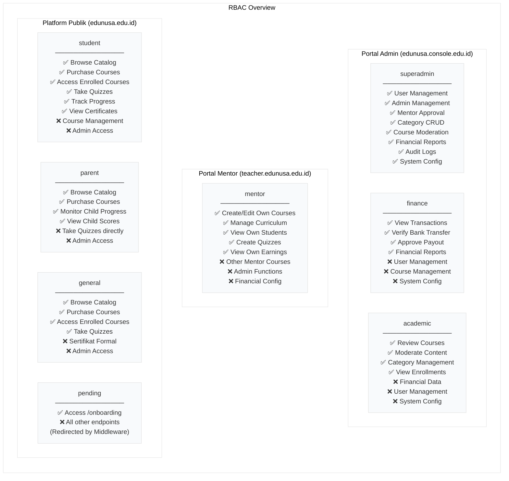

**Matriks Detail per API Endpoint:**

| Endpoint | Public | `pending` | `student` | `parent` | `general` | `mentor` | `academic` | `finance` | `superadmin` |
|---|---|---|---|---|---|---|---|---|---|
| `GET /api/v1/categories` | ✅ | ✅ | ✅ | ✅ | ✅ | ✅ | ✅ | ✅ | ✅ |
| `POST /api/v1/categories` | ❌ | ❌ | ❌ | ❌ | ❌ | ❌ | ✅ | ❌ | ✅ |
| `GET /api/v1/courses` | ✅ | ✅ | ✅ | ✅ | ✅ | ✅ | ✅ | ✅ | ✅ |
| `POST /api/v1/courses` | ❌ | ❌ | ❌ | ❌ | ❌ | ✅ (own) | ❌ | ❌ | ✅ |
| `PUT /api/v1/courses/{id}` | ❌ | ❌ | ❌ | ❌ | ❌ | ✅ (own) | ❌ | ❌ | ✅ |
| `POST /api/v1/auth/onboarding` | ❌ | ✅ | ❌ | ❌ | ❌ | ❌ | ❌ | ❌ | ❌ |
| `POST /api/v1/transactions` | ❌ | ❌ | ✅ | ✅ | ✅ | ❌ | ❌ | ❌ | ✅ |
| `GET /api/v1/enrollments` | ❌ | ❌ | ✅ (own) | ✅ (own) | ✅ (own) | ❌ | ✅ | ✅ | ✅ |
| `GET /api/v1/admin/transactions` | ❌ | ❌ | ❌ | ❌ | ❌ | ❌ | ❌ | ✅ | ✅ |
| `POST /api/v1/admin/payout` | ❌ | ❌ | ❌ | ❌ | ❌ | ❌ | ❌ | ✅ | ✅ |
| `DELETE /api/v1/admin/users/{id}` | ❌ | ❌ | ❌ | ❌ | ❌ | ❌ | ❌ | ❌ | ✅ |

### Middleware Validation Flow

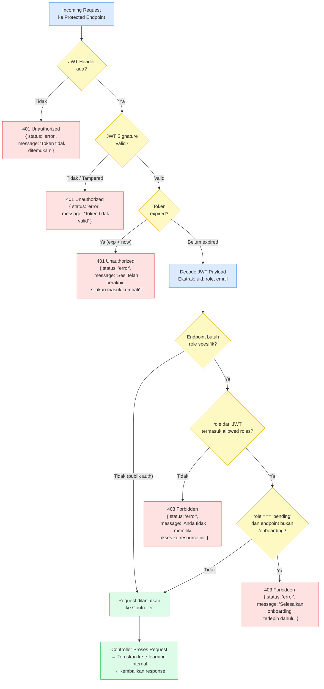

**Implementasi AuthFilter di CI4 (e-learning-api):**

```php
// app/Filters/JwtFilter.php — e-learning-api
<?php

namespace App\Filters;

use CodeIgniter\HTTP\RequestInterface;
use CodeIgniter\HTTP\ResponseInterface;
use CodeIgniter\Filters\FilterInterface;
use Firebase\JWT\JWT;
use Firebase\JWT\Key;

class JwtFilter implements FilterInterface
{
    public function before(RequestInterface $request, $arguments = null)
    {
        $header = $request->getHeaderLine('Authorization');

        if (!$header || !str_starts_with($header, 'Bearer ')) {
            return service('response')
                ->setStatusCode(401)
                ->setJSON(['status' => 'error', 'message' => 'Token tidak ditemukan']);
        }

        $token = substr($header, 7);

        try {
            $decoded = JWT::decode($token, new Key(env('JWT_SECRET'), 'HS256'));
            $request->decoded_token = $decoded;

            // Cek role jika ada argument (e.g., ['superadmin', 'finance'])
            if ($arguments !== null) {
                $userRole = $decoded->role ?? '';
                if (!in_array($userRole, $arguments)) {
                    return service('response')
                        ->setStatusCode(403)
                        ->setJSON(['status' => 'error', 'message' => 'Anda tidak memiliki akses ke resource ini']);
                }
            }

            // Blokir role pending dari semua endpoint kecuali onboarding
            if (($decoded->role ?? '') === 'pending') {
                $path = $request->getPath();
                if (!str_contains($path, 'onboarding')) {
                    return service('response')
                        ->setStatusCode(403)
                        ->setJSON(['status' => 'error', 'message' => 'Selesaikan onboarding terlebih dahulu']);
                }
            }

        } catch (\Firebase\JWT\ExpiredException $e) {
            return service('response')
                ->setStatusCode(401)
                ->setJSON(['status' => 'error', 'message' => 'Sesi telah berakhir, silakan masuk kembali']);
        } catch (\Exception $e) {
            return service('response')
                ->setStatusCode(401)
                ->setJSON(['status' => 'error', 'message' => 'Token tidak valid']);
        }
    }

    public function after(RequestInterface $request, ResponseInterface $response, $arguments = null)
    {
        // No-op
    }
}
```

---

## Error Handling

### Standard Response Format

Seluruh endpoint di `e-learning-api` dan `e-learning-internal` WAJIB menggunakan format respons JSON berikut:

**Response Sukses:**
```json
{
  "status": "success",
  "message": "Pesan deskriptif aksi yang berhasil",
  "data": { },
  "meta": {
    "page": 1,
    "per_page": 20,
    "total": 150
  }
}
```

**Response Error:**
```json
{
  "status": "error",
  "message": "Pesan deskriptif kesalahan yang ramah pengguna",
  "errors": {
    "email": "Format email tidak valid",
    "password": "Password minimal 8 karakter"
  }
}
```

### HTTP Status Code Matrix

| Situasi | Status Code | Contoh |
|---|---|---|
| Request berhasil (read/update) | `200 OK` | Login sukses, data ditemukan |
| Resource baru berhasil dibuat | `201 Created` | Registrasi berhasil, kursus baru |
| Token tidak ada / invalid | `401 Unauthorized` | JWT expired, signature salah |
| Role tidak cukup | `403 Forbidden` | Student akses endpoint admin |
| Resource tidak ditemukan | `404 Not Found` | Email tidak terdaftar |
| Validasi input gagal | `422 Unprocessable Entity` | Format email salah, field kosong |
| MySQL tidak bisa dijangkau | `503 Service Unavailable` | Internal DB connection failed |
| Unhandled server error | `500 Internal Server Error` | Exception tidak tertangkap |

### Service Failure Cascade

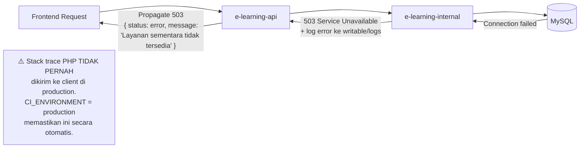

---

## Correctness Properties

*A property is a characteristic or behavior that should hold true across all valid executions of a system — essentially, a formal statement about what the system should do. Properties serve as the bridge between human-readable specifications and machine-verifiable correctness guarantees.*

Fase 1 melibatkan beberapa komponen logika yang dapat diverifikasi secara properti: UUID generation hook, soft-delete filter, strict entity separation, RBAC enforcement, dan JWT generation. Komponen-komponen ini memiliki input yang bervariasi dan perilaku universal yang dapat diuji.

### Property 1: UUID v4 Auto-Generation Always Valid

*For any* insert operation to any table in e-learning-internal that does not include an `id` field, the `beforeInsert` hook SHALL always generate an `id` value that is exactly 36 characters long and matches the UUID v4 format `xxxxxxxx-xxxx-4xxx-yxxx-xxxxxxxxxxxx`.

**Validates: Requirements 2.1, 6.1, 6.2**

### Property 2: UUID Generation is Idempotent When ID Provided

*For any* valid UUID v4 string provided in an INSERT payload, the stored record's `id` SHALL equal the provided value exactly — the `beforeInsert` hook shall not override an explicitly supplied `id`.

**Validates: Requirements 6.3**

### Property 3: Strict Entity Separation (Cross-Table Email Independence)

*For any* email address string, if that email is inserted into the `users` table, it SHALL still be possible to insert the same email into the `admins` or `mentors` table. The UNIQUE constraint on `email` is scoped per-table, not cross-table.

**Validates: Requirements 3.1, 3.6, 3.7**

### Property 4: Soft Delete Excludes Records From All Reads

*For any* record in any table that has `deleted_at` set to a non-NULL value, the Internal Service's default GET endpoints SHALL never return that record in any response body.

**Validates: Requirements 4.6**

### Property 5: JWT Expiry is Always 86400 Seconds

*For any* successful login or onboarding completion, the issued JWT token's `exp` field SHALL always equal `iat + 86400` (exactly 24 hours), regardless of when the request is made.

**Validates: Requirements 5.3**

### Property 6: Invalid Credentials Produce Identical Error Messages

*For any* login attempt — whether the email does not exist or the email exists but the password is wrong — the API Gateway SHALL return HTTP 401 with an identical response body. The response MUST NOT reveal which part of the credentials was incorrect.

**Validates: Requirements 5.7**

### Property 7: Role Isolation — Non-Admin Roles Cannot Access Admin Endpoints

*For any* JWT token with role `student`, `parent`, or `general`, any request to an endpoint that requires role `superadmin`, `finance`, or `academic` SHALL return HTTP 403 Forbidden, regardless of which specific endpoint is targeted.

**Validates: Requirements 7.3**

### Property 8: Pending Role Blocked From All Non-Onboarding Endpoints

*For any* JWT token with `role: "pending"`, any request to any endpoint other than `/api/v1/auth/onboarding` SHALL return HTTP 403 Forbidden.

**Validates: Requirements 7.4**

---

## Testing Strategy

Fase 1 merupakan fondasi infrastruktur: Docker orchestration, database schema, dan microservice wiring. Tidak ada pure function yang berdiri sendiri dengan input/output yang murni — semua operasi melalui network I/O dan database. Oleh karena itu, **Property-Based Testing (PBT) tidak applicable** untuk fase ini.

Strategi pengujian yang tepat untuk Fase 1 adalah kombinasi **Smoke Tests**, **Integration Tests**, dan **Contract Tests**.

### Smoke Tests (Infrastruktur)

Memverifikasi bahwa seluruh kontainer berjalan dan dapat saling berkomunikasi setelah `docker compose up`:

```bash
# 1. Verifikasi semua container berjalan
docker compose ps | grep -E "(healthy|running)"

# 2. MySQL dapat dijangkau dari container internal
docker exec e-learning-internal curl -s http://localhost/health | jq .status

# 3. API Gateway dapat menjangkau Internal
docker exec e-learning-api curl -s http://internal/api/users | jq .status

# 4. Internal TIDAK dapat dijangkau dari luar network
curl -f http://localhost/api/users && echo "FAIL: Internal is exposed!" || echo "OK: Internal is not exposed"

# 5. Verifikasi seed data ada
docker exec e-learning-docker-mysql-1 mysql -u root -p elearning -e \
  "SELECT COUNT(*) FROM admins WHERE email='admin@edunusa.edu.id';"
```

### Integration Tests (API Contract)

Memverifikasi setiap alur API end-to-end dari API Gateway hingga database:

```bash
# Test: Registrasi → Login → Onboarding
BASE="http://localhost:8000/api/v1"

# 1. Registrasi
RESPONSE=$(curl -s -X POST "$BASE/auth/register" \
  -H "Content-Type: application/json" \
  -d '{"name":"Test User","email":"test@test.com","password":"password123"}')
TOKEN=$(echo $RESPONSE | jq -r '.token')
echo "Register token role: $(echo $TOKEN | jwt decode - | jq -r '.role')"
# Expected: "pending"

# 2. Onboarding
USER_ID=$(echo $RESPONSE | jq -r '.user.id')
RESPONSE2=$(curl -s -X POST "$BASE/auth/onboarding" \
  -H "Authorization: Bearer $TOKEN" \
  -H "Content-Type: application/json" \
  -d "{\"user_id\":\"$USER_ID\",\"role\":\"student\"}")
TOKEN2=$(echo $RESPONSE2 | jq -r '.token')
echo "Onboarding token role: $(echo $TOKEN2 | jwt decode - | jq -r '.role')"
# Expected: "student"

# 3. Login
curl -s -X POST "$BASE/auth/login" \
  -H "Content-Type: application/json" \
  -d '{"email":"test@test.com","password":"password123"}' | jq .
# Expected: 200 OK dengan token

# 4. Test endpoint pending role diblokir
curl -s -X GET "$BASE/courses" \
  -H "Authorization: Bearer $TOKEN" | jq .status
# Expected: 403 (pending role tidak bisa akses)
```

### Database Schema Tests

```sql
-- Test 1: UUID v4 auto-generation
INSERT INTO users (name, email, password) VALUES ('Test', 'test@example.com', 'hash');
SELECT id, LENGTH(id) as len FROM users WHERE email = 'test@example.com';
-- Expected: len = 36, id matches UUID v4 pattern

-- Test 2: Soft delete tidak muncul di query biasa
UPDATE users SET deleted_at = NOW() WHERE email = 'test@example.com';
SELECT COUNT(*) FROM users WHERE email = 'test@example.com' AND deleted_at IS NULL;
-- Expected: 0

-- Test 3: Unique constraint email per tabel (bukan lintas tabel)
INSERT INTO admins (id, name, email, password) 
VALUES (UUID(), 'Admin', 'test@example.com', 'hash');
-- Expected: Berhasil (email boleh sama di tabel berbeda = strict separation)

-- Test 4: Enrollment unique constraint
INSERT INTO enrollments (id, user_id, course_id) VALUES (UUID(), ?, ?);
INSERT INTO enrollments (id, user_id, course_id) VALUES (UUID(), ?, ?);
-- Expected: Kedua query sama → Error 1062 Duplicate entry (UNIQUE KEY)

-- Test 5: Cascade delete
DELETE FROM courses WHERE id = ?;
SELECT COUNT(*) FROM course_sections WHERE course_id = ?;
-- Expected: 0 (cascade bekerja)
```

### Non-Functional Requirements Checklist

| NFR | Target | Cara Verifikasi |
|---|---|---|
| Response time GET single record | < 200ms | `time curl http://internal/api/users/{id}` |
| Password tidak pernah plaintext di DB | N/A | `SELECT password FROM users` → harus dimulai dengan `$2y$` |
| JWT Secret tidak di source code | N/A | `grep -r "JWT_SECRET" --include="*.php"` → tidak ada value hardcode |
| Port MySQL tidak exposed | N/A | `docker compose ps` → port 3306 tidak di-bind ke 0.0.0.0 |
| CI_ENVIRONMENT production tidak leak stacktrace | N/A | Trigger 500 error → verifikasi response hanya pesan generik |
