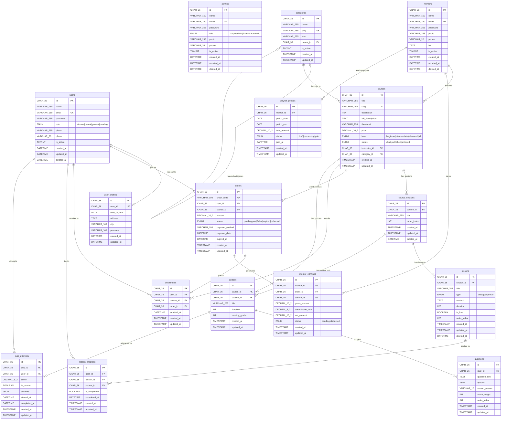

# Requirements Document

## Fase 1 — Fondasi, Database & Microservices
**Platform:** EduNusa E-Learning  
**Status:** ✅ Selesai Diimplementasikan  
**Versi Dokumen:** 1.0.0  
**Tanggal:** 2025

---

## Pendahuluan

Fase 1 membangun seluruh fondasi infrastruktur platform EduNusa, mencakup orkestrasi lingkungan Docker, desain basis data enterprise skala besar, pembagian arsitektur microservices tiga tingkatan (3-Tier), pemisahan entitas pengguna secara ketat (Strict Separation), dan konfigurasi RBAC (Role-Based Access Control).

Seluruh komponen yang dibangun pada fase ini menjadi tulang punggung bagi seluruh fase pengembangan berikutnya. Tidak ada fase lain yang dapat berjalan tanpa fondasi yang diletakkan di Fase 1 ini.

### Prinsip Arsitektur Kritis

1. **Strict UUID v4**: Seluruh Primary Key dan Foreign Key di semua tabel WAJIB menggunakan `CHAR(36)` UUID v4. Integer auto-increment dilarang keras.
2. **Strict Entity Separation**: Entitas `users`, `mentors`, dan `admins` adalah tabel terpisah yang tidak boleh digabung dalam kondisi apapun.
3. **Zero Direct DB Access**: Hanya `e-learning-internal` yang boleh berinteraksi langsung dengan database. Semua service lain WAJIB mengakses data melalui HTTP API.
4. **Isolated Bridge Network**: Kontainer Docker berkomunikasi dalam bridge network terisolasi, tidak terekspos langsung ke jaringan publik.

---

## Glosarium

| Istilah | Definisi |
|---|---|
| **EduNusa** | Nama platform e-learning yang dibangun |
| **e-learning-internal** | Service Data Access Layer (DAO) — satu-satunya service yang boleh kontak langsung ke database MySQL |
| **e-learning-api** | API Gateway berbasis CodeIgniter 4 — pengelola business logic, validasi JWT, dan sanitasi data |
| **e-learning-external** | Service integrasi pihak ketiga (Midtrans, Zoom, SMTP email) |
| **e-learning-public** | Frontend siswa berbasis Next.js dengan arsitektur MVVM Clean Architecture |
| **e-learning-admin** | Portal backoffice administrator berbasis CodeIgniter 4 MVC |
| **e-learning-mentor** | Portal instruktur berbasis CodeIgniter 4 MVC |
| **UUID v4** | Universally Unique Identifier versi 4 — format `CHAR(36)` berisi 32 karakter heksadesimal dan 4 tanda hubung, dihasilkan secara acak |
| **RBAC** | Role-Based Access Control — sistem hak akses berdasarkan peran pengguna |
| **DAO** | Data Access Object — pola desain untuk abstraksi akses data dari database |
| **Bridge Network** | Jaringan terisolasi Docker yang menghubungkan kontainer dalam lingkungan yang sama |
| **JWT** | JSON Web Token — standar token autentikasi stateless |
| **3-Tier Architecture** | Pola arsitektur tiga lapisan: Presentation (Frontend), Business Logic (API Gateway), Data Access (Internal) |
| **Soft Delete** | Penandaan data sebagai terhapus menggunakan kolom `deleted_at` tanpa menghapus baris fisik dari database |
| **Migration** | Skrip SQL terversion untuk manajemen perubahan skema database secara terkontrol |

---

## Persyaratan

---

### Persyaratan 1: Orkestrasi Infrastruktur Docker

**User Story:** Sebagai DevOps Engineer, saya ingin seluruh komponen platform EduNusa berjalan dalam kontainer Docker yang terisolasi dan terorganisir, sehingga lingkungan pengembangan dan produksi bersifat konsisten, reproducible, dan mudah dikelola.

#### Kriteria Penerimaan

1. THE Docker_Orchestration SHALL menyediakan kontainer MySQL (`e-learning-docker-mysql-1`) yang menjalankan database `elearning` dengan konfigurasi charset `utf8mb4` dan collation `utf8mb4_unicode_ci`.

2. THE Docker_Orchestration SHALL membuat Docker bridge network terisolasi dengan nama yang terdefinisi, sehingga kontainer `e-learning-internal`, `e-learning-api`, `e-learning-external`, `e-learning-public`, `e-learning-admin`, dan `e-learning-mentor` dapat saling berkomunikasi menggunakan hostname antar-kontainer.

3. WHEN kontainer MySQL pertama kali dijalankan, THE Docker_Orchestration SHALL mengeksekusi skrip inisialisasi database (`schema_uuid.sql`) secara otomatis untuk membuat seluruh tabel, constraint, dan data seed awal.

4. THE Docker_Orchestration SHALL memastikan kontainer MySQL mempersistensikan data ke volume Docker yang terdefinisi, sehingga data tidak hilang ketika kontainer dihentikan atau di-restart.

5. WHEN kontainer `e-learning-internal` dijalankan, THE Internal_Service SHALL dapat menjangkau host MySQL menggunakan hostname internal Docker (bukan `localhost` atau IP statis eksternal).

6. THE Docker_Orchestration SHALL mendefinisikan dependency order antar-kontainer: kontainer MySQL HARUS dalam kondisi healthy sebelum `e-learning-internal` dimulai; `e-learning-internal` HARUS dalam kondisi healthy sebelum `e-learning-api` dimulai.

7. IF sebuah kontainer mengalami kegagalan (crash), THEN THE Docker_Orchestration SHALL mengeksekusi restart policy `unless-stopped` untuk memulihkan kontainer tersebut secara otomatis.

8. THE Docker_Orchestration SHALL mengisolasi port database MySQL sehingga port `3306` HANYA terekspos ke jaringan internal Docker (tidak boleh di-bind ke `0.0.0.0` di lingkungan produksi).

---

### Persyaratan 2: Desain Skema Database Enterprise (ERD)

**User Story:** Sebagai Database Architect, saya ingin memiliki skema database yang terdefinisi dengan baik, menggunakan UUID v4 di semua tabel, dengan relasi yang jelas antar entitas, sehingga sistem dapat mengelola data pengguna, kurikulum, transaksi, dan akademik secara terstruktur dan konsisten.

#### Kriteria Penerimaan

##### 2.1 — Aturan Umum Skema

1. THE Database_Schema SHALL mendefinisikan kolom `id CHAR(36) PRIMARY KEY` pada setiap tabel sebagai primary key berbasis UUID v4. Penggunaan integer auto-increment (`AUTO_INCREMENT`) sebagai primary key dilarang keras.

2. THE Database_Schema SHALL mendefinisikan kolom `created_at DATETIME DEFAULT CURRENT_TIMESTAMP` dan `updated_at DATETIME DEFAULT CURRENT_TIMESTAMP ON UPDATE CURRENT_TIMESTAMP` pada seluruh tabel untuk keperluan audit trail.

3. WHERE soft delete dibutuhkan, THE Database_Schema SHALL mendefinisikan kolom `deleted_at DATETIME DEFAULT NULL` sehingga data dapat dipulihkan tanpa kehilangan histori.

4. THE Database_Schema SHALL mendefinisikan seluruh kolom teks yang digunakan untuk identifikasi unik (email, slug) dengan constraint `UNIQUE` di level database.

5. THE Database_Schema SHALL mendefinisikan Foreign Key constraint dengan referential integrity yang sesuai (`ON DELETE CASCADE`, `ON DELETE SET NULL`, atau `ON DELETE RESTRICT`) berdasarkan hubungan entitas.

##### 2.2 — Tabel Identitas & Akun (Identity Tables)

6. THE Database_Schema SHALL mendefinisikan tabel `users` dengan struktur berikut untuk menyimpan data siswa/pelajar:

   ```sql
   CREATE TABLE users (
       id           CHAR(36)     PRIMARY KEY,
       name         VARCHAR(150) NOT NULL,
       email        VARCHAR(150) NOT NULL UNIQUE,
       password     VARCHAR(255) NOT NULL,
       role         ENUM('student', 'parent', 'general', 'pending') DEFAULT 'pending',
       photo        VARCHAR(255) DEFAULT NULL,
       phone        VARCHAR(20)  DEFAULT NULL,
       is_active    TINYINT(1)   NOT NULL DEFAULT 1,
       remember_token VARCHAR(100) DEFAULT NULL,
       created_at   DATETIME     DEFAULT CURRENT_TIMESTAMP,
       updated_at   DATETIME     DEFAULT CURRENT_TIMESTAMP ON UPDATE CURRENT_TIMESTAMP,
       deleted_at   DATETIME     DEFAULT NULL
   );
   ```

7. THE Database_Schema SHALL mendefinisikan tabel `admins` dengan struktur berikut untuk menyimpan data administrator sistem:

   ```sql
   CREATE TABLE admins (
       id           CHAR(36)     PRIMARY KEY,
       name         VARCHAR(150) NOT NULL,
       email        VARCHAR(150) NOT NULL UNIQUE,
       password     VARCHAR(255) NOT NULL,
       role         ENUM('superadmin', 'finance', 'academic') DEFAULT 'superadmin',
       photo        VARCHAR(255) DEFAULT NULL,
       phone        VARCHAR(20)  DEFAULT NULL,
       is_active    TINYINT(1)   NOT NULL DEFAULT 1,
       remember_token VARCHAR(100) DEFAULT NULL,
       created_at   DATETIME     DEFAULT CURRENT_TIMESTAMP,
       updated_at   DATETIME     DEFAULT CURRENT_TIMESTAMP ON UPDATE CURRENT_TIMESTAMP,
       deleted_at   DATETIME     DEFAULT NULL
   );
   ```

8. THE Database_Schema SHALL mendefinisikan tabel `mentors` dengan struktur berikut untuk menyimpan data instruktur/pengajar:

   ```sql
   CREATE TABLE mentors (
       id           CHAR(36)     PRIMARY KEY,
       name         VARCHAR(150) NOT NULL,
       email        VARCHAR(150) NOT NULL UNIQUE,
       password     VARCHAR(255) NOT NULL,
       photo        VARCHAR(255) DEFAULT NULL,
       phone        VARCHAR(20)  DEFAULT NULL,
       bio          TEXT         DEFAULT NULL,
       is_active    TINYINT(1)   NOT NULL DEFAULT 1,
       remember_token VARCHAR(100) DEFAULT NULL,
       created_at   DATETIME     DEFAULT CURRENT_TIMESTAMP,
       updated_at   DATETIME     DEFAULT CURRENT_TIMESTAMP ON UPDATE CURRENT_TIMESTAMP,
       deleted_at   DATETIME     DEFAULT NULL
   );
   ```

9. THE Database_Schema SHALL mendefinisikan tabel `user_profiles` dengan struktur berikut untuk menyimpan preferensi dan data profil tambahan pengguna:

   ```sql
   CREATE TABLE user_profiles (
       id           CHAR(36)     PRIMARY KEY,
       user_id      CHAR(36)     NOT NULL UNIQUE,
       date_of_birth DATE        DEFAULT NULL,
       address      TEXT         DEFAULT NULL,
       city         VARCHAR(100) DEFAULT NULL,
       province     VARCHAR(100) DEFAULT NULL,
       created_at   DATETIME     DEFAULT CURRENT_TIMESTAMP,
       updated_at   DATETIME     DEFAULT CURRENT_TIMESTAMP ON UPDATE CURRENT_TIMESTAMP,
       FOREIGN KEY (user_id) REFERENCES users(id) ON DELETE CASCADE
   );
   ```

##### 2.3 — Tabel Kurikulum & Konten (Curriculum Tables)

10. THE Database_Schema SHALL mendefinisikan tabel `categories` dengan kolom `parent_id CHAR(36) DEFAULT NULL` yang mereferensi dirinya sendiri (`self-referential FK`) untuk mendukung hierarki kategori bertingkat (kategori induk dan sub-kategori):

    ```sql
    CREATE TABLE categories (
        id        CHAR(36)     PRIMARY KEY,
        name      VARCHAR(255) NOT NULL,
        slug      VARCHAR(255) NOT NULL UNIQUE,
        icon      VARCHAR(255) DEFAULT NULL,
        parent_id CHAR(36)     DEFAULT NULL,
        is_active TINYINT(1)   DEFAULT 1,
        created_at TIMESTAMP   DEFAULT CURRENT_TIMESTAMP,
        updated_at TIMESTAMP   DEFAULT CURRENT_TIMESTAMP ON UPDATE CURRENT_TIMESTAMP,
        FOREIGN KEY (parent_id) REFERENCES categories(id) ON DELETE SET NULL
    );
    ```

11. THE Database_Schema SHALL mendefinisikan tabel `courses` dengan Foreign Key ke tabel `mentors` (kolom `instructor_id`) dan ke tabel `categories` (kolom `category_id`):

    ```sql
    CREATE TABLE courses (
        id            CHAR(36)        PRIMARY KEY,
        title         VARCHAR(255)    NOT NULL,
        slug          VARCHAR(255)    NOT NULL UNIQUE,
        description   TEXT,
        full_description TEXT,
        thumbnail     VARCHAR(255)    DEFAULT NULL,
        trailer_url   VARCHAR(500)    DEFAULT NULL,
        price         DECIMAL(10, 2)  DEFAULT 0.00,
        level         ENUM('beginner', 'intermediate', 'advanced', 'all') DEFAULT 'all',
        status        ENUM('draft', 'published', 'archived') DEFAULT 'draft',
        instructor_id CHAR(36)        NOT NULL,
        category_id   CHAR(36)        DEFAULT NULL,
        created_at    TIMESTAMP       DEFAULT CURRENT_TIMESTAMP,
        updated_at    TIMESTAMP       DEFAULT CURRENT_TIMESTAMP ON UPDATE CURRENT_TIMESTAMP,
        FOREIGN KEY (instructor_id) REFERENCES mentors(id) ON DELETE CASCADE,
        FOREIGN KEY (category_id)   REFERENCES categories(id) ON DELETE SET NULL
    );
    ```

12. THE Database_Schema SHALL mendefinisikan tabel `course_sections` dengan kolom `order_index INT DEFAULT 0` untuk menjaga urutan tampilan seksi dalam satu kursus:

    ```sql
    CREATE TABLE course_sections (
        id          CHAR(36)     PRIMARY KEY,
        course_id   CHAR(36)     NOT NULL,
        title       VARCHAR(255) NOT NULL,
        order_index INT          DEFAULT 0,
        created_at  TIMESTAMP    DEFAULT CURRENT_TIMESTAMP,
        updated_at  TIMESTAMP    DEFAULT CURRENT_TIMESTAMP ON UPDATE CURRENT_TIMESTAMP,
        deleted_at  DATETIME     DEFAULT NULL,
        FOREIGN KEY (course_id) REFERENCES courses(id) ON DELETE CASCADE
    );
    ```

13. THE Database_Schema SHALL mendefinisikan tabel `lessons` dengan kolom `type ENUM('video', 'pdf', 'article')` dan kolom `is_free BOOLEAN DEFAULT FALSE` untuk mendukung penandaan materi gratis (free preview):

    ```sql
    CREATE TABLE lessons (
        id          CHAR(36)                        PRIMARY KEY,
        section_id  CHAR(36)                        NOT NULL,
        title       VARCHAR(255)                    NOT NULL,
        type        ENUM('video', 'pdf', 'article') DEFAULT 'video',
        content     TEXT,
        duration    INT                             DEFAULT 0,
        is_free     BOOLEAN                         DEFAULT FALSE,
        order_index INT                             DEFAULT 0,
        created_at  TIMESTAMP                       DEFAULT CURRENT_TIMESTAMP,
        updated_at  TIMESTAMP                       DEFAULT CURRENT_TIMESTAMP ON UPDATE CURRENT_TIMESTAMP,
        deleted_at  DATETIME                        DEFAULT NULL,
        FOREIGN KEY (section_id) REFERENCES course_sections(id) ON DELETE CASCADE
    );
    ```

##### 2.4 — Tabel Transaksi & Keuangan (Transaction Tables)

14. THE Database_Schema SHALL mendefinisikan tabel `orders` untuk mencatat seluruh transaksi pembelian kursus:

    ```sql
    CREATE TABLE orders (
        id               CHAR(36)      PRIMARY KEY,
        order_code       VARCHAR(100)  NOT NULL UNIQUE,
        user_id          CHAR(36)      NOT NULL,
        course_id        CHAR(36)      NOT NULL,
        amount           DECIMAL(10,2) NOT NULL,
        status           ENUM('pending', 'paid', 'failed', 'expired', 'refunded') DEFAULT 'pending',
        payment_method   VARCHAR(100)  DEFAULT NULL,
        payment_date     DATETIME      DEFAULT NULL,
        midtrans_token   VARCHAR(500)  DEFAULT NULL,
        expired_at       DATETIME      DEFAULT NULL,
        created_at       TIMESTAMP     DEFAULT CURRENT_TIMESTAMP,
        updated_at       TIMESTAMP     DEFAULT CURRENT_TIMESTAMP ON UPDATE CURRENT_TIMESTAMP,
        FOREIGN KEY (user_id)   REFERENCES users(id) ON DELETE CASCADE,
        FOREIGN KEY (course_id) REFERENCES courses(id) ON DELETE CASCADE
    );
    ```

15. THE Database_Schema SHALL mendefinisikan tabel `enrollments` untuk mencatat hak akses siswa terhadap kursus yang telah dibeli:

    ```sql
    CREATE TABLE enrollments (
        id          CHAR(36)  PRIMARY KEY,
        user_id     CHAR(36)  NOT NULL,
        course_id   CHAR(36)  NOT NULL,
        order_id    CHAR(36)  DEFAULT NULL,
        enrolled_at DATETIME  DEFAULT CURRENT_TIMESTAMP,
        created_at  TIMESTAMP DEFAULT CURRENT_TIMESTAMP,
        updated_at  TIMESTAMP DEFAULT CURRENT_TIMESTAMP ON UPDATE CURRENT_TIMESTAMP,
        UNIQUE KEY unique_enrollment (user_id, course_id),
        FOREIGN KEY (user_id)   REFERENCES users(id) ON DELETE CASCADE,
        FOREIGN KEY (course_id) REFERENCES courses(id) ON DELETE CASCADE,
        FOREIGN KEY (order_id)  REFERENCES orders(id) ON DELETE SET NULL
    );
    ```

16. THE Database_Schema SHALL mendefinisikan tabel `mentor_earnings` untuk mencatat komisi instruktur dari setiap transaksi kursus yang berhasil:

    ```sql
    CREATE TABLE mentor_earnings (
        id           CHAR(36)      PRIMARY KEY,
        mentor_id    CHAR(36)      NOT NULL,
        order_id     CHAR(36)      NOT NULL,
        course_id    CHAR(36)      NOT NULL,
        gross_amount DECIMAL(10,2) NOT NULL,
        commission_rate DECIMAL(5,2) NOT NULL DEFAULT 70.00,
        net_amount   DECIMAL(10,2) NOT NULL,
        status       ENUM('pending', 'disbursed') DEFAULT 'pending',
        created_at   TIMESTAMP     DEFAULT CURRENT_TIMESTAMP,
        updated_at   TIMESTAMP     DEFAULT CURRENT_TIMESTAMP ON UPDATE CURRENT_TIMESTAMP,
        FOREIGN KEY (mentor_id) REFERENCES mentors(id) ON DELETE CASCADE,
        FOREIGN KEY (order_id)  REFERENCES orders(id) ON DELETE CASCADE,
        FOREIGN KEY (course_id) REFERENCES courses(id) ON DELETE CASCADE
    );
    ```

17. THE Database_Schema SHALL mendefinisikan tabel `payroll_periods` untuk mencatat periode dan siklus pencairan dana instruktur:

    ```sql
    CREATE TABLE payroll_periods (
        id           CHAR(36)      PRIMARY KEY,
        mentor_id    CHAR(36)      NOT NULL,
        period_start DATE          NOT NULL,
        period_end   DATE          NOT NULL,
        total_amount DECIMAL(10,2) NOT NULL DEFAULT 0.00,
        status       ENUM('draft', 'processing', 'paid') DEFAULT 'draft',
        paid_at      DATETIME      DEFAULT NULL,
        created_at   TIMESTAMP     DEFAULT CURRENT_TIMESTAMP,
        updated_at   TIMESTAMP     DEFAULT CURRENT_TIMESTAMP ON UPDATE CURRENT_TIMESTAMP,
        FOREIGN KEY (mentor_id) REFERENCES mentors(id) ON DELETE CASCADE
    );
    ```

##### 2.5 — Tabel Akademik & Evaluasi (Academic Tables)

18. THE Database_Schema SHALL mendefinisikan tabel `lesson_progress` dengan constraint `UNIQUE KEY (user_id, lesson_id)` untuk mencegah duplikasi entri progres per siswa per materi:

    ```sql
    CREATE TABLE lesson_progress (
        id           CHAR(36)  PRIMARY KEY,
        user_id      CHAR(36)  NOT NULL,
        lesson_id    CHAR(36)  NOT NULL,
        course_id    CHAR(36)  NOT NULL,
        is_completed BOOLEAN   DEFAULT FALSE,
        completed_at DATETIME  DEFAULT NULL,
        created_at   TIMESTAMP DEFAULT CURRENT_TIMESTAMP,
        updated_at   TIMESTAMP DEFAULT CURRENT_TIMESTAMP ON UPDATE CURRENT_TIMESTAMP,
        UNIQUE KEY unique_progress (user_id, lesson_id),
        FOREIGN KEY (user_id)   REFERENCES users(id) ON DELETE CASCADE,
        FOREIGN KEY (lesson_id) REFERENCES lessons(id) ON DELETE CASCADE,
        FOREIGN KEY (course_id) REFERENCES courses(id) ON DELETE CASCADE
    );
    ```

19. THE Database_Schema SHALL mendefinisikan tabel `quizzes` yang terhubung ke satu kursus atau satu seksi tertentu:

    ```sql
    CREATE TABLE quizzes (
        id           CHAR(36)     PRIMARY KEY,
        course_id    CHAR(36)     NOT NULL,
        section_id   CHAR(36)     DEFAULT NULL,
        title        VARCHAR(255) NOT NULL,
        duration     INT          DEFAULT 0 COMMENT 'Durasi dalam menit',
        passing_grade INT         DEFAULT 70 COMMENT 'Nilai minimum kelulusan',
        created_at   TIMESTAMP    DEFAULT CURRENT_TIMESTAMP,
        updated_at   TIMESTAMP    DEFAULT CURRENT_TIMESTAMP ON UPDATE CURRENT_TIMESTAMP,
        FOREIGN KEY (course_id)  REFERENCES courses(id) ON DELETE CASCADE,
        FOREIGN KEY (section_id) REFERENCES course_sections(id) ON DELETE SET NULL
    );
    ```

20. THE Database_Schema SHALL mendefinisikan tabel `questions` dengan kolom `options JSON NOT NULL` untuk menyimpan pilihan jawaban dalam format JSON array:

    ```sql
    CREATE TABLE questions (
        id             CHAR(36)   PRIMARY KEY,
        quiz_id        CHAR(36)   NOT NULL,
        question_text  TEXT       NOT NULL,
        options        JSON       NOT NULL COMMENT 'Array JSON berisi pilihan jawaban',
        correct_answer VARCHAR(10) NOT NULL COMMENT 'Kunci jawaban (a/b/c/d)',
        score_weight   INT        DEFAULT 1,
        order_index    INT        DEFAULT 0,
        created_at     TIMESTAMP  DEFAULT CURRENT_TIMESTAMP,
        updated_at     TIMESTAMP  DEFAULT CURRENT_TIMESTAMP ON UPDATE CURRENT_TIMESTAMP,
        FOREIGN KEY (quiz_id) REFERENCES quizzes(id) ON DELETE CASCADE
    );
    ```

21. THE Database_Schema SHALL mendefinisikan tabel `quiz_attempts` untuk merekam setiap percobaan pengerjaan kuis oleh siswa:

    ```sql
    CREATE TABLE quiz_attempts (
        id           CHAR(36)      PRIMARY KEY,
        quiz_id      CHAR(36)      NOT NULL,
        user_id      CHAR(36)      NOT NULL,
        score        DECIMAL(5,2)  DEFAULT 0.00,
        is_passed    BOOLEAN       DEFAULT FALSE,
        answers      JSON          DEFAULT NULL COMMENT 'JSON snapshot jawaban siswa',
        started_at   DATETIME      DEFAULT NULL,
        completed_at DATETIME      DEFAULT NULL,
        created_at   TIMESTAMP     DEFAULT CURRENT_TIMESTAMP,
        updated_at   TIMESTAMP     DEFAULT CURRENT_TIMESTAMP ON UPDATE CURRENT_TIMESTAMP,
        FOREIGN KEY (quiz_id)  REFERENCES quizzes(id) ON DELETE CASCADE,
        FOREIGN KEY (user_id)  REFERENCES users(id) ON DELETE CASCADE
    );
    ```

---

### Persyaratan 3: Pemisahan Entitas Pengguna (Strict Entity Separation)

**User Story:** Sebagai System Architect, saya ingin entitas pengguna `users`, `mentors`, dan `admins` disimpan dalam tabel terpisah yang tidak boleh digabung, sehingga hak akses, logika bisnis, dan keamanan data setiap peran terisolasi sepenuhnya dan tidak saling mencemari.

#### Kriteria Penerimaan

1. THE Database_Schema SHALL mendefinisikan tabel `users`, `admins`, dan `mentors` sebagai tiga tabel TERPISAH dengan Primary Key `id CHAR(36)` masing-masing. Penggabungan ketiga entitas ke dalam satu tabel dilarang keras dalam kondisi apapun.

2. THE Database_Schema SHALL memastikan tabel `users` HANYA digunakan untuk menyimpan akun siswa/pelajar (peran: `student`, `parent`, `general`, `pending`). Akun administrator dan instruktur dilarang disimpan di tabel `users`.

3. THE Database_Schema SHALL memastikan tabel `admins` HANYA digunakan untuk menyimpan akun administrator sistem. Tabel ini tidak boleh memiliki Foreign Key atau hubungan langsung ke tabel `users` atau `mentors`.

4. THE Database_Schema SHALL memastikan tabel `mentors` HANYA digunakan untuk menyimpan akun instruktur/pengajar. Kolom `instructor_id` pada tabel `courses` HARUS mereferensi `mentors.id`, bukan `users.id`.

5. WHEN sebuah endpoint API menerima request autentikasi, THE Authentication_Service SHALL menentukan tabel target (`users`, `admins`, atau `mentors`) berdasarkan konteks service yang melayani request tersebut (portal publik menggunakan `users`, portal admin menggunakan `admins`, portal mentor menggunakan `mentors`).

6. IF sebuah alamat email terdaftar di tabel `users`, THEN THE Internal_Service SHALL mengizinkan pendaftaran alamat email yang sama di tabel `admins` atau `mentors`, karena ketiganya adalah entitas yang sepenuhnya independen dengan namespace berbeda.

7. THE Database_Schema SHALL mendefinisikan constraint `UNIQUE` pada kolom `email` secara per-tabel (bukan lintas tabel), sesuai dengan prinsip strict separation entitas.

---

### Persyaratan 4: Arsitektur 3-Tier Microservices

**User Story:** Sebagai System Architect, saya ingin platform EduNusa dibangun di atas arsitektur microservices tiga tingkatan, sehingga setiap layer memiliki tanggung jawab tunggal yang jelas, mudah di-scale secara independen, dan tidak ada service yang melewati batas aksesnya.

#### Kriteria Penerimaan

##### 4.1 — Layer 1: Data Access Layer (`e-learning-internal`)

1. THE Internal_Service SHALL menjadi satu-satunya service yang memiliki koneksi langsung ke database MySQL. Service lain manapun (`e-learning-api`, `e-learning-public`, `e-learning-admin`, `e-learning-mentor`) DILARANG KERAS membuka koneksi database secara langsung.

2. THE Internal_Service SHALL menyediakan RESTful API endpoint dengan prefix path `/api/` untuk setiap entitas utama database (users, admins, mentors, categories, courses, course_sections, lessons, orders, enrollments, dll.).

3. THE Internal_Service SHALL menerima dan mengembalikan data dalam format JSON (`Content-Type: application/json`).

4. THE Internal_Service SHALL mengimplementasikan operasi CRUD standar untuk setiap entitas: Create (`POST`), Read All (`GET /resource`), Read One (`GET /resource/{id}`), Update (`PUT /resource/{id}`), Delete (`DELETE /resource/{id}`).

5. WHEN sebuah operasi INSERT dipanggil, THE Internal_Service SHALL secara otomatis men-generate UUID v4 melalui `beforeInsert` hook pada Model, sehingga pemanggil tidak perlu menyertakan `id` secara manual.

6. THE Internal_Service SHALL menerapkan filter `deleted_at IS NULL` secara default pada seluruh query SELECT untuk memastikan data yang telah di-soft-delete tidak pernah dikembalikan ke pemanggil.

7. IF koneksi ke database MySQL gagal atau timeout, THEN THE Internal_Service SHALL mengembalikan HTTP status `503 Service Unavailable` dengan pesan error yang deskriptif.

##### 4.2 — Layer 2: API Gateway (`e-learning-api`)

8. THE API_Gateway SHALL memvalidasi dan memproses seluruh request dari frontend (public, admin, mentor) sebelum meneruskan ke `e-learning-internal`.

9. THE API_Gateway SHALL berkomunikasi dengan `e-learning-internal` HANYA melalui HTTP request menggunakan hostname Docker internal (contoh: `http://internal/api/...`). Koneksi database langsung dari `e-learning-api` dilarang keras.

10. THE API_Gateway SHALL mengekspos endpoint publik dengan prefix `/api/v1/` untuk dikonsumsi oleh frontend services.

11. WHEN sebuah request memerlukan autentikasi, THE API_Gateway SHALL memvalidasi JWT token pada header `Authorization: Bearer <token>` sebelum memproses request tersebut.

12. THE API_Gateway SHALL meng-hash password pengguna menggunakan `password_hash()` dengan algoritma `PASSWORD_DEFAULT` (bcrypt) sebelum meneruskan data ke `e-learning-internal`.

13. IF JWT token tidak valid, kedaluwarsa, atau tidak disertakan pada endpoint yang dilindungi, THEN THE API_Gateway SHALL mengembalikan HTTP status `401 Unauthorized` dengan body JSON `{"status": "error", "message": "..."}`.

14. THE API_Gateway SHALL menangani semua business logic dan validasi input (format email, panjang password, keunikan data, dll.) sebelum meneruskan data ke Internal Service.

##### 4.3 — Layer 3: Frontend Services

15. THE Frontend_Services SHALL berkomunikasi HANYA dengan `e-learning-api` (API Gateway) untuk semua kebutuhan data. Frontend services tidak boleh memanggil `e-learning-internal` secara langsung.

16. THE Public_Frontend (`e-learning-public`) SHALL dibangun menggunakan Next.js App Router dengan implementasi MVVM Clean Architecture: pemisahan layer Entity, Repository, UseCase, dan ViewModel.

17. THE Admin_Frontend (`e-learning-admin`) SHALL dibangun menggunakan CodeIgniter 4 MVC dengan session-based authentication (bukan JWT cookie seperti frontend publik).

18. THE Mentor_Frontend (`e-learning-mentor`) SHALL dibangun menggunakan CodeIgniter 4 MVC dengan session-based authentication yang terisolasi dari session admin.

##### 4.4 — Layer Integrasi: External Service (`e-learning-external`)

19. THE External_Service SHALL menjadi satu-satunya service yang berkomunikasi dengan pihak ketiga (Midtrans Payment, Zoom API, SMTP email server).

20. WHEN menerima callback webhook dari pihak ketiga, THE External_Service SHALL memverifikasi signature/token keamanan dari provider sebelum memproses data callback tersebut.

21. THE External_Service SHALL meneruskan hasil verifikasi webhook ke `e-learning-api` (bukan langsung ke `e-learning-internal`) untuk update status transaksi.

---

### Persyaratan 5: Konfigurasi JWT & Autentikasi

**User Story:** Sebagai Developer, saya ingin sistem autentikasi yang aman berbasis JWT untuk seluruh komunikasi API, sehingga setiap request teridentifikasi dengan jelas dan sesi pengguna terlindungi dari penyalahgunaan.

#### Kriteria Penerimaan

1. THE Authentication_Service SHALL menerbitkan JWT token menggunakan algoritma `HS256` dengan secret key yang panjang (minimum 32 karakter) yang dikonfigurasi melalui environment variable, bukan di-hardcode dalam kode sumber.

2. THE Authentication_Service SHALL membuat JWT payload yang berisi field berikut: `iat` (issued at), `exp` (expiry time), `uid` (user UUID), `email`, `name`, `role`, dan `photo`.

3. THE JWT_Token SHALL memiliki masa berlaku (`exp`) selama 86400 detik (24 jam) sejak waktu penerbitan.

4. WHEN pengguna berhasil login, THE Authentication_Service SHALL mengembalikan response JSON dengan struktur:
   ```json
   {
     "message": "Selamat datang! Anda berhasil masuk.",
     "token": "<jwt_token_string>",
     "user": {
       "id": "<uuid>",
       "name": "<nama>",
       "email": "<email>",
       "role": "<role>"
     }
   }
   ```

5. WHEN pengguna baru mendaftar, THE Authentication_Service SHALL menetapkan `role: 'pending'` pada akun tersebut, dan token JWT yang diterbitkan HARUS mencerminkan role `pending` untuk memungkinkan middleware mengarahkan pengguna ke halaman onboarding.

6. WHEN onboarding selesai dan role definitif dipilih, THE Authentication_Service SHALL menerbitkan JWT baru dengan role yang sudah diperbarui (`student`, `parent`, atau `general`).

7. IF email tidak ditemukan di database, THEN THE Authentication_Service SHALL mengembalikan HTTP status `401 Unauthorized` dengan pesan yang TIDAK membedakan antara "email tidak ditemukan" dan "password salah" (untuk mencegah user enumeration attack).

8. IF akun pengguna memiliki status `is_active = 0`, THEN THE Authentication_Service SHALL menolak login dan mengembalikan pesan "akun tidak aktif" tanpa menerbitkan token.

---

### Persyaratan 6: Generator UUID v4 Otomatis (Auto-UUID Generation)

**User Story:** Sebagai Developer, saya ingin UUID v4 di-generate secara otomatis oleh backend setiap kali ada operasi INSERT ke database, sehingga konsistensi format Primary Key terjamin tanpa bergantung pada input dari klien.

#### Kriteria Penerimaan

1. THE Model_Layer SHALL mengimplementasikan `beforeInsert` callback hook pada setiap Model database untuk meng-generate UUID v4 secara otomatis sebelum data disimpan.

2. THE UUID_Generator SHALL menghasilkan string UUID v4 dengan format `xxxxxxxx-xxxx-4xxx-yxxx-xxxxxxxxxxxx` (8-4-4-4-12 karakter heksadesimal) menggunakan nilai acak kriptografis.

3. WHEN kolom `id` sudah tersedia dalam payload INSERT request, THE Model_Layer SHALL menggunakan nilai tersebut alih-alih meng-generate UUID baru (idempotent behavior).

4. THE Model_Layer SHALL mendefinisikan `$useAutoIncrement = false` pada seluruh Model untuk memastikan framework tidak mencoba menggunakan integer auto-increment.

5. THE Internal_Service SHALL memverifikasi bahwa nilai `id` yang di-generate memiliki panjang tepat 36 karakter (termasuk 4 tanda hubung) sebelum mengeksekusi INSERT statement.

---

### Persyaratan 7: RBAC (Role-Based Access Control)

**User Story:** Sebagai Super Admin, saya ingin setiap peran pengguna memiliki batas hak akses yang jelas dan terdefinisi, sehingga tidak ada pengguna yang dapat mengakses atau memodifikasi data di luar kewenangannya.

#### Kriteria Penerimaan

1. THE RBAC_System SHALL mendefinisikan tujuh peran berikut dengan hak akses masing-masing:

   | Peran | Akses | Portal |
   |---|---|---|
   | `superadmin` | Pengelolaan penuh seluruh platform, akun staf, approval instruktur, konfigurasi sistem, audit log | `e-learning-admin` |
   | `finance` | Pemantauan arus kas, verifikasi transfer bank, transaksi Midtrans, persetujuan penarikan dana mentor | `e-learning-admin` |
   | `academic` | Peninjauan kelayakan kursus, moderasi kurikulum, manajemen kategori | `e-learning-admin` |
   | `mentor` | Pembuatan dan pengelolaan kursus, perakitan kurikulum, pemantauan kuis, riwayat komisi | `e-learning-mentor` |
   | `student` | Eksplorasi katalog, akses kelas interaktif, pengerjaan kuis, perolehan sertifikat | `e-learning-public` |
   | `parent` | Pemantauan progres belajar anak, pembelian kursus atas nama anak | `e-learning-public` |
   | `general` | Eksplorasi katalog dan akses kelas untuk pengembangan keahlian mandiri | `e-learning-public` |

2. THE API_Gateway SHALL memvalidasi `role` dari JWT payload pada setiap request ke endpoint yang memerlukan otorisasi spesifik peran, sebelum request diteruskan ke service berikutnya.

3. IF pengguna dengan peran `student`, `parent`, atau `general` mencoba mengakses endpoint yang memerlukan peran `superadmin`, `finance`, atau `academic`, THEN THE API_Gateway SHALL mengembalikan HTTP status `403 Forbidden`.

4. WHILE pengguna memiliki `role: 'pending'`, THE RBAC_System SHALL hanya mengizinkan akses ke endpoint onboarding (`/api/v1/auth/onboarding`) dan melarang akses ke semua endpoint yang memerlukan peran definitif.

5. THE Admin_Frontend SHALL mengimplementasikan filter middleware yang memverifikasi session admin sebelum mengizinkan akses ke halaman apapun di portal admin.

---

### Persyaratan 8: Data Seed Awal (Initial Data Seeding)

**User Story:** Sebagai DevOps Engineer, saya ingin database terinitalisasi dengan data seed yang dibutuhkan saat pertama kali dijalankan, sehingga sistem dapat langsung diuji fungsionalitasnya tanpa setup manual yang berulang.

#### Kriteria Penerimaan

1. WHEN database diinisialisasi untuk pertama kalinya, THE Database_Seeder SHALL membuat setidaknya satu akun `superadmin` dengan email `admin@edunusa.edu.id` dan password yang di-hash menggunakan bcrypt.

2. WHEN database diinisialisasi untuk pertama kalinya, THE Database_Seeder SHALL membuat setidaknya satu akun `mentor` dengan email `mentor@edunusa.edu.id` sebagai instruktur default untuk pengujian.

3. THE Database_Seeder SHALL membuat minimal dua kategori kursus utama (contoh: "Web Development" dan "Digital Marketing") dengan slug yang valid dan unik.

4. THE Database_Seeder SHALL membuat minimal dua sub-kategori yang mereferensi kategori induk menggunakan `parent_id` yang valid (UUID kategori induk yang benar, bukan `NULL`).

5. THE Database_Seeder SHALL memastikan seluruh data seed menggunakan UUID v4 yang di-generate oleh fungsi `UUID()` MySQL atau generator PHP yang kompatibel, bukan integer atau string statis.

---

## Diagram ERD (Entity-Relationship Diagram)



---

## Kontrak API (API Contract Requirements)

### Endpoint `e-learning-internal` (Internal DAO Layer)

Seluruh endpoint diakses melalui hostname Docker internal `http://internal`.

#### Autentikasi Pengguna

| Method | Path | Deskripsi |
|---|---|---|
| `GET` | `/api/users/find_by_email?email={email}` | Cari pengguna berdasarkan email |
| `POST` | `/api/users` | Buat akun pengguna baru |
| `POST` | `/api/users/onboarding` | Update role dan buat user_profile |
| `GET` | `/api/users/{id}` | Ambil data pengguna berdasarkan UUID |
| `PUT` | `/api/users/{id}` | Perbarui data pengguna |

#### Konten Kursus

| Method | Path | Deskripsi |
|---|---|---|
| `GET` | `/api/categories` | Ambil semua kategori aktif |
| `GET` | `/api/categories/{id}` | Ambil kategori berdasarkan UUID |
| `POST` | `/api/categories` | Buat kategori baru |
| `PUT` | `/api/categories/{id}` | Perbarui kategori |
| `GET` | `/api/courses` | Ambil semua kursus |
| `GET` | `/api/courses/{id}` | Ambil kursus berdasarkan UUID |
| `POST` | `/api/courses` | Buat kursus baru |
| `PUT` | `/api/courses/{id}` | Perbarui data kursus |
| `GET` | `/api/courses/{id}/sections` | Ambil semua seksi milik kursus |
| `POST` | `/api/sections` | Buat seksi baru |
| `GET` | `/api/sections/{id}/lessons` | Ambil semua materi dalam seksi |
| `POST` | `/api/lessons` | Buat materi baru |

### Endpoint `e-learning-api` (Public API Gateway)

Seluruh endpoint diakses melalui prefix `/api/v1/`.

#### Authentication

| Method | Path | Auth | Deskripsi |
|---|---|---|---|
| `POST` | `/api/v1/auth/login` | ❌ Publik | Login pengguna, terbitkan JWT |
| `POST` | `/api/v1/auth/register` | ❌ Publik | Registrasi akun baru |
| `POST` | `/api/v1/auth/onboarding` | ✅ JWT | Selesaikan pemilihan role |

#### Categories & Courses

| Method | Path | Auth | Deskripsi |
|---|---|---|---|
| `GET` | `/api/v1/categories` | ❌ Publik | Daftar kategori aktif |
| `GET` | `/api/v1/courses` | ❌ Publik | Katalog kursus published |
| `GET` | `/api/v1/courses/{slug}` | ❌ Publik | Detail kursus by slug |

### Format Response Standar

Seluruh response API HARUS menggunakan format JSON konsisten berikut:

**Response Sukses:**
```json
{
  "status": "success",
  "message": "Pesan deskriptif aksi yang berhasil",
  "data": { ... }
}
```

**Response Error:**
```json
{
  "status": "error",
  "message": "Pesan deskriptif kesalahan",
  "errors": { ... }
}
```

---

## Persyaratan Non-Fungsional

### NFR-1: Keamanan (Security)

1. THE System SHALL menyimpan seluruh password menggunakan bcrypt hash (`PASSWORD_DEFAULT` PHP) dengan cost factor minimum 10. Penyimpanan password plaintext dilarang keras.

2. THE System SHALL memastikan secret key JWT dikonfigurasi melalui environment variable (file `.env`) dan tidak pernah di-commit ke version control (WAJIB ada di `.gitignore`).

3. THE Internal_Service SHALL HANYA dapat diakses dari jaringan Docker internal. Port Internal Service tidak boleh terekspos ke internet publik.

4. THE API_Gateway SHALL mengimplementasikan validasi input untuk mencegah SQL Injection: seluruh query database WAJIB menggunakan parameterized query atau Query Builder CodeIgniter 4.

5. THE API_Gateway SHALL mengimplementasikan header CORS yang ketat, hanya mengizinkan origin yang terdaftar dalam konfigurasi.

6. THE System SHALL tidak pernah mengembalikan informasi stack trace atau error detail PHP ke klien di lingkungan produksi (mode `CI_ENVIRONMENT = production`).

### NFR-2: Performa (Performance)

1. THE Internal_Service SHALL merespons seluruh query GET data tunggal dalam waktu kurang dari **200ms** pada kondisi database tidak terbebani (idle state).

2. THE Database_Schema SHALL mendefinisikan index pada kolom-kolom yang sering digunakan dalam kondisi WHERE, JOIN, dan ORDER BY:
   - `users.email` — untuk lookup autentikasi
   - `courses.slug` — untuk pencarian kursus by slug
   - `courses.status` — untuk filter kursus published
   - `enrollments(user_id, course_id)` — untuk verifikasi kepemilikan kursus
   - `lesson_progress(user_id, lesson_id)` — untuk tracking progres belajar

3. THE Database_Schema SHALL mendefinisikan tipe data yang efisien: gunakan `TINYINT(1)` untuk boolean flag, `DECIMAL(10,2)` untuk nilai uang, dan `ENUM` untuk kolom dengan nilai terbatas.

### NFR-3: Skalabilitas (Scalability)

1. THE System SHALL menggunakan arsitektur stateless pada API Gateway sehingga multiple instance dapat dijalankan secara paralel di belakang load balancer tanpa konflik session.

2. THE Docker_Orchestration SHALL memungkinkan scale-out pada service-service tertentu (terutama `e-learning-api` dan `e-learning-public`) secara independen tanpa harus mematikan service lainnya.

3. THE Database_Schema SHALL menggunakan `CHAR(36)` UUID (bukan `INT AUTO_INCREMENT`) sebagai primary key untuk memungkinkan database sharding di masa depan tanpa risiko konflik ID.

### NFR-4: Pemeliharaan (Maintainability)

1. THE System SHALL memisahkan konfigurasi lingkungan (database host, port, credentials, JWT secret) ke dalam file `.env` masing-masing service, sehingga tidak ada nilai konfigurasi yang di-hardcode dalam kode sumber.

2. THE Database_Schema SHALL dikelola menggunakan skrip SQL yang terversion (`schema_uuid.sql`) yang dapat dieksekusi ulang untuk re-inisialisasi database dalam lingkungan baru.

3. THE Codebase SHALL mengikuti konvensi penamaan yang konsisten: `snake_case` untuk nama tabel dan kolom database, `PascalCase` untuk nama kelas PHP, `camelCase` untuk variabel dan fungsi.

### NFR-5: Konsistensi Data (Data Consistency)

1. THE Database_Schema SHALL mendefinisikan semua Foreign Key constraint di level database (bukan hanya di level aplikasi) untuk menjamin referential integrity bahkan ketika data dimanipulasi langsung.

2. THE System SHALL memastikan operasi enrollment hanya dapat terjadi setelah status transaksi (`orders.status`) berubah menjadi `paid`, bukan di status `pending`, `failed`, atau `expired`.

3. THE Database_Schema SHALL menggunakan constraint `UNIQUE KEY unique_enrollment (user_id, course_id)` pada tabel `enrollments` untuk mencegah duplikasi hak akses kursus di level database.

---

## Ringkasan Implementasi

Tabel berikut merangkum status implementasi seluruh komponen Fase 1:

| Komponen | Status | Keterangan |
|---|---|---|
| Docker MySQL Container | ✅ Selesai | Container `e-learning-docker-mysql-1` berjalan dengan database `elearning` |
| Docker Bridge Network | ✅ Selesai | Network terisolasi menghubungkan semua service |
| Tabel `users` | ✅ Selesai | UUID v4, role ENUM, soft delete, is_active flag |
| Tabel `admins` | ✅ Selesai | UUID v4, terpisah dari users, is_active flag |
| Tabel `mentors` | ✅ Selesai | UUID v4, terpisah dari users dan admins |
| Tabel `user_profiles` | ✅ Selesai | One-to-one dengan users |
| Tabel `categories` | ✅ Selesai | Self-referential FK untuk hierarki kategori |
| Tabel `courses` | ✅ Selesai | FK ke mentors dan categories, ENUM status/level |
| Tabel `course_sections` | ✅ Selesai | order_index, soft delete, FK cascade ke courses |
| Tabel `lessons` | ✅ Selesai | ENUM type, is_free toggle, soft delete |
| Tabel `orders` | ✅ Selesai | ENUM status lengkap, midtrans_token, expired_at |
| Tabel `enrollments` | ✅ Selesai | Unique constraint (user_id, course_id) |
| Tabel `mentor_earnings` | ✅ Selesai | commission_rate, net_amount, status disbursement |
| Tabel `payroll_periods` | ✅ Selesai | Period start/end, status lifecycle |
| Tabel `lesson_progress` | ✅ Selesai | Unique constraint, completed_at timestamp |
| Tabel `quizzes` | ✅ Selesai | duration, passing_grade, FK ke course dan section |
| Tabel `questions` | ✅ Selesai | JSON options, correct_answer, score_weight |
| Tabel `quiz_attempts` | ✅ Selesai | JSON answers snapshot, is_passed flag |
| Auto UUID v4 Generation | ✅ Selesai | `beforeInsert` hook di semua Model |
| Strict Entity Separation | ✅ Selesai | users/admins/mentors sebagai tabel independen |
| 3-Tier Microservices | ✅ Selesai | internal → api → frontend tanpa bypass |
| JWT Authentication | ✅ Selesai | HS256, 24 jam, payload lengkap |
| RBAC 7 Peran | ✅ Selesai | superadmin, finance, academic, mentor, student, parent, general |
| Data Seed Awal | ✅ Selesai | Superadmin, Mentor, Kategori, Subkategori default |
