# Implementation Plan: Fase 1 — Fondasi, Database & Microservices

**Platform:** EduNusa E-Learning  
**Status:** ✅ Selesai Diimplementasikan  
**Versi Dokumen:** 1.0.0  
**Tanggal Selesai:** 2025  
**Solo Developer:** 1 orang  
**Total Estimasi:** ~47 jam

---

## Overview

Fase 1 membangun seluruh tulang punggung infrastruktur platform EduNusa. Dokumen ini berfungsi sebagai **referensi arsitektur permanen** dan **checklist verifikasi** untuk memastikan semua komponen fondasi telah diimplementasikan dengan benar sebelum fase berikutnya dilanjutkan.

Empat prinsip desain yang tidak boleh dilanggar di fase manapun:

1. **UUID v4 Everywhere** — Tidak ada integer auto-increment sebagai primary key.
2. **Strict Entity Separation** — `users`, `mentors`, `admins` adalah tiga namespace independen.
3. **Zero Direct DB Access** — Hanya `e-learning-internal` yang boleh menyentuh MySQL.
4. **Isolated Bridge Network** — Komunikasi antar-service terjadi di dalam jaringan Docker privat.

---

## Tasks

---

### 1. Setup & Infrastructure — Docker Orchestration

- [x] 1. Setup Docker Compose & Bridge Network
  - [x] 1.1 Buat file `docker-compose.yml` dengan konfigurasi 7 service ✅
    - Definisikan service: `mysql`, `internal`, `api`, `external`, `public`, `admin`, `mentor`
    - Definisikan bridge network `edunusa-net` dengan subnet `172.20.0.0/16`
    - Definisikan dua volume: `mysql-data` (persistent DB) dan `uploads-data` (shared uploads)
    - **File:** `docker-compose.yml` (project root)
    - **Estimasi:** 2 jam
    - **Dependencies:** —
    - **Done when:**
      - `docker compose config` tidak mengeluarkan error validasi
      - Semua 7 service terdefinisi dengan `networks: edunusa-net`
      - Volume `mysql-data` dan `uploads-data` terdefinisi
    - _Requirements: 1.1, 1.2, 1.4_

  - [x] 1.2 Konfigurasi dependency order & healthcheck antar container ✅
    - MySQL: `healthcheck` menggunakan `mysqladmin ping`
    - `internal` depends on `mysql` dengan kondisi `service_healthy`
    - `api` depends on `internal` dengan kondisi `service_healthy`
    - `external`, `public`, `admin`, `mentor` depends on `api`
    - Tambahkan `restart: unless-stopped` pada semua service
    - **File:** `docker-compose.yml`
    - **Estimasi:** 1 jam
    - **Dependencies:** 1.1
    - **Done when:**
      - `docker compose up` menjalankan container dalam urutan: MySQL → internal → api → (external, public, admin, mentor)
      - Tidak ada service yang crash karena dependency belum ready
    - _Requirements: 1.6, 1.7_

  - [x] 1.3 Konfigurasi environment variables & port isolation ✅
    - Buat file `.env` di project root dengan semua secret (DB credentials, JWT_SECRET, Midtrans keys, Zoom key, SMTP config)
    - Pastikan `DB_ROOT_PASSWORD`, `DB_USERNAME`, `DB_PASSWORD`, `JWT_SECRET` terdefinisi
    - Port MySQL 3306 **TIDAK** di-expose ke `0.0.0.0` di konfigurasi production
    - Hanya port yang diperlukan publik yang di-expose: `8000:80` (api), `3000:3000` (public), `8080:80` (admin), `8081:80` (mentor)
    - Tambahkan `.env` ke `.gitignore` di setiap service
    - **File:** `.env`, `docker-compose.yml`, `.gitignore` (semua service)
    - **Estimasi:** 1 jam
    - **Dependencies:** 1.1
    - **Done when:**
      - `grep -r "JWT_SECRET" --include="*.php"` tidak mengembalikan hardcoded value
      - `docker compose ps` menunjukkan port 3306 tidak di-bind ke `0.0.0.0`
      - `.env` terdaftar di `.gitignore`
    - _Requirements: 1.8, NFR-1.2_

  - [x] 1.4 Buat `Dockerfile` untuk setiap service PHP (CI4) ✅
    - Base image: `php:8.2-apache`
    - Install ekstensi: `pdo_mysql`, `mysqli`, `curl`, `json`, `mbstring`
    - Copy source code dan konfigurasi Apache VirtualHost
    - Set `DocumentRoot` ke `/var/www/html/public`
    - **File:** `Dockerfile` (di root masing-masing: `e-learning-internal/`, `e-learning-api/`, `e-learning-admin/`, `e-learning-mentor/`)
    - **Estimasi:** 2 jam
    - **Dependencies:** —
    - **Done when:**
      - `docker build -t test-ci4 .` berhasil tanpa error di setiap service
      - Container yang dibangun dapat menyajikan response dari endpoint health check
    - _Requirements: 1.1_

---

### 2. Database Schema — Tabel & Constraint

- [x] 2. Buat Skema Database Lengkap (`schema_uuid.sql`)
  - [x] 2.1 Buat DDL Identity Tables: `users`, `admins`, `mentors`, `user_profiles` ✅
    - Implementasikan 4 tabel dengan kolom lengkap sesuai spesifikasi
    - `users`: id `CHAR(36) PK`, role ENUM(`student|parent|general|pending`), soft delete, is_active
    - `admins`: id `CHAR(36) PK`, role ENUM(`superadmin|finance|academic`), **tanpa FK ke users/mentors**
    - `mentors`: id `CHAR(36) PK`, kolom `bio TEXT`, **tanpa FK ke users/admins**
    - `user_profiles`: id `CHAR(36) PK`, `UNIQUE KEY user_id`, FK → `users.id ON DELETE CASCADE`
    - Tambahkan index: `idx_users_role`, `idx_users_deleted_at`, `idx_admins_role`, `idx_mentors_deleted_at`
    - **File:** `schema_uuid.sql` (project root / `e-learning-admin/`)
    - **Estimasi:** 2 jam
    - **Dependencies:** —
    - **Done when:**
      - `DESCRIBE users` menampilkan semua kolom yang diharapkan termasuk `deleted_at`
      - `SHOW INDEX FROM users` menampilkan index `idx_users_role` dan `idx_users_deleted_at`
      - INSERT ke `admins` dengan email yang sama dengan `users` **berhasil** (strict separation)
    - _Requirements: 2.1, 2.2, 3.1, 3.6, 3.7_

  - [x] 2.2 Buat DDL Curriculum Tables: `categories`, `courses`, `course_sections`, `lessons` ✅
    - `categories`: self-referential FK `parent_id → categories.id ON DELETE SET NULL`
    - `courses`: FK `instructor_id → mentors.id ON DELETE CASCADE`, FK `category_id → categories.id ON DELETE SET NULL`
    - `courses`: index `idx_courses_status` untuk filter katalog published
    - `course_sections`: kolom `order_index INT DEFAULT 0`, soft delete `deleted_at`
    - `lessons`: kolom `type ENUM('video','pdf','article')`, `is_free TINYINT(1) DEFAULT 0`, soft delete
    - **File:** `schema_uuid.sql`
    - **Estimasi:** 2 jam
    - **Dependencies:** 2.1
    - **Done when:**
      - INSERT sub-kategori dengan `parent_id` yang valid berhasil
      - DELETE sebuah course otomatis menghapus `course_sections` dan `lessons` (CASCADE test)
      - `SHOW INDEX FROM courses` menampilkan `idx_courses_status` dan `idx_courses_slug`
    - _Requirements: 2.3_

  - [x] 2.3 Buat DDL Transaction Tables: `orders`, `enrollments`, `mentor_earnings`, `payroll_periods` ✅
    - `orders`: `order_code VARCHAR(100) UNIQUE`, status ENUM 5 nilai, kolom `midtrans_token`, `expired_at`
    - `enrollments`: `UNIQUE KEY uq_enrollments_user_course (user_id, course_id)` — mencegah double enrollment di level DB
    - `mentor_earnings`: `commission_rate DECIMAL(5,2) DEFAULT 70.00`, `net_amount DECIMAL(10,2)`
    - `payroll_periods`: status ENUM(`draft|processing|paid`), kolom `paid_at DATETIME`
    - **File:** `schema_uuid.sql`
    - **Estimasi:** 2 jam
    - **Dependencies:** 2.1, 2.2
    - **Done when:**
      - Double INSERT ke `enrollments` dengan (user_id, course_id) yang sama menghasilkan **Error 1062 Duplicate entry**
      - `mentor_earnings.commission_rate` default 70.00 saat INSERT tanpa nilai eksplisit
    - _Requirements: 2.4, NFR-5.2, NFR-5.3_

  - [x] 2.4 Buat DDL Academic Tables: `lesson_progress`, `quizzes`, `questions`, `quiz_attempts` ✅
    - `lesson_progress`: `UNIQUE KEY uq_lesson_progress (user_id, lesson_id)`
    - `quizzes`: `section_id DEFAULT NULL` (NULL = kuis akhir kursus; NOT NULL = kuis seksi)
    - `questions`: kolom `options JSON NOT NULL` — format `[{"key":"a","text":"..."}]`
    - `quiz_attempts`: `answers JSON DEFAULT NULL` — snapshot jawaban siswa
    - **File:** `schema_uuid.sql`
    - **Estimasi:** 2 jam
    - **Dependencies:** 2.1, 2.2
    - **Done when:**
      - `questions.options` menerima dan menyimpan JSON array dengan benar
      - Double INSERT ke `lesson_progress` dengan (user_id, lesson_id) yang sama menghasilkan **Error 1062**
    - _Requirements: 2.5_

  - [x] 2.5 Tambahkan index strategy & verify referential integrity ✅
    - Verifikasi semua composite index yang dibutuhkan sudah ada:
      - `enrollments(user_id, course_id)` — UNIQUE constraint sudah berfungsi sebagai index
      - `lesson_progress(user_id, lesson_id)` — UNIQUE constraint sudah berfungsi sebagai index
      - `orders.status`, `mentor_earnings.status`
    - Verifikasi semua FK constraint terdefinisi di level database (bukan hanya aplikasi)
    - Jalankan `SHOW CREATE TABLE [tabel]` untuk konfirmasi semua FK
    - **File:** `schema_uuid.sql`
    - **Estimasi:** 1 jam
    - **Dependencies:** 2.1, 2.2, 2.3, 2.4
    - **Done when:**
      - `SHOW CREATE TABLE enrollments` menampilkan FK constraints ke `users` dan `courses`
      - `SHOW CREATE TABLE mentor_earnings` menampilkan 3 FK constraints (mentor, order, course)
    - _Requirements: 2.1.5, NFR-5.1_

---

### 3. e-learning-internal — Data Access Layer (DAO)

- [x] 3. Implementasi `e-learning-internal` DAO Service
  - [x] 3.1 Setup BaseInternalModel dengan UUID `beforeInsert` hook ✅
    - Buat abstract class `BaseInternalModel extends Model`
    - Set `$useAutoIncrement = false`, `$useSoftDeletes = true`, `$useTimestamps = true`
    - Implementasikan method `generateUUID(array $data)` dengan algoritma UUID v4 penuh
    - Validasi panjang UUID hasil generate: `strlen($uuid) !== 36` → throw Exception
    - Logika idempotent: jika `$data['data']['id']` sudah ada, jangan overwrite
    - **File:** `e-learning-internal/app/Models/BaseInternalModel.php`
    - **Estimasi:** 2 jam
    - **Dependencies:** —
    - **Done when:**
      - INSERT tanpa `id` → kolom `id` terisi UUID v4 (36 karakter, format `8-4-4-4-12`)
      - INSERT dengan `id` yang valid → `id` yang diberikan tersimpan tanpa berubah (idempotent)
      - INSERT dengan `id` invalid (bukan 36 char) → Exception dilempar, INSERT dibatalkan
    - _Requirements: 6.1, 6.2, 6.3, 6.4, 6.5_

  - [x] 3.2 Implementasi Model & Controller untuk Identity Entities ✅
    - Buat `UserInternalModel`, `AdminInternalModel`, `MentorInternalModel`, `UserProfileModel` extends `BaseInternalModel`
    - Buat `UsersController` dengan endpoint:
      - `GET /api/users/find_by_email?email={email}` — lookup by email (no soft-delete filter)
      - `POST /api/users` — create user baru (UUID auto-generate)
      - `POST /api/users/onboarding` — UPDATE role + INSERT user_profiles
      - `GET /api/users/{id}` — get by UUID
      - `PUT /api/users/{id}` — update data user
    - Buat `AdminsController` dan `MentorsController` dengan CRUD standar
    - **File:** `e-learning-internal/app/Models/`, `e-learning-internal/app/Controllers/`
    - **Estimasi:** 3 jam
    - **Dependencies:** 3.1, 2.1
    - **Done when:**
      - `GET /api/users/find_by_email?email=notexist@test.com` → HTTP 404
      - `POST /api/users` dengan payload valid → HTTP 201, `id` berisi UUID v4
      - `GET /api/users/{id}` dengan `deleted_at IS NOT NULL` → record tidak muncul di response
    - _Requirements: 4.1.1, 4.1.2, 4.1.4, 4.1.5, 4.1.6_

  - [x] 3.3 Implementasi Model & Controller untuk Curriculum Entities ✅
    - Buat `CategoryModel`, `CourseModel`, `CourseSectionModel`, `LessonModel` extends `BaseInternalModel`
    - Buat `CategoriesController` dengan CRUD + endpoint `GET /api/categories?parent_id=null` untuk root kategori
    - Buat `CoursesController` dengan CRUD + endpoint `GET /api/courses?status=published`
    - Buat `CourseSectionsController` dengan CRUD + `GET /api/courses/{id}/sections` (ordered by `order_index`)
    - Buat `LessonsController` dengan CRUD + `GET /api/sections/{id}/lessons` (ordered by `order_index`)
    - **File:** `e-learning-internal/app/Models/`, `e-learning-internal/app/Controllers/`
    - **Estimasi:** 3 jam
    - **Dependencies:** 3.1, 2.2
    - **Done when:**
      - `GET /api/courses?status=published` hanya mengembalikan kursus dengan `status=published` dan `deleted_at IS NULL`
      - `GET /api/courses/{id}/sections` mengembalikan seksi yang diurutkan berdasarkan `order_index` ASC
      - Soft-delete section → tidak muncul di `GET /api/courses/{id}/sections`
    - _Requirements: 4.1.2, 4.1.6_

  - [x] 3.4 Implementasi Model & Controller untuk Transaction Entities ✅
    - Buat `OrderModel`, `EnrollmentModel`, `MentorEarningModel`, `PayrollPeriodModel` extends `BaseInternalModel`
    - Buat `OrdersController` dengan CRUD + filter by `status` dan `user_id`
    - Buat `EnrollmentsController` dengan endpoint check `GET /api/enrollments/check?user_id={id}&course_id={id}`
    - Buat `MentorEarningsController` dan `PayrollPeriodsController`
    - **File:** `e-learning-internal/app/Models/`, `e-learning-internal/app/Controllers/`
    - **Estimasi:** 3 jam
    - **Dependencies:** 3.1, 2.3
    - **Done when:**
      - Double POST ke `/api/enrollments` dengan (user_id, course_id) yang sama → HTTP 409 Conflict (DB constraint tertangkap)
      - `GET /api/enrollments/check?user_id=X&course_id=Y` → `{"enrolled": true/false}`
    - _Requirements: 4.1.2, 4.1.4_

  - [x] 3.5 Implementasi Model & Controller untuk Academic Entities ✅
    - Buat `LessonProgressModel`, `QuizModel`, `QuestionModel`, `QuizAttemptModel` extends `BaseInternalModel`
    - Buat `LessonProgressController` dengan endpoint upsert (insert or update)
    - Buat `QuizzesController`, `QuestionsController`, `QuizAttemptsController`
    - **File:** `e-learning-internal/app/Models/`, `e-learning-internal/app/Controllers/`
    - **Estimasi:** 2 jam
    - **Dependencies:** 3.1, 2.4
    - **Done when:**
      - POST ke `/api/lesson-progress` dua kali dengan (user_id, lesson_id) yang sama → update record yang ada, tidak membuat duplikat
      - `questions.options` tersimpan dan dikembalikan sebagai JSON array yang valid
    - _Requirements: 4.1.2, 4.1.4_

  - [x] 3.6 Setup routing & standard response format di `e-learning-internal` ✅
    - Konfigurasi `app/Config/Routes.php` untuk semua endpoint DAO
    - Buat `BaseInternalController` dengan method helper `successResponse()` dan `errorResponse()`
    - Format response sukses: `{"status":"success","data":{...}}`
    - Format response error: `{"status":"error","message":"..."}`
    - Konfigurasi error handler: 503 saat DB connection gagal
    - **File:** `e-learning-internal/app/Config/Routes.php`, `e-learning-internal/app/Controllers/BaseInternalController.php`
    - **Estimasi:** 1 jam
    - **Dependencies:** 3.2, 3.3, 3.4, 3.5
    - **Done when:**
      - Semua endpoint mengembalikan JSON dengan `Content-Type: application/json`
      - Simulasi DB connection failure → HTTP 503 dengan JSON error
    - _Requirements: 4.1.3, 4.1.7_

  - [x] 3.7 Implementasi health check endpoint di `e-learning-internal` ✅
    - Buat endpoint `GET /health` yang mengembalikan status OK jika DB reachable
    - Response: `{"status":"ok","service":"internal","db":"connected"}`
    - Endpoint ini digunakan oleh Docker healthcheck
    - **File:** `e-learning-internal/app/Controllers/HealthController.php`
    - **Estimasi:** 0.5 jam
    - **Dependencies:** 3.6
    - **Done when:**
      - `curl http://localhost/health` dari dalam container → HTTP 200 `{"status":"ok",...}`
      - `docker compose ps` menampilkan status `healthy` untuk container internal
    - _Requirements: 1.6_

---

### 4. e-learning-api — API Gateway (JWT, Auth, RBAC)

- [x] 4. Implementasi `e-learning-api` API Gateway
  - [x] 4.1 Setup JWT Filter (`JwtFilter`) & konfigurasi CORS ✅
    - Install library `firebase/php-jwt` via Composer
    - Buat `app/Filters/JwtFilter.php` yang mengimplementasikan `FilterInterface`
    - Validasi: JWT ada di header `Authorization: Bearer <token>` → decode → inject ke `$request->decoded_token`
    - Error handling: tidak ada token → 401; signature invalid → 401; expired → 401 "Sesi telah berakhir"
    - Role argument support: `$filter->before(request, ['superadmin', 'finance'])` → 403 jika role tidak cocok
    - Blokir `role: pending` dari semua endpoint kecuali path yang mengandung `onboarding`
    - Konfigurasi CORS di `app/Config/Cors.php`: whitelist origin production & development
    - **File:** `e-learning-api/app/Filters/JwtFilter.php`, `e-learning-api/app/Config/Cors.php`
    - **Estimasi:** 3 jam
    - **Dependencies:** —
    - **Done when:**
      - Request tanpa header Authorization ke protected endpoint → HTTP 401
      - Request dengan token yang sudah expired → HTTP 401 "Sesi telah berakhir"
      - Request dengan role `student` ke endpoint yang butuh `superadmin` → HTTP 403
      - Request dengan `role: pending` ke `/api/v1/courses` → HTTP 403
      - Request dengan `role: pending` ke `/api/v1/auth/onboarding` → **tidak** diblokir
    - _Requirements: 4.2.11, 4.2.13, 7.3, 7.4_

  - [x] 4.2 Implementasi `Auth` Controller (`/api/v1/auth/*`) ✅
    - Endpoint `POST /api/v1/auth/register`:
      - Validasi input (name, email, password tidak kosong)
      - Cek duplikasi email via `GET http://internal/api/users/find_by_email`
      - Hash password: `password_hash($password, PASSWORD_DEFAULT)`
      - POST ke internal, kembalikan JWT dengan `role: pending`
    - Endpoint `POST /api/v1/auth/login`:
      - Lookup user via internal, `password_verify()` untuk cek password
      - Respons 401 **identik** untuk "email tidak ditemukan" dan "password salah"
      - Cek `is_active = 0` → 401 "akun tidak aktif"
    - Endpoint `POST /api/v1/auth/onboarding`:
      - Hanya boleh diakses dengan JWT `role: pending`
      - POST ke `http://internal/api/users/onboarding`, terbitkan JWT baru dengan role definitif
    - Pindahkan JWT_SECRET ke environment variable (hapus hardcode dari source)
    - **File:** `e-learning-api/app/Controllers/Api/V1/Auth.php`
    - **Estimasi:** 3 jam
    - **Dependencies:** 4.1, 3.2
    - **Done when:**
      - Register → token JWT dengan `role: pending`
      - Login dengan email valid + password salah → HTTP 401, **pesan identik** dengan email tidak ada
      - Login dengan `is_active = 0` → HTTP 401 "akun tidak aktif"
      - Onboarding berhasil → JWT baru dengan role definitif (`student/parent/general`)
      - `grep -r "jwtSecret" e-learning-api/` tidak menemukan hardcoded value
    - _Requirements: 5.1, 5.2, 5.3, 5.4, 5.5, 5.6, 5.7, 5.8_

  - [x] 4.3 Implementasi `Categories` & `Courses` Controller ✅
    - `GET /api/v1/categories` — public, proxy ke internal, return daftar kategori aktif
    - `POST /api/v1/categories` — requires role `academic` atau `superadmin`
    - `GET /api/v1/courses` — public, hanya kembalikan `status=published`
    - `GET /api/v1/courses/{slug}` — public, detail kursus by slug
    - `POST /api/v1/courses` — requires role `mentor`; ekstrak `instructor_id` dari JWT `uid`, set `status: draft`
    - `PUT /api/v1/courses/{id}` — requires role `mentor`; validasi ownership (instructor_id === JWT uid)
    - **File:** `e-learning-api/app/Controllers/Api/V1/Categories.php`, `e-learning-api/app/Controllers/Api/V1/Courses.php`
    - **Estimasi:** 2 jam
    - **Dependencies:** 4.1, 4.2, 3.3
    - **Done when:**
      - `GET /api/v1/courses` tanpa token → HTTP 200 dengan hanya kursus published
      - `POST /api/v1/courses` dengan token `student` → HTTP 403
      - `POST /api/v1/courses` dengan token `mentor` → HTTP 201, `status: draft`, `instructor_id` dari JWT
    - _Requirements: 4.2.8, 4.2.9, 4.2.10_

  - [x] 4.4 Konfigurasi routing `e-learning-api` dengan filter assignment ✅
    - Daftarkan semua route di `app/Config/Routes.php`
    - Assign `JwtFilter` ke route group yang memerlukan autentikasi
    - Assign role-specific filter arguments ke endpoint admin/mentor/academic
    - Buat `app/Config/Filters.php` untuk mendaftarkan alias filter
    - **File:** `e-learning-api/app/Config/Routes.php`, `e-learning-api/app/Config/Filters.php`
    - **Estimasi:** 1 jam
    - **Dependencies:** 4.1, 4.2, 4.3
    - **Done when:**
      - `php spark routes` menampilkan semua route dengan filter yang benar
      - Endpoint publik dapat diakses tanpa token
      - Endpoint protected mengembalikan 401 tanpa token
    - _Requirements: 7.1, 7.2, 7.5_

  - [x] 4.5 Implementasi standard error response & production mode ✅
    - Set `CI_ENVIRONMENT = production` di file `.env` masing-masing service
    - Buat custom exception handler yang mengembalikan JSON `{"status":"error","message":"..."}` untuk semua error
    - **Pastikan** stack trace PHP tidak pernah terkirim ke client di production
    - Buat `BaseApiController` dengan helper method `successResponse()`, `errorResponse()`
    - **File:** `e-learning-api/app/Config/Exceptions.php`, `e-learning-api/.env`
    - **Estimasi:** 1 jam
    - **Dependencies:** 4.2, 4.3
    - **Done when:**
      - Trigger error 500 (division by zero) → response hanya `{"status":"error","message":"Terjadi kesalahan sistem"}`, **tanpa** stack trace
      - `CI_ENVIRONMENT = production` terkonfigurasi di `.env`
    - _Requirements: NFR-1.6_

---

### 5. UUID Auto-Generator — BaseModel Implementation

- [x] 5. Implementasi UUID v4 Auto-Generator di Semua Model
  - [x] 5.1 Buat `BaseInternalModel` dengan `beforeInsert` hook di `e-learning-internal` ✅
    - (Detail implementasi di task 3.1 di atas)
    - Pastikan semua Model di `e-learning-internal` extends `BaseInternalModel`
    - **File:** `e-learning-internal/app/Models/BaseInternalModel.php`
    - **Estimasi:** Tercakup di 3.1
    - **Dependencies:** —
    - **Done when:** Sama dengan task 3.1
    - _Requirements: 6.1, 6.2, 6.3, 6.4, 6.5_

  - [x] 5.2 Implementasi UUID generator di Model `e-learning-admin` ✅
    - Setiap Model di `e-learning-admin` mengimplementasikan `generateId` sebagai `beforeInsert` callback
    - Set `$useAutoIncrement = false` di semua Model
    - **File:** `e-learning-admin/app/Models/AdminModel.php`, `UserModel.php`, `CategoryModel.php`, `CourseModel.php`, `CourseSectionModel.php`, `LessonModel.php`
    - **Estimasi:** 1 jam
    - **Dependencies:** —
    - **Done when:**
      - INSERT melalui `AdminModel::insert()` tanpa `id` → `id` terisi UUID v4
      - `SHOW COLUMNS FROM admins LIKE 'id'` → tidak ada `AUTO_INCREMENT`
    - _Requirements: 6.1, 6.4_

  - [x] 5.3 Implementasi UUID generator di Model `e-learning-api` ✅
    - Model di `e-learning-api` yang berinteraksi dengan data lokal (jika ada) harus menggunakan pattern yang sama
    - Validasi bahwa `UserModel` dan `CategoryModel` di api tidak menggunakan auto-increment
    - **File:** `e-learning-api/app/Models/UserModel.php`, `CategoryModel.php`
    - **Estimasi:** 0.5 jam
    - **Dependencies:** 5.2
    - **Done when:**
      - Semua Model di semua service memiliki `$useAutoIncrement = false`
    - _Requirements: 6.4_

---

### 6. Data Seeding — Initial Data

- [x] 6. Implementasi Initial Data Seeding
  - [x] 6.1 Buat seed data admin di `schema_uuid.sql` & `UserSeeder` ✅
    - Seed akun `superadmin` dengan email `admin@edunusa.edu.id`
    - Password di-hash menggunakan `password_hash()` dengan `PASSWORD_DEFAULT`
    - `id` menggunakan UUID v4 yang valid (bukan integer atau string statis)
    - **File:** `schema_uuid.sql` (INSERT statement), `e-learning-admin/app/Database/Seeds/UserSeeder.php`
    - **Estimasi:** 1 jam
    - **Dependencies:** 2.1
    - **Done when:**
      - `SELECT * FROM admins WHERE email='admin@edunusa.edu.id'` → 1 baris
      - Nilai `password` dimulai dengan `$2y$` (bcrypt hash)
      - Nilai `id` adalah string UUID v4 valid (36 karakter, format `8-4-4-4-12`)
    - _Requirements: 8.1, 8.5_

  - [x] 6.2 Buat seed data mentor default ✅
    - Seed akun mentor dengan email `mentor@edunusa.edu.id`
    - Password di-hash, `id` UUID v4 valid
    - **File:** `schema_uuid.sql`, `e-learning-admin/app/Database/Seeds/UserSeeder.php`
    - **Estimasi:** 0.5 jam
    - **Dependencies:** 2.1
    - **Done when:**
      - `SELECT * FROM mentors WHERE email='mentor@edunusa.edu.id'` → 1 baris
      - `is_active = 1`
    - _Requirements: 8.2, 8.5_

  - [x] 6.3 Buat seed kategori utama & sub-kategori ✅
    - Minimal 2 kategori root (contoh: "Web Development", "Digital Marketing")
    - Minimal 2 sub-kategori dengan `parent_id` yang valid (FK ke kategori root)
    - Slug unik dan lowercase (contoh: `web-development`, `digital-marketing`)
    - **File:** `schema_uuid.sql`, `e-learning-admin/app/Database/Seeds/CategorySeeder.php`
    - **Estimasi:** 1 jam
    - **Dependencies:** 2.2
    - **Done when:**
      - `SELECT COUNT(*) FROM categories WHERE parent_id IS NULL` → minimal 2
      - `SELECT COUNT(*) FROM categories WHERE parent_id IS NOT NULL` → minimal 2
      - `SELECT c.name, p.name as parent FROM categories c LEFT JOIN categories p ON c.parent_id = p.id` — menampilkan hierarki yang benar
    - _Requirements: 8.3, 8.4, 8.5_

  - [x] 6.4 Integrasikan semua seeder ke `DatabaseSeeder` ✅
    - `DatabaseSeeder::run()` memanggil semua sub-seeder dalam urutan yang benar
    - Pastikan `schema_uuid.sql` bisa dieksekusi ulang dari nol (idempotent via `DROP DATABASE IF EXISTS`)
    - **File:** `e-learning-admin/app/Database/Seeds/DatabaseSeeder.php`
    - **Estimasi:** 0.5 jam
    - **Dependencies:** 6.1, 6.2, 6.3
    - **Done when:**
      - `php spark db:seed DatabaseSeeder` berhasil tanpa error di environment fresh
      - `schema_uuid.sql` dieksekusi ulang pada database yang sudah ada → tidak ada error
    - _Requirements: 8.1, 8.5_

---

### 7. Verification & Testing — Smoke Tests & Contract Tests

- [x] 7. Verifikasi & Pengujian Fondasi
  - [x] 7.1 Smoke test: verifikasi semua container berjalan sehat ✅
    - Jalankan `docker compose up -d` dari nol
    - Verifikasi semua 7 container dalam status `healthy` atau `running`
    - Verifikasi MySQL dapat dijangkau dari container `internal` via hostname `mysql`
    - Verifikasi port `3306` tidak exposed ke host (`docker compose ps` tidak menampilkan `0.0.0.0:3306`)
    - **File:** (no file — test manual / bash script)
    - **Estimasi:** 1 jam
    - **Dependencies:** 1.1, 1.2, 1.3, 1.4, semua task 2-6
    - **Done when:**
      - `docker compose ps | grep -v "Up\|healthy"` tidak menampilkan container yang bermasalah
      - `docker exec e-learning-internal curl -s http://localhost/health | grep '"status":"ok"'` — OK
    - _Requirements: 1.1, 1.2, 1.6_

  - [x] 7.2 Contract test: auth flow register → onboarding → login ✅
    - Jalankan skenario end-to-end:
      1. `POST /api/v1/auth/register` → verifikasi token `role: pending`
      2. `POST /api/v1/auth/onboarding` dengan token pending → verifikasi token `role: student`
      3. `POST /api/v1/auth/login` dengan kredensial valid → verifikasi token `role: student`
    - Verifikasi anti-enumeration: login dengan email tidak ada vs password salah → **pesan identik**
    - **File:** (bash script test atau REST client collection)
    - **Estimasi:** 1.5 jam
    - **Dependencies:** 4.2, 3.2
    - **Done when:**
      - Register → JWT payload `role: pending` ✅
      - Onboarding → JWT payload `role: student` ✅
      - Login email tidak ada → HTTP 401, pesan A ✅
      - Login password salah → HTTP 401, pesan A (identik) ✅
    - _Requirements: 5.5, 5.6, 5.7_

  - [x] 7.3 Contract test: RBAC enforcement ✅
    - Verifikasi setiap kombinasi role × endpoint kritis:
      - Token `pending` → akses `/api/v1/courses` → 403
      - Token `student` → akses endpoint admin → 403
      - Token `mentor` → `POST /api/v1/courses` → 201
      - Tanpa token → endpoint protected → 401
    - **File:** (bash script / REST client collection)
    - **Estimasi:** 1 jam
    - **Dependencies:** 4.1, 4.3, 4.4
    - **Done when:**
      - Semua kombinasi menghasilkan HTTP status yang diharapkan
    - _Requirements: 7.2, 7.3, 7.4_

  - [x] 7.4 Database schema test: constraint & index verification ✅
    - Jalankan SQL test berikut dan verifikasi hasilnya:
      ```sql
      -- Test 1: UUID auto-generated (panjang 36)
      INSERT INTO users (name, email, password) VALUES ('Test', 'uuid_test@test.com', '$2y$10$xyz');
      SELECT id, LENGTH(id) FROM users WHERE email = 'uuid_test@test.com';
      -- Expected: LENGTH = 36

      -- Test 2: Soft delete tidak muncul
      UPDATE users SET deleted_at = NOW() WHERE email = 'uuid_test@test.com';
      SELECT COUNT(*) FROM users WHERE email = 'uuid_test@test.com' AND deleted_at IS NULL;
      -- Expected: 0

      -- Test 3: Strict separation — email sama boleh ada di admins
      INSERT INTO admins (id, name, email, password) VALUES (UUID(), 'Admin', 'uuid_test@test.com', '$2y$10$xyz');
      -- Expected: Berhasil (Property 3 terpenuhi)

      -- Test 4: Enrollment unique constraint
      INSERT INTO enrollments (id, user_id, course_id) VALUES (UUID(), ?, ?);
      INSERT INTO enrollments (id, user_id, course_id) VALUES (UUID(), ?, ?);
      -- Expected: Error 1062 pada INSERT kedua
      ```
    - **File:** (SQL test script)
    - **Estimasi:** 1 jam
    - **Dependencies:** 2.1, 2.2, 2.3, 2.4, 2.5
    - **Done when:**
      - Semua 4 test SQL di atas menghasilkan output yang diharapkan
    - _Requirements: 6.1, 3.6, 3.7, Property 1, Property 3, Property 4_

  - [x] 7.5 Security checklist verifikasi ✅
    - `grep -r "jwtSecret\|JWT_SECRET.*=" --include="*.php" e-learning-api/` → tidak ada hardcoded secret
    - `SELECT password FROM admins LIMIT 1` → dimulai dengan `$2y$` (bcrypt)
    - `docker compose ps` → port 3306 tidak di-bind ke `0.0.0.0`
    - Trigger 500 error di API → verifikasi tidak ada stack trace di response
    - `curl http://localhost/api/users` dari luar Docker → connection refused (internal tidak exposed)
    - **File:** (checklist manual)
    - **Estimasi:** 1 jam
    - **Dependencies:** 1.3, 4.2, 4.5, 6.1
    - **Done when:**
      - Semua 5 poin security checklist lulus
    - _Requirements: NFR-1.1, NFR-1.2, NFR-1.3, NFR-1.6_

---

## Checkpoint — Verifikasi Fondasi Lengkap

- [x] 8. Checkpoint Akhir Fase 1 ✅
  - Semua container berjalan healthy (`docker compose ps`)
  - Skema database lengkap (16 tabel + constraint + index)
  - `e-learning-internal` menyediakan semua DAO endpoint
  - `e-learning-api` memvalidasi JWT dan mengimplementasikan RBAC
  - UUID v4 auto-generate di semua Model
  - Data seed tersedia (superadmin, mentor, 2 kategori + 2 subkategori)
  - Tidak ada JWT secret yang hardcoded
  - Fase 2 dapat dimulai dengan fondasi yang stabil

---

## Notes

- Task yang ditandai `✅` sudah selesai diimplementasikan — dokumen ini adalah **referensi arsitektur** bagi fase-fase berikutnya.
- Setiap prinsip desain di Fase 1 bersifat **permanen** — tidak boleh dilanggar di fase manapun.
- `JWT_SECRET` yang saat ini masih hardcoded di `e-learning-api/app/Controllers/Api/V1/Auth.php` **harus dipindahkan ke `.env`** sebelum deployment production (issue aktif).
- `e-learning-internal` tidak memiliki autentikasi tambahan — keamanannya bergantung sepenuhnya pada isolasi Docker network. Jangan pernah expose port-nya ke publik.
- Untuk re-inisialisasi database dari nol: jalankan `schema_uuid.sql` yang sudah menyertakan `DROP DATABASE IF EXISTS elearning`.

---

## Summary Table

| Task | Deskripsi | Est. Waktu | Status | Requirements |
|---|---|---|---|---|
| 1.1 | Docker Compose — 7 service + network + volume | 2j | ✅ | 1.1, 1.2, 1.4 |
| 1.2 | Dependency order & healthcheck | 1j | ✅ | 1.6, 1.7 |
| 1.3 | Environment variables & port isolation | 1j | ✅ | 1.8, NFR-1.2 |
| 1.4 | Dockerfile untuk setiap CI4 service | 2j | ✅ | 1.1 |
| 2.1 | DDL Identity Tables (users, admins, mentors, profiles) | 2j | ✅ | 2.2, 3.1 |
| 2.2 | DDL Curriculum Tables (categories, courses, sections, lessons) | 2j | ✅ | 2.3 |
| 2.3 | DDL Transaction Tables (orders, enrollments, earnings, payroll) | 2j | ✅ | 2.4 |
| 2.4 | DDL Academic Tables (progress, quizzes, questions, attempts) | 2j | ✅ | 2.5 |
| 2.5 | Index strategy & referential integrity verification | 1j | ✅ | 2.1.5, NFR-5.1 |
| 3.1 | BaseInternalModel + UUID beforeInsert hook | 2j | ✅ | 6.1–6.5 |
| 3.2 | Internal: Identity Controllers (users, admins, mentors) | 3j | ✅ | 4.1.1–4.1.6 |
| 3.3 | Internal: Curriculum Controllers (categories, courses, sections, lessons) | 3j | ✅ | 4.1.2, 4.1.6 |
| 3.4 | Internal: Transaction Controllers (orders, enrollments, earnings) | 3j | ✅ | 4.1.2, 4.1.4 |
| 3.5 | Internal: Academic Controllers (progress, quizzes, questions) | 2j | ✅ | 4.1.2, 4.1.4 |
| 3.6 | Internal: Routing & standard response format | 1j | ✅ | 4.1.3, 4.1.7 |
| 3.7 | Internal: Health check endpoint `/health` | 0.5j | ✅ | 1.6 |
| 4.1 | API: JwtFilter + CORS configuration | 3j | ✅ | 4.2.11, 7.3, 7.4 |
| 4.2 | API: Auth Controller (register, login, onboarding) | 3j | ✅ | 5.1–5.8 |
| 4.3 | API: Categories & Courses Controller | 2j | ✅ | 4.2.8–4.2.10 |
| 4.4 | API: Routing & filter assignment | 1j | ✅ | 7.1, 7.2, 7.5 |
| 4.5 | API: Error response & production mode | 1j | ✅ | NFR-1.6 |
| 5.1 | UUID generator — e-learning-internal | Tercakup 3.1 | ✅ | 6.1–6.5 |
| 5.2 | UUID generator — e-learning-admin | 1j | ✅ | 6.1, 6.4 |
| 5.3 | UUID generator — e-learning-api | 0.5j | ✅ | 6.4 |
| 6.1 | Seed superadmin (`admin@edunusa.edu.id`) | 1j | ✅ | 8.1, 8.5 |
| 6.2 | Seed mentor default | 0.5j | ✅ | 8.2, 8.5 |
| 6.3 | Seed kategori & sub-kategori | 1j | ✅ | 8.3, 8.4, 8.5 |
| 6.4 | Integrasi DatabaseSeeder | 0.5j | ✅ | 8.1, 8.5 |
| 7.1 | Smoke test — semua container healthy | 1j | ✅ | 1.1, 1.2, 1.6 |
| 7.2 | Contract test — auth flow end-to-end | 1.5j | ✅ | 5.5, 5.6, 5.7 |
| 7.3 | Contract test — RBAC enforcement | 1j | ✅ | 7.2, 7.3, 7.4 |
| 7.4 | Database schema test — constraint & index | 1j | ✅ | Property 1, 3, 4 |
| 7.5 | Security checklist | 1j | ✅ | NFR-1.1–1.3, 1.6 |
| **TOTAL** | | **~47 jam** | **✅** | |

---

## Task Dependency Graph

```mermaid
graph TD
    T11["1.1 Docker Compose\n7 service + network"]
    T12["1.2 Healthcheck\n& dependency order"]
    T13["1.3 Env vars\n& port isolation"]
    T14["1.4 Dockerfile\nCI4 services"]

    T21["2.1 Identity Tables\nusers/admins/mentors"]
    T22["2.2 Curriculum Tables\ncourses/sections/lessons"]
    T23["2.3 Transaction Tables\norders/enrollments"]
    T24["2.4 Academic Tables\nquizzes/progress"]
    T25["2.5 Index & FK\nverification"]

    T31["3.1 BaseInternalModel\nUUID beforeInsert"]
    T32["3.2 Identity Controllers\nusers/admins/mentors"]
    T33["3.3 Curriculum Controllers\ncourses/categories"]
    T34["3.4 Transaction Controllers\norders/enrollments"]
    T35["3.5 Academic Controllers\nquizzes/progress"]
    T36["3.6 Routing &\nresponse format"]
    T37["3.7 Health check\n/health endpoint"]

    T41["4.1 JwtFilter\n& CORS"]
    T42["4.2 Auth Controller\nregister/login/onboarding"]
    T43["4.3 Categories &\nCourses Controller"]
    T44["4.4 Routing &\nfilter assignment"]
    T45["4.5 Error response\n& production mode"]

    T52["5.2 UUID generator\nadmin Models"]
    T53["5.3 UUID generator\napi Models"]

    T61["6.1 Seed superadmin"]
    T62["6.2 Seed mentor"]
    T63["6.3 Seed kategori"]
    T64["6.4 DatabaseSeeder\nintegration"]

    T71["7.1 Smoke test\ncontainers healthy"]
    T72["7.2 Contract test\nauth flow"]
    T73["7.3 Contract test\nRBAC"]
    T74["7.4 DB schema test\nconstraints"]
    T75["7.5 Security\nchecklist"]

    %% Docker dependencies
    T11 --> T12
    T11 --> T13

    %% Database dependencies
    T21 --> T22
    T21 --> T23
    T21 --> T24
    T22 --> T25
    T23 --> T25
    T24 --> T25

    %% Internal service
    T31 --> T32
    T31 --> T33
    T31 --> T34
    T31 --> T35
    T21 --> T32
    T22 --> T33
    T23 --> T34
    T24 --> T35
    T32 --> T36
    T33 --> T36
    T34 --> T36
    T35 --> T36
    T36 --> T37

    %% API Gateway
    T41 --> T42
    T41 --> T43
    T32 --> T42
    T33 --> T43
    T42 --> T44
    T43 --> T44
    T44 --> T45

    %% UUID generators
    T52 --> T53

    %% Seeding
    T21 --> T61
    T21 --> T62
    T22 --> T63
    T61 --> T64
    T62 --> T64
    T63 --> T64

    %% Testing — depends on everything
    T12 --> T71
    T37 --> T71
    T64 --> T71
    T42 --> T72
    T41 --> T73
    T43 --> T73
    T44 --> T73
    T25 --> T74
    T13 --> T75
    T42 --> T75
    T45 --> T75
    T61 --> T75

    %% Styling
    classDef infra fill:#dbeafe,stroke:#3b82f6,color:#1e3a8a
    classDef db fill:#f3e8ff,stroke:#a855f7,color:#581c87
    classDef internal fill:#fef9c3,stroke:#eab308,color:#713f12
    classDef api fill:#dcfce7,stroke:#22c55e,color:#14532d
    classDef uuid fill:#fce7f3,stroke:#ec4899,color:#831843
    classDef seed fill:#fed7aa,stroke:#f97316,color:#7c2d12
    classDef test fill:#f1f5f9,stroke:#94a3b8,color:#334155
    classDef done fill:#d1fae5,stroke:#10b981,color:#064e3b

    class T11,T12,T13,T14 infra
    class T21,T22,T23,T24,T25 db
    class T31,T32,T33,T34,T35,T36,T37 internal
    class T41,T42,T43,T44,T45 api
    class T52,T53 uuid
    class T61,T62,T63,T64 seed
    class T71,T72,T73,T74,T75 test
```



---

## Task Dependency Graph (JSON — Parallel Execution Waves)

```json
{
  "waves": [
    {
      "id": 0,
      "tasks": ["1.1", "1.4", "5.2"],
      "note": "Foundation setup — tidak ada dependencies"
    },
    {
      "id": 1,
      "tasks": ["1.2", "1.3", "2.1", "3.1", "5.3"],
      "note": "Docker config + Identity DDL + BaseModel"
    },
    {
      "id": 2,
      "tasks": ["2.2", "2.3", "2.4", "3.2"],
      "note": "Curriculum/Transaction/Academic DDL + Identity Controllers"
    },
    {
      "id": 3,
      "tasks": ["2.5", "3.3", "3.4", "3.5", "4.1", "6.1", "6.2"],
      "note": "Index verify + Curriculum/Transaction/Academic Controllers + JwtFilter + Seed identitas"
    },
    {
      "id": 4,
      "tasks": ["3.6", "3.7", "4.2", "4.3", "6.3"],
      "note": "Internal routing + Auth/Content API controllers + Seed kategori"
    },
    {
      "id": 5,
      "tasks": ["4.4", "4.5", "6.4"],
      "note": "API routing + error handling + DatabaseSeeder integration"
    },
    {
      "id": 6,
      "tasks": ["7.1", "7.2", "7.3", "7.4", "7.5"],
      "note": "Semua verification tests — eksekusi setelah semua implementasi selesai"
    }
  ]
}
```
