# Design Document

## Fase 2 — Public Marketing & Company Profile
**Platform:** EduNusa E-Learning  
**Feature:** `fase-2-public-marketing`  
**Service:** `e-learning-public` (Next.js App Router)  
**Versi Dokumen:** 1.0.0

---

## Daftar Isi

1. [Overview](#1-overview)
2. [Architecture](#2-architecture)
3. [Components and Interfaces](#3-components-and-interfaces)
4. [Data Models](#4-data-models)
5. [Correctness Properties](#5-correctness-properties)
6. [Error Handling](#6-error-handling)
7. [Testing Strategy](#7-testing-strategy)

---

## 1. Overview

Fase 2 membangun lapisan presentasi publik platform EduNusa menggunakan **Next.js App Router** dengan pola **MVVM Clean Architecture**. Tujuan utama fase ini adalah:

1. **Konversi Pengunjung**: Mengubah pengunjung anonim menjadi siswa terdaftar melalui landing page yang persuasif dan katalog kursus yang mudah dijelajahi.
2. **Isolasi Layer**: Memisahkan secara tegas domain logic (Entity → Repository → UseCase) dari presentasi (ViewModel → UI Component) sehingga setiap layer dapat diuji dan dimodifikasi secara independen.
3. **Zero DB Access**: `e-learning-public` tidak pernah menyentuh database secara langsung — seluruh data mengalir melalui `e-learning-api` via Server Actions.
4. **Kinerja Optimal**: Halaman dirender di server (Server Components) untuk LCP < 2.5s, dengan caching ISR 60 detik pada data publik yang tidak sering berubah.

### Keputusan Teknis Kritis

| Keputusan | Pilihan | Alasan |
|---|---|---|
| Rendering Strategy | Server Component untuk landing page & detail kursus | HTML penuh dari server, optimal untuk SEO dan LCP |
| Rendering Strategy | Client Component untuk katalog kursus | Membutuhkan interaktivitas real-time (filter, infinite scroll) |
| Styling | TailwindCSS + Custom CSS | Anti-Bootstrap — kontrol penuh atas visual |
| Notifikasi | `react-hot-toast` | Anti-native alert — UX yang konsisten |
| Loading State | Skeleton shimmer | Anti-spinner — memberikan konteks visual konten |
| Thumbnail Resolution | `getCourseThumbnail()` util | Normalisasi path dari berbagai sumber (API, lokal, eksternal) |
| Font | Plus Jakarta Sans via `next/font/google` | Identitas visual EduNusa yang konsisten |
| Paginasi | Infinite Scroll via `IntersectionObserver` | UX lebih alami dibanding pagination tradisional |

---

## 2. Architecture

### 2.1 Arsitektur MVVM — Gambaran Besar

```
┌─────────────────────────────────────────────────────────────────┐
│                    e-learning-public (Next.js)                   │
│                                                                   │
│  ┌──────────────────────────────────────────────────────────┐   │
│  │                   PRESENTATION LAYER                      │   │
│  │  ┌────────────┐  ┌────────────┐  ┌─────────────────────┐ │   │
│  │  │   Server   │  │   Client   │  │    ViewModel         │ │   │
│  │  │ Components │  │ Components │  │  (pure transform)    │ │   │
│  │  └─────┬──────┘  └─────┬──────┘  └──────────┬──────────┘ │   │
│  └────────┼───────────────┼──────────────────────┼───────────┘   │
│           │               │                      │               │
│  ┌────────▼───────────────▼──────────────────────▼───────────┐   │
│  │                    APPLICATION LAYER                        │   │
│  │              Server Actions (src/actions/)                  │   │
│  └────────────────────────┬───────────────────────────────────┘   │
│                           │                                       │
│  ┌────────────────────────▼───────────────────────────────────┐   │
│  │                     DOMAIN LAYER                            │   │
│  │  ┌────────────┐  ┌────────────┐  ┌────────────────────┐   │   │
│  │  │  UseCases  │  │Repositories│  │     Entities        │   │   │
│  │  │(orchestrate)│  │(interfaces)│  │ (pure TS interfaces)│   │   │
│  │  └─────┬──────┘  └─────┬──────┘  └────────────────────┘   │   │
│  └────────┼───────────────┼────────────────────────────────────┘   │
│           │               │                                        │
└───────────┼───────────────┼────────────────────────────────────────┘
            │               │  HTTP fetch()
            ▼               ▼
    ┌──────────────────────────────┐
    │      e-learning-api          │
    │  (CodeIgniter 4 REST API)    │
    │  /api/v1/categories          │
    │  /api/v1/courses             │
    │  /api/v1/testimonials        │
    │  /api/v1/site-stats          │
    │  /api/v1/enrollments         │
    └──────────────────────────────┘
```

### 2.2 Struktur Direktori

```
src/
├── app/
│   ├── layout.tsx                    # Root layout (font, metadata global)
│   ├── (public)/
│   │   ├── layout.tsx                # Public layout wrapper (Navbar + Footer)
│   │   ├── page.tsx                  # Landing Page (Server Component)
│   │   ├── kursus/
│   │   │   ├── page.tsx              # Katalog kursus (Client Component)
│   │   │   └── [slug]/
│   │   │       ├── page.tsx          # Detail kursus (Server Component)
│   │   │       └── CourseDetailClient.tsx
│   │   ├── tentang-kami/
│   │   │   └── page.tsx
│   │   ├── kontak/
│   │   │   └── page.tsx
│   │   └── syarat-ketentuan/
│   │       └── page.tsx
│   ├── favicon.ico
│   ├── icon.png
│   ├── icon.svg
│   └── apple-icon.png
│
├── components/
│   └── layout/
│       ├── Navbar.tsx
│       └── Footer.tsx
│
├── core/
│   ├── Entities/
│   │   ├── Category.ts
│   │   ├── Course.ts
│   │   ├── Testimonial.ts
│   │   ├── SiteStats.ts
│   │   └── Enrollment.ts
│   ├── Repositories/
│   │   ├── ICategoryRepository.ts
│   │   ├── ICourseRepository.ts
│   │   ├── ISiteInfoRepository.ts
│   │   ├── IEnrollmentRepository.ts
│   │   ├── CategoryRepository.ts     # implementasi konkret
│   │   ├── CourseRepository.ts
│   │   ├── SiteInfoRepository.ts
│   │   └── EnrollmentRepository.ts
│   ├── UseCases/
│   │   ├── GetCompanyProfileUseCase.ts
│   │   ├── GetPublicCoursesUseCase.ts
│   │   ├── GetCourseDetailUseCase.ts
│   │   └── GetUserEnrollmentsUseCase.ts
│   ├── ViewModels/
│   │   ├── CompanyProfileViewModel.ts
│   │   └── CourseCatalogViewModel.ts
│   └── utils/
│       └── imageHelper.ts
│
├── actions/
│   ├── companyProfileActions.ts
│   ├── courseActions.ts
│   └── enrollmentActions.ts
│
└── store/
    └── cartStore.ts                  # Zustand cart store (Fase 4)
```

### 2.3 Component Architecture Diagram

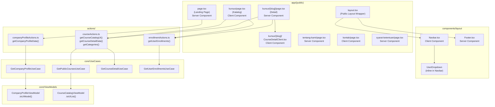

### 2.4 Route Group dan URL Map

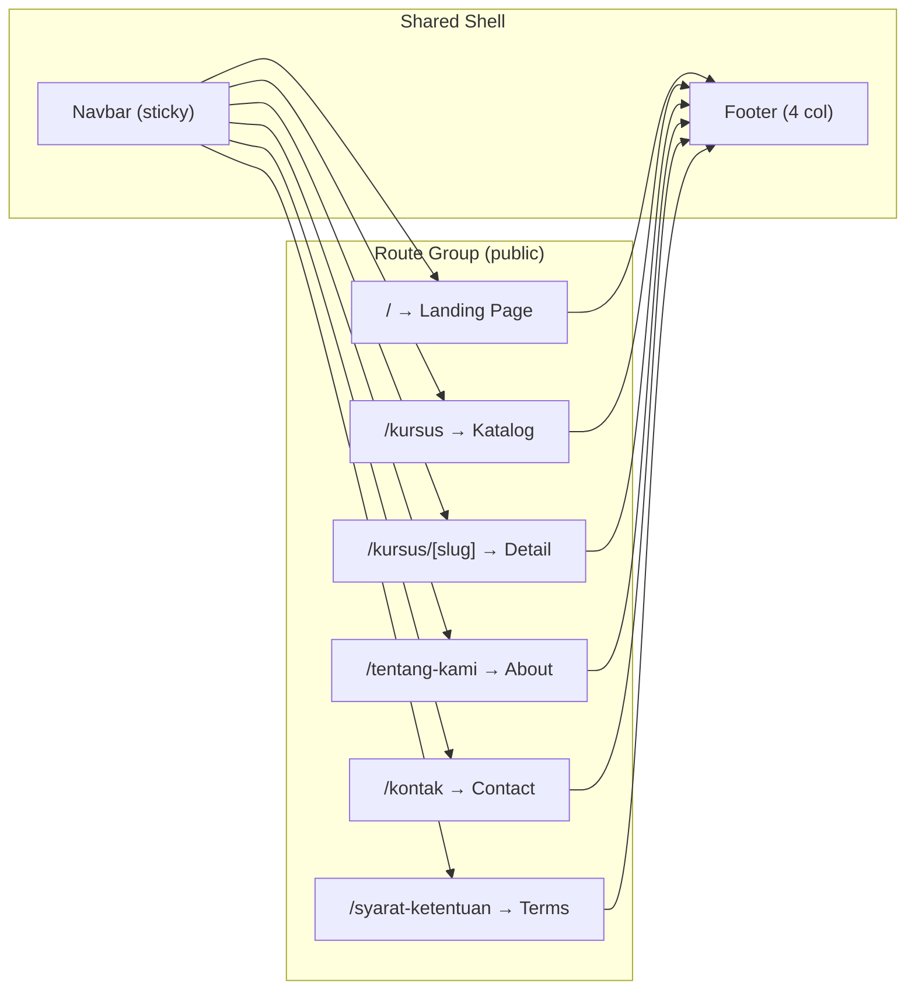

---

## 3. Components and Interfaces

### 3.1 MVVM Class Diagram

```mermaid
classDiagram
    %% ─── ENTITIES ───
    class Category {
        +id: string
        +name: string
        +slug: string
        +icon?: string | null
        +parent_id?: string | null
        +is_active?: boolean
        +course_count?: number
    }

    class Course {
        +id: string
        +title: string
        +slug: string
        +price: number | string
        +level: string
        +status: string
        +instructor_id: string
        +thumbnail: string | null
        +instructor_name?: string
        +instructor_role?: string
        +category_name?: string
        +total_students?: number
        +rating?: number | string
        +sections?: CourseSection[]
    }

    class Testimonial {
        +id: string
        +name: string
        +role: string
        +initials: string
        +color: string
        +rating: number | string
        +text: string
    }

    class SiteStats {
        +students_count: number | string
        +courses_count: number | string
        +instructors_count: number | string
        +average_rating: number | string
        +hero_progress: number
        +hero_current_lesson: string
        +hero_cert_title: string
        +hero_new_students: number
    }

    class Enrollment {
        +id: string
        +user_id: string
        +course_id: string
        +order_id?: string
        +enrolled_at: string
    }

    %% ─── REPOSITORY INTERFACES ───
    class ICategoryRepository {
        <<interface>>
        +getCategories() Promise~Category[]~
        +getCategoryBySlug(slug: string) Promise~Category | null~
    }

    class ICourseRepository {
        <<interface>>
        +getPublicCourses(filters?: Record~string, string~) Promise~Course[]~
        +getCourseBySlug(slug: string) Promise~Course | null~
    }

    class ISiteInfoRepository {
        <<interface>>
        +getTestimonials() Promise~Testimonial[]~
        +getSiteStats() Promise~SiteStats | null~
    }

    class IEnrollmentRepository {
        <<interface>>
        +getUserEnrollments(userId: string) Promise~Enrollment[]~
    }

    %% ─── REPOSITORY IMPLEMENTATIONS ───
    class CategoryRepository {
        -baseUrl: string
        +getCategories() Promise~Category[]~
        +getCategoryBySlug(slug: string) Promise~Category | null~
    }

    class CourseRepository {
        -baseUrl: string
        +getPublicCourses(filters?) Promise~Course[]~
        +getCourseBySlug(slug: string) Promise~Course | null~
    }

    class SiteInfoRepository {
        -baseUrl: string
        +getTestimonials() Promise~Testimonial[]~
        +getSiteStats() Promise~SiteStats | null~
    }

    class EnrollmentRepository {
        -baseUrl: string
        +getUserEnrollments(userId: string) Promise~Enrollment[]~
    }

    %% ─── USECASES ───
    class GetCompanyProfileUseCase {
        -categoryRepo: ICategoryRepository
        -siteInfoRepo: ISiteInfoRepository
        +execute() Promise~CompanyProfileDomainData~
    }

    class GetPublicCoursesUseCase {
        -courseRepo: ICourseRepository
        +execute(filters?) Promise~Course[]~
    }

    class GetCourseDetailUseCase {
        -courseRepo: ICourseRepository
        +execute(slug: string) Promise~Course | null~
    }

    class GetUserEnrollmentsUseCase {
        -enrollmentRepo: IEnrollmentRepository
        +execute(userId: string) Promise~Enrollment[]~
    }

    %% ─── VIEWMODELS ───
    class CourseCatalogViewModel {
        +toUIList(courses: Course[]) CourseCatalogItemUIModel[]$
        -formatRupiah(price: number) string$
        -capitalizeLevel(level: string) string$
    }

    class CompanyProfileViewModel {
        +toUIModel(data: CompanyProfileDomainData) CompanyProfileUIModel$
        -getDefaultStats() SiteStats$
        -normalizeRating(r: number | string) number$
    }

    %% ─── RELATIONSHIPS ───
    ICategoryRepository <|.. CategoryRepository
    ICourseRepository <|.. CourseRepository
    ISiteInfoRepository <|.. SiteInfoRepository
    IEnrollmentRepository <|.. EnrollmentRepository

    GetCompanyProfileUseCase --> ICategoryRepository
    GetCompanyProfileUseCase --> ISiteInfoRepository
    GetPublicCoursesUseCase --> ICourseRepository
    GetCourseDetailUseCase --> ICourseRepository
    GetUserEnrollmentsUseCase --> IEnrollmentRepository

    CourseCatalogViewModel ..> Course
    CompanyProfileViewModel ..> Category
    CompanyProfileViewModel ..> Testimonial
    CompanyProfileViewModel ..> SiteStats
```

### 3.2 Implementasi TypeScript — Entity Layer

```typescript
// src/core/Entities/Category.ts
export interface Category {
  id: string;
  name: string;
  slug: string;
  icon?: string | null;
  parent_id?: string | null;
  is_active?: boolean;
  course_count?: number;
}

// src/core/Entities/Course.ts
export interface CourseSection {
  id: string;
  title: string;
  lessons?: CourseLesson[];
}

export interface CourseLesson {
  id: string;
  title: string;
  duration_minutes?: number;
  is_free_preview?: boolean;
}

export interface Course {
  id: string;
  title: string;
  slug: string;
  price: number | string;
  level: string;
  status: string;
  instructor_id: string;
  thumbnail: string | null;
  instructor_name?: string;
  instructor_role?: string;
  category_name?: string;
  description?: string;
  total_students?: number;
  rating?: number | string;
  sections?: CourseSection[];
}

// src/core/Entities/Testimonial.ts
export interface Testimonial {
  id: string;
  name: string;
  role: string;
  initials: string;
  color: string;
  rating: number | string;
  text: string;
}

// src/core/Entities/SiteStats.ts
export interface SiteStats {
  students_count: number | string;
  courses_count: number | string;
  instructors_count: number | string;
  average_rating: number | string;
  hero_progress: number;
  hero_current_lesson: string;
  hero_cert_title: string;
  hero_new_students: number;
}

// src/core/Entities/Enrollment.ts
export interface Enrollment {
  id: string;
  user_id: string;
  course_id: string;
  order_id?: string;
  enrolled_at: string;
}
```

### 3.3 Implementasi TypeScript — Repository Layer

```typescript
// src/core/Repositories/ICategoryRepository.ts
import type { Category } from '../Entities/Category';
export interface ICategoryRepository {
  getCategories(): Promise<Category[]>;
  getCategoryBySlug(slug: string): Promise<Category | null>;
}

// src/core/Repositories/CategoryRepository.ts
import type { ICategoryRepository } from './ICategoryRepository';
import type { Category } from '../Entities/Category';

export class CategoryRepository implements ICategoryRepository {
  private readonly baseUrl: string;

  constructor(baseUrl: string = process.env.API_URL ?? '') {
    this.baseUrl = baseUrl;
  }

  async getCategories(): Promise<Category[]> {
    try {
      const res = await fetch(`${this.baseUrl}/api/v1/categories`, {
        next: { revalidate: 60 },
      });
      if (!res.ok) return [];
      const json = await res.json();
      return (json.data ?? []) as Category[];
    } catch {
      return [];
    }
  }

  async getCategoryBySlug(slug: string): Promise<Category | null> {
    try {
      const res = await fetch(`${this.baseUrl}/api/v1/categories/${slug}`);
      if (!res.ok) return null;
      const json = await res.json();
      return (json.data ?? null) as Category | null;
    } catch {
      return null;
    }
  }
}

// src/core/Repositories/CourseRepository.ts
import type { ICourseRepository } from './ICourseRepository';
import type { Course } from '../Entities/Course';

export class CourseRepository implements ICourseRepository {
  private readonly baseUrl: string;

  constructor(baseUrl: string = process.env.API_URL ?? '') {
    this.baseUrl = baseUrl;
  }

  async getPublicCourses(filters?: Record<string, string>): Promise<Course[]> {
    try {
      const params = new URLSearchParams(filters ?? {}).toString();
      const url = `${this.baseUrl}/api/v1/courses/public${params ? `?${params}` : ''}`;
      const res = await fetch(url, { next: { revalidate: 60 } });
      if (!res.ok) return [];
      const json = await res.json();
      return (json.data ?? []) as Course[];
    } catch {
      return [];
    }
  }

  async getCourseBySlug(slug: string): Promise<Course | null> {
    try {
      const res = await fetch(`${this.baseUrl}/api/v1/courses/public/${slug}`);
      if (!res.ok) return null;
      const json = await res.json();
      return (json.data ?? null) as Course | null;
    } catch {
      return null;
    }
  }
}
```

### 3.4 Implementasi TypeScript — UseCase Layer

```typescript
// src/core/UseCases/GetCompanyProfileUseCase.ts
import type { ICategoryRepository } from '../Repositories/ICategoryRepository';
import type { ISiteInfoRepository } from '../Repositories/ISiteInfoRepository';
import type { Category } from '../Entities/Category';
import type { Testimonial } from '../Entities/Testimonial';
import type { SiteStats } from '../Entities/SiteStats';

export interface CompanyProfileDomainData {
  categories: Category[];
  testimonials: Testimonial[];
  stats: SiteStats | null;
}

export class GetCompanyProfileUseCase {
  constructor(
    private readonly categoryRepo: ICategoryRepository,
    private readonly siteInfoRepo: ISiteInfoRepository,
  ) {}

  async execute(): Promise<CompanyProfileDomainData> {
    const [categories, testimonials, stats] = await Promise.all([
      this.categoryRepo.getCategories(),
      this.siteInfoRepo.getTestimonials(),
      this.siteInfoRepo.getSiteStats(),
    ]);
    return { categories, testimonials, stats };
  }
}

// src/core/UseCases/GetPublicCoursesUseCase.ts
import type { ICourseRepository } from '../Repositories/ICourseRepository';
import type { Course } from '../Entities/Course';

export class GetPublicCoursesUseCase {
  constructor(private readonly courseRepo: ICourseRepository) {}

  async execute(filters?: Record<string, string>): Promise<Course[]> {
    return this.courseRepo.getPublicCourses(filters);
  }
}

// src/core/UseCases/GetCourseDetailUseCase.ts
export class GetCourseDetailUseCase {
  constructor(private readonly courseRepo: ICourseRepository) {}

  async execute(slug: string): Promise<Course | null> {
    return this.courseRepo.getCourseBySlug(slug);
  }
}
```

### 3.5 Implementasi TypeScript — ViewModel Layer

```typescript
// src/core/ViewModels/CourseCatalogViewModel.ts
import type { Course } from '../Entities/Course';
import { getCourseThumbnail } from '../utils/imageHelper';

export interface CourseCatalogItemUIModel {
  id: string;
  title: string;
  slug: string;
  thumbnail: string;
  instructor_name: string;
  instructor_role: string;
  category: string;
  level: string;
  students: number;
  price: number;
  price_formatted: string;
  rating: number;
}

export class CourseCatalogViewModel {
  static toUIList(courses: Course[]): CourseCatalogItemUIModel[] {
    return courses.map((c) => ({
      id: c.id,
      title: c.title,
      slug: c.slug,
      thumbnail: getCourseThumbnail(c.thumbnail),
      instructor_name: c.instructor_name ?? 'Instruktur EduNusa',
      instructor_role: c.instructor_role ?? '',
      category: c.category_name ?? '',
      level: CourseCatalogViewModel.capitalizeLevel(c.level),
      students: Number(c.total_students ?? 0),
      price: Number(c.price ?? 0),
      price_formatted: CourseCatalogViewModel.formatRupiah(Number(c.price ?? 0)),
      rating: Number(c.rating ?? 0),
    }));
  }

  private static formatRupiah(price: number): string {
    return new Intl.NumberFormat('id-ID', {
      style: 'currency',
      currency: 'IDR',
      minimumFractionDigits: 0,
      maximumFractionDigits: 0,
    }).format(price);
  }

  private static capitalizeLevel(level: string): string {
    if (!level) return '';
    return level.charAt(0).toUpperCase() + level.slice(1).toLowerCase();
  }
}

// src/core/ViewModels/CompanyProfileViewModel.ts
import type { CompanyProfileDomainData } from '../UseCases/GetCompanyProfileUseCase';

export interface CompanyProfileUIModel {
  categories: CategoryUIModel[];
  testimonials: TestimonialUIModel[];
  stats: SiteStatsUIModel;
}

export interface SiteStatsUIModel {
  students_count: string;
  courses_count: string;
  instructors_count: string;
  average_rating: string;
  hero_progress: number;
  hero_current_lesson: string;
  hero_cert_title: string;
  hero_new_students: number;
}

export class CompanyProfileViewModel {
  static toUIModel(data: CompanyProfileDomainData): CompanyProfileUIModel {
    const stats = data.stats;
    return {
      categories: data.categories.map((c) => ({
        id: c.id,
        name: c.name,
        slug: c.slug,
        icon: c.icon ?? null,
        course_count: c.course_count ?? 0,
      })),
      testimonials: data.testimonials.map((t) => ({
        id: t.id,
        name: t.name,
        role: t.role,
        initials: t.initials,
        color: t.color,
        rating: Number(t.rating),
        text: t.text,
      })),
      stats: {
        students_count: String(stats?.students_count ?? '50.000+'),
        courses_count: String(stats?.courses_count ?? '1.200+'),
        instructors_count: String(stats?.instructors_count ?? '500+'),
        average_rating: String(stats?.average_rating ?? '4.9'),
        hero_progress: Number(stats?.hero_progress ?? 78),
        hero_current_lesson: stats?.hero_current_lesson ?? 'Pengenalan React Hooks',
        hero_cert_title: stats?.hero_cert_title ?? 'Sertifikat JavaScript',
        hero_new_students: Number(stats?.hero_new_students ?? 128),
      },
    };
  }
}
```

### 3.6 Implementasi TypeScript — imageHelper

```typescript
// src/core/utils/imageHelper.ts

/**
 * Resolves a course thumbnail path to a valid public URL.
 *
 * Resolution rules (priority order):
 * 1. null / undefined / empty string → "/placeholder.jpg"
 * 2. starts with "http://" or "https://" → return as-is (external URL)
 * 3. starts with "/" → return as-is (absolute path)
 * 4. otherwise → prepend "/" (relative filename → absolute path)
 */
export function getCourseThumbnail(thumbnail?: string | null): string {
  if (!thumbnail || thumbnail.trim() === '') {
    return '/placeholder.jpg';
  }
  if (thumbnail.startsWith('http://') || thumbnail.startsWith('https://')) {
    return thumbnail;
  }
  if (thumbnail.startsWith('/')) {
    return thumbnail;
  }
  return `/${thumbnail}`;
}
```

### 3.7 Navbar Component State

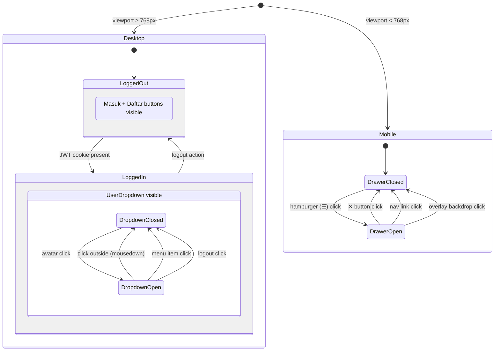

### 3.8 Navbar Component Implementation

```typescript
// src/components/layout/Navbar.tsx
'use client';

import { useState, useRef, useEffect } from 'react';
import Link from 'next/link';

interface NavbarProps {
  isLoggedIn: boolean;
  user?: { name: string; email: string } | null;
}

export default function Navbar({ isLoggedIn, user }: NavbarProps) {
  const [drawerOpen, setDrawerOpen] = useState(false);
  const [dropdownOpen, setDropdownOpen] = useState(false);
  const dropdownRef = useRef<HTMLDivElement>(null);

  // Close dropdown on outside click
  useEffect(() => {
    const handler = (e: MouseEvent) => {
      if (dropdownRef.current && !dropdownRef.current.contains(e.target as Node)) {
        setDropdownOpen(false);
      }
    };
    document.addEventListener('mousedown', handler);
    return () => document.removeEventListener('mousedown', handler);
  }, []);

  const initials = user?.name
    ? user.name.split(' ').slice(0, 2).map((w) => w[0]).join('').toUpperCase()
    : 'US';

  return (
    <nav className="navbar-sticky">
      {/* ... JSX omitted for brevity — see implementation guide below */}
    </nav>
  );
}
```

### 3.9 Public Layout Wrapper

```typescript
// src/app/(public)/layout.tsx
import { cookies } from 'next/headers';
import Navbar from '@/components/layout/Navbar';
import Footer from '@/components/layout/Footer';

export default async function PublicLayout({
  children,
}: {
  children: React.ReactNode;
}) {
  const cookieStore = await cookies();
  const token = cookieStore.get('token')?.value;
  const userCookie = cookieStore.get('user')?.value;

  const isLoggedIn = Boolean(token);
  const user = userCookie ? JSON.parse(userCookie) : null;

  return (
    <>
      <Navbar isLoggedIn={isLoggedIn} user={user} />
      <main>{children}</main>
      <Footer />
    </>
  );
}
```

---

## 4. Data Models

### 4.1 Sequence Diagram: Landing Page Load

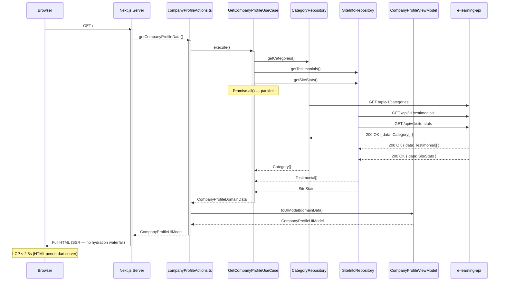

### 4.2 Sequence Diagram: Katalog Kursus dengan Filter

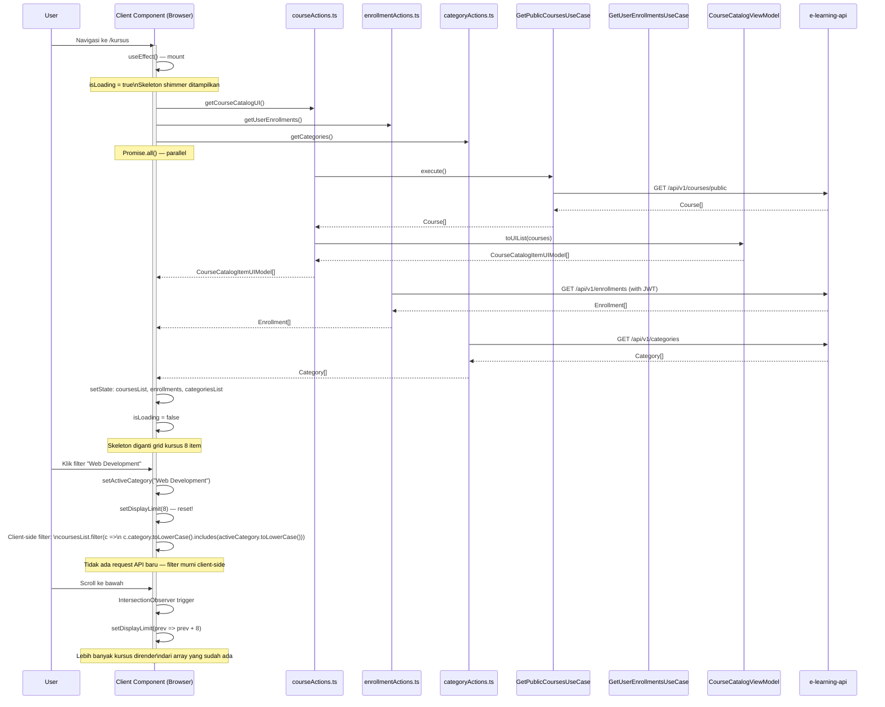

### 4.3 Sequence Diagram: Detail Kursus

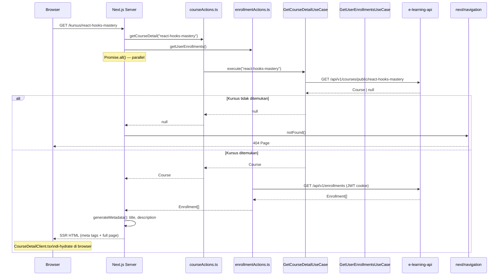

### 4.4 Sequence Diagram: Enrollment Check dan Tombol Adaptif

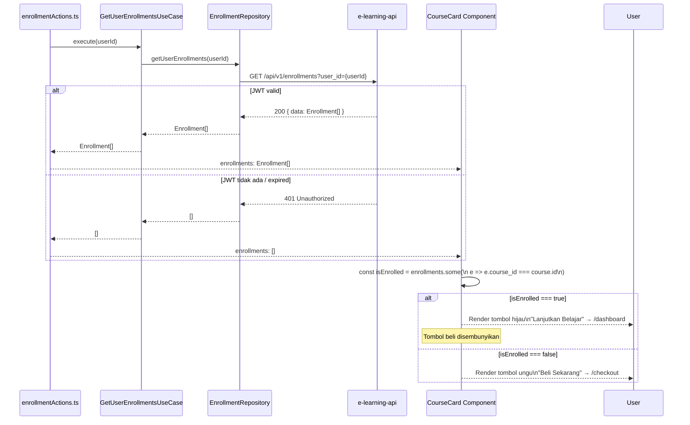

### 4.5 Infinite Scroll Engine Flow

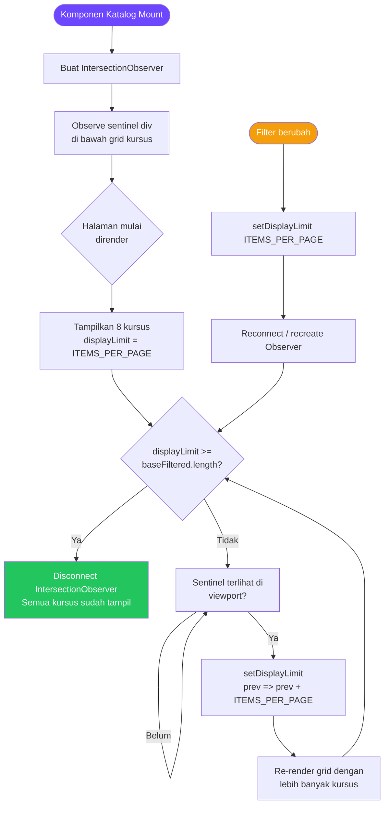

### 4.6 UserDropdown Interaction Flow

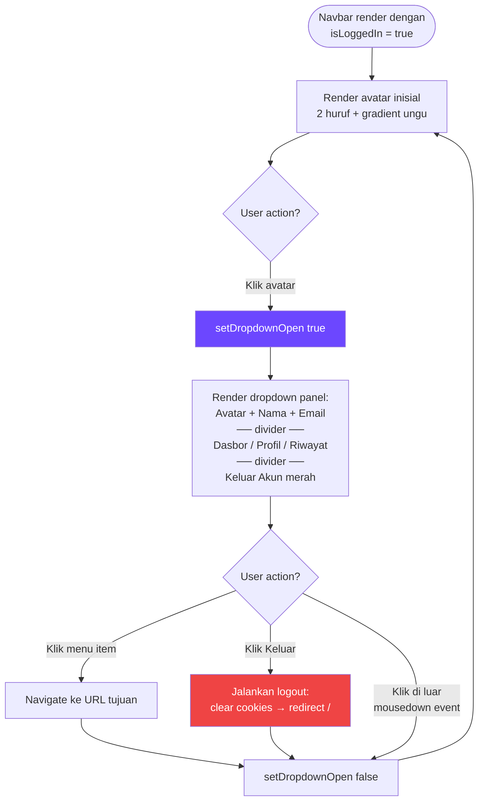

### 4.7 Mobile Drawer Menu Flow

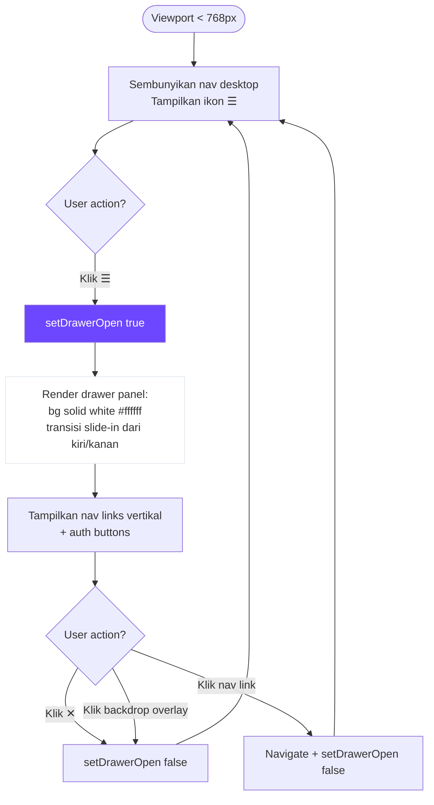

### 4.8 Course Card State Machine

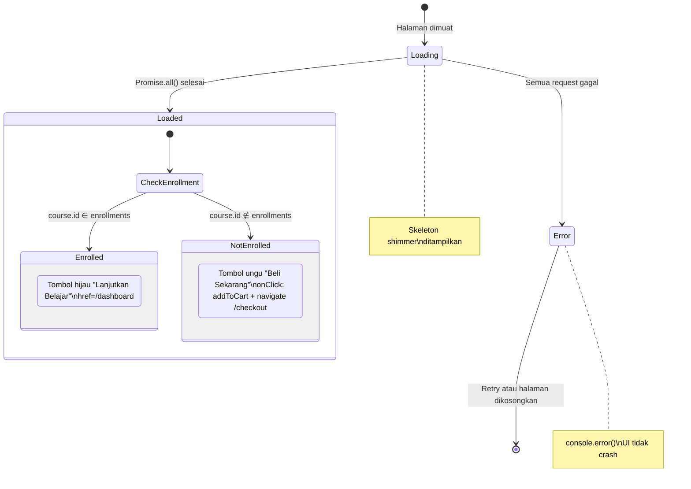

### 4.9 Filter Katalog State Machine

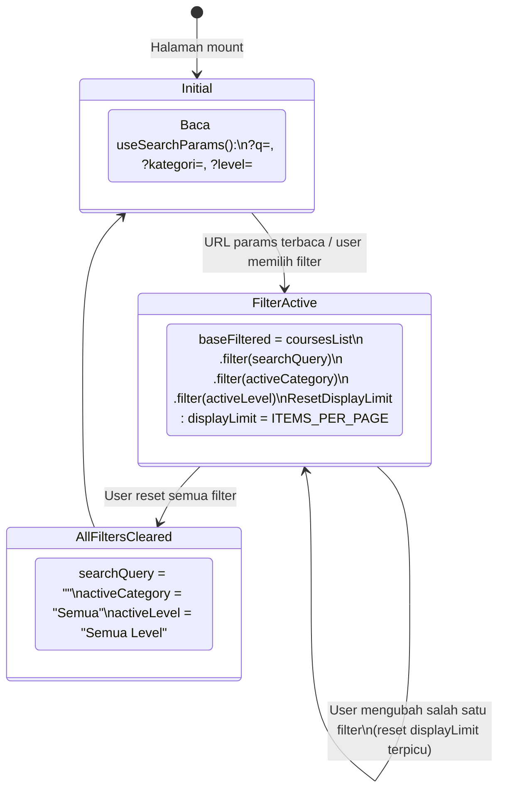

---

## 5. Correctness Properties

*A property is a characteristic or behavior that should hold true across all valid executions of a system — essentially, a formal statement about what the system should do. Properties serve as the bridge between human-readable specifications and machine-verifiable correctness guarantees.*

### Property 1: Repository Error Resilience

*For any* HTTP response with a non-200 status code, the Repository implementation SHALL return an empty array `[]` or `null` without throwing an unhandled exception to the caller.

**Validates: Requirements 1.2.12**

---

### Property 2: UseCase Parallel Aggregation Correctness

*For any* combination of `Category[]`, `Testimonial[]`, and `SiteStats | null` returned by their respective repositories, `GetCompanyProfileUseCase.execute()` SHALL return a `CompanyProfileDomainData` object where `categories`, `testimonials`, and `stats` fields exactly match the values returned by the repositories.

**Validates: Requirements 1.3.13**

---

### Property 3: CourseCatalogViewModel Transformation Completeness

*For any* non-empty array of `Course` entities, `CourseCatalogViewModel.toUIList()` SHALL return an array of the same length where every element has: a non-empty `price_formatted` string matching the Rupiah format pattern (`/^Rp\s?[\d.,]+$/`), a `level` field with the first letter capitalized, and a `thumbnail` field that is always a non-empty string.

**Validates: Requirements 1.4.18, 1.4.19**

---

### Property 4: CompanyProfileViewModel Null-Safety Invariant

*For any* `CompanyProfileDomainData` — including inputs where `stats` is `null` — `CompanyProfileViewModel.toUIModel()` SHALL return a `CompanyProfileUIModel` where no field in the `stats` sub-object is `null`, `undefined`, or an empty string.

**Validates: Requirements 1.4.21**

---

### Property 5: getCourseThumbnail Resolution Completeness

*For any* input string (including `null`, `undefined`, empty string, relative filename, absolute path, or full URL), `getCourseThumbnail()` SHALL:
- always return a non-empty string
- return `"/placeholder.jpg"` if and only if the input is falsy or blank
- return the original string unchanged if it starts with `http://` or `https://`
- return the original string unchanged if it starts with `/`
- return `"/" + input` for any other non-empty string

**Validates: Requirements 5.3.12, 8.4.11**

---

### Property 6: Course Filter Correctness

*For any* array of `CourseCatalogItemUIModel[]`, any `searchQuery` string, any `activeCategory` string, and any `activeLevel` string, the client-side filter result SHALL contain only courses where:
- `title.toLowerCase()` includes `searchQuery.toLowerCase()` (or `searchQuery` is empty)
- `category.toLowerCase()` includes `activeCategory.toLowerCase()` (or `activeCategory` is "Semua")
- `level.toLowerCase()` === `activeLevel.toLowerCase()` (or `activeLevel` is "Semua Level")

*For any* empty `searchQuery`, the filter SHALL return all courses regardless of title.

**Validates: Requirements 5.2.7, 5.2.8, 5.2.9**

---

### Property 7: Enrollment-Based Button State Correctness

*For any* course and *any* list of enrollments, the button state SHALL satisfy exactly one of the following mutually exclusive conditions:
- If `enrollments.some(e => e.course_id === course.id)` is `true` → "Lanjutkan Belajar" button is rendered and "Beli Sekarang" button is absent
- If `enrollments.some(e => e.course_id === course.id)` is `false` → "Beli Sekarang" button is rendered and "Lanjutkan Belajar" button is absent

**Validates: Requirements 5.3.13, 5.3.14**

---

### Property 8: Testimonial Rating Type Normalization

*For any* `Testimonial` entity where `rating` may be either `string` or `number`, `CompanyProfileViewModel.toUIModel()` SHALL produce a `testimonials` array where every element has `typeof rating === 'number'` and `!isNaN(rating)`.

**Validates: Requirements 4.3.11**

---

## 6. Error Handling

### 6.1 Strategi Error per Layer

```mermaid
flowchart TD
    subgraph "Repository Layer (catch all)"
        R1[HTTP fetch gagal\nNetwork Error] --> R2[try-catch blok\nreturn [] atau null]
        R3[API return non-200] --> R4[Cek !res.ok\nreturn [] atau null]
        R5[API return malformed JSON] --> R6[try-catch json.parse\nreturn [] atau null]
    end

    subgraph "UseCase Layer (propagate dengan graceful)"
        UC1[Repository return []] --> UC2[UseCase tetap jalan\nreturn data kosong]
        UC3[Promise.all partial fail] --> UC4[Tidak diblokir —\nhasil yang berhasil tetap dikembalikan]
    end

    subgraph "ViewModel Layer (never throws)"
        VM1[data.stats === null] --> VM2[Gunakan nilai default\nbukan throw error]
        VM3[rating bertipe string] --> VM4[Number konversi\nbukan throw error]
    end

    subgraph "UI Component Layer (graceful empty state)"
        UI1[Array kategori kosong] --> UI2[Tampilkan pesan informatif\nbukan crash atau grid rusak]
        UI3[Kursus tidak ditemukan] --> UI4[notFound()\nHalaman 404 kustom]
        UI5[Promise.all partial fail\nkatalog] --> UI6[console.error()\nData lain tetap ditampilkan]
    end
```

### 6.2 HTTP Error Handling Pattern

```typescript
// Pattern standar di semua Repository implementation
async function safeFetch<T>(url: string, fallback: T): Promise<T> {
  try {
    const res = await fetch(url, { next: { revalidate: 60 } });
    if (!res.ok) return fallback;
    const json = await res.json();
    return (json.data ?? fallback) as T;
  } catch {
    // Network error, JSON parse error, dll.
    return fallback;
  }
}

// Penggunaan:
// getCategories() → safeFetch(url, [])
// getCourseBySlug() → safeFetch(url, null)
```

### 6.3 Empty State Handling

| Kondisi | Komponen | Perlakuan |
|---|---|---|
| Kategori kosong dari API | Category Section | Pesan "Belum ada kategori tersedia" |
| Kursus tidak ditemukan (slug) | Detail Page | `notFound()` → 404 kustom |
| Enrollment gagal dimuat | Course Card | Default: semua tombol "Beli Sekarang" |
| Stats API gagal | Hero Section | Nilai default dari ViewModel (tidak kosong) |
| Filter menghasilkan 0 kursus | Katalog | Pesan "Tidak ada kursus ditemukan untuk filter ini" |
| Kontak form submit gagal | Contact Page | `toast.error()` dari react-hot-toast |

### 6.4 Type Safety Guards

```typescript
// Guard untuk rating
function safeRating(value: unknown): number {
  const n = Number(value);
  return isNaN(n) ? 0 : Math.min(5, Math.max(0, n));
}

// Guard untuk price
function safePrice(value: unknown): number {
  const n = Number(value);
  return isNaN(n) || n < 0 ? 0 : n;
}
```

---

## 7. Testing Strategy

### 7.1 Gambaran Strategi

Fase 2 menggunakan **pendekatan testing berlapis** dengan kombinasi unit tests untuk logika murni, property-based tests untuk fungsi transformasi dan filtering, dan integration tests untuk verifikasi koneksi layer:

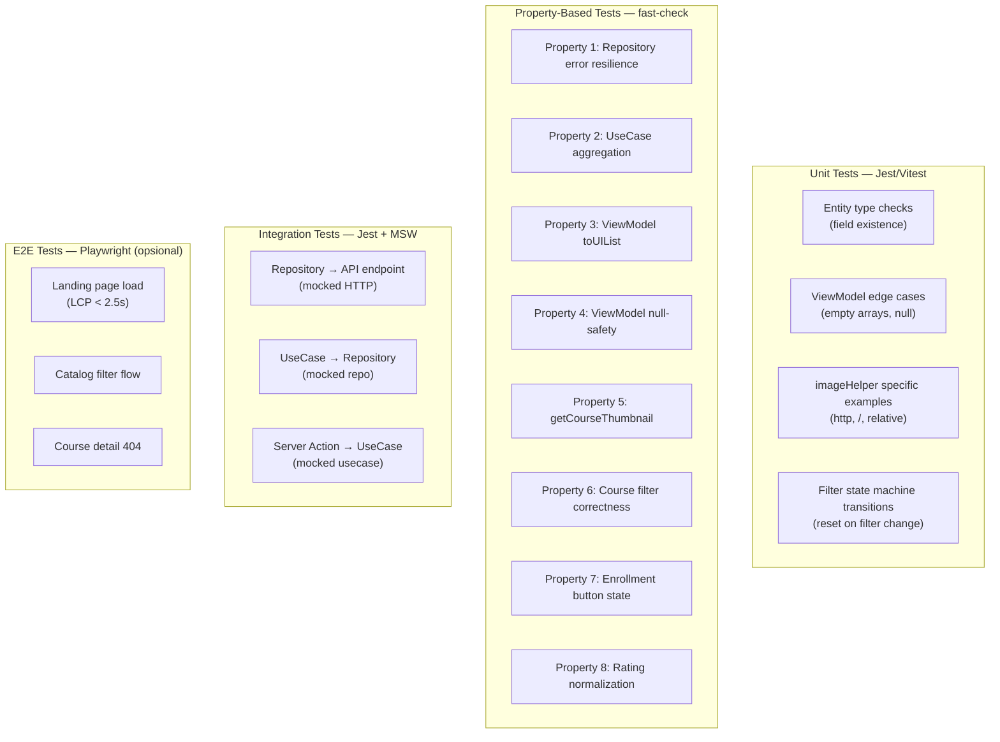

### 7.2 Konfigurasi Property-Based Testing

Library yang digunakan: **[fast-check](https://fast-check.dev/)** (TypeScript-native, cocok untuk Next.js ecosystem).

Konfigurasi minimum 100 iterasi per property:

```typescript
// vitest.config.ts atau jest.config.ts
// fast-check default: 100 runs per property

import fc from 'fast-check';

// Konfigurasi global
fc.configureGlobal({ numRuns: 100 });
```

### 7.3 Implementasi Property Tests

```typescript
// tests/unit/imageHelper.property.test.ts
// Feature: fase-2-public-marketing, Property 5: getCourseThumbnail resolution completeness

import fc from 'fast-check';
import { getCourseThumbnail } from '@/core/utils/imageHelper';

describe('Property 5: getCourseThumbnail Resolution Completeness', () => {
  it('always returns a non-empty string', () => {
    fc.assert(
      fc.property(fc.option(fc.string()), (thumbnail) => {
        const result = getCourseThumbnail(thumbnail ?? null);
        expect(result.length).toBeGreaterThan(0);
      }),
      { numRuns: 100 }
    );
  });

  it('null or empty input always returns /placeholder.jpg', () => {
    fc.assert(
      fc.property(
        fc.oneof(fc.constant(null), fc.constant(undefined), fc.constant('')),
        (input) => {
          expect(getCourseThumbnail(input)).toBe('/placeholder.jpg');
        }
      ),
      { numRuns: 100 }
    );
  });

  it('http:// or https:// URLs are returned unchanged', () => {
    fc.assert(
      fc.property(
        fc.oneof(
          fc.webUrl().map((u) => `http://${u}`),
          fc.webUrl()
        ),
        (url) => {
          fc.pre(url.startsWith('http://') || url.startsWith('https://'));
          expect(getCourseThumbnail(url)).toBe(url);
        }
      ),
      { numRuns: 100 }
    );
  });

  it('strings starting with / are returned unchanged', () => {
    fc.assert(
      fc.property(
        fc.string({ minLength: 1 }).map((s) => `/${s}`),
        (path) => {
          expect(getCourseThumbnail(path)).toBe(path);
        }
      ),
      { numRuns: 100 }
    );
  });

  it('relative filenames get / prepended', () => {
    fc.assert(
      fc.property(
        fc.string({ minLength: 1 }).filter(
          (s) =>
            !s.startsWith('/') &&
            !s.startsWith('http://') &&
            !s.startsWith('https://')
        ),
        (filename) => {
          expect(getCourseThumbnail(filename)).toBe(`/${filename}`);
        }
      ),
      { numRuns: 100 }
    );
  });
});

// tests/unit/courseCatalogViewModel.property.test.ts
// Feature: fase-2-public-marketing, Property 3: CourseCatalogViewModel transformation completeness

import fc from 'fast-check';
import { CourseCatalogViewModel } from '@/core/ViewModels/CourseCatalogViewModel';
import type { Course } from '@/core/Entities/Course';

const courseArb: fc.Arbitrary<Course> = fc.record({
  id: fc.uuid(),
  title: fc.string({ minLength: 1, maxLength: 100 }),
  slug: fc.string({ minLength: 1 }),
  price: fc.oneof(fc.nat(10_000_000), fc.nat(10_000_000).map(String)),
  level: fc.oneof(
    fc.constant('beginner'),
    fc.constant('intermediate'),
    fc.constant('advanced'),
    fc.constant('BEGINNER'),
  ),
  status: fc.constant('published'),
  instructor_id: fc.uuid(),
  thumbnail: fc.option(fc.string()),
  instructor_name: fc.option(fc.string()),
  category_name: fc.option(fc.string()),
  total_students: fc.option(fc.nat(100_000)),
  rating: fc.option(fc.double({ min: 0, max: 5 })),
});

describe('Property 3: CourseCatalogViewModel Transformation Completeness', () => {
  it('output length matches input length', () => {
    fc.assert(
      fc.property(fc.array(courseArb, { minLength: 1, maxLength: 50 }), (courses) => {
        const result = CourseCatalogViewModel.toUIList(courses);
        expect(result).toHaveLength(courses.length);
      }),
      { numRuns: 100 }
    );
  });

  it('price_formatted always matches Rupiah pattern', () => {
    fc.assert(
      fc.property(fc.array(courseArb, { minLength: 1 }), (courses) => {
        const result = CourseCatalogViewModel.toUIList(courses);
        result.forEach((item) => {
          expect(item.price_formatted).toMatch(/Rp[\s]?[\d.,]+/);
        });
      }),
      { numRuns: 100 }
    );
  });

  it('level is always capitalized (first letter uppercase)', () => {
    fc.assert(
      fc.property(fc.array(courseArb, { minLength: 1 }), (courses) => {
        const result = CourseCatalogViewModel.toUIList(courses);
        result.forEach((item) => {
          if (item.level.length > 0) {
            expect(item.level[0]).toBe(item.level[0].toUpperCase());
          }
        });
      }),
      { numRuns: 100 }
    );
  });

  it('thumbnail is always a non-empty string', () => {
    fc.assert(
      fc.property(fc.array(courseArb, { minLength: 1 }), (courses) => {
        const result = CourseCatalogViewModel.toUIList(courses);
        result.forEach((item) => {
          expect(item.thumbnail.length).toBeGreaterThan(0);
        });
      }),
      { numRuns: 100 }
    );
  });
});

// tests/unit/companyProfileViewModel.property.test.ts
// Feature: fase-2-public-marketing, Property 4: CompanyProfileViewModel null-safety invariant

import fc from 'fast-check';
import { CompanyProfileViewModel } from '@/core/ViewModels/CompanyProfileViewModel';

describe('Property 4: CompanyProfileViewModel Null-Safety Invariant', () => {
  it('stats fields are never null or undefined even when input stats is null', () => {
    fc.assert(
      fc.property(
        fc.record({
          categories: fc.array(fc.record({ id: fc.uuid(), name: fc.string(), slug: fc.string() })),
          testimonials: fc.array(
            fc.record({
              id: fc.uuid(), name: fc.string(), role: fc.string(),
              initials: fc.string(), color: fc.string(),
              rating: fc.oneof(fc.double({ min: 0, max: 5 }), fc.double({ min: 0, max: 5 }).map(String)),
              text: fc.string(),
            })
          ),
          stats: fc.option(fc.record({
            students_count: fc.nat(),
            courses_count: fc.nat(),
            instructors_count: fc.nat(),
            average_rating: fc.double({ min: 0, max: 5 }),
            hero_progress: fc.nat(100),
            hero_current_lesson: fc.string(),
            hero_cert_title: fc.string(),
            hero_new_students: fc.nat(),
          })),
        }),
        (domainData) => {
          const result = CompanyProfileViewModel.toUIModel(domainData);
          const s = result.stats;
          expect(s.students_count).toBeTruthy();
          expect(s.courses_count).toBeTruthy();
          expect(s.instructors_count).toBeTruthy();
          expect(s.average_rating).toBeTruthy();
          expect(s.hero_current_lesson.length).toBeGreaterThan(0);
          expect(s.hero_cert_title.length).toBeGreaterThan(0);
        }
      ),
      { numRuns: 100 }
    );
  });
});

// tests/unit/courseFilter.property.test.ts
// Feature: fase-2-public-marketing, Property 6: Course filter correctness

import fc from 'fast-check';
import type { CourseCatalogItemUIModel } from '@/core/ViewModels/CourseCatalogViewModel';

function applyFilters(
  courses: CourseCatalogItemUIModel[],
  searchQuery: string,
  activeCategory: string,
  activeLevel: string,
): CourseCatalogItemUIModel[] {
  return courses.filter((c) => {
    const matchSearch =
      !searchQuery || c.title.toLowerCase().includes(searchQuery.toLowerCase());
    const matchCategory =
      activeCategory === 'Semua' ||
      c.category.toLowerCase().includes(activeCategory.toLowerCase());
    const matchLevel =
      activeLevel === 'Semua Level' ||
      c.level.toLowerCase() === activeLevel.toLowerCase();
    return matchSearch && matchCategory && matchLevel;
  });
}

const uiCourseArb = fc.record({
  id: fc.uuid(),
  title: fc.string({ minLength: 1 }),
  slug: fc.string(),
  thumbnail: fc.constant('/placeholder.jpg'),
  instructor_name: fc.string(),
  instructor_role: fc.string(),
  category: fc.oneof(fc.constant('Web Development'), fc.constant('Design'), fc.constant('Data Science')),
  level: fc.oneof(fc.constant('Beginner'), fc.constant('Intermediate'), fc.constant('Advanced')),
  students: fc.nat(),
  price: fc.nat(10_000_000),
  price_formatted: fc.constant('Rp 0'),
  rating: fc.double({ min: 0, max: 5 }),
});

describe('Property 6: Course Filter Correctness', () => {
  it('all results pass the search query filter', () => {
    fc.assert(
      fc.property(
        fc.array(uiCourseArb, { minLength: 1 }),
        fc.string({ minLength: 1, maxLength: 10 }),
        (courses, query) => {
          const result = applyFilters(courses, query, 'Semua', 'Semua Level');
          result.forEach((c) => {
            expect(c.title.toLowerCase()).toContain(query.toLowerCase());
          });
        }
      ),
      { numRuns: 100 }
    );
  });

  it('empty search query returns all courses', () => {
    fc.assert(
      fc.property(
        fc.array(uiCourseArb, { minLength: 1 }),
        (courses) => {
          const result = applyFilters(courses, '', 'Semua', 'Semua Level');
          expect(result).toHaveLength(courses.length);
        }
      ),
      { numRuns: 100 }
    );
  });
});
```

### 7.4 Implementasi Unit Tests

```typescript
// tests/unit/imageHelper.unit.test.ts
import { getCourseThumbnail } from '@/core/utils/imageHelper';

describe('getCourseThumbnail — specific examples', () => {
  it('returns /placeholder.jpg for null', () => {
    expect(getCourseThumbnail(null)).toBe('/placeholder.jpg');
  });
  it('returns /placeholder.jpg for undefined', () => {
    expect(getCourseThumbnail(undefined)).toBe('/placeholder.jpg');
  });
  it('returns /placeholder.jpg for empty string', () => {
    expect(getCourseThumbnail('')).toBe('/placeholder.jpg');
  });
  it('returns external URL unchanged', () => {
    expect(getCourseThumbnail('https://cdn.example.com/img.jpg')).toBe(
      'https://cdn.example.com/img.jpg'
    );
  });
  it('returns absolute path unchanged', () => {
    expect(getCourseThumbnail('/images/courses/react.jpg')).toBe(
      '/images/courses/react.jpg'
    );
  });
  it('prepends / to relative filename', () => {
    expect(getCourseThumbnail('react.jpg')).toBe('/react.jpg');
  });
});

// tests/unit/navbar.unit.test.tsx
// Tests state transitions for Navbar (dropdown open/close)
```

### 7.5 CSS Architecture

#### Skeleton Shimmer Implementation

```css
/* src/app/globals.css */

/* ── Skeleton Shimmer Base ── */
.skeleton {
  background: #f0f0f0;
  border-radius: 4px;
  overflow: hidden;
  position: relative;
}

.skeleton::after {
  content: '';
  position: absolute;
  inset: 0;
  background: linear-gradient(
    90deg,
    #f0f0f0 25%,
    #e0e0e0 50%,
    #f0f0f0 75%
  );
  background-size: 200% 100%;
  animation: shimmer 1.5s infinite;
}

@keyframes shimmer {
  0%   { background-position: 200% 0; }
  100% { background-position: -200% 0; }
}

/* ── Skeleton Course Card Layout ── */
.skeleton-card {
  border-radius: 12px;
  overflow: hidden;
  border: 1px solid #e2e8f0;
}
.skeleton-thumb  { height: 180px; }
.skeleton-body   { padding: 16px; display: flex; flex-direction: column; gap: 8px; }
.skeleton-line   { height: 14px; border-radius: 4px; }
.skeleton-line-sm { width: 60%; }
.skeleton-line-md { width: 80%; }
.skeleton-line-lg { width: 95%; }

/* ── Color System Variables ── */
:root {
  --color-brand-primary: #6C47FF;
  --color-brand-secondary: #4f46e5;
  --color-brand-accent: #6366F1;
  --color-text-primary: #1e293b;
  --color-text-secondary: #64748b;
  --color-border: #e2e8f0;
  --color-bg: #ffffff;
  --color-success: #22c55e;
  --color-error: #ef4444;
  --color-warning: #f59e0b;
}

/* ── Pill-shaped Button System ── */
.btn-pill {
  border-radius: 99px;
  padding: 10px 24px;
  font-weight: 600;
  font-family: 'Plus Jakarta Sans', sans-serif;
  cursor: pointer;
  transition: opacity 0.2s ease, transform 0.1s ease;
}
.btn-pill:active { transform: scale(0.98); }

.btn-primary {
  background: linear-gradient(135deg, var(--color-brand-primary), var(--color-brand-secondary));
  color: #ffffff;
  border: none;
}
.btn-primary:hover { opacity: 0.92; }

.btn-outline {
  background: transparent;
  color: var(--color-brand-primary);
  border: 2px solid var(--color-brand-primary);
}
.btn-outline:hover {
  background: var(--color-brand-primary);
  color: #ffffff;
}

/* ── Responsive Breakpoints ── */
/* Mobile:  < 768px  */
/* Tablet:  768px – 1023px  */
/* Desktop: ≥ 1024px  */

.container {
  width: 100%;
  max-width: 1280px;
  margin: 0 auto;
  padding: 0 24px;   /* 24px di semua sisi — sesuai Req 9.1.4 */
}

@media (max-width: 767px) {
  .container { padding: 0 16px; }  /* min 16px di mobile — Req 9.3.11 */
}

/* ── Sticky Navbar ── */
.navbar-sticky {
  position: sticky;
  top: 0;
  z-index: 50;
  background: rgba(255, 255, 255, 0.95);
  backdrop-filter: blur(8px);
  border-bottom: 1px solid var(--color-border);
}

/* ── Text Gradient ── */
.text-gradient {
  background: linear-gradient(135deg, var(--color-brand-primary), var(--color-brand-secondary));
  -webkit-background-clip: text;
  -webkit-text-fill-color: transparent;
  background-clip: text;
}
```

#### Responsive Grid Strategy

```css
/* Course Grid — 4 col desktop, 3 col tablet-lg, 2 col tablet-sm, 1 col mobile */
.course-grid {
  display: grid;
  gap: 24px;
  grid-template-columns: repeat(1, 1fr);
}

@media (min-width: 640px) {
  .course-grid { grid-template-columns: repeat(2, 1fr); }
}
@media (min-width: 1024px) {
  .course-grid { grid-template-columns: repeat(3, 1fr); }
}
@media (min-width: 1280px) {
  .course-grid { grid-template-columns: repeat(4, 1fr); }
}

/* Category Grid — 4 col desktop, 3 col tablet, 2 col mobile */
.category-grid {
  display: grid;
  gap: 16px;
  grid-template-columns: repeat(2, 1fr);
}
@media (min-width: 768px) {
  .category-grid { grid-template-columns: repeat(3, 1fr); }
}
@media (min-width: 1024px) {
  .category-grid { grid-template-columns: repeat(4, 1fr); }
}

/* Hero Visual — hidden on mobile/tablet */
.hero-visual { display: none; }
@media (min-width: 1024px) {
  .hero-visual { display: block; }
}
```

### 7.6 Ringkasan Test Coverage

| Property/Test | Tipe | Library | Iterasi |
|---|---|---|---|
| Repository error resilience | Property | fast-check | 100 |
| UseCase parallel aggregation | Property | fast-check | 100 |
| ViewModel toUIList completeness | Property | fast-check | 100 |
| ViewModel null-safety invariant | Property | fast-check | 100 |
| getCourseThumbnail resolution | Property | fast-check | 100 |
| Course filter correctness | Property | fast-check | 100 |
| Enrollment button state | Property | fast-check | 100 |
| Rating type normalization | Property | fast-check | 100 |
| imageHelper specific examples | Unit | Vitest | N/A |
| Navbar state transitions | Unit | Vitest + Testing Library | N/A |
| Filter displayLimit reset | Unit | Vitest | N/A |
| Repository → API wiring | Integration | Vitest + MSW | N/A |
| Landing page load | E2E | Playwright | N/A |

> **Catatan**: Property-based tests menjalankan setiap properti minimum **100 iterasi** dengan input yang di-generate secara acak oleh fast-check. Ini setara dengan menulis 100 unit test manual yang mencakup edge case yang tidak terpikirkan sebelumnya.
