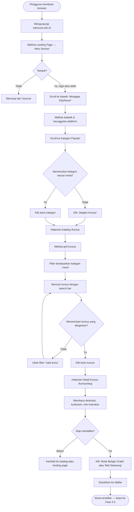
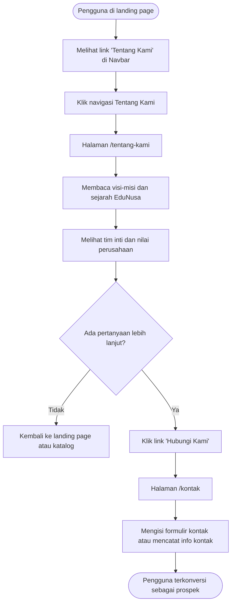
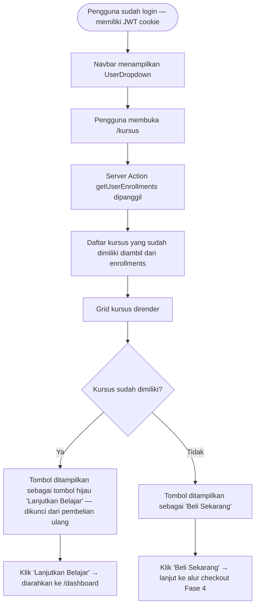
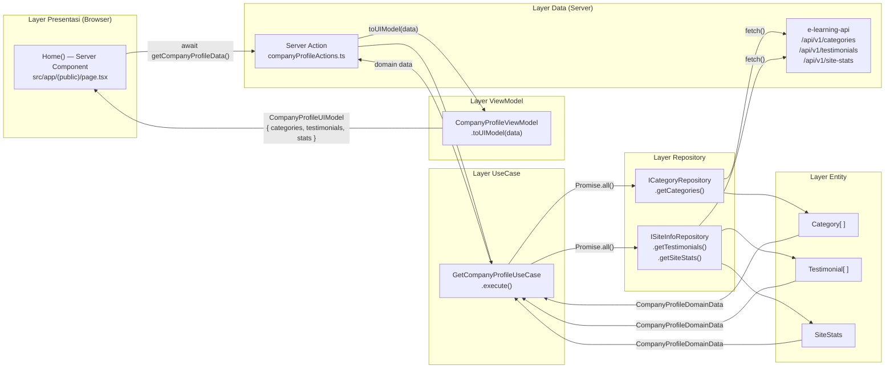
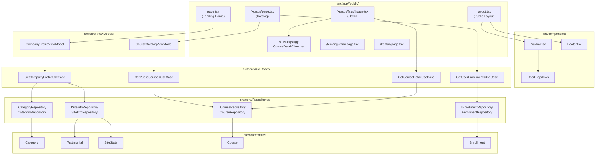
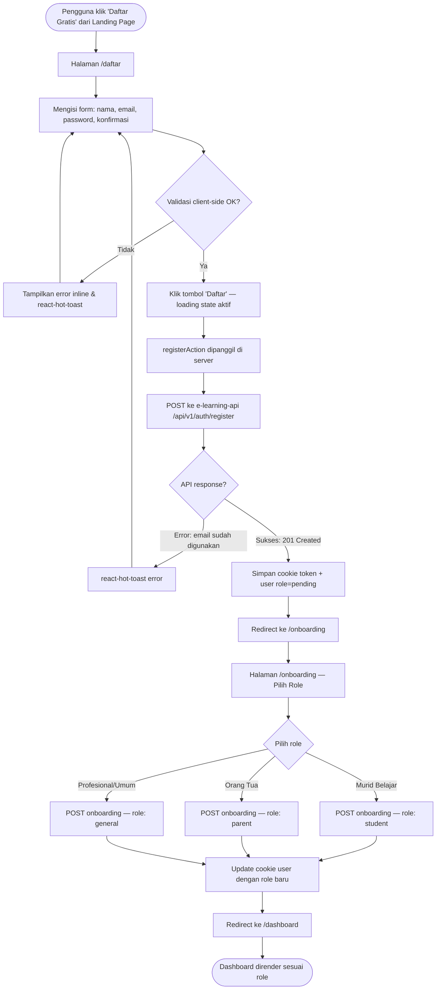
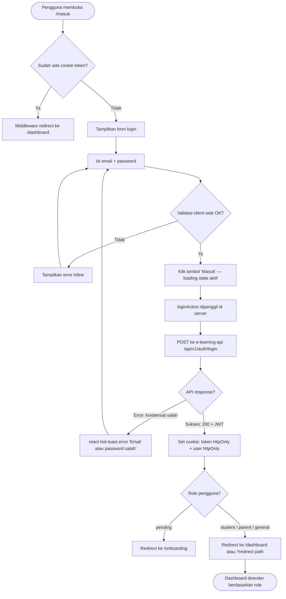
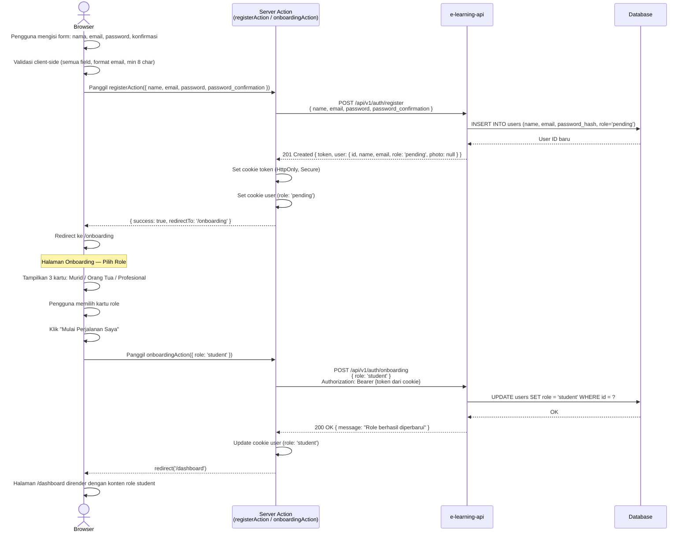
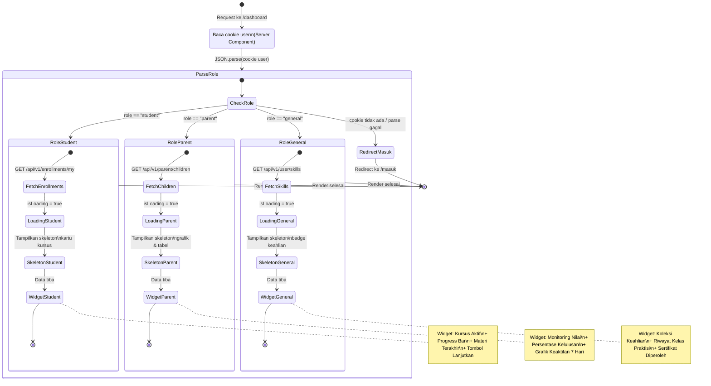

# Requirements Document

## Fase 2 — Public Marketing & Company Profile
**Platform:** EduNusa E-Learning  
**Status:** ✅ Selesai Diimplementasikan  
**Versi Dokumen:** 1.0.0  
**Tanggal:** 2025  
**Service:** `e-learning-public` (Next.js App Router)

---

## Pendahuluan

Fase 2 membangun lapisan presentasi publik platform EduNusa, mencakup portal marketing (landing page), katalog kursus yang bisa disaring dan dicari, serta halaman informasi statis perusahaan. Seluruh komponen dibangun di atas Next.js App Router dengan pola arsitektur **MVVM Clean Architecture** yang memisahkan secara tegas antara lapisan domain (Entity, Repository, UseCase) dari lapisan presentasi (ViewModel, UI Component).

Fase ini adalah titik sentuhan pertama pengguna dengan platform EduNusa — kesan pertama yang menentukan konversi dari pengunjung anonim menjadi siswa terdaftar. Oleh karena itu, kecepatan render, kualitas visual, dan kejelasan navigasi adalah kunci keberhasilannya.

### Prinsip Teknis Kritis

1. **MVVM Strict Layer Separation**: Business logic, transformasi data, dan state UI dilarang keras dicampur dalam satu komponen React. Aliran data hanya boleh berjalan satu arah: `Entity → Repository → UseCase → ViewModel → UI Component`.
2. **Anti-Bootstrap**: Tidak ada satu baris pun gaya default Bootstrap yang boleh diterapkan. Seluruh UI menggunakan TailwindCSS dan Custom CSS murni.
3. **Anti-Native Alert**: Dilarang keras menggunakan `window.alert()`, `window.confirm()`, atau `window.prompt()`. Seluruh notifikasi menggunakan `react-hot-toast`.
4. **Skeleton Loading Only**: Dilarang menggunakan spinner bulat polos sebagai indikator loading. Seluruh loading state menggunakan Skeleton Loading dengan animasi shimmer.
5. **Zero Direct DB Access**: `e-learning-public` dilarang keras terhubung langsung ke database. Semua data diperoleh melalui `e-learning-api` via Server Actions Next.js.
6. **Strict UUID**: Seluruh Primary Key entitas menggunakan `CHAR(36)` UUID v4 sesuai ketetapan Fase 1.

---

## Glosarium

| Istilah | Definisi |
|---|---|
| **EduNusa** | Nama resmi platform e-learning yang dibangun |
| **e-learning-public** | Service frontend publik berbasis Next.js App Router — satu-satunya lapisan UI yang berinteraksi langsung dengan pengguna akhir |
| **e-learning-api** | API Gateway berbasis CodeIgniter 4 yang menjadi sumber data bagi `e-learning-public` melalui HTTP request |
| **Server Component** | Komponen React yang di-render di sisi server (Next.js). Dapat mengakses Server Actions secara langsung dan tidak mengirimkan JavaScript ke browser |
| **Client Component** | Komponen React yang di-render di sisi klien (browser) dengan direktif `"use client"`. Diperlukan untuk interaktivitas seperti event handler, useState, dan useEffect |
| **Server Action** | Fungsi async Next.js yang dijalankan di server, diakses dari Client Component untuk mengambil atau memutasi data tanpa membuat API route terpisah |
| **MVVM** | Model-View-ViewModel — pola arsitektur yang memisahkan logika bisnis (Model) dari tampilan (View) melalui lapisan perantara ViewModel |
| **Entity** | Representasi murni objek domain (plain TypeScript interface), tidak mengandung logika bisnis atau logika UI |
| **Repository** | Abstraksi akses data — interface mendefinisikan kontrak, implementasi konkret menangani komunikasi HTTP ke API |
| **UseCase** | Orkestrasi operasi bisnis tunggal yang menggunakan satu atau lebih Repository untuk menghasilkan domain data |
| **ViewModel** | Kelas statis yang mentransformasi domain data dari UseCase menjadi UI Model yang siap dikonsumsi komponen View |
| **ISR** | Incremental Static Regeneration — fitur Next.js untuk meng-cache dan memperbarui halaman statis secara berkala di background tanpa rebuild penuh |
| **Skeleton Loading** | Teknik loading state yang menampilkan placeholder berbentuk mirip konten asli dengan animasi shimmer bergerak, memberikan konteks visual kepada pengguna |
| **Shimmer Animation** | Animasi gradien bergerak dari kiri ke kanan pada elemen Skeleton Loading, meniru efek cahaya yang melintas — memberikan kesan premium dan modern |
| **Pill-shaped Button** | Tombol dengan `border-radius: 99px` yang menghasilkan bentuk kapsul bulat sempurna |
| **Infinite Scroll** | Teknik paginasi di mana konten baru dimuat otomatis saat pengguna menggulir mendekati bagian bawah halaman, menggunakan `IntersectionObserver API` |
| **getCourseThumbnail()** | Fungsi resolver di `@/core/utils/imageHelper` yang menormalisasi string path thumbnail kursus menjadi URL publik yang valid, dengan fallback ke `/placeholder.jpg` |
| **Plus Jakarta Sans** | Font utama platform EduNusa — typeface sans-serif modern dari Google Fonts yang digunakan di seluruh elemen tipografi heading dan body |
| **UserDropdown** | Komponen dropdown profil pengguna di Navbar, menampilkan avatar inisial, nama, email, menu navigasi, dan tombol logout |
| **CTA** | Call-to-Action — elemen UI (tombol atau banner) yang mendorong pengguna untuk melakukan tindakan konversi tertentu |
| **Hero Section** | Seksi pertama dan paling dominan pada landing page — menampilkan headline utama, deskripsi singkat, CTA, dan statistik platform |
| **devIndicators** | Indikator bawaan Next.js yang muncul di pojok layar selama development. Dinonaktifkan agar tidak menutupi elemen UI |

---

## User Journey Flow

### Journey 1: Pengunjung Anonim → Siswa Terdaftar



### Journey 2: Pengguna Ingin Mengetahui Profil Perusahaan



### Journey 3: Pengguna Sudah Login Mengakses Katalog



---

## Wireframe Deskriptif

### Wireframe 1: Landing Page (Desktop — 1440px)

```
┌─────────────────────────────────────────────────────────────────────┐
│ NAVBAR                                                              │
│ [Logo EduNusa]    [Beranda] [Kursus] [Tentang] [Kontak]  [Masuk] [Daftar] │
└─────────────────────────────────────────────────────────────────────┘
┌─────────────────────────────────────────────────────────────────────┐
│ HERO SECTION (min-height: 90vh, background gradient + shapes)       │
│                                                                     │
│  ┌────────────────────────────┐  ┌──────────────────────────────┐  │
│  │  [Badge: Platform #1 ★]   │  │  HERO VISUAL (desktop only)  │  │
│  │                            │  │  ┌─────────────────────────┐ │  │
│  │  Kuasai Skill Baru,        │  │  │ [Card Utama: Progress]   │ │  │
│  │  Wujudkan Karier Impian    │  │  │ Avatar | Nama | Online   │ │  │
│  │  [h1, Plus Jakarta Sans]   │  │  │ JavaScript Mastery  78%  │ │  │
│  │                            │  │  │ [progress bar]           │ │  │
│  │  Deskripsi singkat...      │  │  │ ▶ Sedang belajar: ...   │ │  │
│  │                            │  │  └─────────────────────────┘ │  │
│  │  [Mulai Belajar Gratis →]  │  │  [Float Card: Sertifikat 🏆] │  │
│  │  [▶ Jelajahi Kursus]       │  │  [Float Card: +128 siswa 👥] │  │
│  │                            │  └──────────────────────────────┘  │
│  │  [Stats Ticker: 50K+ | 1200+ | 500+ | 4.9★]                   │  │
│  └────────────────────────────┘                                    │
└─────────────────────────────────────────────────────────────────────┘
┌─────────────────────────────────────────────────────────────────────┐
│ SEKSI KATEGORI POPULER                                              │
│  [Badge: Kategori Populer]                                          │
│  Temukan Kursus Sesuai Passion Anda                                 │
│                                                                     │
│  ┌──────┐ ┌──────┐ ┌──────┐ ┌──────┐  (grid 4 kolom desktop,     │
│  │ Icon │ │ Icon │ │ Icon │ │ Icon │   2 kolom mobile)             │
│  │ Nama │ │ Nama │ │ Nama │ │ Nama │                               │
│  │ N Kursus│ │ N│ │ N│ │ N│                                        │
│  └──────┘ └──────┘ └──────┘ └──────┘                               │
└─────────────────────────────────────────────────────────────────────┘
┌─────────────────────────────────────────────────────────────────────┐
│ SEKSI MENGAPA EDUNUSA?                                              │
│                                                                     │
│  ┌─────────────────────────┐  ┌────────────────────────────────┐  │
│  │ [Badge: Mengapa EduNusa?]│  │  ┌──────────┐  ┌──────────┐  │  │
│  │ Pengalaman Belajar       │  │  │ 98%      │  │ 85%      │  │  │
│  │ yang Berbeda             │  │  │ Kepuasan │  │ Kerja    │  │  │
│  │                          │  │  └──────────┘  └──────────┘  │  │
│  │ [✓] Materi Berkualitas   │  │  ┌──────────┐  ┌──────────┐  │  │
│  │ [✓] Sertifikat           │  │  │ 4.9★     │  │ 50K+     │  │  │
│  │ [✓] Dukungan Mentor      │  │  │ Rating   │  │ Siswa    │  │  │
│  │ [✓] Belajar Kapan Saja   │  │  └──────────┘  └──────────┘  │  │
│  └─────────────────────────┘  └────────────────────────────────┘  │
└─────────────────────────────────────────────────────────────────────┘
┌─────────────────────────────────────────────────────────────────────┐
│ SEKSI TESTIMONI                                                     │
│  [Badge: Testimoni]                                                 │
│  Kata Mereka yang Sudah Berhasil                                    │
│                                                                     │
│  ┌──────────────┐ ┌──────────────┐ ┌──────────────┐               │
│  │ ★★★★★        │ │ ★★★★★        │ │ ★★★★★        │               │
│  │ "Teks..."    │ │ "Teks..."    │ │ "Teks..."    │               │
│  │ [Avatar] Nama│ │ [Avatar] Nama│ │ [Avatar] Nama│               │
│  │ Role         │ │ Role         │ │ Role         │               │
│  └──────────────┘ └──────────────┘ └──────────────┘               │
└─────────────────────────────────────────────────────────────────────┘
┌─────────────────────────────────────────────────────────────────────┐
│ SEKSI CTA                                                           │
│                  Siap Mulai Perjalanan Belajar?                     │
│         Bergabunglah dengan 50K+ siswa bersama EduNusa.             │
│          [Daftar Gratis Sekarang →]  [Lihat Semua Kursus]          │
└─────────────────────────────────────────────────────────────────────┘
┌─────────────────────────────────────────────────────────────────────┐
│ FOOTER (4 kolom)                                                    │
│ [Logo+Deskripsi] [Navigasi] [Layanan] [Kontak+Sosmed]              │
│                 Copyright © 2025 EduNusa                            │
└─────────────────────────────────────────────────────────────────────┘
```

### Wireframe 2: Halaman Katalog Kursus (`/kursus`) — Desktop

```
┌─────────────────────────────────────────────────────────────────────┐
│ NAVBAR (Sticky)                                                     │
└─────────────────────────────────────────────────────────────────────┘
┌───────────────┬─────────────────────────────────────────────────────┐
│ SIDEBAR FILTER│  AREA KONTEN UTAMA                                  │
│               │                                                     │
│ Semua Level ▼ │  [🔍 Search bar: Cari kursus...]                   │
│               │                                                     │
│ KATEGORI      │  [Filter Pills: Semua│Web Dev│Design│Marketing...]  │
│ ○ Semua       │                                                     │
│ ○ Web Dev     │  GRID KURSUS (4 kolom desktop, 2 tablet, 1 mobile)  │
│ ○ Design      │  ┌───────┐ ┌───────┐ ┌───────┐ ┌───────┐          │
│ ○ Marketing   │  │Thumb  │ │Thumb  │ │Thumb  │ │Thumb  │          │
│ ○ Data Sc.    │  │Judul  │ │Judul  │ │Judul  │ │Judul  │          │
│               │  │Mentor │ │Mentor │ │Mentor │ │Mentor │          │
│ LEVEL         │  │Level  │ │Level  │ │Level  │ │Level  │          │
│ ○ Semua Level │  │★ 4.9  │ │★ 4.8  │ │★ 4.7  │ │★ 4.9  │          │
│ ○ Beginner    │  │Rp X   │ │Rp X   │ │Rp X   │ │Rp X   │          │
│ ○ Intermediate│  │[Beli] │ │[Lanjut│ │[Beli] │ │[Beli] │          │
│ ○ Advanced    │  └───────┘ └───────┘ └───────┘ └───────┘          │
│               │                                                     │
│               │  ┌───────┐ ┌───────┐ ... (infinite scroll)         │
│               │  │Skel.. │ │Skel.. │ ← Skeleton saat loading       │
│               │  └───────┘ └───────┘                               │
└───────────────┴─────────────────────────────────────────────────────┘
```

### Wireframe 3: Navbar Mobile (< 768px)

```
┌─────────────────────────────────┐
│ [Logo EduNusa]           [☰]   │  ← Hamburger icon
└─────────────────────────────────┘

=== Drawer Terbuka (slide dari kiri) ===
┌─────────────────────────────────┐
│  [✕ Tutup]                     │
│  ─────────────────────────────  │
│  Beranda                        │
│  Kursus                         │
│  Tentang Kami                   │
│  Hubungi Kami                   │
│  ─────────────────────────────  │
│  [Masuk]    [Daftar Gratis]     │
└─────────────────────────────────┘
Background drawer: solid white (#ffffff)
Tidak ada transparansi
```

---

## Persyaratan

---

### Persyaratan 1: Arsitektur MVVM Clean Architecture

**User Story:** Sebagai Developer, saya ingin seluruh kode frontend publik mengikuti pola MVVM Clean Architecture yang ketat, sehingga business logic terisolasi dari komponen UI, pengujian dapat dilakukan secara independen per layer, dan perubahan pada satu layer tidak merusak layer lainnya.

#### Kriteria Penerimaan

##### 1.1 — Layer Entity (Domain Model)

1. THE MVVM_Architecture SHALL mendefinisikan `interface Category` di `src/core/Entities/Category.ts` dengan field: `id: string`, `name: string`, `slug: string`, `icon?: string | null`, `parent_id?: string | null`, `is_active?: boolean`, dan `course_count?: number`.

2. THE MVVM_Architecture SHALL mendefinisikan `interface Course` di `src/core/Entities/Course.ts` dengan field wajib: `id: string`, `title: string`, `slug: string`, `price: number | string`, `level: string`, `status: string`, `instructor_id: string`, `thumbnail: string | null`, serta field opsional: `instructor_name`, `instructor_role`, `category_name`, `total_students`, `rating`, `sections`.

3. THE MVVM_Architecture SHALL mendefinisikan `interface Testimonial` di `src/core/Entities/Testimonial.ts` dengan field: `id: string`, `name: string`, `role: string`, `initials: string`, `color: string`, `rating: number | string`, `text: string`.

4. THE MVVM_Architecture SHALL mendefinisikan `interface SiteStats` di `src/core/Entities/SiteStats.ts` dengan field statistik platform: `students_count`, `courses_count`, `instructors_count`, `average_rating`, serta field hero card dinamis: `hero_progress`, `hero_current_lesson`, `hero_cert_title`, `hero_new_students`.

5. THE MVVM_Architecture SHALL mendefinisikan `interface Enrollment` di `src/core/Entities/Enrollment.ts` yang menyimpan data kepemilikan kursus dengan field: `id: string`, `user_id: string`, `course_id: string`, `order_id?: string`, `enrolled_at: string`.

6. THE Entity_Layer SHALL bersifat murni TypeScript interface tanpa metode, tanpa logika bisnis, dan tanpa dependensi pada library eksternal apapun.

##### 1.2 — Layer Repository (Data Access Abstraction)

7. THE MVVM_Architecture SHALL mendefinisikan `interface ICategoryRepository` di `src/core/Repositories/ICategoryRepository.ts` dengan kontrak: `getCategories(): Promise<Category[]>` dan `getCategoryBySlug(slug: string): Promise<Category | null>`.

8. THE MVVM_Architecture SHALL mendefinisikan `interface ISiteInfoRepository` di `src/core/Repositories/ISiteInfoRepository.ts` dengan kontrak: `getTestimonials(): Promise<Testimonial[]>` dan `getSiteStats(): Promise<SiteStats | null>`.

9. THE MVVM_Architecture SHALL mendefinisikan `interface ICourseRepository` di `src/core/Repositories/ICourseRepository.ts` dengan kontrak: `getPublicCourses(filters?: Record<string, string>): Promise<Course[]>` dan `getCourseBySlug(slug: string): Promise<Course | null>`.

10. THE MVVM_Architecture SHALL mendefinisikan `interface IEnrollmentRepository` di `src/core/Repositories/IEnrollmentRepository.ts` dengan kontrak: `getUserEnrollments(userId: string): Promise<Enrollment[]>`.

11. THE Repository_Implementations SHALL mengkomunikasikan data ke `e-learning-api` melalui HTTP fetch ke endpoint `/api/v1/...`. Koneksi database langsung dari `e-learning-public` dilarang keras.

12. IF HTTP request ke `e-learning-api` mengembalikan status non-200, THEN THE Repository_Implementation SHALL mengembalikan array kosong `[]` atau `null` tanpa melempar unhandled exception ke komponen UI.

##### 1.3 — Layer UseCase (Business Logic Orchestration)

13. THE MVVM_Architecture SHALL mendefinisikan `GetCompanyProfileUseCase` di `src/core/UseCases/GetCompanyProfileUseCase.ts` yang mengeksekusi `ICategoryRepository.getCategories()`, `ISiteInfoRepository.getTestimonials()`, dan `ISiteInfoRepository.getSiteStats()` secara paralel menggunakan `Promise.all()`.

14. THE MVVM_Architecture SHALL mendefinisikan `GetPublicCoursesUseCase` di `src/core/UseCases/GetPublicCoursesUseCase.ts` yang menerima parameter `filters?: Record<string, string>` dan mendelegasikannya ke `ICourseRepository.getPublicCourses(filters)`.

15. THE MVVM_Architecture SHALL mendefinisikan `GetCourseDetailUseCase` di `src/core/UseCases/GetCourseDetailUseCase.ts` yang memanggil `ICourseRepository.getCourseBySlug(slug)` dan mengembalikan `Course | null`.

16. THE MVVM_Architecture SHALL mendefinisikan `GetUserEnrollmentsUseCase` di `src/core/UseCases/GetUserEnrollmentsUseCase.ts` yang memanggil `IEnrollmentRepository.getUserEnrollments(userId)` dan mengembalikan daftar `Enrollment[]`.

17. THE UseCase_Layer SHALL menerima instance Repository melalui constructor injection (Dependency Inversion) sehingga UseCase dapat diuji dengan mock Repository tanpa menghubungi API nyata.

##### 1.4 — Layer ViewModel (Presentasi Transformation)

18. THE MVVM_Architecture SHALL mendefinisikan `CourseCatalogViewModel` di `src/core/ViewModels/CourseCatalogViewModel.ts` dengan static method `toUIList(courses: Course[]): CourseCatalogItemUIModel[]` yang mentransformasi domain `Course` entity menjadi `CourseCatalogItemUIModel` siap pakai UI, termasuk pemformatan harga ke format Rupiah (`Rp X.XXX.XXX`).

19. THE `CourseCatalogItemUIModel` SHALL memiliki field: `id`, `title`, `slug`, `thumbnail`, `instructor_name`, `instructor_role`, `category`, `level` (dengan huruf kapital pertama), `students: number`, `price: number`, `price_formatted: string`, dan `rating: number`.

20. THE MVVM_Architecture SHALL mendefinisikan `CompanyProfileViewModel` di `src/core/ViewModels/CompanyProfileViewModel.ts` dengan static method `toUIModel(data: CompanyProfileDomainData): CompanyProfileUIModel` yang mentransformasi data kategori, testimoni, dan statistik ke format siap render.

21. THE `CompanyProfileViewModel.toUIModel()` SHALL menyediakan nilai default `SiteStats` yang lengkap ketika `data.stats` bernilai `null`, sehingga UI tidak pernah merender nilai `undefined` atau `null` secara langsung.

22. THE ViewModel_Layer SHALL bersifat pure function (static method) — tidak menyimpan state, tidak memanggil API, dan tidak memiliki efek samping (side effects).

---

### Persyaratan 2: Tata Letak Global & Navigasi Publik

**User Story:** Sebagai Pengunjung, saya ingin memiliki navigasi yang jelas dan konsisten di seluruh halaman publik EduNusa, sehingga saya dapat berpindah antar bagian platform dengan mudah tanpa kebingungan.

#### Kriteria Penerimaan

##### 2.1 — Public Layout Wrapper

1. THE Public_Layout SHALL mendefinisikan layout wrapper di `src/app/(public)/layout.tsx` yang membungkus seluruh halaman dalam Route Group `(public)` dengan komponen `<Navbar>` di atas dan `<Footer>` di bawah.

2. THE Public_Layout SHALL membaca status autentikasi pengguna dari HTTP-Only Cookie (`token` dan `user`) secara server-side menggunakan `cookies()` dari `next/headers`, dan meneruskan `isLoggedIn: boolean` serta `user` object ke komponen `<Navbar>`.

3. THE Public_Layout SHALL memastikan komponen Navbar dan Footer dirender di semua rute dalam Route Group `(public)`: `/`, `/kursus`, `/kursus/[slug]`, `/tentang-kami`, `/kontak`, dan `/syarat-ketentuan`.

##### 2.2 — Navbar (Desktop & Mobile)

4. THE Navbar SHALL menampilkan logo EduNusa di sisi kiri dan tautan navigasi di tengah-kanan: **Beranda**, **Kursus**, **Tentang Kami**, **Hubungi Kami**.

5. WHEN pengguna belum terautentikasi (`isLoggedIn = false`), THE Navbar SHALL menampilkan tombol **Masuk** (outline) dan tombol **Daftar** (pill-shaped solid, background gradient ungu) di sisi kanan.

6. WHEN pengguna sudah terautentikasi (`isLoggedIn = true`), THE Navbar SHALL menggantikan tombol Masuk/Daftar dengan komponen `UserDropdown` yang menampilkan avatar inisial dua huruf dalam lingkaran gradient ungu (`#6C47FF → #4f46e5`).

7. THE `UserDropdown` SHALL menampilkan (dari atas ke bawah): avatar inisial + nama lengkap + email, garis pembatas tipis, menu item dengan ikon (Dasbor, Profil, Riwayat Transaksi), garis pembatas, tombol "Keluar Akun" berwarna merah.

8. WHEN pengguna mengklik di luar area `UserDropdown`, THE `UserDropdown` SHALL menutup dirinya secara otomatis menggunakan `mousedown` event listener yang terpasang pada `document`.

9. THE Navbar SHALL bersifat **sticky** — tetap terlihat di bagian atas viewport saat pengguna menggulir halaman ke bawah, tanpa perubahan visual yang mengganggu.

10. WHEN ukuran layar kurang dari 768px (mobile), THE Navbar SHALL menyembunyikan menu navigasi desktop dan menampilkan ikon hamburger (☰) di sisi kanan.

11. WHEN ikon hamburger diklik pada tampilan mobile, THE Navbar SHALL menampilkan **Drawer Menu** yang bergeser dari sisi kanan atau kiri dengan background **solid white** (`#ffffff`) tanpa transparansi apapun.

12. THE Drawer_Menu SHALL menampilkan seluruh tautan navigasi secara vertikal, diikuti tombol Masuk dan Daftar di bagian bawah (atau UserDropdown jika sudah login).

##### 2.3 — Footer

13. THE Footer SHALL menampilkan empat kolom: (1) logo + deskripsi singkat EduNusa, (2) tautan navigasi halaman, (3) tautan layanan/fitur, (4) informasi kontak + ikon media sosial.

14. THE Footer SHALL mencantumkan teks copyright di bagian paling bawah: `© 2025 EduNusa. Hak Cipta Dilindungi Undang-Undang.`

15. THE Footer SHALL bersifat responsif — beralih dari 4 kolom di desktop menjadi 2 kolom di tablet dan 1 kolom di mobile.

---

### Persyaratan 3: Landing Page — Hero Section

**User Story:** Sebagai Pengunjung Baru, saya ingin disambut oleh halaman utama yang menarik dan meyakinkan, sehingga saya langsung memahami nilai yang ditawarkan EduNusa dan terdorong untuk mendaftar atau menjelajahi kursus.

#### Kriteria Penerimaan

1. THE Landing_Page SHALL menggunakan `async function` (Server Component) untuk mengambil data profil perusahaan melalui `GetCompanyProfileUseCase.execute()` sebelum merender halaman, sehingga konten tersedia sejak render pertama tanpa Loading State tambahan.

2. THE Hero_Section SHALL menampilkan konten utama dalam layout dua kolom di desktop: sisi kiri berisi teks dan CTA, sisi kanan berisi Hero Visual dengan floating cards (hanya tampil di layar ≥ 1024px).

3. THE Hero_Section SHALL menampilkan headline utama menggunakan font **Plus Jakarta Sans** dengan ukuran minimum `3rem` pada desktop, dengan kata atau frasa kunci diberi `text-gradient` menggunakan CSS gradient `#6C47FF → #4f46e5`.

4. THE Hero_Section SHALL menampilkan minimal dua tombol CTA: tombol primer **"Mulai Belajar Gratis"** (pill-shaped, background gradient ungu) yang mengarah ke `/daftar`, dan tombol sekunder **"Jelajahi Kursus"** (pill-shaped outline) yang mengarah ke `/kursus`.

5. THE Hero_Section SHALL menampilkan Stats Ticker yang berisi empat statistik platform: jumlah siswa aktif, jumlah kursus, jumlah instruktur, dan rating rata-rata — diambil dari `SiteStats` entity.

6. THE Hero_Visual SHALL menampilkan tiga kartu floating: (1) Kartu Progres Belajar (avatar + nama + progress bar dengan persentase dari `stats.hero_progress`), (2) Kartu Sertifikat (ikon + judul sertifikat dari `stats.hero_cert_title`), (3) Kartu Siswa Baru (jumlah siswa baru dari `stats.hero_new_students`).

7. THE Hero_Section SHALL menerapkan animasi `animate-on-scroll` pada elemen teks dan CTA yang memberikan efek masuk halus saat elemen pertama kali terlihat di viewport.

8. IF `SiteStats` tidak tersedia (bernilai `null`), THE Hero_Section SHALL menampilkan nilai default yang bermakna (bukan string kosong atau `undefined`) dari `CompanyProfileViewModel.toUIModel()`.

---

### Persyaratan 4: Landing Page — Seksi Konten Pendukung

**User Story:** Sebagai Pengunjung, saya ingin mendapatkan informasi lengkap tentang keunggulan EduNusa, kategori pembelajaran yang tersedia, dan testimoni dari siswa yang sudah berhasil, sehingga saya semakin yakin untuk bergabung.

#### Kriteria Penerimaan

##### 4.1 — Seksi Kategori Populer

1. THE Category_Section SHALL mengambil daftar kategori dari `CompanyProfileViewModel.categories` (yang sudah diproses oleh `GetCompanyProfileUseCase`) dan merendernya sebagai grid kartu kategori.

2. THE Category_Cards SHALL ditampilkan dalam grid **4 kolom** di desktop (≥ 1024px), **3 kolom** di tablet (≥ 768px), dan **2 kolom** di mobile (< 768px).

3. THE Category_Card SHALL menampilkan: ikon dengan background berwarna (warna diambil dari field `icon` JSON yang berisi `{icon: string, color: string}`), nama kategori, dan jumlah kursus dalam format `N Kursus`.

4. WHEN pengunjung mengklik sebuah kartu kategori, THE Category_Card SHALL mengarahkan pengguna ke halaman katalog dengan filter kategori aktif: `/kursus?kategori={category.name}`.

5. IF data kategori dari API kosong atau gagal dimuat, THE Category_Section SHALL menampilkan pesan kosong yang informatif dan tidak merender grid yang rusak.

##### 4.2 — Seksi Mengapa EduNusa

6. THE Why_Section SHALL menampilkan empat keunggulan platform dalam format daftar berikon (ikon dalam kotak bulat berwarna ungu): Materi Berkualitas Tinggi, Sertifikat Terakreditasi, Dukungan Mentor Aktif, dan Belajar Kapan Saja.

7. THE Why_Section SHALL menampilkan empat kartu statistik di sisi kanan: tingkat kepuasan siswa (`satisfaction_rate`), persentase siswa mendapat pekerjaan (`employment_rate`), rating rata-rata kursus (`average_rating`), dan jumlah siswa aktif (`students_count`) — semuanya diambil dari `SiteStats`.

8. THE Stat_Cards SHALL menggunakan warna latar berbeda untuk membedakan setiap metrik: ungu (kepuasan), oranye (kerja), hijau (rating), biru (siswa aktif).

##### 4.3 — Seksi Testimoni

9. THE Testimonial_Section SHALL mengambil daftar testimoni dari `CompanyProfileViewModel.testimonials` dan merendernya dalam layout **3 kolom** di desktop, **1 kolom** di mobile.

10. THE Testimonial_Card SHALL menampilkan: bintang rating (bintang ★ kuning sebanyak nilai rating), teks ulasan dalam tanda kutip, avatar inisial dua huruf dengan warna latar dari field `color`, nama pengguna, dan peran/jabatan.

11. THE Testimonial_Card SHALL menggunakan nilai `rating` bertipe `number`. WHEN nilai rating dari API bertipe string, THE `CompanyProfileViewModel` SHALL mengkonversinya menggunakan `Number()` sebelum diserahkan ke UI.

##### 4.4 — Seksi CTA Bawah

12. THE CTA_Section SHALL menampilkan banner full-width dengan headline ajakan, deskripsi singkat yang menyebutkan jumlah siswa dari `stats.students_count`, tombol **"Daftar Gratis Sekarang"** (→ `/daftar`) dan tombol **"Lihat Semua Kursus"** (→ `/kursus`).

13. THE CTA_Section SHALL memiliki elemen dekoratif `cta-shape` di sudut kiri-atas dan kanan-bawah untuk memberikan visual yang menarik tanpa mengganggu konten utama.

---

### Persyaratan 5: Katalog Kursus Publik (`/kursus`)

**User Story:** Sebagai Calon Siswa, saya ingin menjelajahi seluruh kursus yang tersedia dengan kemudahan filtering berdasarkan kategori dan level serta pencarian berdasarkan kata kunci, sehingga saya dapat menemukan kursus yang tepat sesuai kebutuhan dan anggaran saya.

#### Kriteria Penerimaan

##### 5.1 — Pemuatan Data Katalog

1. THE Course_Catalog_Page SHALL diimplementasikan sebagai **Client Component** (`"use client"`) untuk mendukung interaktivitas filtering, pencarian, dan infinite scroll tanpa reload halaman.

2. WHEN halaman katalog pertama kali dimuat, THE Course_Catalog_Page SHALL memanggil tiga operasi secara paralel menggunakan `Promise.all()`: (1) `getCourseCatalogUI()` untuk data kursus, (2) `getUserEnrollments()` untuk status kepemilikan, (3) `getCategories()` untuk daftar filter kategori.

3. WHILE data sedang dimuat (`isLoading = true`), THE Course_Catalog_Page SHALL menampilkan **Skeleton Loading** berbentuk grid kartu kursus dengan animasi shimmer. Penggunaan spinner bulat polos dilarang keras.

4. THE Skeleton_Loading SHALL me-mirror layout kartu kursus asli: area thumbnail (kotak persegi panjang), baris nama instruktur (garis pendek), baris judul (garis lebih panjang), dan area harga (garis pendek).

5. IF salah satu dari tiga pemanggilan paralel gagal, THE Course_Catalog_Page SHALL menangani kegagalan tersebut secara graceful (try/catch) tanpa memblokir tampilan data yang berhasil dimuat, dan mencatat error ke `console.error`.

##### 5.2 — Filter dan Pencarian

6. THE Course_Catalog_Page SHALL membaca parameter URL awal dari `useSearchParams()`: `?q=` untuk kata kunci pencarian, `?kategori=` untuk filter kategori, dan `?level=` untuk filter level kesulitan.

7. THE Filter_System SHALL mendukung tiga dimensi filter secara bersamaan: **Kategori** (diambil dari daftar kategori API), **Level** (Semua Level, Beginner, Intermediate, Advanced), dan **Kata Kunci** (pencarian teks pada judul kursus).

8. THE Search_Filter SHALL berjalan **client-side** — memfilter array `coursesList` yang sudah diambil tanpa mengirimkan request baru ke API, menggunakan `String.prototype.toLowerCase().includes()`.

9. THE Category_Filter SHALL mendukung pencocokan kata kunci parsial yang case-insensitive antara nama kategori kursus (`c.category`) dan pilihan filter (`activeCategory`), untuk mengakomodasi kemungkinan perbedaan kapitalisasi dari API.

10. WHEN pengunjung mengklik kartu kategori di landing page dengan tautan `/kursus?kategori=Web%20Development`, THE Course_Catalog_Page SHALL membaca parameter tersebut dari URL melalui `useSearchParams()` dan mengaktifkan filter kategori yang sesuai secara otomatis.

##### 5.3 — Grid Kursus dan Kartu Kursus

11. THE Course_Card SHALL menampilkan: thumbnail kursus (menggunakan `getCourseThumbnail()` dari `@/core/utils/imageHelper`), judul kursus, nama instruktur, level kesulitan dengan huruf kapital pertama, rating bintang, dan harga dalam format Rupiah (`Rp X.XXX.XXX`).

12. THE `getCourseThumbnail()` SHALL mengikuti logika berikut: jika thumbnail kosong/null → kembalikan `/placeholder.jpg`; jika dimulai dengan `http://` atau `https://` → kembalikan apa adanya; jika dimulai dengan `/` → kembalikan apa adanya; selain itu → tambahkan prefix `/` di depan.

13. WHEN pengguna sudah memiliki kursus tersebut (ada di `enrollments`), THE Course_Card SHALL menampilkan tombol **"Lanjutkan Belajar"** berwarna hijau yang mengarah ke `/dashboard`, dan menyembunyikan tombol beli. Pembelian ulang kursus yang sudah dimiliki dilarang keras.

14. WHEN pengguna belum memiliki kursus, THE Course_Card SHALL menampilkan tombol **"Beli Sekarang"** yang menyimpan data kursus ke Cart Store dan mengarahkan pengguna ke `/checkout`.

15. THE Course_Grid SHALL ditampilkan dalam layout **4 kolom** di desktop (≥ 1280px), **3 kolom** di tablet besar, **2 kolom** di tablet kecil, dan **1 kolom** di mobile.

##### 5.4 — Infinite Scroll dan Paginasi

16. THE Course_Catalog_Page SHALL menampilkan **8 kartu kursus** pertama pada render awal (`ITEMS_PER_PAGE = 8`).

17. WHEN pengguna menggulir mendekati bagian bawah daftar kursus, THE Infinite_Scroll_Engine SHALL menggunakan `IntersectionObserver API` untuk mendeteksi visibilitas elemen trigger, kemudian menambah `displayLimit` sebesar `ITEMS_PER_PAGE`.

18. WHEN filter aktif (kategori, level, atau kata kunci) berubah, THE Course_Catalog_Page SHALL mereset `displayLimit` kembali ke `ITEMS_PER_PAGE` (8) sehingga paginasi dimulai ulang.

19. WHEN semua hasil filter sudah ditampilkan (`displayLimit >= baseFiltered.length`), THE Infinite_Scroll_Engine SHALL berhenti memuat lebih banyak data dan `IntersectionObserver` SHALL di-disconnect.

---

### Persyaratan 6: Halaman Detail Kursus (`/kursus/[slug]`)

**User Story:** Sebagai Calon Siswa, saya ingin melihat informasi lengkap tentang sebuah kursus sebelum membelinya, sehingga saya dapat membuat keputusan pembelian yang tepat berdasarkan deskripsi, kurikulum, dan info instruktur.

#### Kriteria Penerimaan

1. THE Course_Detail_Page SHALL mendefinisikan `generateMetadata()` sebagai async function yang mengambil data kursus berdasarkan slug dan mengembalikan `Metadata` berisi `title` dan `description` untuk keperluan SEO.

2. THE Course_Detail_Page (Server Component) SHALL mengambil data kursus menggunakan `GetCourseDetailUseCase.execute(slug)` dan data enrollment menggunakan `GetUserEnrollmentsUseCase.execute()` secara paralel dengan `Promise.all()`.

3. IF kursus dengan slug yang diminta tidak ditemukan di API (mengembalikan `null`), THE Course_Detail_Page SHALL merender `notFound()` dari `next/navigation` untuk menampilkan halaman 404 kustom.

4. THE Course_Detail_Page SHALL meneruskan data `course` dan `enrollments` ke komponen `CourseDetailClient` (Client Component) untuk rendering interaktif.

5. THE `CourseDetailClient` SHALL menampilkan bagian konten: hero banner kursus (thumbnail + overlay gradient), judul, level, harga, tombol aksi (Beli/Lanjutkan), deskripsi lengkap, dan daftar silabus (sections + lessons).

6. WHEN pengguna membuka halaman detail kursus, THE Course_Detail_Page SHALL menginjeksi CSS kustom melalui tag `<style>` dinamis untuk mengatur visibilitas elemen Navbar agar kontras terhadap hero banner gelap (dynamic CSS injection per halaman).

---

### Persyaratan 7: Halaman Informasi Statis

**User Story:** Sebagai Pengunjung, saya ingin membaca informasi resmi tentang perusahaan EduNusa — visi-misi, cara menghubungi, dan syarat penggunaan layanan — sehingga saya merasa percaya bahwa platform ini kredibel dan terpercaya.

#### Kriteria Penerimaan

1. THE Static_Pages SHALL mendefinisikan tiga halaman statis dalam Route Group `(public)`: `/tentang-kami`, `/kontak`, dan `/syarat-ketentuan`.

2. THE About_Page (`/tentang-kami`) SHALL menampilkan: visi dan misi EduNusa, narasi sejarah singkat pendirian platform, nilai-nilai inti perusahaan, dan ajakan bergabung dengan CTA menuju `/daftar`.

3. THE Contact_Page (`/kontak`) SHALL menampilkan: formulir kontak (nama, email, subjek, pesan) dengan validasi sisi klien, informasi kontak langsung (email, nomor telepon, alamat), dan peta lokasi atau keterangan wilayah operasional.

4. THE Terms_Page (`/syarat-ketentuan`) SHALL menampilkan dokumen syarat dan ketentuan dalam format yang mudah dibaca dengan heading bertingkat, list item, dan baris kalimat yang tidak terlalu panjang.

5. THE Static_Pages SHALL menggunakan `<title>` dan `<meta description>` yang unik per halaman melalui Next.js `Metadata` API untuk mengoptimalkan SEO setiap halaman secara independen.

6. THE Static_Pages SHALL menggunakan layout yang sama dengan halaman dinamis (melalui Route Group `(public)/layout.tsx`) sehingga Navbar dan Footer tampil konsisten di seluruh halaman statis.

---

### Persyaratan 8: Konfigurasi Teknis & Aset Platform

**User Story:** Sebagai Developer, saya ingin platform EduNusa memiliki konfigurasi Next.js yang tepat, identitas merek yang konsisten, dan pengelolaan aset yang benar, sehingga tidak ada elemen bawaan framework yang mengganggu UI dan brand EduNusa tampil profesional di semua titik kontak.

#### Kriteria Penerimaan

##### 8.1 — Konfigurasi Next.js

1. THE `next.config.ts` SHALL mendefinisikan `devIndicators: false` untuk menonaktifkan indikator debug bawaan Next.js yang dapat menutupi elemen UI di pojok layar selama development.

2. THE `next.config.ts` SHALL mendefinisikan `allowedDevOrigins` berisi daftar domain yang diizinkan mengakses aplikasi dalam mode development: `["e-learning.edu.id", "localhost", "edunusa.edu.id"]`.

3. THE `next.config.ts` SHALL tidak mengaktifkan konfigurasi `experimental` yang tidak diperlukan untuk menghindari perilaku tak terduga pada fitur yang belum stabil.

##### 8.2 — Font & Tipografi

4. THE Public_Layout (`src/app/layout.tsx` global atau `(public)/layout.tsx`) SHALL memuat font **Plus Jakarta Sans** dari Google Fonts sebagai font utama platform melalui `next/font/google`, diaplikasikan ke seluruh elemen di bawah layout melalui CSS variable atau className.

5. THE Typography_System SHALL menggunakan **Plus Jakarta Sans** untuk seluruh heading (`h1`–`h6`) dan body text. Dilarang keras mencampur dengan font sistem atau font framework lain tanpa alasan yang terdokumentasi.

##### 8.3 — Identitas Merek & Favicon

6. THE Brand_Identity SHALL mendefinisikan favicon EduNusa dengan ikon **topi toga putih (🎓) di atas background rounded squircle dengan gradient `#6366F1 → #4338CA`** (bukan logo default Next.js atau Vercel).

7. THE Public_App SHALL menyediakan seluruh format favicon yang dibutuhkan browser modern: `favicon.ico`, `icon.png`, `icon.svg`, dan `apple-touch-icon.png` di direktori `src/app/`.

8. THE `apple-icon.png` SHALL menggunakan logo EduNusa resmi (bukan placeholder) untuk memastikan tampilan ikon yang benar saat pengguna menambahkan shortcut ke Home Screen perangkat iOS/Android.

##### 8.4 — Aset Statis & Resolver Thumbnail

9. THE `public/` directory SHALL menyediakan `placeholder.jpg` sebagai fallback image default ketika thumbnail kursus tidak tersedia, mencegah error `404 (Not Found)` di console browser.

10. THE `public/images/courses/` directory SHALL menjadi lokasi penyimpanan file thumbnail kursus lokal dengan format penamaan yang konsisten (misal: `react.jpg`, `python.jpg`).

11. THE `getCourseThumbnail(thumbnail?: string | null): string` function SHALL mengimplementasikan logika resolusi path dengan aturan prioritas berikut:
    - `thumbnail` kosong atau `null` → kembalikan `/placeholder.jpg`
    - `thumbnail` dimulai `http://` atau `https://` → kembalikan URL asli (external URL)
    - `thumbnail` dimulai `/` → kembalikan path apa adanya (absolute path)
    - Selain itu → tambahkan prefix `/` (relative filename menjadi absolute path)

12. THE `getCourseThumbnail()` function SHALL diekspor dari `@/core/utils/imageHelper` dan digunakan secara konsisten oleh seluruh komponen yang merender gambar kursus: kartu kursus di katalog, detail kursus, halaman checkout, dan ringkasan keranjang.

---

### Persyaratan 9: Standar UI/UX & Aksesibilitas

**User Story:** Sebagai Pengguna, saya ingin seluruh antarmuka EduNusa memiliki tampilan yang profesional, konsisten, dan nyaman digunakan di semua perangkat, sehingga pengalaman belajar terasa premium dan tidak mengganggu konsentrasi belajar.

#### Kriteria Penerimaan

##### 9.1 — Desain Visual

1. THE UI_System SHALL menerapkan **Unified Canvas Layout** dengan background halaman berwarna putih bersih (`#ffffff`). Dilarang menggunakan background abu-abu default atau shadow kotak tebal.

2. THE Button_System SHALL menggunakan desain **pill-shaped** dengan `border-radius: 99px` untuk seluruh tombol aksi primer dan sekunder. Tombol kotak kaku dengan sudut tajam dilarang keras.

3. THE Color_System SHALL menggunakan palette warna brand EduNusa: ungu utama `#6C47FF`, biru tua `#4f46e5`, dan aksen `#6366F1`, dengan teks utama `#1e293b`, teks sekunder `#64748b`, dan border tipis `#e2e8f0`.

4. THE Spacing_System SHALL menerapkan padding konten **tepat 24px** di segala sisi pada container utama. Dilarang menggunakan padding 48px (terlalu longgar) atau padding ganda bersarang (double padding).

5. THE Border_System SHALL menggunakan garis pembatas tipis `1px solid #e2e8f0` untuk memisahkan section atau elemen terkait. Dilarang menggunakan `box-shadow` tebal yang memberi kesan kartu melayang berlebihan.

##### 9.2 — Notifikasi & Feedback

6. THE Notification_System SHALL menggunakan **`react-hot-toast`** untuk seluruh notifikasi pengguna: sukses, error, warning, dan loading. Penggunaan `window.alert()`, `window.confirm()`, atau modal default browser dilarang keras.

7. THE Loading_State SHALL selalu menggunakan **Skeleton Loading dengan animasi shimmer** sebagai indikator loading. Spinner bulat polos (`<div className="spinner">`) dilarang keras digunakan di halaman publik.

8. THE Shimmer_Animation SHALL menggunakan CSS `background: linear-gradient(90deg, #f0f0f0 25%, #e0e0e0 50%, #f0f0f0 75%)` dengan `background-size: 200% 100%` dan keyframe animasi yang menggerakkan gradient dari kiri ke kanan dalam `1.5s` secara infinite.

##### 9.3 — Responsivitas

9. THE Responsive_Layout SHALL mendukung tiga breakpoint utama: mobile (< 768px), tablet (768px – 1023px), dan desktop (≥ 1024px), dengan layout dan ukuran font yang menyesuaikan secara optimal di setiap breakpoint.

10. THE Mobile_Navigation SHALL menampilkan Drawer Menu dengan background **solid white** (`#ffffff`) tanpa transparansi, memastikan keterbacaan menu navigasi di atas konten halaman yang ada di belakang drawer.

11. THE Container_System SHALL memiliki horizontal padding minimum 16px di mobile untuk mencegah konten menyentuh tepi layar perangkat.

12. THE Hero_Visual (floating cards di Hero Section) SHALL disembunyikan sepenuhnya di layar mobile dan tablet (viewport < 1024px) menggunakan Tailwind class `hidden lg:block` untuk menghindari overflow dan tumpang tindih elemen.

##### 9.4 — Aksesibilitas

13. THE Interactive_Elements SHALL memiliki atribut `aria-label` yang deskriptif untuk semua tombol ikon, input search, dan link yang tidak memiliki teks label yang terlihat.

14. THE Image_Elements SHALL selalu menyertakan atribut `alt` yang deskriptif pada semua tag `` dan komponen `<Image>` Next.js, termasuk thumbnail kursus dan avatar.

15. THE Color_Contrast SHALL memenuhi standar WCAG AA minimum — rasio kontras antara warna teks dan latar minimal 4.5:1 untuk teks normal dan 3:1 untuk teks besar.

---

### Persyaratan 10: Optimasi Kinerja & SEO

**User Story:** Sebagai Operator Platform, saya ingin halaman publik EduNusa dimuat dengan cepat dan mudah ditemukan oleh mesin pencari, sehingga biaya akuisisi pengguna rendah dan pengalaman pengguna tetap prima meskipun traffic tinggi.

#### Kriteria Penerimaan

1. THE Landing_Page (`/`) SHALL menggunakan Next.js **Server Component** (bukan Client Component) untuk data fetching awal, sehingga HTML halaman ter-render penuh di server dan terkirim ke browser tanpa waterfall JavaScript.

2. THE `GetCompanyProfileUseCase.execute()` SHALL mengeksekusi tiga repository call secara paralel dengan `Promise.all([getCategories(), getTestimonials(), getSiteStats()])` untuk meminimalkan total waktu tunggu data fetching.

3. THE Server_Actions (di `src/actions/`) SHALL memanfaatkan Next.js caching (`unstable_cache` atau `fetch` dengan `cache: 'force-cache'` dan `revalidate`) untuk data publik yang tidak berubah sering (kategori, testimonial, statistik), sehingga response pertama langsung dari cache tanpa memanggil ulang `e-learning-api`.

4. THE Course_Detail_Page SHALL mendefinisikan `generateMetadata({ params })` yang menghasilkan `<title>` unik berbasis judul kursus dan `<meta name="description">` berbasis deskripsi kursus untuk mengoptimalkan indexing mesin pencari setiap halaman kursus.

5. THE Thumbnail_Images SHALL dimuat menggunakan tag `` dengan atribut `loading="lazy"` atau komponen `<Image>` dari `next/image` untuk menunda pemuatan gambar yang belum terlihat di viewport.

6. THE `next.config.ts` SHALL tidak mengaktifkan `experimental.turbopack` atau konfigurasi caching agresif lainnya kecuali telah diuji dan terdokumentasi, untuk menghindari perilaku cache yang tidak terduga di production.

---

## Diagram Arsitektur MVVM

### Aliran Data Komponen Landing Page



### Aliran Data Komponen Katalog Kursus

```mermaid
flowchart LR
    subgraph "Layer Presentasi (Browser)"
        UI["CoursesContent() — Client Component\n'use client'"]
    end

    subgraph "State Management"
        ST["useState:\ncoursesList, categoriesList,\nenrollments, isLoading,\nactiveCategory, activeLevel,\nsearchQuery, displayLimit"]
    end

    subgraph "Server Actions"
        SA1["getCourseCatalogUI()"]
        SA2["getUserEnrollments()"]
        SA3["getCategories()"]
    end

    subgraph "Layer ViewModel"
        VM["CourseCatalogViewModel\n.toUIList(courses)"]
    end

    subgraph "Layer UseCase"
        UC1["GetPublicCoursesUseCase"]
        UC2["GetUserEnrollmentsUseCase"]
    end

    subgraph "Layer Repository"
        R1["ICourseRepository"]
        R2["IEnrollmentRepository"]
        R3["ICategoryRepository"]
    end

    subgraph "API"
        API["e-learning-api"]
    end

    UI -->|"useEffect()\nPromise.all()"| SA1 & SA2 & SA3
    SA1 --> UC1 --> R1 --> API
    SA2 --> UC2 --> R2 --> API
    SA3 --> R3 --> API
    SA1 -->|"CourseCatalogItemUIModel[]"| VM
    VM --> ST
    SA2 --> ST
    SA3 --> ST
    ST -->|"baseFiltered (client-side)\n+ infinite scroll"| UI
```

---

## Diagram Dependensi Komponen



---

## Persyaratan Non-Fungsional

### NFR-1: Kinerja (Performance)

1. THE Landing_Page SHALL mencapai skor **Lighthouse Performance ≥ 80** pada kondisi simulasi koneksi 4G seluler yang diukur dengan menggunakan Lighthouse CLI atau browser DevTools.

2. THE Largest_Contentful_Paint (LCP) pada Landing_Page SHALL kurang dari **2.5 detik** pada koneksi 3G karena halaman menggunakan Server Component yang menghasilkan HTML penuh dari server.

3. THE Course_Catalog_Page SHALL menampilkan konten awal (8 kartu pertama) dalam waktu kurang dari **500ms** setelah data diterima dari Server Action, berkat pendekatan Client-Side Rendering yang tidak memblokir UI.

4. THE ISR_Cache SHALL memperbarui data halaman publik (`/`, `/kursus`) di background setiap **60 detik** (atau interval yang dikonfigurasi) tanpa mengganggu pengguna yang sedang aktif mengakses halaman.

### NFR-2: SEO & Crawlability

1. THE Landing_Page SHALL memiliki `<title>` berbunyi "EduNusa — Platform E-Learning #1 di Indonesia" dan `<meta name="description">` yang ringkas dan persuasif (maksimal 160 karakter).

2. THE Course_Detail_Pages SHALL menghasilkan `<title>` unik per kursus dengan format `{Judul Kursus} | EduNusa` melalui fungsi `generateMetadata()`.

3. THE Public_Pages SHALL tidak memiliki konten duplikat — setiap halaman memiliki URL kanonik (`canonical`) yang didefinisikan melalui Next.js Metadata API.

### NFR-3: Keamanan (Security)

1. THE Cookie_Token (`token`) SHALL bertipe HTTP-Only dan Secure, sehingga tidak dapat diakses oleh JavaScript di browser dan hanya dikirimkan melalui HTTPS.

2. THE Server_Actions SHALL tidak meneruskan nilai secret JWT atau credential database ke Client Component. Seluruh operasi sensitif dieksekusi di sisi server.

3. THE Public_Pages SHALL tidak mengekspos URL atau kredensial `e-learning-internal` secara langsung dalam source code frontend yang terkirim ke browser.

### NFR-4: Pemeliharaan (Maintainability)

1. THE MVVM_Layer SHALL diimplementasikan dengan pemisahan file yang ketat — setiap Entity, Repository interface, UseCase, dan ViewModel berada dalam file TypeScript terpisah dengan nama yang deskriptif dan konsisten.

2. THE Codebase SHALL mengikuti konvensi penamaan: `PascalCase` untuk interface, class, dan komponen React; `camelCase` untuk variable, function, dan prop; `kebab-case` untuk nama file.

3. THE Type_Safety SHALL dijaga dengan menggunakan TypeScript secara ketat — semua parameter function, return type, dan prop komponen harus memiliki anotasi tipe yang eksplisit. Penggunaan `any` sebaiknya dihindari kecuali untuk kasus integrasi API yang belum memiliki tipe definitif.

---

## Ringkasan Implementasi Fase 2

| Komponen | Status | File/Path Implementasi |
|---|---|---|
| MVVM Entity Layer | ✅ Selesai | `src/core/Entities/*.ts` |
| MVVM Repository Interfaces | ✅ Selesai | `src/core/Repositories/I*.ts` |
| MVVM Repository Implementations | ✅ Selesai | `src/core/Repositories/*.ts` (non-I prefix) |
| MVVM UseCase — Company Profile | ✅ Selesai | `src/core/UseCases/GetCompanyProfileUseCase.ts` |
| MVVM UseCase — Public Courses | ✅ Selesai | `src/core/UseCases/GetPublicCoursesUseCase.ts` |
| MVVM UseCase — Course Detail | ✅ Selesai | `src/core/UseCases/GetCourseDetailUseCase.ts` |
| MVVM UseCase — User Enrollments | ✅ Selesai | `src/core/UseCases/GetUserEnrollmentsUseCase.ts` |
| MVVM ViewModel — Company Profile | ✅ Selesai | `src/core/ViewModels/CompanyProfileViewModel.ts` |
| MVVM ViewModel — Course Catalog | ✅ Selesai | `src/core/ViewModels/CourseCatalogViewModel.ts` |
| Public Layout Wrapper | ✅ Selesai | `src/app/(public)/layout.tsx` |
| Navbar (Desktop + Mobile Drawer) | ✅ Selesai | `src/components/layout/Navbar.tsx` |
| UserDropdown Komponen | ✅ Selesai | Terintegrasi dalam `Navbar.tsx` |
| Footer Korporat | ✅ Selesai | `src/components/layout/Footer.tsx` |
| Landing Page — Hero Section | ✅ Selesai | `src/app/(public)/page.tsx` |
| Landing Page — Kategori Populer | ✅ Selesai | `src/app/(public)/page.tsx` |
| Landing Page — Mengapa EduNusa | ✅ Selesai | `src/app/(public)/page.tsx` |
| Landing Page — Testimoni | ✅ Selesai | `src/app/(public)/page.tsx` |
| Landing Page — CTA Section | ✅ Selesai | `src/app/(public)/page.tsx` |
| Halaman Katalog Kursus | ✅ Selesai | `src/app/(public)/kursus/page.tsx` |
| Halaman Detail Kursus | ✅ Selesai | `src/app/(public)/kursus/[slug]/page.tsx` |
| Komponen CourseDetailClient | ✅ Selesai | `src/app/(public)/kursus/[slug]/CourseDetailClient.tsx` |
| Halaman Tentang Kami | ✅ Selesai | `src/app/(public)/tentang-kami/page.tsx` |
| Halaman Hubungi Kami | ✅ Selesai | `src/app/(public)/kontak/page.tsx` |
| Filter Kategori & Level (Katalog) | ✅ Selesai | Client-side filtering di `kursus/page.tsx` |
| Infinite Scroll (Katalog) | ✅ Selesai | IntersectionObserver di `kursus/page.tsx` |
| Enrollment Verification (Katalog) | ✅ Selesai | Tombol adaptif di `kursus/page.tsx` |
| Skeleton Loading | ✅ Selesai | Shimmer animation di `globals.css` |
| getCourseThumbnail() Resolver | ✅ Selesai | `src/core/utils/imageHelper.ts` |
| Favicon EduNusa (topi toga) | ✅ Selesai | `src/app/favicon.ico`, `icon.png`, `icon.svg`, `apple-icon.png` |
| devIndicators Dinonaktifkan | ✅ Selesai | `next.config.ts` — `devIndicators: false` |
| Plus Jakarta Sans Font | ✅ Selesai | Dimuat via CSS di `globals.css` / layout |
| react-hot-toast Integration | ✅ Selesai | Menggantikan seluruh `window.alert()` |
| Bootstrap Removal | ✅ Selesai | Tidak ada dependensi Bootstrap di frontend publik |
| Mobile Responsive (Drawer solid white) | ✅ Selesai | Navbar drawer `background: #ffffff` |
| Sticky Navbar | ✅ Selesai | CSS `position: sticky; top: 0` dengan z-index tepat |


---

## Fase 2.5 — Autentikasi, JWT, Session & Route Protection

**Status:** ✅ Selesai Diimplementasikan  
**Versi Tambahan:** 1.1.0  
**Tanggal:** 2025  
**Catatan:** Fase 2.5 digabungkan ke dalam Fase 2. Persyaratan 11–16 adalah tambahan yang memperluas lingkup Fase 2 untuk mencakup sistem autentikasi penuh, manajemen sesi berbasis JWT cookie, onboarding pengguna baru, serta proteksi rute menggunakan Next.js Middleware.

---

### Glosarium Tambahan (Fase 2.5)

| Istilah | Definisi |
|---|---|
| **JWT** | JSON Web Token — format token standar industri yang digunakan untuk autentikasi stateless. Token berisi payload terenkode yang dapat diverifikasi tanpa database lookup |
| **HTTP-Only Cookie** | Cookie yang tidak dapat diakses oleh JavaScript di browser (`document.cookie`), hanya dikirimkan oleh browser pada setiap HTTP request. Memberikan perlindungan terhadap serangan XSS |
| **Secure Cookie** | Cookie yang hanya dikirimkan melalui koneksi HTTPS, mencegah penyadapan token pada koneksi tidak terenkripsi |
| **SameSite: Strict** | Atribut cookie yang mencegah pengiriman cookie pada request lintas situs (cross-site), memberikan perlindungan terhadap serangan CSRF |
| **Server Action** | Fungsi async Next.js dengan direktif `"use server"` yang dijalankan sepenuhnya di sisi server. Digunakan untuk operasi mutasi (login, register, logout) yang tidak boleh diekspos ke browser |
| **loginAction()** | Server Action untuk proses masuk — mengirim kredensial ke API, menerima JWT, dan menyimpannya di HTTP-Only Cookie |
| **registerAction()** | Server Action untuk proses pendaftaran akun baru — mengirim data registrasi ke API |
| **logoutAction()** | Server Action untuk proses keluar — menghapus cookie `token` dan `user`, kemudian meredirect ke `/masuk` |
| **onboardingAction()** | Server Action untuk pemilihan role saat onboarding — mengirim pilihan role ke API dan memperbarui cookie `user` |
| **Cookie `token`** | HTTP-Only Secure cookie yang menyimpan JWT untuk autentikasi. maxAge: 86400 detik (24 jam) |
| **Cookie `user`** | HTTP-Only Secure cookie yang menyimpan JSON data profil pengguna: `id`, `name`, `email`, `role`, `photo` |
| **Role `pending`** | Status role default saat pengguna baru mendaftar sebelum memilih role di halaman onboarding |
| **Role `student`** | Role murid yang berfokus pada mengakses dan menyelesaikan kursus secara mandiri |
| **Role `parent`** | Role orang tua yang memantau aktivitas belajar dan progress nilai anak |
| **Role `general`** | Role profesional atau umum yang mengakses kelas praktisi dan mengembangkan keahlian kerja |
| **Next.js Middleware** | File `src/middleware.ts` yang dieksekusi di Edge Runtime sebelum setiap request diproses. Digunakan untuk auth guard dan redirect logic tanpa memanggil API eksternal |
| **Auth Guard** | Mekanisme penjagaan rute yang memeriksa keberadaan cookie `token` sebelum mengizinkan akses ke halaman terlindungi |
| **Role Guard** | Mekanisme penjagaan rute berbasis role — pengguna dengan role `pending` diarahkan ke `/onboarding` dari halaman manapun selain `/onboarding` itu sendiri |
| **Split Layout** | Tata letak 50:50 yang membagi layar menjadi panel kiri (visual/branding) dan panel kanan (form), khusus untuk halaman autentikasi |
| **react-hot-toast** | Library notifikasi ringan yang menampilkan toast notification non-blocking di sudut layar, digunakan sebagai pengganti `window.alert()` |
| **Skeleton Loading** | Placeholder animasi berbentuk elemen UI asli yang ditampilkan saat data masih dimuat — digunakan di dashboard untuk setiap widget konten |

---

### User Journey Flow Tambahan (Fase 2.5)

### Journey 4: Pengguna Baru — Register → Onboarding → Dashboard



### Journey 5: Pengguna Kembali — Login → Dashboard



### Journey 6: Akses Rute Terlindungi oleh Pengguna Tanpa Autentikasi

```mermaid
flowchart TD
    A([Request ke halaman terlindungi]) --> B[Next.js Middleware src/middleware.ts]
    B --> C{Cookie token ada?}
    C -- Tidak --> D[Redirect ke /masuk?redirect={path_asli}]
    D --> E[Pengguna login via /masuk]
    E --> F[Setelah login sukses — redirect kembali ke path_asli]
    C -- Ya --> G{Role dari cookie user?}
    G -- pending --> H{Path tujuan == /onboarding?}
    H -- Tidak --> I[Redirect ke /onboarding]
    H -- Ya --> J[Lanjutkan ke /onboarding]
    G -- student/parent/general --> K{Path tujuan adalah /masuk atau /daftar?}
    K -- Ya --> L[Redirect ke /dashboard]
    K -- Tidak --> M[Lanjutkan ke halaman yang diminta]
```

---

### Persyaratan 11: Antarmuka Autentikasi (50:50 Split Layout)

**User Story:** Sebagai Pengunjung, saya ingin memiliki halaman masuk dan daftar yang terasa premium dan profesional, sehingga saya percaya bahwa platform ini serius dan aman untuk menyimpan data saya.

#### Kriteria Penerimaan

##### 11.1 — Tata Letak Halaman Masuk (`/masuk`)

1. THE Auth_Layout SHALL mengimplementasikan tata letak **50:50 Split** di layar desktop (≥ 1024px): panel kiri 50% berisi branding visual EduNusa, panel kanan 50% berisi form login.

2. THE Branding_Panel (kiri) SHALL menampilkan: background gradient ungu (`#6C47FF → #4f46e5`), logo EduNusa, tagline platform, dan daftar tiga keunggulan singkat (ikon + teks) yang meyakinkan calon pengguna.

3. THE Form_Panel (kanan) SHALL menampilkan: heading "Selamat Datang Kembali", sub-heading, input email, input password (dengan toggle visibilitas mata 👁️), tombol "Masuk", dan link "Belum punya akun? Daftar" yang mengarah ke `/daftar`.

4. WHEN ukuran layar kurang dari 1024px (mobile/tablet), THE Auth_Layout SHALL menampilkan hanya panel form di tengah layar. Panel branding kiri disembunyikan sepenuhnya menggunakan class `hidden lg:flex`.

5. THE Input_Fields SHALL menggunakan custom styling (BUKAN komponen Bootstrap) dengan: border `1px solid #e2e8f0`, border-radius `8px`, padding `12px 16px`, dan focus ring ungu `outline: 2px solid #6C47FF` saat aktif.

##### 11.2 — Tata Letak Halaman Daftar (`/daftar`)

6. THE Register_Page SHALL mengikuti tata letak 50:50 yang sama dengan halaman masuk, dengan panel kiri berisi pesan selamat datang dan panel kanan berisi form registrasi.

7. THE Register_Form SHALL memiliki field: nama lengkap, email, password, dan konfirmasi password, dengan validasi client-side sebelum memanggil Server Action.

8. THE Register_Form SHALL menampilkan link "Sudah punya akun? Masuk" di bagian bawah form yang mengarah ke `/masuk`.

##### 11.3 — Validasi Form dan Feedback

9. THE Form_Validation SHALL memvalidasi semua field secara client-side sebelum mengirimkan request ke server: email harus berformat valid (mengandung `@` dan domain), password minimal 8 karakter, semua field wajib diisi.

10. WHEN validasi client-side gagal, THE Form_Validation SHALL menampilkan pesan error **inline** di bawah field yang bermasalah (merah, teks kecil) tanpa menggunakan `window.alert()` atau modal.

11. IF Server Action mengembalikan error (contoh: email sudah terdaftar, kredensial salah), THEN THE Auth_Form SHALL menampilkan notifikasi error menggunakan **`react-hot-toast`** dengan durasi tampil 4 detik.

12. WHEN Server Action berhasil (login atau register sukses), THE Auth_Form SHALL menampilkan notifikasi sukses menggunakan **`react-hot-toast`** sebelum redirect dilakukan.

##### 11.4 — Tombol Submit dan Loading State

13. THE Submit_Button SHALL menggunakan desain **pill-shaped** (`border-radius: 99px`), background gradient ungu (`#6C47FF → #4f46e5`), dan lebar penuh (`width: 100%`) dalam container form.

14. WHEN Server Action sedang berjalan (loading), THE Submit_Button SHALL: menampilkan spinner kecil + teks "Memproses...", menonaktifkan tombol (`disabled`), dan mencegah pengiriman form berulang kali.

15. THE Submit_Button SHALL kembali ke keadaan normal (teks dan warna asal) secara otomatis ketika Server Action selesai, baik dengan sukses maupun error.

---

### Persyaratan 12: Integrasi Next.js Server Actions & JWT Cookies

**User Story:** Sebagai Developer, saya ingin seluruh operasi autentikasi dijalankan sepenuhnya di sisi server melalui Server Actions, sehingga JWT token tidak pernah terekspos ke JavaScript browser dan risiko keamanan XSS dapat dimitigasi secara maksimal.

#### Kriteria Penerimaan

##### 12.1 — `loginAction()`

1. THE `loginAction()` SHALL didefinisikan sebagai Server Action (`"use server"`) di file `src/actions/authActions.ts` yang menerima parameter `{ email: string, password: string }`.

2. WHEN `loginAction()` dipanggil, THE Server_Action SHALL mengirimkan `POST` request ke `e-learning-api` endpoint `/api/v1/auth/login` dengan body JSON `{ email, password }` dan header `Content-Type: application/json`.

3. WHEN API mengembalikan respons sukses (HTTP 200) dengan JWT, THE `loginAction()` SHALL menyimpan dua cookie menggunakan `cookies()` dari `next/headers`:
   - Cookie `token`: nilai JWT, opsi `httpOnly: true`, `secure: true`, `sameSite: 'strict'`, `maxAge: 86400`.
   - Cookie `user`: nilai JSON string dari objek `{ id, name, email, role, photo }` yang diambil dari respons API, opsi `httpOnly: true`, `secure: true`, `sameSite: 'strict'`.

4. IF API mengembalikan status non-200, THEN THE `loginAction()` SHALL mengembalikan objek error `{ success: false, message: string }` tanpa melempar unhandled exception.

5. WHEN login berhasil dan role pengguna bukan `pending`, THE `loginAction()` SHALL mengembalikan `{ success: true, redirectTo: '/dashboard' }` atau path dari parameter `redirect` di URL.

6. WHEN login berhasil dan role pengguna adalah `pending`, THE `loginAction()` SHALL mengembalikan `{ success: true, redirectTo: '/onboarding' }`.

##### 12.2 — `registerAction()`

7. THE `registerAction()` SHALL didefinisikan di file `src/actions/authActions.ts` dan menerima parameter `{ name: string, email: string, password: string, password_confirmation: string }`.

8. WHEN `registerAction()` dipanggil, THE Server_Action SHALL mengirimkan `POST` request ke `e-learning-api` endpoint `/api/v1/auth/register` dengan body JSON yang berisi seluruh data registrasi.

9. WHEN API mengembalikan respons sukses (HTTP 201), THE `registerAction()` SHALL menyimpan cookie `token` dan `user` dengan cara yang sama seperti `loginAction()`, dan mengembalikan `{ success: true, redirectTo: '/onboarding' }` karena role baru selalu `pending`.

10. IF API mengembalikan error validasi (HTTP 422), THEN THE `registerAction()` SHALL mengekstrak pesan error dari respons API dan mengembalikannya sebagai `{ success: false, message: string }`.

##### 12.3 — `logoutAction()`

11. THE `logoutAction()` SHALL didefinisikan di file `src/actions/authActions.ts` sebagai Server Action tanpa parameter.

12. WHEN `logoutAction()` dipanggil, THE Server_Action SHALL menghapus cookie `token` dengan memanggil `cookies().delete('token')` dan menghapus cookie `user` dengan memanggil `cookies().delete('user')`.

13. AFTER menghapus kedua cookie, THE `logoutAction()` SHALL menjalankan `redirect('/masuk')` dari `next/navigation` untuk mengarahkan pengguna ke halaman masuk.

##### 12.4 — Aturan Penyimpanan Token

14. THE Auth_System SHALL TIDAK menyimpan JWT token di `localStorage`, `sessionStorage`, atau variabel JavaScript manapun yang dapat diakses dari browser. Token hanya boleh berada di HTTP-Only Cookie di sisi server.

15. THE Client_Components SHALL TIDAK dapat membaca nilai cookie `token` secara langsung. Nilai token hanya boleh dibaca oleh Server Components dan Server Actions melalui `cookies()` dari `next/headers`.

---

### Persyaratan 13: Alur Onboarding & Pemilihan Role

**User Story:** Sebagai Pengguna Baru, saya ingin dapat memilih role yang sesuai dengan kebutuhan saya saat pertama kali bergabung, sehingga pengalaman belajar saya di dashboard dapat dipersonalisasi sejak awal.

#### Kriteria Penerimaan

##### 13.1 — Aksesibilitas Halaman Onboarding

1. THE Onboarding_Page SHALL didefinisikan di rute `/onboarding` dalam Route Group terpisah dari `(public)` (misalnya `(auth)/onboarding/page.tsx` atau `(protected)/onboarding/page.tsx`) agar tidak menggunakan layout Navbar/Footer publik.

2. THE Middleware SHALL memastikan rute `/onboarding` hanya dapat diakses oleh pengguna yang memiliki cookie `token` yang valid. Pengguna tanpa cookie `token` SHALL diredirect ke `/masuk`.

3. WHILE pengguna memiliki role `pending`, THE Middleware SHALL meredirect pengguna dari semua rute terlindungi (selain `/onboarding` itu sendiri) ke `/onboarding`, memastikan pemilihan role diselesaikan sebelum mengakses area lain.

##### 13.2 — UI Pemilihan Role

4. THE Onboarding_Page SHALL menampilkan tiga kartu pilihan role dalam layout grid yang visual dan menarik, masing-masing dengan: ikon besar (emoji atau SVG ≥ 48px), nama role dalam Bahasa Indonesia, dan deskripsi singkat manfaat (2–3 kalimat).

5. THE Role_Cards SHALL menampilkan tiga pilihan berikut secara berurutan:
   - **Murid Belajar** (nilai API: `student`): ikon 📚, deskripsi tentang mengakses kursus dan membangun skill baru.
   - **Orang Tua** (nilai API: `parent`): ikon 👨‍👩‍👧, deskripsi tentang memantau progress belajar anak.
   - **Profesional / Umum** (nilai API: `general`): ikon 💼, deskripsi tentang mengembangkan kompetensi profesional.

6. THE Role_Cards SHALL memiliki efek hover visual (border ungu menyala, background ungu muda `rgba(108, 71, 255, 0.05)`) untuk memberikan feedback interaktif yang jelas.

7. WHEN pengguna mengklik sebuah kartu role, THE Onboarding_Page SHALL menampilkan state terpilih pada kartu tersebut (border solid ungu, ikon centang di sudut kartu) dan mengaktifkan tombol konfirmasi "Mulai Perjalanan Saya".

##### 13.3 — Pengiriman Pilihan Role

8. THE `onboardingAction()` SHALL didefinisikan di `src/actions/authActions.ts` dan menerima parameter `{ role: 'student' | 'parent' | 'general' }`.

9. WHEN `onboardingAction()` dipanggil, THE Server_Action SHALL mengirimkan `POST` request ke `e-learning-api` endpoint `/api/v1/auth/onboarding` dengan body `{ role }` dan menyertakan cookie `token` sebagai Authorization header atau melalui cookie otomatis.

10. WHEN API mengembalikan respons sukses, THE `onboardingAction()` SHALL memperbarui cookie `user` dengan objek JSON yang sama tetapi dengan field `role` diubah ke nilai role yang baru dipilih.

11. AFTER memperbarui cookie `user`, THE `onboardingAction()` SHALL menjalankan `redirect('/dashboard')` untuk mengarahkan pengguna ke dashboard yang sesuai dengan role barunya.

12. IF API mengembalikan error saat onboarding, THEN THE Onboarding_Page SHALL menampilkan notifikasi error menggunakan `react-hot-toast` dan mempertahankan state halaman (tidak redirect) agar pengguna dapat mencoba ulang.

---

### Persyaratan 14: Proteksi Rute via Next.js Middleware

**User Story:** Sebagai Operator Platform, saya ingin seluruh halaman yang memerlukan login otomatis menolak akses pengguna yang tidak terautentikasi dan mengarahkan mereka ke halaman masuk, sehingga data pengguna dan konten berbayar terlindungi tanpa perlu menambahkan logika auth di setiap halaman.

#### Kriteria Penerimaan

##### 14.1 — Konfigurasi Middleware

1. THE Middleware SHALL didefinisikan dalam file `src/middleware.ts` di root direktori `src/` menggunakan fungsi `export function middleware(request: NextRequest)` dari `next/server`.

2. THE Middleware `config.matcher` SHALL mencakup semua rute yang perlu diproses: `['/dashboard/:path*', '/checkout/:path*', '/transaksi/:path*', '/onboarding/:path*', '/masuk', '/daftar']`.

3. THE Middleware SHALL berjalan di **Edge Runtime** dan dilarang keras memanggil API eksternal (`fetch()` ke `e-learning-api` atau layanan lain). Seluruh keputusan routing hanya boleh dibuat berdasarkan data dari cookie yang tersedia di request.

##### 14.2 — Protected Routes

4. THE Protected_Routes SHALL mencakup semua path berikut: `/dashboard` dan seluruh sub-path (`/dashboard/*`), `/checkout` dan seluruh sub-path, `/transaksi` dan seluruh sub-path, serta `/onboarding`.

5. WHEN request masuk ke Protected_Route tanpa cookie `token`, THE Middleware SHALL mengembalikan `NextResponse.redirect()` ke URL `/masuk?redirect={encoded_current_path}`, di mana `{encoded_current_path}` adalah path asli yang dikodekan dengan `encodeURIComponent()`.

6. WHEN request masuk ke Protected_Route dengan cookie `token` yang ada, THE Middleware SHALL mengizinkan request dilanjutkan ke halaman yang dituju.

##### 14.3 — Redirect Protection (Anti Double-Access)

7. WHEN pengguna yang sudah memiliki cookie `token` mengakses `/masuk` atau `/daftar`, THE Middleware SHALL meredirect pengguna ke `/dashboard`, mencegah pengguna yang sudah login membuka halaman autentikasi.

##### 14.4 — Role Guard

8. WHEN pengguna dengan cookie `token` yang valid mengakses Protected_Route selain `/onboarding`, THE Middleware SHALL membaca field `role` dari cookie `user` (dengan `JSON.parse()`).

9. IF field `role` dari cookie `user` bernilai `pending`, THEN THE Middleware SHALL meredirect request ke `/onboarding`, kecuali path saat ini sudah `/onboarding` (untuk menghindari redirect loop).

10. IF parsing cookie `user` gagal (format JSON tidak valid atau cookie tidak ada), THEN THE Middleware SHALL memperlakukan pengguna sebagai tidak terautentikasi dan meredirect ke `/masuk`.

##### 14.5 — Public Routes

11. THE Public_Routes berikut SHALL selalu dapat diakses tanpa autentikasi apapun, dan Middleware TIDAK boleh menambahkan redirect pada rute-rute ini: `/` (landing page), `/kursus`, `/kursus/[slug]`, `/tentang-kami`, `/kontak`, `/syarat-ketentuan`.

---

### Persyaratan 15: Dashboard Publik Tunggal (`/dashboard`)

**User Story:** Sebagai Pengguna Terdaftar, saya ingin memiliki dashboard personal yang menampilkan informasi relevan sesuai dengan role saya, sehingga saya dapat langsung melihat aktivitas, progress, dan informasi terpenting tanpa harus berpindah-pindah halaman.

#### Kriteria Penerimaan

##### 15.1 — Arsitektur Satu URL Multi-Role

1. THE Dashboard SHALL didefinisikan di rute tunggal `/dashboard` tanpa sub-path berbasis role (dilarang menggunakan `/dashboard/murid`, `/dashboard/orang-tua`, atau `/dashboard/umum`).

2. THE Dashboard_Page SHALL diimplementasikan sebagai **Server Component** yang membaca role pengguna dari cookie `user` menggunakan `cookies()` dari `next/headers`, kemudian merender komponen dashboard yang sesuai.

3. THE Dashboard SHALL mendukung rendering kondisional penuh berdasarkan tiga role: `student`, `parent`, dan `general`, dengan konten widget yang berbeda untuk setiap role.

##### 15.2 — Dashboard Role: Student

4. WHEN cookie `user` memiliki role `student`, THE Dashboard SHALL menampilkan widget berikut:
   - Daftar kursus aktif yang sedang di-enroll dengan judul kursus dan progress bar persentase penyelesaian.
   - Informasi materi (lesson) terakhir yang diakses pada setiap kursus.
   - Tombol "Lanjutkan Belajar" di setiap kartu kursus yang mengarah ke halaman materi.

5. THE Student_Dashboard SHALL mengambil data enrollment dari `e-learning-api` endpoint `/api/v1/enrollments/my` dengan menyertakan token dari cookie.

##### 15.3 — Dashboard Role: Parent

6. WHEN cookie `user` memiliki role `parent`, THE Dashboard SHALL menampilkan widget berikut:
   - Daftar anak yang terhubung ke akun orang tua.
   - Nilai kuis terakhir dan rata-rata nilai per anak.
   - Persentase kelulusan (jumlah kuis lulus / total kuis dikerjakan) per anak.
   - Grafik batang atau garis sederhana yang menampilkan keaktifan belajar anak dalam 7 hari terakhir.

7. THE Parent_Dashboard SHALL mengambil data dari `e-learning-api` endpoint yang relevan untuk monitoring progres anak dengan menyertakan token dari cookie.

##### 15.4 — Dashboard Role: General

8. WHEN cookie `user` memiliki role `general`, THE Dashboard SHALL menampilkan widget berikut:
   - Koleksi keahlian (skills) yang sudah diperoleh dari kursus yang telah diselesaikan.
   - Riwayat kelas praktisi yang pernah diikuti.
   - Sertifikat yang telah diperoleh beserta tanggal penerbitan.

9. THE General_Dashboard SHALL mengambil data dari `e-learning-api` endpoint yang relevan untuk profil profesional pengguna dengan menyertakan token dari cookie.

##### 15.5 — Skeleton Loading Dashboard

10. WHILE data dashboard sedang dimuat (`isLoading = true`), THE Dashboard SHALL menampilkan **Skeleton Loading** untuk setiap widget yang belum memiliki data. Penggunaan spinner bulat polos dilarang keras.

11. THE Dashboard_Skeleton SHALL me-mirror bentuk widget asli: kotak persegi panjang untuk area grafik, baris-baris horizontal untuk daftar item, dan kotak kecil untuk badge statistik.

12. WHEN data sudah tersedia, THE Dashboard SHALL menggantikan skeleton dengan konten asli secara halus tanpa layout shift yang mengganggu.

---

### Persyaratan 16: Pembersihan Bootstrap di Frontend Publik

**User Story:** Sebagai Developer, saya ingin memastikan tidak ada satu baris pun kode Bootstrap yang tersisa di `e-learning-public`, sehingga tidak ada konflik styling antara Bootstrap default dan sistem desain kustom EduNusa berbasis TailwindCSS.

#### Kriteria Penerimaan

1. THE `e-learning-public` codebase SHALL memiliki **zero Bootstrap dependency** — package `bootstrap` tidak boleh terdaftar di `package.json` (baik di `dependencies` maupun `devDependencies`).

2. THE Codebase SHALL tidak mengandung pernyataan `import 'bootstrap/...'` atau `require('bootstrap/...')` di seluruh file TypeScript, TSX, JavaScript, maupun JSX dalam direktori `src/`.

3. THE Codebase SHALL tidak mengandung class CSS Bootstrap (contoh: `container`, `row`, `col-*`, `btn`, `card`, `navbar`, `dropdown`, `d-flex`, `mb-3`, `mt-4`, dll.) di seluruh file komponen TSX/JSX.

4. THE Styling_System SHALL menggunakan exclusively TailwindCSS utility classes dan custom CSS yang didefinisikan di `src/app/globals.css` (termasuk animasi shimmer, variabel warna, custom font loading, dan reset CSS).

5. IF ada halaman atau komponen yang sebelumnya menggunakan Bootstrap grid (`row`/`col-*`), THEN THE Developer SHALL menggantikannya dengan TailwindCSS Flexbox (`flex`, `grid`) atau CSS Grid yang ekuivalen.

6. THE `globals.css` SHALL mendefinisikan seluruh CSS kustom yang diperlukan platform, termasuk: animasi `@keyframes shimmer`, variabel warna CSS (`--color-primary`, `--color-secondary`), font-face jika diperlukan, dan reset styling dasar.

---

## Diagram Arsitektur Tambahan (Fase 2.5)

### Sequence Diagram: Alur Login Lengkap

```mermaid
sequenceDiagram
    actor Browser
    participant ServerAction as Server Action<br/>(loginAction)
    participant API as e-learning-api<br/>(/api/v1/auth/login)
    participant Internal as e-learning-internal<br/>(User Service)
    participant DB as Database<br/>(MySQL)
    participant Cookie as HTTP-Only Cookie<br/>(token + user)

    Browser->>Browser: Pengguna mengisi form email + password
    Browser->>Browser: Validasi client-side (format email, min 8 char)
    Browser->>ServerAction: Panggil loginAction({ email, password })
    Note over Browser,ServerAction: Request ke server — tidak ada data<br/>di localStorage atau client state

    ServerAction->>API: POST /api/v1/auth/login<br/>{ email, password }
    API->>Internal: Validasi kredensial via User Service
    Internal->>DB: SELECT * FROM users WHERE email = ?
    DB-->>Internal: User record (hash password)
    Internal->>Internal: bcrypt.compare(password, hash)
    
    alt Kredensial tidak valid
        Internal-->>API: 401 Unauthorized
        API-->>ServerAction: { success: false, message: "..." }
        ServerAction-->>Browser: { success: false, message: "Email atau password salah" }
        Browser->>Browser: react-hot-toast.error(message)
    else Kredensial valid
        Internal-->>API: User data + JWT token
        API-->>ServerAction: 200 OK { token, user: { id, name, email, role, photo } }
        ServerAction->>Cookie: Set-Cookie: token=JWT; HttpOnly; Secure; SameSite=Strict; MaxAge=86400
        ServerAction->>Cookie: Set-Cookie: user=JSON; HttpOnly; Secure; SameSite=Strict
        ServerAction-->>Browser: { success: true, redirectTo: '/dashboard' }
        Browser->>Browser: react-hot-toast.success("Selamat datang kembali!")
        Browser->>Browser: router.push(redirectTo)
    end
```

### Sequence Diagram: Alur Register → Onboarding



### Flowchart: Middleware Route Protection Logic

```mermaid
flowchart TD
    START([Request masuk]) --> MW[Next.js Middleware<br/>src/middleware.ts]
    MW --> CHECK_PATH{Path yang diminta?}
    
    CHECK_PATH -- Public route\n/ /kursus /tentang-kami\n/kontak /syarat-ketentuan --> ALLOW[NextResponse.next\nLanjutkan tanpa pemeriksaan]
    
    CHECK_PATH -- Protected route\n/dashboard /checkout\n/transaksi /onboarding --> CHECK_TOKEN{Ada cookie token?}
    
    CHECK_PATH -- Auth route\n/masuk /daftar --> CHECK_LOGGED_IN{Ada cookie token?}
    CHECK_LOGGED_IN -- Ya --> REDIRECT_DASHBOARD[Redirect ke /dashboard]
    CHECK_LOGGED_IN -- Tidak --> ALLOW_AUTH[NextResponse.next\nTampilkan halaman auth]
    
    CHECK_TOKEN -- Tidak ada --> REDIRECT_LOGIN[Redirect ke\n/masuk?redirect={encoded_path}]
    
    CHECK_TOKEN -- Ada --> PARSE_USER{Parse cookie user\nJSON.parse OK?}
    
    PARSE_USER -- Gagal / tidak valid --> REDIRECT_LOGIN
    
    PARSE_USER -- Berhasil --> CHECK_ROLE{role dari cookie user?}
    
    CHECK_ROLE -- pending --> CHECK_ONBOARDING{Path == /onboarding?}
    CHECK_ONBOARDING -- Ya --> ALLOW
    CHECK_ONBOARDING -- Tidak --> REDIRECT_ONBOARDING[Redirect ke /onboarding]
    
    CHECK_ROLE -- student/parent/general --> ALLOW
    
    ALLOW --> RESPONSE([Response dikirim ke browser])
    REDIRECT_LOGIN --> RESPONSE
    REDIRECT_DASHBOARD --> RESPONSE
    REDIRECT_ONBOARDING --> RESPONSE
    ALLOW_AUTH --> RESPONSE
```

### State Diagram: Dashboard Conditional Rendering Berdasarkan Role



---

## Ringkasan Implementasi Fase 2.5

| Komponen | Status | File/Path Implementasi |
|---|---|---|
| Halaman Masuk (`/masuk`) — Split Layout | ✅ Selesai | `src/app/(auth)/masuk/page.tsx` |
| Halaman Daftar (`/daftar`) — Split Layout | ✅ Selesai | `src/app/(auth)/daftar/page.tsx` |
| `loginAction()` Server Action | ✅ Selesai | `src/actions/authActions.ts` |
| `registerAction()` Server Action | ✅ Selesai | `src/actions/authActions.ts` |
| `logoutAction()` Server Action | ✅ Selesai | `src/actions/authActions.ts` |
| `onboardingAction()` Server Action | ✅ Selesai | `src/actions/authActions.ts` |
| Cookie `token` HTTP-Only Secure | ✅ Selesai | Diset via `next/headers` cookies() |
| Cookie `user` HTTP-Only Secure (JSON) | ✅ Selesai | Diset via `next/headers` cookies() |
| Zero localStorage/sessionStorage untuk token | ✅ Selesai | Enforced by Server Action pattern |
| Halaman Onboarding (`/onboarding`) | ✅ Selesai | `src/app/(auth)/onboarding/page.tsx` |
| Kartu Role — 3 pilihan visual | ✅ Selesai | Terintegrasi dalam `onboarding/page.tsx` |
| Next.js Middleware (`src/middleware.ts`) | ✅ Selesai | `src/middleware.ts` |
| Auth Guard — redirect ke `/masuk` | ✅ Selesai | Middleware `matcher` + cookie check |
| Redirect Protection — `/masuk` & `/daftar` | ✅ Selesai | Middleware redirect ke `/dashboard` |
| Role Guard — `pending` ke `/onboarding` | ✅ Selesai | Middleware JSON.parse cookie user |
| Dashboard Tunggal (`/dashboard`) | ✅ Selesai | `src/app/(protected)/dashboard/page.tsx` |
| Dashboard Kondisional — Role Student | ✅ Selesai | Widget enrollment + progress |
| Dashboard Kondisional — Role Parent | ✅ Selesai | Widget monitoring anak |
| Dashboard Kondisional — Role General | ✅ Selesai | Widget keahlian & sertifikat |
| Skeleton Loading Dashboard | ✅ Selesai | Per-widget skeleton di `dashboard/page.tsx` |
| Zero Bootstrap di e-learning-public | ✅ Selesai | Tidak ada `bootstrap` di `package.json` |
| Form validation client-side (auth) | ✅ Selesai | Inline error + react-hot-toast |
| Loading state tombol submit | ✅ Selesai | Disabled + spinner text "Memproses..." |
| Custom input styling (bukan Bootstrap) | ✅ Selesai | CSS kustom di `globals.css` atau inline |
