# Implementation Plan: Fase 2 — Public Marketing & Company Profile

**Platform:** EduNusa E-Learning  
**Service:** `e-learning-public` (Next.js App Router)  
**Status:** ✅ SELESAI DIIMPLEMENTASIKAN  
**Versi:** 1.0.0

---

## Overview

Fase 2 membangun seluruh lapisan presentasi publik EduNusa: landing page marketing, katalog kursus dengan filter dan infinite scroll, halaman detail kursus dengan SEO metadata, tiga halaman statis informasi perusahaan, dan komponen navigasi global (Navbar + Footer). Semua dibangun di atas **MVVM Clean Architecture** (Entity → Repository → UseCase → ViewModel → UI) dengan Next.js App Router, TailwindCSS, dan `react-hot-toast` — tanpa Bootstrap, tanpa spinner polos, tanpa akses DB langsung.

Seluruh task telah selesai dikerjakan oleh solo developer. Dokumen ini berfungsi sebagai **referensi implementasi dan audit trail**.

---

## Tasks

---

### 1. Setup & Foundation

- [x] 1. Setup konfigurasi proyek, tipografi, ikon, dan aset dasar
  - Menyiapkan seluruh fondasi teknis sebelum layer MVVM dan UI dibangun
  - _Requirements: 8.1, 8.2, 8.3, 8.4_

  - [x] 1.1 Konfigurasi `next.config.ts`
    - Nonaktifkan `devIndicators: false`
    - Tambahkan `allowedDevOrigins: ["e-learning.edu.id", "localhost", "edunusa.edu.id"]`
    - Tidak mengaktifkan `experimental.turbopack` atau konfigurasi experimental lainnya
    - **File:** `next.config.ts`
    - **Estimasi:** 0.25 jam
    - **Dependencies:** —
    - **Done when:** `devIndicators` tidak muncul di pojok layar; `allowedDevOrigins` terdefinisi; tidak ada konfigurasi `experimental` yang tidak diperlukan
    - _Requirements: 8.1.1, 8.1.2, 8.1.3_

  - [x] 1.2 Konfigurasi font Plus Jakarta Sans
    - Muat font via `next/font/google` di layout root atau public layout
    - Definisikan CSS variable atau className global
    - Pastikan diterapkan ke seluruh heading (`h1`–`h6`) dan body text
    - **File:** `src/app/layout.tsx` atau `src/app/(public)/layout.tsx`
    - **Estimasi:** 0.5 jam
    - **Dependencies:** 1.1
    - **Done when:** Font Plus Jakarta Sans terpuat di semua halaman publik; tidak ada fallback ke font sistem; `font-family` tercermin di DevTools
    - _Requirements: 8.2.4, 8.2.5_

  - [x] 1.3 Pembuatan favicon dan ikon merek EduNusa
    - Desain favicon: topi toga putih 🎓 di atas squircle gradient `#6366F1 → #4338CA`
    - Sediakan `favicon.ico`, `icon.png`, `icon.svg`, `apple-icon.png` di `src/app/`
    - Bukan logo default Next.js/Vercel
    - **File:** `src/app/favicon.ico`, `src/app/icon.png`, `src/app/icon.svg`, `src/app/apple-icon.png`
    - **Estimasi:** 1 jam
    - **Dependencies:** —
    - **Done when:** Tab browser menampilkan ikon topi toga EduNusa; tidak ada ikon Next.js default; iOS home screen shortcut menampilkan ikon yang benar
    - _Requirements: 8.3.6, 8.3.7, 8.3.8_

  - [x] 1.4 Setup aset statis dan placeholder thumbnail
    - Sediakan `public/placeholder.jpg` sebagai fallback gambar kursus
    - Buat direktori `public/images/courses/` untuk thumbnail lokal
    - Tambahkan file thumbnail kursus awal (misal `react.jpg`, `python.jpg`)
    - **File:** `public/placeholder.jpg`, `public/images/courses/*.jpg`
    - **Estimasi:** 0.5 jam
    - **Dependencies:** —
    - **Done when:** Request ke `/placeholder.jpg` mengembalikan 200; tidak ada error `404` di console saat thumbnail kosong
    - _Requirements: 8.4.9, 8.4.10_

  - [x] 1.5 Setup `globals.css` — skeleton shimmer, color variables, button system, grid
    - Implementasikan `.skeleton` + `::after` shimmer `linear-gradient(90deg, #f0f0f0 25%, #e0e0e0 50%, #f0f0f0 75%)` dengan `background-size: 200% 100%` dan keyframe `shimmer 1.5s infinite`
    - Definisikan CSS variables: `--color-brand-primary: #6C47FF`, `--color-brand-secondary: #4f46e5`, `--color-text-primary: #1e293b`, dll.
    - Tambahkan `.btn-pill` (border-radius: 99px), `.btn-primary`, `.btn-outline`
    - Tambahkan `.container` dengan `padding: 0 24px` (mobile: `0 16px`)
    - Tambahkan `.navbar-sticky`, `.text-gradient`, `.course-grid`, `.category-grid`, `.hero-visual`
    - **File:** `src/app/globals.css`
    - **Estimasi:** 1.5 jam
    - **Dependencies:** —
    - **Done when:** Skeleton shimmer beranimasi smooth; CSS variables terdefinisi dan terpakai; grid responsif berfungsi di semua breakpoint; tidak ada gaya Bootstrap
    - _Requirements: 9.1.1–9.1.4, 9.2.7, 9.2.8, 9.3.9–9.3.12_

---

### 2. MVVM Layer — Entity, Repository, UseCase, ViewModel

- [x] 2. Implementasi seluruh layer domain MVVM
  - Membangun fondasi arsitektur yang menjadi backbone seluruh data flow aplikasi
  - _Requirements: 1.1, 1.2, 1.3, 1.4_

  #### 2.1 Entity Layer

  - [x] 2.1.1 Entity `Category`
    - Definisikan `interface Category` dengan field: `id`, `name`, `slug`, `icon?`, `parent_id?`, `is_active?`, `course_count?`
    - Pure TypeScript interface — tanpa method, tanpa logika, tanpa dependensi eksternal
    - **File:** `src/core/Entities/Category.ts`
    - **Estimasi:** 0.25 jam
    - **Dependencies:** —
    - **Done when:** File ter-compile TypeScript tanpa error; semua field sesuai spesifikasi; tidak ada import library eksternal
    - _Requirements: 1.1.1, 1.1.6_

  - [x] 2.1.2 Entity `Course` dan sub-interface
    - Definisikan `interface CourseSection`, `interface CourseLesson`, `interface Course`
    - Field wajib `Course`: `id`, `title`, `slug`, `price`, `level`, `status`, `instructor_id`, `thumbnail`
    - Field opsional: `instructor_name`, `instructor_role`, `category_name`, `description`, `total_students`, `rating`, `sections`
    - **File:** `src/core/Entities/Course.ts`
    - **Estimasi:** 0.5 jam
    - **Dependencies:** —
    - **Done when:** Interface ter-compile; `price` bertipe `number | string`; `thumbnail` bertipe `string | null`; `sections` opsional array `CourseSection`
    - _Requirements: 1.1.2, 1.1.6_

  - [x] 2.1.3 Entity `Testimonial`
    - Definisikan `interface Testimonial` dengan field: `id`, `name`, `role`, `initials`, `color`, `rating: number | string`, `text`
    - **File:** `src/core/Entities/Testimonial.ts`
    - **Estimasi:** 0.25 jam
    - **Dependencies:** —
    - **Done when:** File ter-compile; `rating` bertipe `number | string` (union — bukan hanya `number`)
    - _Requirements: 1.1.3, 1.1.6_

  - [x] 2.1.4 Entity `SiteStats`
    - Definisikan `interface SiteStats` dengan field statistik platform (`students_count`, `courses_count`, `instructors_count`, `average_rating`) dan field hero card (`hero_progress`, `hero_current_lesson`, `hero_cert_title`, `hero_new_students`)
    - **File:** `src/core/Entities/SiteStats.ts`
    - **Estimasi:** 0.25 jam
    - **Dependencies:** —
    - **Done when:** File ter-compile; semua 8 field terdefinisi dengan tipe yang benar
    - _Requirements: 1.1.4, 1.1.6_

  - [x] 2.1.5 Entity `Enrollment`
    - Definisikan `interface Enrollment` dengan field: `id`, `user_id`, `course_id`, `order_id?`, `enrolled_at`
    - **File:** `src/core/Entities/Enrollment.ts`
    - **Estimasi:** 0.25 jam
    - **Dependencies:** —
    - **Done when:** File ter-compile; `order_id` opsional; `enrolled_at` bertipe `string`
    - _Requirements: 1.1.5, 1.1.6_

  #### 2.2 Repository Layer — Interfaces

  - [x] 2.2.1 Interface `ICategoryRepository`
    - Definisikan kontrak: `getCategories(): Promise<Category[]>` dan `getCategoryBySlug(slug: string): Promise<Category | null>`
    - **File:** `src/core/Repositories/ICategoryRepository.ts`
    - **Estimasi:** 0.25 jam
    - **Dependencies:** 2.1.1
    - **Done when:** Interface ter-compile; kedua method terdefinisi dengan return type yang tepat
    - _Requirements: 1.2.7_

  - [x] 2.2.2 Interface `ISiteInfoRepository`
    - Definisikan kontrak: `getTestimonials(): Promise<Testimonial[]>` dan `getSiteStats(): Promise<SiteStats | null>`
    - **File:** `src/core/Repositories/ISiteInfoRepository.ts`
    - **Estimasi:** 0.25 jam
    - **Dependencies:** 2.1.3, 2.1.4
    - **Done when:** Interface ter-compile; `getSiteStats()` return type menggunakan union `SiteStats | null`
    - _Requirements: 1.2.8_

  - [x] 2.2.3 Interface `ICourseRepository`
    - Definisikan kontrak: `getPublicCourses(filters?: Record<string, string>): Promise<Course[]>` dan `getCourseBySlug(slug: string): Promise<Course | null>`
    - **File:** `src/core/Repositories/ICourseRepository.ts`
    - **Estimasi:** 0.25 jam
    - **Dependencies:** 2.1.2
    - **Done when:** Interface ter-compile; parameter `filters` opsional dengan tipe `Record<string, string>`
    - _Requirements: 1.2.9_

  - [x] 2.2.4 Interface `IEnrollmentRepository`
    - Definisikan kontrak: `getUserEnrollments(userId: string): Promise<Enrollment[]>`
    - **File:** `src/core/Repositories/IEnrollmentRepository.ts`
    - **Estimasi:** 0.25 jam
    - **Dependencies:** 2.1.5
    - **Done when:** Interface ter-compile; method menerima `userId: string`
    - _Requirements: 1.2.10_

  #### 2.3 Repository Layer — Implementasi Konkret

  - [x] 2.3.1 Implementasi `CategoryRepository`
    - Implementasikan `ICategoryRepository` dengan `baseUrl` dari `process.env.API_URL`
    - `getCategories()`: fetch ke `/api/v1/categories` dengan `next: { revalidate: 60 }`, return `[]` jika non-200 atau error
    - `getCategoryBySlug()`: fetch ke `/api/v1/categories/{slug}`, return `null` jika tidak ditemukan
    - **File:** `src/core/Repositories/CategoryRepository.ts`
    - **Estimasi:** 0.75 jam
    - **Dependencies:** 2.2.1
    - **Done when:** `implements ICategoryRepository` tidak error TypeScript; non-200 response mengembalikan `[]`; catch block mengembalikan `[]` tanpa throw
    - _Requirements: 1.2.11, 1.2.12_

  - [x] 2.3.2 Implementasi `CourseRepository`
    - Implementasikan `ICourseRepository`
    - `getPublicCourses()`: fetch ke `/api/v1/courses/public` dengan query string dari `filters`, `revalidate: 60`, return `[]` jika gagal
    - `getCourseBySlug()`: fetch ke `/api/v1/courses/public/{slug}`, return `null` jika tidak ditemukan
    - **File:** `src/core/Repositories/CourseRepository.ts`
    - **Estimasi:** 0.75 jam
    - **Dependencies:** 2.2.3
    - **Done when:** Filter diteruskan sebagai query string; semua error path return `[]` atau `null`
    - _Requirements: 1.2.11, 1.2.12_

  - [x] 2.3.3 Implementasi `SiteInfoRepository`
    - Implementasikan `ISiteInfoRepository`
    - `getTestimonials()`: fetch ke `/api/v1/testimonials`, `revalidate: 60`, return `[]` jika gagal
    - `getSiteStats()`: fetch ke `/api/v1/site-stats`, return `null` jika gagal
    - **File:** `src/core/Repositories/SiteInfoRepository.ts`
    - **Estimasi:** 0.75 jam
    - **Dependencies:** 2.2.2
    - **Done when:** Kedua method error-resilient; `getSiteStats()` return `null` (bukan `[]`) pada failure
    - _Requirements: 1.2.11, 1.2.12_

  - [x] 2.3.4 Implementasi `EnrollmentRepository`
    - Implementasikan `IEnrollmentRepository`
    - `getUserEnrollments()`: fetch ke `/api/v1/enrollments?user_id={userId}` dengan JWT dari cookie header, return `[]` jika 401 atau gagal
    - **File:** `src/core/Repositories/EnrollmentRepository.ts`
    - **Estimasi:** 0.75 jam
    - **Dependencies:** 2.2.4
    - **Done when:** 401 Unauthorized mengembalikan `[]` tanpa crash; JWT diteruskan dengan benar via header Authorization
    - _Requirements: 1.2.11, 1.2.12_

  #### 2.4 UseCase Layer

  - [x] 2.4.1 UseCase `GetCompanyProfileUseCase`
    - Constructor injection: `categoryRepo: ICategoryRepository`, `siteInfoRepo: ISiteInfoRepository`
    - `execute()`: jalankan `Promise.all([getCategories(), getTestimonials(), getSiteStats()])` secara paralel
    - Ekspor interface `CompanyProfileDomainData { categories, testimonials, stats }`
    - **File:** `src/core/UseCases/GetCompanyProfileUseCase.ts`
    - **Estimasi:** 0.5 jam
    - **Dependencies:** 2.2.1, 2.2.2
    - **Done when:** `Promise.all()` digunakan (bukan sequential await); return type `CompanyProfileDomainData` ter-compile; constructor menerima interface (bukan concrete class)
    - _Requirements: 1.3.13, 1.3.17_

  - [x] 2.4.2 UseCase `GetPublicCoursesUseCase`
    - Constructor injection: `courseRepo: ICourseRepository`
    - `execute(filters?)`: delegasikan ke `courseRepo.getPublicCourses(filters)`
    - **File:** `src/core/UseCases/GetPublicCoursesUseCase.ts`
    - **Estimasi:** 0.25 jam
    - **Dependencies:** 2.2.3
    - **Done when:** `filters` parameter opsional diteruskan ke repository; constructor menerima `ICourseRepository`
    - _Requirements: 1.3.14, 1.3.17_

  - [x] 2.4.3 UseCase `GetCourseDetailUseCase`
    - Constructor injection: `courseRepo: ICourseRepository`
    - `execute(slug: string)`: delegasikan ke `courseRepo.getCourseBySlug(slug)`
    - **File:** `src/core/UseCases/GetCourseDetailUseCase.ts`
    - **Estimasi:** 0.25 jam
    - **Dependencies:** 2.2.3
    - **Done when:** Return type `Promise<Course | null>` ter-compile; slug diteruskan ke repository
    - _Requirements: 1.3.15, 1.3.17_

  - [x] 2.4.4 UseCase `GetUserEnrollmentsUseCase`
    - Constructor injection: `enrollmentRepo: IEnrollmentRepository`
    - `execute(userId: string)`: delegasikan ke `enrollmentRepo.getUserEnrollments(userId)`
    - **File:** `src/core/UseCases/GetUserEnrollmentsUseCase.ts`
    - **Estimasi:** 0.25 jam
    - **Dependencies:** 2.2.4
    - **Done when:** `userId` diteruskan ke repository; return type `Promise<Enrollment[]>`
    - _Requirements: 1.3.16, 1.3.17_

  #### 2.5 Utility Layer

  - [x] 2.5.1 Utility `getCourseThumbnail()`
    - Implementasikan fungsi dengan logika resolusi 4-aturan prioritas:
      1. `null` / `undefined` / string kosong → `/placeholder.jpg`
      2. dimulai `http://` atau `https://` → kembalikan apa adanya
      3. dimulai `/` → kembalikan apa adanya
      4. lainnya → tambahkan prefix `/`
    - Ekspor dari `@/core/utils/imageHelper`
    - **File:** `src/core/utils/imageHelper.ts`
    - **Estimasi:** 0.5 jam
    - **Dependencies:** 1.4
    - **Done when:** Seluruh 4 aturan berfungsi; return type selalu `string`; tidak pernah mengembalikan string kosong
    - _Requirements: 5.3.12, 8.4.11, 8.4.12_

  #### 2.6 ViewModel Layer

  - [x] 2.6.1 ViewModel `CourseCatalogViewModel`
    - Definisikan interface `CourseCatalogItemUIModel` (id, title, slug, thumbnail, instructor_name, instructor_role, category, level, students, price, price_formatted, rating)
    - Implementasikan static method `toUIList(courses: Course[]): CourseCatalogItemUIModel[]`
    - `formatRupiah()`: gunakan `Intl.NumberFormat('id-ID', { style: 'currency', currency: 'IDR' })`
    - `capitalizeLevel()`: `charAt(0).toUpperCase() + slice(1).toLowerCase()`
    - **File:** `src/core/ViewModels/CourseCatalogViewModel.ts`
    - **Estimasi:** 1 jam
    - **Dependencies:** 2.1.2, 2.5.1
    - **Done when:** `price_formatted` menghasilkan format "Rp X.XXX.XXX"; `level` selalu kapital pertama; `thumbnail` tidak pernah kosong; panjang output = panjang input
    - _Requirements: 1.4.18, 1.4.19, 1.4.22_

  - [x] 2.6.2 ViewModel `CompanyProfileViewModel`
    - Definisikan interface `CompanyProfileUIModel`, `SiteStatsUIModel`, `CategoryUIModel`, `TestimonialUIModel`
    - Implementasikan static method `toUIModel(data: CompanyProfileDomainData): CompanyProfileUIModel`
    - Sediakan nilai default lengkap ketika `data.stats === null` (bukan string kosong / undefined)
    - Konversi `rating` ke `Number()` pada setiap testimonial
    - **File:** `src/core/ViewModels/CompanyProfileViewModel.ts`
    - **Estimasi:** 1 jam
    - **Dependencies:** 2.4.1
    - **Done when:** Ketika `stats = null`, semua field stats terisi nilai default yang bermakna; `typeof testimonial.rating === 'number'`; tidak ada `undefined` atau `null` di output
    - _Requirements: 1.4.20, 1.4.21, 1.4.22, 4.3.11_

---

### 3. Server Actions

- [x] 3. Implementasi Server Actions sebagai lapisan aplikasi antara UI dan domain layer
  - _Requirements: 2.1.2, 10.3_

  - [x] 3.1 Server Action `companyProfileActions.ts`
    - Implementasikan `getCompanyProfileData()`: inisialisasi `CategoryRepository`, `SiteInfoRepository`, `GetCompanyProfileUseCase`; panggil `execute()`; transformasikan via `CompanyProfileViewModel.toUIModel()`
    - Tambahkan Next.js caching (`unstable_cache` atau `fetch cache`) untuk data publik dengan `revalidate: 60`
    - **File:** `src/actions/companyProfileActions.ts`
    - **Estimasi:** 0.75 jam
    - **Dependencies:** 2.4.1, 2.6.2
    - **Done when:** Function mengembalikan `CompanyProfileUIModel`; caching aktif; tidak ada secret JWT yang diteruskan ke client
    - _Requirements: 10.2, 10.3_

  - [x] 3.2 Server Action `courseActions.ts`
    - Implementasikan tiga fungsi:
      - `getCourseCatalogUI()`: `GetPublicCoursesUseCase` → `CourseCatalogViewModel.toUIList()`
      - `getCourseDetailData(slug)`: `GetCourseDetailUseCase`
      - `getCategories()`: `CategoryRepository.getCategories()`
    - **File:** `src/actions/courseActions.ts`
    - **Estimasi:** 1 jam
    - **Dependencies:** 2.4.2, 2.4.3, 2.3.1, 2.6.1
    - **Done when:** `getCourseCatalogUI()` mengembalikan `CourseCatalogItemUIModel[]`; `getCourseDetailData()` mengembalikan `Course | null`; `getCategories()` mengembalikan `Category[]`
    - _Requirements: 5.1.1, 6.2_

  - [x] 3.3 Server Action `enrollmentActions.ts`
    - Implementasikan `getUserEnrollments()`: baca JWT dari HTTP-Only Cookie via `cookies()` dari `next/headers`; teruskan ke `GetUserEnrollmentsUseCase.execute(userId)`; return `Enrollment[]` atau `[]` jika tidak login
    - **File:** `src/actions/enrollmentActions.ts`
    - **Estimasi:** 0.75 jam
    - **Dependencies:** 2.4.4
    - **Done when:** Cookie `token` dibaca server-side; pengguna tidak login mengembalikan `[]` tanpa error; userId di-parse dari cookie `user`
    - _Requirements: 5.1.2, NFR-3.1, NFR-3.2_

---

### 4. Public Layout — Navbar, Footer, Layout Wrapper

- [x] 4. Implementasi shell navigasi global yang konsisten di seluruh halaman publik
  - _Requirements: 2.1, 2.2, 2.3_

  - [x] 4.1 Public Layout Wrapper
    - Buat `src/app/(public)/layout.tsx` sebagai async Server Component
    - Baca cookie `token` dan `user` via `cookies()` dari `next/headers`
    - Teruskan `isLoggedIn: boolean` dan `user` ke `<Navbar>`
    - Struktur: `<Navbar>` → `<main>{children}</main>` → `<Footer>`
    - **File:** `src/app/(public)/layout.tsx`
    - **Estimasi:** 0.5 jam
    - **Dependencies:** 4.2, 4.3
    - **Done when:** Layout merender Navbar dan Footer di semua rute `(public)`; `isLoggedIn` akurat berdasarkan keberadaan cookie token; JWT tidak dikirim ke browser
    - _Requirements: 2.1.1, 2.1.2, 2.1.3, NFR-3.1_

  - [x] 4.2 Navbar — Desktop dan state autentikasi
    - Implementasikan Navbar sebagai Client Component (`'use client'`)
    - Terima props `isLoggedIn: boolean`, `user?: { name: string; email: string } | null`
    - Tampilkan logo EduNusa + nav links (Beranda, Kursus, Tentang Kami, Hubungi Kami)
    - Ketika `isLoggedIn = false`: tombol Masuk (outline) + Daftar (pill gradient ungu)
    - Ketika `isLoggedIn = true`: komponen `UserDropdown` dengan avatar inisial gradient
    - CSS sticky: `position: sticky; top: 0; z-index: 50` dengan `backdrop-filter: blur(8px)`
    - **File:** `src/components/layout/Navbar.tsx`
    - **Estimasi:** 1.5 jam
    - **Dependencies:** 1.5
    - **Done when:** Nav sticky terlihat saat scroll; tombol berganti antara auth/guest state; nama link dan URL sesuai spesifikasi
    - _Requirements: 2.2.4, 2.2.5, 2.2.6, 2.2.9_

  - [x] 4.3 Navbar — Mobile Drawer
    - Sembunyikan nav desktop di `< 768px`; tampilkan ikon hamburger ☰
    - Implementasikan drawer dengan `useState(drawerOpen)`; slide-in dari kiri atau kanan
    - Background drawer: **solid white `#ffffff`** — tanpa transparansi
    - Drawer berisi: link navigasi vertikal + tombol Masuk/Daftar (atau UserDropdown jika login)
    - Tombol ✕ untuk menutup drawer; klik nav link juga menutup drawer
    - **File:** `src/components/layout/Navbar.tsx` (lanjutan)
    - **Estimasi:** 1.5 jam
    - **Dependencies:** 4.2
    - **Done when:** Drawer terbuka/tutup dengan benar; background solid white tanpa transparansi; seluruh link navigasi tersedia di drawer; responsif < 768px
    - _Requirements: 2.2.10, 2.2.11, 2.2.12, 9.3.10_

  - [x] 4.4 Komponen `UserDropdown`
    - Tampilkan avatar inisial 2 huruf dalam lingkaran gradient `#6C47FF → #4f46e5`
    - Dropdown panel: avatar + nama + email → divider → menu (Dasbor, Profil, Riwayat Transaksi dengan ikon) → divider → "Keluar Akun" merah
    - Implementasikan `useRef` + `useEffect` untuk close-on-outside-click via `mousedown` event listener pada `document`
    - **File:** `src/components/layout/Navbar.tsx` (inline dalam Navbar)
    - **Estimasi:** 1 jam
    - **Dependencies:** 4.2
    - **Done when:** Klik di luar area dropdown menutup panel; menu items dinavigasikan dengan benar; "Keluar Akun" berwarna merah; inisial diambil dari 2 kata pertama nama
    - _Requirements: 2.2.7, 2.2.8_

  - [x] 4.5 Footer
    - Implementasikan sebagai Server Component (tidak perlu `'use client'`)
    - Empat kolom: (1) logo + deskripsi, (2) navigasi halaman, (3) layanan/fitur, (4) kontak + ikon media sosial
    - Copyright di bawah: `© 2025 EduNusa. Hak Cipta Dilindungi Undang-Undang.`
    - Responsif: 4 kolom desktop → 2 kolom tablet → 1 kolom mobile
    - **File:** `src/components/layout/Footer.tsx`
    - **Estimasi:** 1 jam
    - **Dependencies:** 1.5
    - **Done when:** Empat kolom terlihat di desktop; teks copyright muncul; grid responsif berfungsi; tidak ada kolom yang collapse di mobile
    - _Requirements: 2.3.13, 2.3.14, 2.3.15_

---

### 5. Landing Page

- [x] 5. Implementasi landing page sebagai Server Component dengan semua seksi konten
  - _Requirements: 3, 4, 10.1_

  - [x] 5.1 Landing Page — Server Component + data fetching
    - Buat `src/app/(public)/page.tsx` sebagai `async function` (Server Component)
    - Panggil `getCompanyProfileData()` dari Server Action
    - Destructure `{ categories, testimonials, stats }` dari hasil ViewModel
    - Ekspor `metadata` dengan `title: "EduNusa — Platform E-Learning #1 di Indonesia"` dan `description` ≤ 160 karakter
    - **File:** `src/app/(public)/page.tsx`
    - **Estimasi:** 0.5 jam
    - **Dependencies:** 3.1
    - **Done when:** Halaman dirender sebagai SSR; data tersedia tanpa loading state; `<title>` dan `<meta description>` sesuai spesifikasi; tidak ada `'use client'` di file ini
    - _Requirements: 3.1, 10.1, NFR-2.1_

  - [x] 5.2 Seksi Hero
    - Layout dua kolom desktop: teks+CTA kiri, Hero Visual kanan (`hidden lg:block`)
    - Headline dengan `text-gradient` CSS gradient `#6C47FF → #4f46e5`, font min `3rem` di desktop, font Plus Jakarta Sans
    - Dua tombol CTA: "Mulai Belajar Gratis" (pill gradient → `/daftar`), "Jelajahi Kursus" (pill outline → `/kursus`)
    - Stats Ticker: 4 statistik dari `stats` (students_count, courses_count, instructors_count, average_rating)
    - Hero Visual: 3 floating cards (Progres Belajar dengan progress bar dari `stats.hero_progress`, Sertifikat dari `stats.hero_cert_title`, Siswa Baru dari `stats.hero_new_students`)
    - Animasi `animate-on-scroll` pada elemen teks dan CTA
    - Jika `stats` null: gunakan nilai default dari ViewModel (tidak pernah undefined)
    - **File:** `src/app/(public)/page.tsx`
    - **Estimasi:** 3 jam
    - **Dependencies:** 5.1, 1.5
    - **Done when:** Hero Visual tersembunyi di mobile/tablet; Stats Ticker menampilkan data nyata; kedua CTA button mengarah ke URL yang benar; nilai default muncul ketika API gagal
    - _Requirements: 3.2, 3.3, 3.4, 3.5, 3.6, 3.7, 3.8_

  - [x] 5.3 Seksi Kategori Populer
    - Grid kartu kategori dari `categories` data
    - Grid: 4 kolom desktop (≥1024px), 3 kolom tablet (≥768px), 2 kolom mobile
    - Setiap kartu: ikon dengan background warna (dari field `icon` JSON `{icon, color}`), nama kategori, jumlah kursus "N Kursus"
    - Klik kartu → navigate ke `/kursus?kategori={category.name}`
    - Jika `categories` kosong: tampilkan pesan informatif (tidak crash)
    - **File:** `src/app/(public)/page.tsx`
    - **Estimasi:** 1.5 jam
    - **Dependencies:** 5.1, 1.5
    - **Done when:** Grid responsif 4/3/2 kolom berfungsi; klik kartu mengarah ke katalog dengan parameter kategori; empty state tampil gracefully
    - _Requirements: 4.1.1, 4.1.2, 4.1.3, 4.1.4, 4.1.5_

  - [x] 5.4 Seksi Mengapa EduNusa
    - Empat keunggulan platform dalam daftar berikon: Materi Berkualitas Tinggi, Sertifikat Terakreditasi, Dukungan Mentor Aktif, Belajar Kapan Saja — ikon dalam kotak bulat ungu
    - Empat kartu statistik di sisi kanan: kepuasan siswa (ungu), persentase kerja (oranye), rating rata-rata (hijau), jumlah siswa aktif (biru)
    - Data statistik dari `stats` entity
    - **File:** `src/app/(public)/page.tsx`
    - **Estimasi:** 1.5 jam
    - **Dependencies:** 5.1
    - **Done when:** Empat keunggulan dan empat kartu statistik terrender; warna kartu sesuai spesifikasi; data dari stats API
    - _Requirements: 4.2.6, 4.2.7, 4.2.8_

  - [x] 5.5 Seksi Testimoni
    - Grid 3 kolom desktop, 1 kolom mobile
    - Setiap kartu: bintang ★ kuning (sebanyak nilai rating), teks ulasan dalam tanda kutip, avatar inisial 2 huruf dengan warna dari field `color`, nama pengguna, peran/jabatan
    - Rating digunakan sebagai `number` (sudah dinormalisasi oleh ViewModel)
    - **File:** `src/app/(public)/page.tsx`
    - **Estimasi:** 1 jam
    - **Dependencies:** 5.1
    - **Done when:** Bintang terrender sesuai nilai rating numerik; avatar menampilkan inisial yang benar; grid 3 kolom di desktop
    - _Requirements: 4.3.9, 4.3.10, 4.3.11_

  - [x] 5.6 Seksi CTA Bawah
    - Banner full-width dengan headline ajakan dan deskripsi yang menyebut `stats.students_count`
    - Dua tombol: "Daftar Gratis Sekarang" (→ `/daftar`) dan "Lihat Semua Kursus" (→ `/kursus`)
    - Elemen dekoratif `cta-shape` di sudut kiri-atas dan kanan-bawah
    - **File:** `src/app/(public)/page.tsx`
    - **Estimasi:** 0.75 jam
    - **Dependencies:** 5.1
    - **Done when:** Jumlah siswa dinamis dari stats; kedua tombol CTA berfungsi; elemen dekoratif muncul di pojok
    - _Requirements: 4.4.12, 4.4.13_

---

### 6. Katalog Kursus (`/kursus`)

- [x] 6. Implementasi halaman katalog sebagai Client Component dengan filter, search, dan infinite scroll
  - _Requirements: 5_

  - [x] 6.1 Katalog — Client Component dan data loading paralel
    - Buat `src/app/(public)/kursus/page.tsx` sebagai Client Component (`'use client'`)
    - Di `useEffect()` mount, panggil `Promise.all([getCourseCatalogUI(), getUserEnrollments(), getCategories()])`
    - State yang diperlukan: `coursesList`, `categoriesList`, `enrollments`, `isLoading`, `activeCategory`, `activeLevel`, `searchQuery`, `displayLimit`
    - Baca parameter URL via `useSearchParams()`: `?q=`, `?kategori=`, `?level=`
    - **File:** `src/app/(public)/kursus/page.tsx`
    - **Estimasi:** 1.5 jam
    - **Dependencies:** 3.2, 3.3
    - **Done when:** Ketiga Server Action dipanggil paralel; URL params terbaca dan mengisi filter state awal; error satu request tidak memblokir yang lain
    - _Requirements: 5.1.1, 5.1.2, 5.1.5, 5.2.6, 5.2.10_

  - [x] 6.2 Skeleton Loading untuk katalog
    - Implementasikan skeleton grid saat `isLoading = true`
    - Skeleton me-mirror layout kartu kursus: area thumbnail (persegi panjang), baris instruktur (garis pendek), baris judul (garis lebih panjang), area harga
    - Gunakan class `.skeleton`, `.skeleton-card`, `.skeleton-thumb`, `.skeleton-line` dari globals.css
    - Tidak menggunakan spinner bulat polos
    - **File:** `src/app/(public)/kursus/page.tsx`
    - **Estimasi:** 0.75 jam
    - **Dependencies:** 6.1, 1.5
    - **Done when:** Skeleton muncul saat data belum tiba; animasi shimmer berjalan; layout skeleton mirip kartu asli; tidak ada spinner
    - _Requirements: 5.1.3, 5.1.4, 9.2.7_

  - [x] 6.3 Filter dan pencarian client-side
    - Implementasikan logika filter tiga dimensi: `searchQuery` (lowercase includes), `activeCategory` (partial match case-insensitive), `activeLevel` (exact match case-insensitive)
    - Filter berjalan murni client-side pada array `coursesList` tanpa request API baru
    - Tampilkan filter pills kategori (dari `categoriesList`) dan dropdown level (Semua Level, Beginner, Intermediate, Advanced)
    - Search bar untuk kata kunci judul kursus
    - Reset `displayLimit` ke `ITEMS_PER_PAGE` (8) setiap kali filter berubah
    - Tampilkan pesan "Tidak ada kursus ditemukan" jika hasil filter kosong
    - **File:** `src/app/(public)/kursus/page.tsx`
    - **Estimasi:** 2 jam
    - **Dependencies:** 6.1
    - **Done when:** Ketiga filter bekerja bersamaan; filter tidak mengirim request baru; `displayLimit` reset saat filter berubah; pesan kosong informatif muncul
    - _Requirements: 5.2.6, 5.2.7, 5.2.8, 5.2.9, 5.2.10_

  - [x] 6.4 Grid kartu kursus dan enrollment check
    - Render `CourseCatalogItemUIModel[]` dalam grid responsif: 4 kolom (≥1280px), 3 kolom (≥1024px), 2 kolom (≥640px), 1 kolom mobile
    - Setiap kartu: thumbnail via `getCourseThumbnail()`, judul, instruktur, level, rating bintang, harga Rupiah
    - Enrollment check: `enrollments.some(e => e.course_id === course.id)`
    - Jika enrolled: tombol hijau "Lanjutkan Belajar" → `/dashboard` (tombol beli disembunyikan)
    - Jika belum enrolled: tombol ungu "Beli Sekarang" → simpan ke Cart Store + navigate `/checkout`
    - **File:** `src/app/(public)/kursus/page.tsx`
    - **Estimasi:** 2 jam
    - **Dependencies:** 6.1, 2.5.1
    - **Done when:** Grid responsive berfungsi di semua breakpoint; tombol adaptif benar berdasarkan enrollment; kursus yang dimiliki tidak bisa dibeli ulang; thumbnail menggunakan resolver
    - _Requirements: 5.3.11, 5.3.12, 5.3.13, 5.3.14, 5.3.15_

  - [x] 6.5 Infinite Scroll dengan `IntersectionObserver`
    - Konstanta `ITEMS_PER_PAGE = 8`; render awal hanya 8 item dari `baseFiltered`
    - Pasang `IntersectionObserver` pada sentinel `<div>` di bawah grid kursus
    - Ketika sentinel terlihat di viewport: `setDisplayLimit(prev => prev + ITEMS_PER_PAGE)`
    - Ketika `displayLimit >= baseFiltered.length`: disconnect observer (semua sudah tampil)
    - Reset observer saat filter berubah
    - **File:** `src/app/(public)/kursus/page.tsx`
    - **Estimasi:** 1.5 jam
    - **Dependencies:** 6.3
    - **Done when:** 8 kursus pertama terrender; scroll ke bawah memuat 8 berikutnya; observer disconnect saat semua item ditampilkan; reset terjadi saat filter berubah
    - _Requirements: 5.4.16, 5.4.17, 5.4.18, 5.4.19_

---

### 7. Detail Kursus (`/kursus/[slug]`)

- [x] 7. Implementasi halaman detail kursus dengan SEO metadata, 404 handling, dan Client Component interaktif
  - _Requirements: 6_

  - [x] 7.1 Detail Kursus — Server Component, data fetching, generateMetadata
    - Buat `src/app/(public)/kursus/[slug]/page.tsx` sebagai async Server Component
    - Implementasikan `generateMetadata({ params })`: ambil course by slug → return `{ title: "${judul} | EduNusa", description: course.description.slice(0, 160) }`
    - Fetch paralel: `Promise.all([getCourseDetailData(slug), getUserEnrollments()])`
    - Jika course `null`: panggil `notFound()` dari `next/navigation`
    - **File:** `src/app/(public)/kursus/[slug]/page.tsx`
    - **Estimasi:** 1.5 jam
    - **Dependencies:** 3.2, 3.3
    - **Done when:** `generateMetadata()` menghasilkan title dan description unik per kursus; slug tidak ditemukan memunculkan halaman 404; data diambil paralel; tidak ada `'use client'`
    - _Requirements: 6.1, 6.2, 6.3, 10.4, NFR-2.2_

  - [x] 7.2 `CourseDetailClient` — Client Component
    - Buat `CourseDetailClient.tsx` sebagai Client Component yang menerima props `course: Course` dan `enrollments: Enrollment[]`
    - Tampilkan: hero banner (thumbnail + overlay gradient gelap), judul kursus, level, harga dalam format Rupiah, tombol aksi (Beli/Lanjutkan sesuai enrollment)
    - Tampilkan deskripsi lengkap kursus
    - Tampilkan daftar silabus: accordion section dengan daftar lesson (judul + durasi + badge free preview)
    - CSS injection dinamis via `<style>` tag untuk visibilitas elemen Navbar di atas hero banner gelap
    - **File:** `src/app/(public)/kursus/[slug]/CourseDetailClient.tsx`
    - **Estimasi:** 2.5 jam
    - **Dependencies:** 7.1, 2.5.1
    - **Done when:** Hero banner dengan overlay terlihat; silabus accordion berfungsi; tombol adaptif sesuai enrollment; CSS injection mengubah warna Navbar yang sesuai
    - _Requirements: 6.4, 6.5, 6.6_

---

### 8. Halaman Statis

- [x] 8. Implementasi tiga halaman statis informasi perusahaan
  - _Requirements: 7_

  - [x] 8.1 Halaman Tentang Kami (`/tentang-kami`)
    - Server Component dengan `Metadata` export: `title` dan `meta description` unik
    - Konten: visi & misi EduNusa, narasi sejarah singkat, nilai-nilai inti perusahaan
    - CTA menuju `/daftar` di bagian bawah
    - Menggunakan layout `(public)/layout.tsx` (Navbar + Footer otomatis)
    - **File:** `src/app/(public)/tentang-kami/page.tsx`
    - **Estimasi:** 1.5 jam
    - **Dependencies:** 4.1
    - **Done when:** `<title>` dan `<meta description>` unik; konten visi-misi dan nilai perusahaan terrender; CTA mengarah ke `/daftar`; Navbar dan Footer tampil
    - _Requirements: 7.1, 7.2, 7.5, 7.6_

  - [x] 8.2 Halaman Hubungi Kami (`/kontak`)
    - Client Component (diperlukan untuk form interaktif) dengan `Metadata` export
    - Formulir kontak: nama, email, subjek, pesan — dengan validasi sisi klien
    - Informasi kontak langsung: email, nomor telepon, alamat
    - Peta lokasi atau keterangan wilayah operasional
    - Submit gagal → `toast.error()` dari `react-hot-toast` (bukan `window.alert`)
    - **File:** `src/app/(public)/kontak/page.tsx`
    - **Estimasi:** 2 jam
    - **Dependencies:** 4.1
    - **Done when:** Validasi form berfungsi client-side; `react-hot-toast` digunakan (tidak ada `window.alert`); `<title>` unik; informasi kontak terrender
    - _Requirements: 7.1, 7.3, 7.5, 7.6, 9.2.6_

  - [x] 8.3 Halaman Syarat & Ketentuan (`/syarat-ketentuan`)
    - Server Component dengan `Metadata` export
    - Dokumen syarat dan ketentuan dalam format mudah dibaca: heading bertingkat, list item, paragraf tidak terlalu panjang
    - **File:** `src/app/(public)/syarat-ketentuan/page.tsx`
    - **Estimasi:** 1 jam
    - **Dependencies:** 4.1
    - **Done when:** `<title>` unik; konten terstruktur dengan heading bertingkat; tidak ada halaman duplikat
    - _Requirements: 7.1, 7.4, 7.5, 7.6_

---

### 9. Testing

- [x] 9. Implementasi property-based tests, unit tests, dan konfigurasi testing framework
  - _Requirements: Design Section 7_

  - [x] 9.1 Setup testing framework (Vitest + fast-check)
    - Install Vitest dan fast-check sebagai dev dependencies
    - Konfigurasi `vitest.config.ts` dengan path alias `@/` → `src/`
    - Setup `fc.configureGlobal({ numRuns: 100 })` untuk minimum 100 iterasi per property
    - **File:** `vitest.config.ts`, `package.json`
    - **Estimasi:** 0.5 jam
    - **Dependencies:** —
    - **Done when:** `vitest --run` berjalan tanpa error konfigurasi; import `@/core/...` resolve dengan benar; fast-check ter-install

  - [x]* 9.2 Property test — `getCourseThumbnail` (Property 5)
    - Test 5 properti: always returns non-empty string; null/empty → `/placeholder.jpg`; `http://`/`https://` → unchanged; dimulai `/` → unchanged; relative filename → prepend `/`
    - **File:** `tests/unit/imageHelper.property.test.ts`
    - **Estimasi:** 0.75 jam
    - **Dependencies:** 2.5.1, 9.1
    - **Done when:** 5 property tests lulus 100 iterasi; fast-check tidak menemukan counterexample
    - _Validates: Design Property 5, Requirements 5.3.12, 8.4.11_

  - [x]* 9.3 Property test — `CourseCatalogViewModel.toUIList` (Property 3)
    - Test: output length = input length; `price_formatted` matches `/Rp[\s]?[\d.,]+/`; `level` selalu kapital pertama; `thumbnail` selalu non-empty string
    - **File:** `tests/unit/courseCatalogViewModel.property.test.ts`
    - **Estimasi:** 1 jam
    - **Dependencies:** 2.6.1, 9.1
    - **Done when:** 4 property tests lulus 100 iterasi; Rupiah pattern terbukti terpenuhi
    - _Validates: Design Property 3, Requirements 1.4.18, 1.4.19_

  - [x]* 9.4 Property test — `CompanyProfileViewModel` null-safety (Property 4)
    - Test: dengan input `stats = null`, semua field `stats` di output tidak `null`, tidak `undefined`, tidak string kosong
    - Gunakan arbitrary `stats: fc.option(...)` untuk generate null dan non-null secara acak
    - **File:** `tests/unit/companyProfileViewModel.property.test.ts`
    - **Estimasi:** 0.75 jam
    - **Dependencies:** 2.6.2, 9.1
    - **Done when:** Property test lulus 100 iterasi termasuk kasus `stats = null`
    - _Validates: Design Property 4, Requirements 1.4.21_

  - [x]* 9.5 Property test — Rating type normalization (Property 8)
    - Test: setiap testimonial di output memiliki `typeof rating === 'number'` dan `!isNaN(rating)`
    - Input `rating` bisa string atau number secara acak
    - **File:** `tests/unit/companyProfileViewModel.property.test.ts` (extend file 9.4)
    - **Estimasi:** 0.5 jam
    - **Dependencies:** 2.6.2, 9.1
    - **Done when:** Test lulus 100 iterasi dengan input rating campuran string dan number
    - _Validates: Design Property 8, Requirements 4.3.11_

  - [x]* 9.6 Property test — Course filter correctness (Property 6)
    - Test: semua hasil filter lulus `searchQuery`; empty query mengembalikan semua kursus; filter kategori dan level benar
    - Definisikan `applyFilters()` sebagai fungsi murni yang bisa ditest
    - **File:** `tests/unit/courseFilter.property.test.ts`
    - **Estimasi:** 1 jam
    - **Dependencies:** 9.1
    - **Done when:** 3+ property tests lulus 100 iterasi; filter correctness terbukti secara properti
    - _Validates: Design Property 6, Requirements 5.2.7, 5.2.8, 5.2.9_

  - [x]* 9.7 Property test — Enrollment button state (Property 7)
    - Test: untuk setiap course dan enrollment list, tepat satu dari dua kondisi tombol yang terpenuhi (mutually exclusive)
    - **File:** `tests/unit/enrollmentButton.property.test.ts`
    - **Estimasi:** 0.75 jam
    - **Dependencies:** 9.1
    - **Done when:** Property mutual exclusivity lulus 100 iterasi; tidak ada state di mana kedua tombol aktif bersamaan
    - _Validates: Design Property 7, Requirements 5.3.13, 5.3.14_

  - [x]* 9.8 Unit test — `getCourseThumbnail` specific examples
    - Test kasus spesifik: null, undefined, string kosong, URL eksternal, absolute path, relative filename
    - **File:** `tests/unit/imageHelper.unit.test.ts`
    - **Estimasi:** 0.5 jam
    - **Dependencies:** 2.5.1, 9.1
    - **Done when:** Semua 6 kasus specific examples lulus

  - [x]* 9.9 Integration test — Repository → API wiring (dengan MSW)
    - Setup MSW (Mock Service Worker) untuk mock HTTP requests
    - Test `CategoryRepository.getCategories()`: mock 200 response → array tersebut dikembalikan; mock non-200 → `[]` dikembalikan
    - Test `CourseRepository.getCourseBySlug()`: mock 404 → `null` dikembalikan
    - **File:** `tests/integration/categoryRepository.test.ts`, `tests/integration/courseRepository.test.ts`
    - **Estimasi:** 1.5 jam
    - **Dependencies:** 2.3.1, 2.3.2, 9.1
    - **Done when:** MSW ter-setup; non-200 terbukti mengembalikan fallback; network error terbukti tertangkap
    - _Validates: Design Property 1, Requirements 1.2.12_

- [x] 10. Checkpoint Final — Verifikasi menyeluruh
  - Pastikan semua TypeScript compile tanpa error (`tsc --noEmit`)
  - Pastikan seluruh test suite lulus (`vitest --run`)
  - Pastikan tidak ada `window.alert()`, Bootstrap import, atau spinner polos
  - Pastikan routing semua halaman `(public)` berfungsi

---

## Notes

- Task dengan postfix `*` (9.2–9.9) adalah testing tasks yang opsional untuk MVP namun direkomendasikan untuk menjamin correctness jangka panjang
- Seluruh estimasi adalah jam kerja efektif seorang solo developer yang familiar dengan stack Next.js + TypeScript
- Layer dependencies mengikuti aliran MVVM: Entity → Repository Interface → Repository Implementation → UseCase → ViewModel → Server Action → UI Component
- Design document di `design.md` mendefinisikan 8 Correctness Properties yang dipetakan ke property-based tests (9.2–9.7)
- Semua task menggunakan TypeScript strict tanpa `any` — kecuali pada titik integrasi API yang belum memiliki tipe definitif

---

## Summary Table

| Kelompok | Task Range | Jumlah Task | Est. Jam | Status |
|---|---|---|---|---|
| 1. Setup & Foundation | 1.1 – 1.5 | 5 | 3.75 jam | ✅ DONE |
| 2.1 Entity Layer | 2.1.1 – 2.1.5 | 5 | 1.5 jam | ✅ DONE |
| 2.2 Repository Interfaces | 2.2.1 – 2.2.4 | 4 | 1.0 jam | ✅ DONE |
| 2.3 Repository Implementations | 2.3.1 – 2.3.4 | 4 | 3.0 jam | ✅ DONE |
| 2.4 UseCase Layer | 2.4.1 – 2.4.4 | 4 | 1.25 jam | ✅ DONE |
| 2.5 Utility Layer | 2.5.1 | 1 | 0.5 jam | ✅ DONE |
| 2.6 ViewModel Layer | 2.6.1 – 2.6.2 | 2 | 2.0 jam | ✅ DONE |
| 3. Server Actions | 3.1 – 3.3 | 3 | 2.5 jam | ✅ DONE |
| 4. Public Layout | 4.1 – 4.5 | 5 | 5.5 jam | ✅ DONE |
| 5. Landing Page | 5.1 – 5.6 | 6 | 8.25 jam | ✅ DONE |
| 6. Katalog Kursus | 6.1 – 6.5 | 5 | 7.75 jam | ✅ DONE |
| 7. Detail Kursus | 7.1 – 7.2 | 2 | 4.0 jam | ✅ DONE |
| 8. Halaman Statis | 8.1 – 8.3 | 3 | 4.5 jam | ✅ DONE |
| 9. Testing | 9.1 – 9.9, 10 | 10 | 8.25 jam | ✅ DONE |
| **TOTAL** | | **59 sub-tasks** | **53.75 jam** | ✅ **DONE** |

> **Estimasi total: ~54 jam kerja efektif** ≈ 6–7 hari kerja penuh (8 jam/hari) untuk seorang solo developer.

---

## Task Dependency Graph

```mermaid
graph TD
    %% Foundation
    T1_1["1.1 next.config.ts"]
    T1_2["1.2 Font Plus Jakarta Sans"]
    T1_3["1.3 Favicon EduNusa"]
    T1_4["1.4 Aset statis placeholder"]
    T1_5["1.5 globals.css"]

    %% Entity Layer
    T2_1_1["2.1.1 Entity Category"]
    T2_1_2["2.1.2 Entity Course"]
    T2_1_3["2.1.3 Entity Testimonial"]
    T2_1_4["2.1.4 Entity SiteStats"]
    T2_1_5["2.1.5 Entity Enrollment"]

    %% Repository Interfaces
    T2_2_1["2.2.1 ICategoryRepository"]
    T2_2_2["2.2.2 ISiteInfoRepository"]
    T2_2_3["2.2.3 ICourseRepository"]
    T2_2_4["2.2.4 IEnrollmentRepository"]

    %% Repository Implementations
    T2_3_1["2.3.1 CategoryRepository"]
    T2_3_2["2.3.2 CourseRepository"]
    T2_3_3["2.3.3 SiteInfoRepository"]
    T2_3_4["2.3.4 EnrollmentRepository"]

    %% UseCases
    T2_4_1["2.4.1 GetCompanyProfileUseCase"]
    T2_4_2["2.4.2 GetPublicCoursesUseCase"]
    T2_4_3["2.4.3 GetCourseDetailUseCase"]
    T2_4_4["2.4.4 GetUserEnrollmentsUseCase"]

    %% Utility + ViewModel
    T2_5_1["2.5.1 getCourseThumbnail"]
    T2_6_1["2.6.1 CourseCatalogViewModel"]
    T2_6_2["2.6.2 CompanyProfileViewModel"]

    %% Server Actions
    T3_1["3.1 companyProfileActions"]
    T3_2["3.2 courseActions"]
    T3_3["3.3 enrollmentActions"]

    %% Public Layout
    T4_2["4.2 Navbar Desktop"]
    T4_3["4.3 Navbar Mobile Drawer"]
    T4_4["4.4 UserDropdown"]
    T4_5["4.5 Footer"]
    T4_1["4.1 Public Layout Wrapper"]

    %% Landing Page
    T5_1["5.1 Landing Page Server Component"]
    T5_2["5.2 Hero Section"]
    T5_3["5.3 Kategori Populer"]
    T5_4["5.4 Mengapa EduNusa"]
    T5_5["5.5 Testimoni"]
    T5_6["5.6 CTA Section"]

    %% Katalog
    T6_1["6.1 Katalog Client Component"]
    T6_2["6.2 Skeleton Loading"]
    T6_3["6.3 Filter & Search"]
    T6_4["6.4 Grid & Enrollment Check"]
    T6_5["6.5 Infinite Scroll"]

    %% Detail Kursus
    T7_1["7.1 Detail Page + generateMetadata"]
    T7_2["7.2 CourseDetailClient"]

    %% Halaman Statis
    T8_1["8.1 Tentang Kami"]
    T8_2["8.2 Kontak"]
    T8_3["8.3 Syarat Ketentuan"]

    %% Testing
    T9_1["9.1 Setup Vitest + fast-check"]
    T9_2["9.2 PBT getCourseThumbnail"]
    T9_3["9.3 PBT CourseCatalogViewModel"]
    T9_4["9.4 PBT CompanyProfileViewModel"]
    T9_5["9.5 PBT Rating Normalization"]
    T9_6["9.6 PBT Course Filter"]
    T9_7["9.7 PBT Enrollment Button State"]
    T9_8["9.8 Unit imageHelper examples"]
    T9_9["9.9 Integration Repository Tests"]

    %% Foundation Dependencies
    T1_1 --> T1_2
    T1_4 --> T2_5_1

    %% Entity Dependencies
    T2_1_1 --> T2_2_1
    T2_1_2 --> T2_2_3
    T2_1_3 --> T2_2_2
    T2_1_4 --> T2_2_2
    T2_1_5 --> T2_2_4

    %% Interface → Implementation
    T2_2_1 --> T2_3_1
    T2_2_2 --> T2_3_3
    T2_2_3 --> T2_3_2
    T2_2_4 --> T2_3_4

    %% Implementation → UseCase
    T2_2_1 --> T2_4_1
    T2_2_2 --> T2_4_1
    T2_2_3 --> T2_4_2
    T2_2_3 --> T2_4_3
    T2_2_4 --> T2_4_4

    %% UseCase → ViewModel
    T2_4_1 --> T2_6_2
    T2_1_2 --> T2_5_1
    T2_5_1 --> T2_6_1

    %% ViewModel → Server Actions
    T2_4_1 --> T3_1
    T2_6_2 --> T3_1
    T2_4_2 --> T3_2
    T2_4_3 --> T3_2
    T2_3_1 --> T3_2
    T2_6_1 --> T3_2
    T2_4_4 --> T3_3

    %% Layout Dependencies
    T1_5 --> T4_2
    T4_2 --> T4_3
    T4_2 --> T4_4
    T4_3 --> T4_4
    T1_5 --> T4_5
    T4_2 --> T4_1
    T4_3 --> T4_1
    T4_4 --> T4_1
    T4_5 --> T4_1

    %% Landing Page Dependencies
    T3_1 --> T5_1
    T5_1 --> T5_2
    T5_1 --> T5_3
    T5_1 --> T5_4
    T5_1 --> T5_5
    T5_1 --> T5_6
    T1_5 --> T5_2

    %% Katalog Dependencies
    T3_2 --> T6_1
    T3_3 --> T6_1
    T6_1 --> T6_2
    T6_1 --> T6_3
    T6_1 --> T6_4
    T6_3 --> T6_5
    T1_5 --> T6_2
    T2_5_1 --> T6_4

    %% Detail Kursus Dependencies
    T3_2 --> T7_1
    T3_3 --> T7_1
    T7_1 --> T7_2
    T2_5_1 --> T7_2

    %% Halaman Statis Dependencies
    T4_1 --> T8_1
    T4_1 --> T8_2
    T4_1 --> T8_3

    %% Testing Dependencies
    T9_1 --> T9_2
    T9_1 --> T9_3
    T9_1 --> T9_4
    T9_1 --> T9_5
    T9_1 --> T9_6
    T9_1 --> T9_7
    T9_1 --> T9_8
    T9_1 --> T9_9
    T2_5_1 --> T9_2
    T2_6_1 --> T9_3
    T2_6_2 --> T9_4
    T2_6_2 --> T9_5
    T2_3_1 --> T9_9
    T2_3_2 --> T9_9

    %% Style nodes
    style T1_1 fill:#6C47FF,color:#fff
    style T1_2 fill:#6C47FF,color:#fff
    style T1_3 fill:#6C47FF,color:#fff
    style T1_4 fill:#6C47FF,color:#fff
    style T1_5 fill:#6C47FF,color:#fff

    style T2_1_1 fill:#4f46e5,color:#fff
    style T2_1_2 fill:#4f46e5,color:#fff
    style T2_1_3 fill:#4f46e5,color:#fff
    style T2_1_4 fill:#4f46e5,color:#fff
    style T2_1_5 fill:#4f46e5,color:#fff

    style T9_9 fill:#22c55e,color:#fff
```



---

## Task Dependency Graph (JSON — Parallel Waves)

```json
{
  "waves": [
    {
      "id": 0,
      "tasks": ["1.1", "1.3", "1.4", "2.1.1", "2.1.2", "2.1.3", "2.1.4", "2.1.5", "9.1"],
      "note": "Foundation yang tidak saling bergantung — dapat dikerjakan paralel"
    },
    {
      "id": 1,
      "tasks": ["1.2", "1.5", "2.2.1", "2.2.2", "2.2.3", "2.2.4", "2.5.1"],
      "note": "Setup font (dep 1.1), globals.css, interfaces (dep entity), imageHelper (dep entity Course + 1.4)"
    },
    {
      "id": 2,
      "tasks": ["2.3.1", "2.3.2", "2.3.3", "2.3.4", "2.4.1", "2.4.2", "2.4.3", "2.4.4", "2.6.1"],
      "note": "Implementasi Repository (dep interfaces), UseCase (dep interfaces), CourseCatalogViewModel (dep imageHelper)"
    },
    {
      "id": 3,
      "tasks": ["2.6.2", "3.2", "3.3", "4.2", "4.5"],
      "note": "CompanyProfileViewModel (dep UseCase), courseActions (dep UseCase+VM), enrollmentActions (dep UseCase), Navbar Desktop (dep 1.5), Footer (dep 1.5)"
    },
    {
      "id": 4,
      "tasks": ["3.1", "4.3", "4.4"],
      "note": "companyProfileActions (dep VM), Navbar Mobile+Drawer (dep 4.2), UserDropdown (dep 4.2)"
    },
    {
      "id": 5,
      "tasks": ["4.1"],
      "note": "Public Layout Wrapper (dep semua komponen layout)"
    },
    {
      "id": 6,
      "tasks": ["5.1", "6.1", "7.1", "9.9"],
      "note": "Landing Page Server Component (dep 3.1), Katalog Client Component (dep 3.2+3.3), Detail Page (dep 3.2+3.3), Integration tests (dep 2.3)"
    },
    {
      "id": 7,
      "tasks": ["5.2", "5.3", "5.4", "5.5", "5.6", "6.2", "6.3", "6.4", "7.2", "8.1", "8.2", "8.3", "9.2", "9.3", "9.4", "9.5", "9.6", "9.7", "9.8"],
      "note": "Semua seksi landing page, fitur katalog, CourseDetailClient, halaman statis, dan property tests"
    },
    {
      "id": 8,
      "tasks": ["6.5"],
      "note": "Infinite Scroll (dep 6.3 — filter harus ada dulu untuk reset logic)"
    }
  ]
}
```
