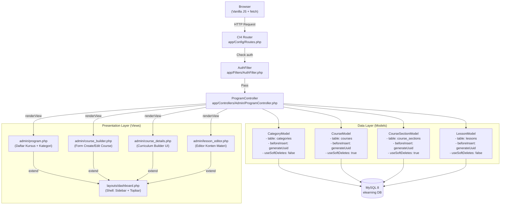
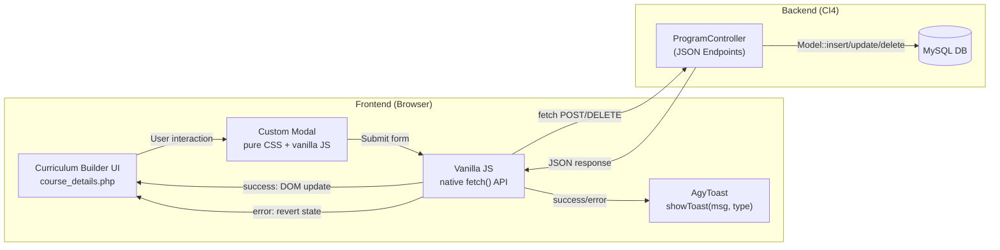
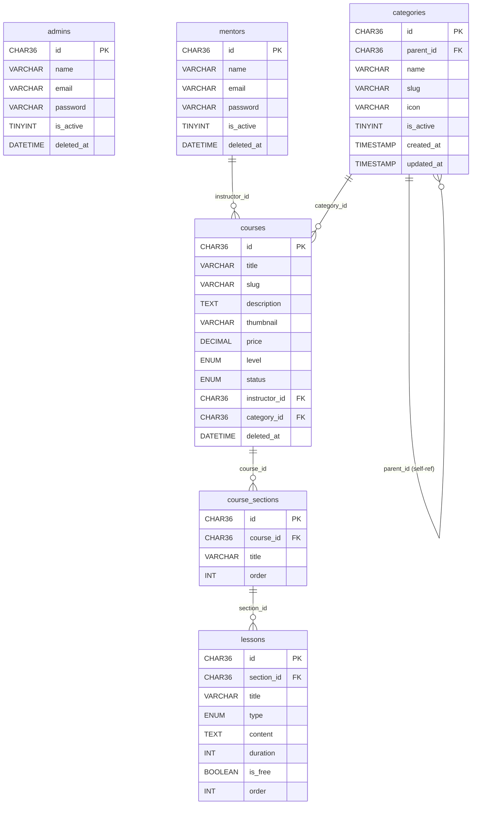
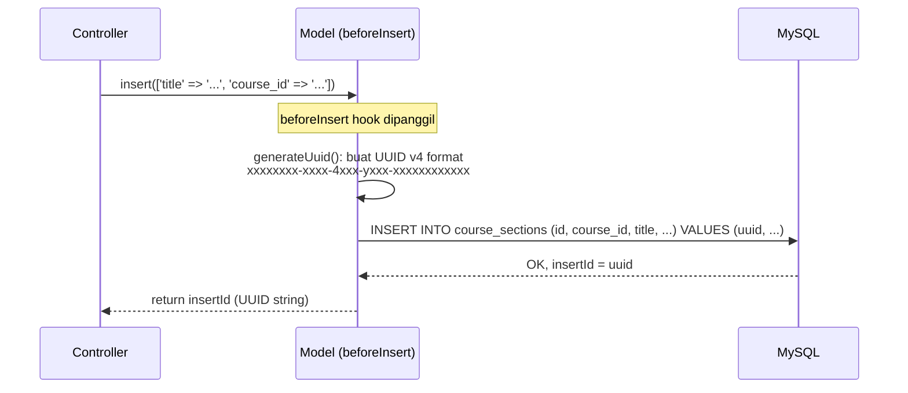
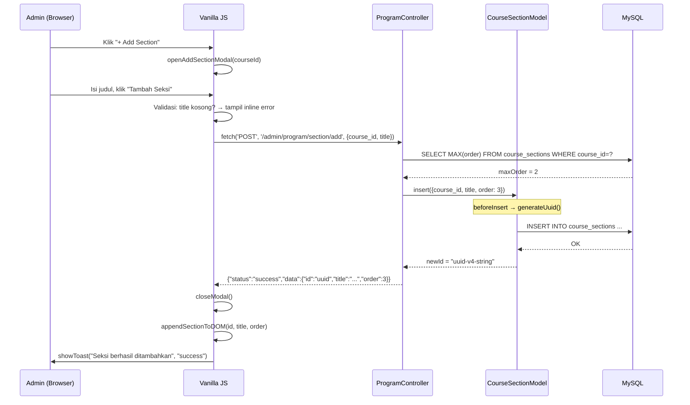
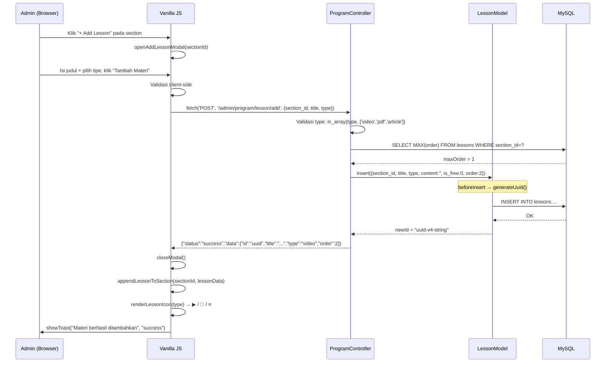
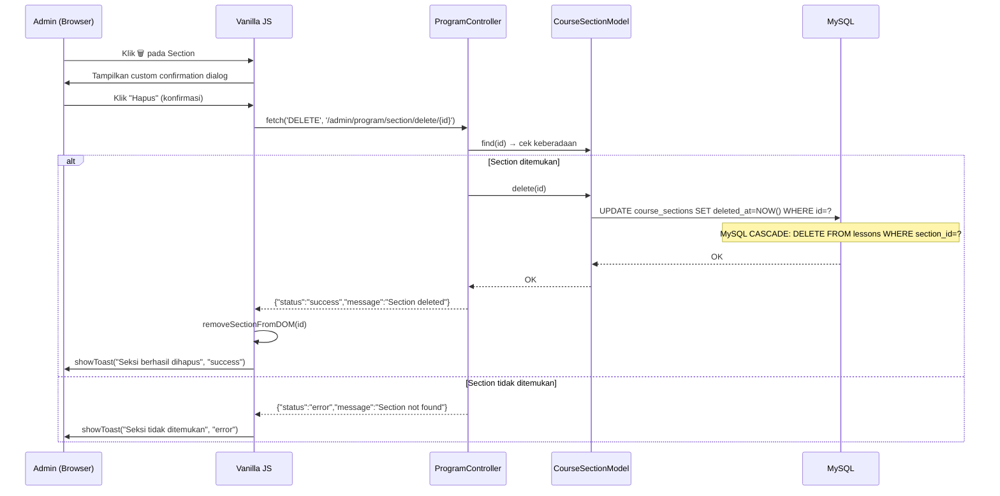
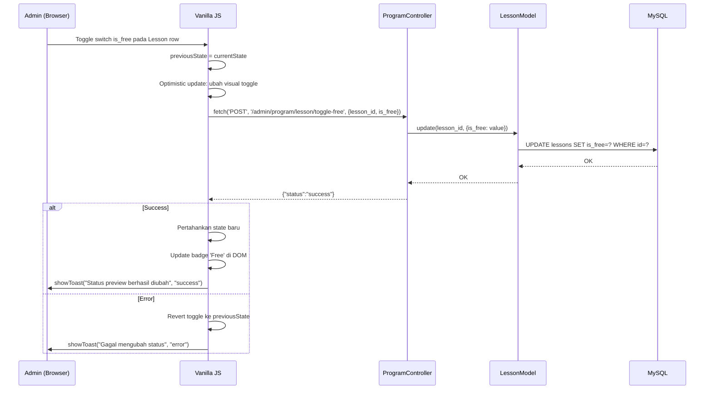
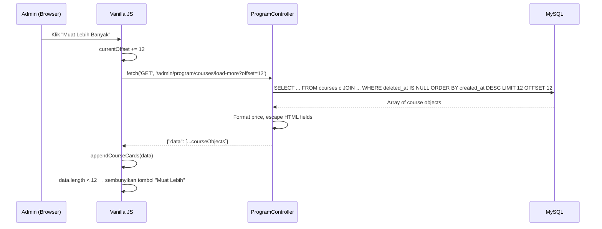
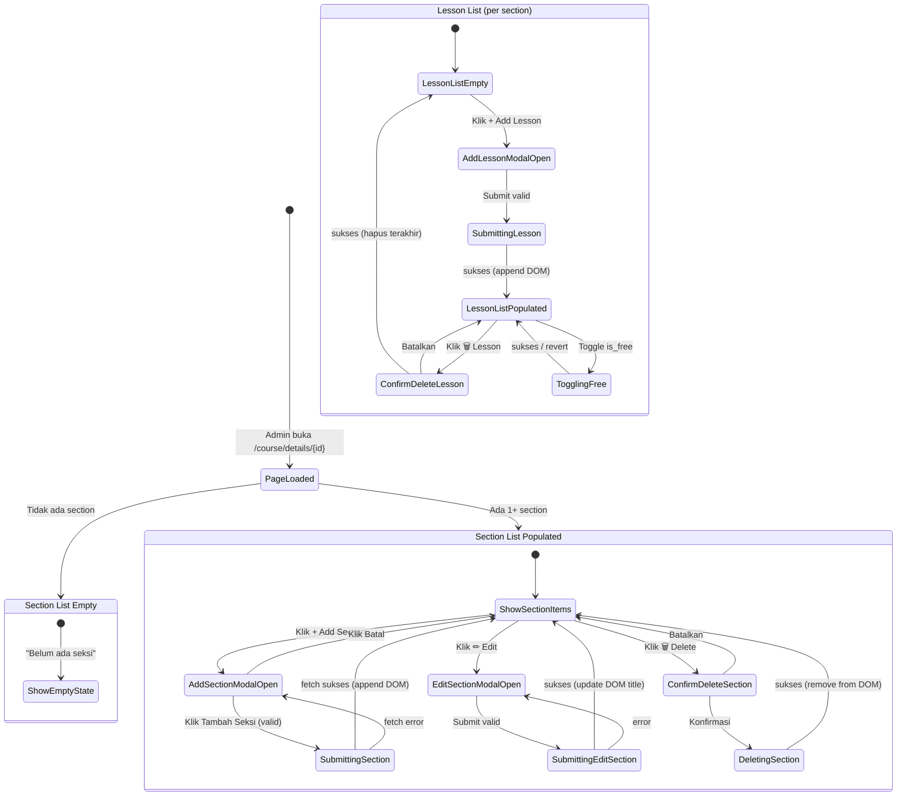

# Design Document

## Fase 3 — Manajemen Entitas Utama, B2B Enterprise Backoffice & Interactive Curriculum Builder

> **Status**: ✅ SELESAI — Dokumen ini merupakan referensi desain arsitektur untuk fitur yang telah diimplementasikan.
> **Platform**: EduNusa Admin Portal (`e-learning-admin`, CodeIgniter 4 MVC)
> **Stack**: PHP 8.x, CodeIgniter 4, MySQL 8, Vanilla JS (fetch API), Pure CSS

---

## Ikhtisar (Overview)

Fase 3 membangun dua sistem utama di atas pondasi CI4 MVC:

1. **Manajemen Entitas & B2B Enterprise UI** — Lapisan CRUD untuk Kategori dan Kursus dengan standar visual B2B enterprise yang ketat.
2. **Interactive Curriculum Builder** — Sistem pengelolaan kurikulum berbasis AJAX tanpa reload halaman, menggunakan native `fetch()` API, custom modal, dan AgyToast notification.

Desain mengutamakan **zero dependency baru** (tidak menambah library JavaScript), **UI consistency** (semua elemen mengikuti B2B Enterprise Standards), dan **data integrity** (UUID v4, soft delete, FK cascade).

---

## Arsitektur Sistem

### Diagram Arsitektur MVC CI4



---

### Diagram Arsitektur AJAX Flow



---

## Komponen & Antarmuka (Components and Interfaces)

### C-1: ProgramController

Satu-satunya controller untuk semua fitur Fase 3. Mewarisi dari `BaseController`.

**Namespace**: `App\Controllers\Admin`
**File**: `app/Controllers/Admin/ProgramController.php`

| Method | Route | HTTP | Return Type | Keterangan |
|---|---|---|---|---|
| `index()` | `/admin/program` | GET | HTML View | Daftar kursus + kategori |
| `loadMoreCourses()` | `/admin/program/courses/load-more` | GET | JSON | Pagination kursus |
| `saveCategory()` | `/admin/program/category/save` | POST | JSON | Insert/update kategori |
| `deleteCategory($id)` | `/admin/program/category/delete/{id}` | DELETE | JSON | Soft-disable kategori |
| `getCategory($id)` | `/admin/program/category/{id}` | GET | JSON | Ambil data kategori |
| `courseBuilder($id)` | `/admin/program/course/builder/{id?}` | GET | HTML View | Form kursus |
| `saveCourse()` | `/admin/program/course/save` | POST | Redirect | Insert/update kursus |
| `courseDetails($id)` | `/admin/program/course/details/{id}` | GET | HTML View | Detail + kurikulum |
| `addSection()` | `/admin/program/section/add` | POST | JSON | AJAX: tambah seksi |
| `updateSection()` | `/admin/program/section/update` | POST | JSON | AJAX: edit seksi |
| `deleteSection($id)` | `/admin/program/section/delete/{id}` | DELETE | JSON | AJAX: hapus seksi |
| `addLesson()` | `/admin/program/lesson/add` | POST | JSON | AJAX: tambah materi |
| `deleteLesson($id)` | `/admin/program/lesson/delete/{id}` | DELETE | JSON | AJAX: hapus materi |
| `lessonEditor($id)` | `/admin/program/lesson/editor/{id}` | GET | HTML View | Editor konten |
| `saveLessonContent()` | `/admin/program/lesson/save-content` | POST | Redirect | Simpan konten materi |

---

### C-2: Model Layer

Semua model mewarisi dari `CodeIgniter\Model` dan mengimplementasikan UUID v4 generation via `beforeInsert` hook.

**Interface bersama semua model**:

```php
// Pattern UUID v4 generation (sama di semua model)
protected function generateUuid(array $data): array
{
    if (empty($data['data'][$this->primaryKey])) {
        $data['data'][$this->primaryKey] = sprintf(
            '%04x%04x-%04x-%04x-%04x-%04x%04x%04x',
            mt_rand(0, 0xffff), mt_rand(0, 0xffff),
            mt_rand(0, 0xffff),
            mt_rand(0, 0x0fff) | 0x4000,   // version 4
            mt_rand(0, 0x3fff) | 0x8000,   // variant
            mt_rand(0, 0xffff), mt_rand(0, 0xffff), mt_rand(0, 0xffff)
        );
    }
    return $data;
}
```

**Perbandingan konfigurasi model**:

| Model | Tabel | useSoftDeletes | allowedFields (ringkasan) |
|---|---|---|---|
| `CategoryModel` | `categories` | `false` | id, parent_id, name, slug, description, icon, is_active |
| `CourseModel` | `courses` | `true` | id, category_id, instructor_id, title, slug, description, thumbnail, price, level, status |
| `CourseSectionModel` | `course_sections` | `true` | id, course_id, title, order |
| `LessonModel` | `lessons` | `false` | id, section_id, title, type, content, duration, order |

---

### C-3: View Layer

Semua view menggunakan CI4 View Inheritance:

```
layouts/dashboard.php          ← Shell layout (sidebar, topbar, script base)
    ├── admin/program.php       ← $this->section('content')
    ├── admin/course_builder.php
    ├── admin/course_details.php
    └── admin/lesson_editor.php
```

**Component Hierarchy — `course_details.php`**:

```
course_details.php
├── [Inline CSS] B2B Enterprise styles + Curriculum styles + Modal styles
├── [Section: Course Metadata]
│   ├── Thumbnail image
│   ├── Judul, Instruktur, Kategori, Level, Harga, Status
│   └── [Button] Edit Kursus → /admin/program/course/builder/{id}
├── [Section: Curriculum Builder]
│   ├── [Button] + Add Section → openAddSectionModal()
│   └── [Loop: sections]
│       └── .curriculum-section
│           ├── .curriculum-section-header
│           │   ├── Section title
│           │   ├── [Button] Edit → openEditSectionModal(id, title)
│           │   └── [Button] Delete → confirmDeleteSection(id)
│           └── .curriculum-section-body
│               ├── [Loop: lessons]
│               │   └── .lesson-item
│               │       ├── .lesson-icon (video/pdf/article)
│               │       ├── Lesson title
│               │       ├── [Toggle] is_free → toggleFreePreview(id, current)
│               │       ├── [Button] Edit → /admin/program/lesson/editor/{id}
│               │       └── [Button] Delete → confirmDeleteLesson(id)
│               └── [Button] + Add Lesson → openAddLessonModal(sectionId)
├── [Modal] #addSectionModal
├── [Modal] #editSectionModal
├── [Modal] #addLessonModal
├── [Modal] #confirmDeleteModal (reusable)
├── [AgyToast] #agy-toast-container
└── [Inline JS] All AJAX + DOM manipulation logic
```

---

### C-4: AgyToast Component

**Implementasi**: Pure CSS + Vanilla JS, inline di view atau sebagai bagian dari layout.

```javascript
// Interface AgyToast
function showToast(message: string, type: 'success' | 'error' | 'warning' | 'info'): void

// Penggunaan
showToast('Seksi berhasil ditambahkan', 'success');
showToast('Gagal menghapus data', 'error');
```

**CSS Structure**:
```
#agy-toast-container          position: fixed; bottom: 24px; right: 24px; z-index: 9999
└── .agy-toast                 background: #fff; border-radius: 12px; box-shadow: ...
    ├── .agy-toast-icon        width: 20px; color: sesuai type
    └── .agy-toast-message     font-size: 0.9rem; color: #0f172a
```

**State Transitions**:
```
[created] → transform: translateX(120%) → opacity: 0
    ↓ (requestAnimationFrame delay 10ms)
[shown]   → transform: translateX(0)    → opacity: 1
    ↓ (setTimeout: 3500ms success / 5000ms error)
[hiding]  → transform: translateX(120%) → opacity: 0
    ↓ (transitionend event)
[removed] → element.remove()
```

---

### C-5: Custom Modal Component

**Implementasi**: Pure CSS + Vanilla JS, bukan Bootstrap Modal.

```
.agy-modal-backdrop      position: fixed; top: 0; left: 0; 100vw x 100vh
                         background: rgba(15,23,42,0.4); backdrop-filter: blur(4px)
                         z-index: 1050; display: none → flex (saat show)
└── .agy-modal           background: #fff; max-width: 500px; border-radius: 20px
    ├── .agy-modal-header  padding: 24px; border-bottom: 1px solid #e2e8f0
    ├── .agy-modal-body    padding: 24px
    └── .agy-modal-footer  padding: 20px 24px; background: #f8fafc
```

**Open/Close Pattern**:
```javascript
// Open
modalEl.style.display = 'flex';
setTimeout(() => modalEl.classList.add('show'), 10); // trigger CSS transition

// Close
modalEl.classList.remove('show');
setTimeout(() => modalEl.style.display = 'none', 300); // after transition
```

---

## Data Models

### Entity Relationship Diagram



---

### Data Flow: UUID v4 Generation



---

## Sequence Diagrams (AJAX Operations)

### SD-1: Add Section Flow



---

### SD-2: Add Lesson Flow



---

### SD-3: Delete Section Flow



---

### SD-4: Toggle Free Preview Flow



---

### SD-5: Load More Courses Flow



---

## State Machine: Curriculum Builder UI



---

## B2B Enterprise CSS Architecture

### Strategi CSS

Tidak ada CSS framework baru yang ditambahkan. Semua styling menggunakan kelas kustom namespaced.

```
Namespace prefix conventions:
  agy-*          → Global B2B enterprise components (button, input, modal, toast)
  curriculum-*   → Curriculum Builder specific components
  lesson-*       → Lesson item components
  flat-*         → Flat tab navigation
  cat-*          → Category list components
  course-*       → Course card components
```

### Token Warna (Design Tokens)

```css
/* Color Palette */
--color-ink-900:    #0f172a;   /* Primary text, headings, dark buttons */
--color-ink-700:    #1e293b;   /* Button hover */
--color-ink-500:    #64748b;   /* Secondary text, labels */
--color-ink-400:    #94a3b8;   /* Placeholder, disabled text */
--color-border:     #e2e8f0;   /* All borders */
--color-surface:    #f8fafc;   /* Card backgrounds, modal footers */
--color-surface-2:  #f1f5f9;   /* Hover states, lesson icons bg */
--color-white:      #ffffff;   /* Canvas background */

/* Semantic Colors */
--color-success:    #22c55e;   /* AgyToast success, Published badge, Free badge */
--color-error:      #ef4444;   /* AgyToast error, Delete actions */
--color-warning:    #f59e0b;   /* Archived badge */
--color-draft:      #94a3b8;   /* Draft badge */
```

### Typography Tokens

```css
/* Font */
font-family: 'Plus Jakarta Sans', sans-serif;  /* Semua teks */

/* Scale */
--text-xs:    0.75rem;   /* Labels uppercase */
--text-sm:    0.85rem;   /* Body small, badges */
--text-base:  0.95rem;   /* Body default */
--text-lg:    1.05rem;   /* Section titles */
--text-xl:    1.25rem;   /* Modal titles, card titles */
--text-2xl:   1.5rem;    /* Page titles */

/* Weight */
--weight-medium:   500;
--weight-semibold: 600;
--weight-bold:     700;
--weight-extrabold: 800;   /* Headings */

/* Heading letter-spacing */
letter-spacing: -0.02em;   /* h1-h4 */
letter-spacing: -0.03em;   /* h1 khusus program page */
```

### Spacing Tokens

```css
/* Layout */
--padding-canvas:  24px;     /* Padding mutlak semua main content */
--padding-card:    20px;     /* Padding dalam component cards */
--gap-sm:          8px;
--gap-md:          16px;
--gap-lg:          24px;
--gap-xl:          32px;

/* Border Radius */
--radius-sm:    8px;         /* Input fields, lesson icons */
--radius-md:    12px;        /* Cards, modals content area */
--radius-lg:    16px;        /* Course thumbnail, curriculum sections */
--radius-xl:    20px;        /* Modals */
--radius-pill:  99px;        /* Semua buttons */
```

### Komponen CSS: `.agy-btn` (Pill Button)

```css
.agy-btn {
    display: inline-flex;
    align-items: center;
    justify-content: center;
    padding: 10px 24px;
    border-radius: 99px;        /* Pill shape */
    font-weight: 700;
    font-size: 0.95rem;
    font-family: 'Plus Jakarta Sans', sans-serif;
    cursor: pointer;
    transition: all 0.2s ease;
    border: none;
    outline: none;
    text-decoration: none;
    gap: 8px;
}

.agy-btn-primary {
    background: #0f172a;
    color: white;
}
.agy-btn-primary:hover {
    background: #1e293b;
    transform: translateY(-1px);
    box-shadow: 0 4px 12px rgba(15, 23, 42, 0.15);
}

.agy-btn-secondary {
    background: #f8fafc;
    color: #0f172a;
    border: 1px solid #e2e8f0;
}
.agy-btn-danger {
    background: #fef2f2;
    color: #ef4444;
    border: 1px solid #fecaca;
}
```

### Komponen CSS: `.curriculum-section`

```css
.curriculum-section {
    border: 1px solid #e2e8f0;
    border-radius: 12px;
    margin-bottom: 24px;
    background: #fff;
    overflow: hidden;
}

.curriculum-section-header {
    background: #f8fafc;
    padding: 16px 20px;
    border-bottom: 1px solid #e2e8f0;
    display: flex;
    justify-content: space-between;
    align-items: center;
}

.lesson-item {
    display: flex;
    justify-content: space-between;
    align-items: center;
    padding: 16px 20px;
    border-bottom: 1px solid #f1f5f9;
    transition: background 0.2s;
}
.lesson-item:hover { background: #f8fafc; }
.lesson-item:last-child { border-bottom: none; }

.lesson-icon {
    width: 36px;
    height: 36px;
    border-radius: 8px;
    display: flex;
    align-items: center;
    justify-content: center;
    background: #f1f5f9;
    color: #64748b;
    margin-right: 16px;
}
```

### Komponen CSS: AgyToast

```css
#agy-toast-container {
    position: fixed;
    bottom: 24px;
    right: 24px;
    z-index: 9999;
    display: flex;
    flex-direction: column;
    gap: 12px;
}

.agy-toast {
    display: flex;
    align-items: center;
    gap: 12px;
    padding: 16px 20px;
    background: white;
    border-radius: 12px;
    box-shadow: 0 10px 30px rgba(0,0,0,0.08);
    min-width: 280px;
    max-width: 360px;
    transform: translateX(120%);
    opacity: 0;
    transition: all 0.35s cubic-bezier(0.175, 0.885, 0.32, 1.275);
    border-left: 3px solid transparent;
}
.agy-toast.show {
    transform: translateX(0);
    opacity: 1;
}
.agy-toast.success { border-left-color: #22c55e; }
.agy-toast.error   { border-left-color: #ef4444; }
.agy-toast.warning { border-left-color: #f59e0b; }
.agy-toast.info    { border-left-color: #3b82f6; }
```

---

## Error Handling

### Strategi Error Handling

| Layer | Error Type | Handling Strategy |
|---|---|---|
| Client-side JS | Form validation (kosong, invalid) | Inline error message di bawah input field |
| Client-side JS | fetch() network error | `catch(error)` → showToast("Terjadi kesalahan jaringan", "error") |
| Controller | Input validation gagal | return JSON `{"status":"error","message":"..."}` |
| Controller | Record not found | return JSON `{"status":"error","message":"Record not found"}` |
| Controller | Model exception | `try/catch` → return JSON `{"status":"error","message":"..."}` |
| Model | DB constraint violation | Exception dilempar ke Controller |
| View | Course not found (`courseDetails`) | `redirect('/admin/program')` dengan flash error |

### Error Response Format (Standard)

Semua JSON endpoint mengikuti format:

```json
// Success
{
  "status": "success",
  "message": "Deskripsi aksi berhasil",
  "data": { /* optional: object yang baru dibuat/diperbarui */ }
}

// Error
{
  "status": "error",
  "message": "Deskripsi error yang human-readable"
}
```

### Validation Rules per Endpoint

| Endpoint | Field | Rule |
|---|---|---|
| `POST /section/add` | `course_id` | required, not empty |
| `POST /section/add` | `title` | required, trim, not empty |
| `POST /section/update` | `id` | required |
| `POST /section/update` | `title` | required, trim, not empty |
| `POST /lesson/add` | `section_id` | required |
| `POST /lesson/add` | `title` | required, trim, not empty |
| `POST /lesson/add` | `type` | required, in_array: video/pdf/article |
| `POST /category/save` | `name` | required |
| `POST /course/save` | `title` | required |
| `POST /course/save` | `instructor_id` | required |
| `POST /course/save` | `status` | in_array: draft/published/archived |

---

## Testing Strategy

### Pendekatan

Fitur ini tidak cocok untuk property-based testing karena:
- Semua endpoint adalah CRUD operations dengan minimal transformasi logika
- Banyak interaksi bergantung pada state database dan sesi CI4
- UI behavior (modal open/close, DOM manipulation) tidak dapat diuji dengan PBT

Strategi testing yang digunakan adalah **Integration Tests** dan **Smoke Tests**.

### Unit Tests (Example-based)

**Target**: Model UUID generation, slug generation, validasi tipe lesson.

```php
// Test: UUID v4 format validation
public function testGenerateUuidFormat()
{
    $model = new CourseModel();
    $id = $model->insert(['title' => 'Test', 'instructor_id' => '...', ...]);
    $course = $model->find($id);
    $this->assertMatchesRegularExpression(
        '/^[0-9a-f]{8}-[0-9a-f]{4}-4[0-9a-f]{3}-[89ab][0-9a-f]{3}-[0-9a-f]{12}$/',
        $course['id']
    );
}

// Test: Slug auto-generation
public function testSlugGeneration()
{
    // title = "Web Development 101!" → slug = "web-development-101-"
    $slug = strtolower(trim(preg_replace('/[^A-Za-z0-9-]+/', '-', 'Web Development 101!')));
    $this->assertEquals('web-development-101-', $slug);
}

// Test: Invalid lesson type rejection
public function testInvalidLessonTypeRejected()
{
    $validTypes = ['video', 'pdf', 'article'];
    $this->assertFalse(in_array('document', $validTypes));
    $this->assertFalse(in_array('text', $validTypes));
    $this->assertTrue(in_array('video', $validTypes));
}
```

### Integration Tests (HTTP)

**Target**: AJAX endpoints memberikan JSON response yang benar.

| Test Case | Endpoint | Expected |
|---|---|---|
| Add section dengan title valid | POST /section/add | status:success + data.id ada |
| Add section dengan title kosong | POST /section/add | status:error |
| Add lesson dengan type valid | POST /lesson/add | status:success |
| Add lesson dengan type invalid | POST /lesson/add | status:error "Invalid lesson type" |
| Delete section yang ada | DELETE /section/delete/{id} | status:success |
| Delete section yang tidak ada | DELETE /section/delete/non-existent | status:error |

### Smoke Tests

| Test | Verifikasi |
|---|---|
| GET /admin/program | HTTP 200, halaman tampil dengan tab Kursus dan Kategori |
| GET /admin/program/course/details/{valid-id} | HTTP 200, judul kursus tampil |
| GET /admin/program/course/details/{invalid-id} | Redirect ke /admin/program |
| GET /admin/program/course/builder | HTTP 200, form tampil |

### Manual Testing Checklist

- [ ] AgyToast muncul setelah setiap operasi AJAX (sukses & error)
- [ ] Modal terbuka dengan backdrop blur, menutup saat klik X atau Batal
- [ ] DOM ter-update tanpa reload setelah add/delete section/lesson
- [ ] Toggle is_free berubah visual secara optimistik dan revert saat error
- [ ] Hierarki kategori parent-child tampil dengan benar
- [ ] Course cards load-more memuat 12 item per batch
- [ ] Thumbnail upload tersimpan di `uploads/courses/`
- [ ] Soft delete tidak menampilkan course di daftar
