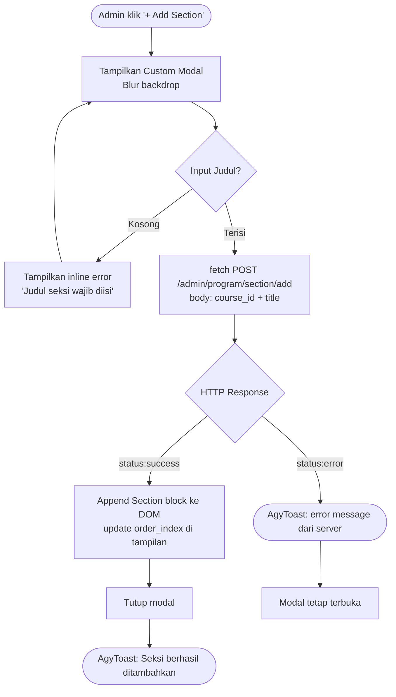
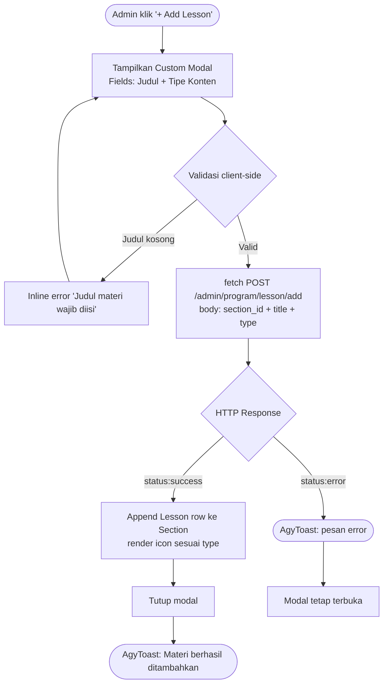
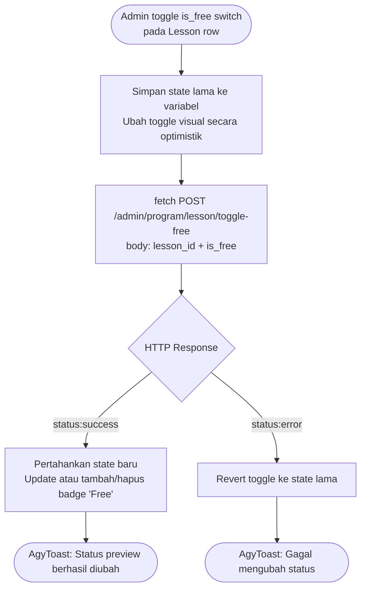
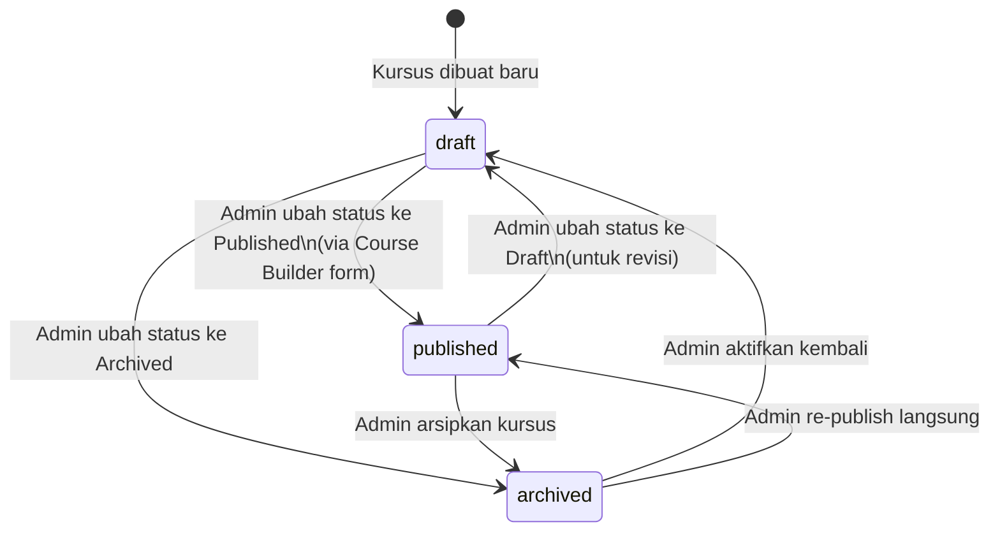

# Requirements Document

## Fase 3 — Manajemen Entitas Utama, B2B Enterprise Backoffice & Interactive Curriculum Builder

> **Status**: ✅ SELESAI — Dokumen ini merupakan referensi komprehensif untuk fitur yang telah diimplementasikan.
> **Platform**: EduNusa Admin Portal (`e-learning-admin`, CodeIgniter 4 MVC)
> **Cakupan**: Fase 3 + Fase 3.5 (digabung)

---

## Pendahuluan

EduNusa adalah platform e-learning berbasis web yang menyediakan portal admin untuk mengelola konten kursus, kurikulum, dan entitas terkait. Fase 3 mencakup dua area utama:

1. **Manajemen Entitas & B2B Enterprise UI** — CRUD Kategori, CRUD Kursus, standarisasi visual B2B enterprise, dan halaman Course Builder.
2. **Interactive Curriculum Builder** — sistem pengelolaan seksi dan materi kursus secara asinkron (zero page reload) dengan AJAX native `fetch()`.

Semua fitur dibangun di atas pondasi UUID v4, soft delete, dan session-based authentication yang diletakkan di Fase 1.

---

## Glosarium

| Istilah | Definisi |
|---|---|
| **Admin** | Pengguna dengan role `superadmin` atau `academic_manager` yang login ke portal admin |
| **Superadmin** | Role tertinggi di admin portal, memiliki akses penuh ke semua fitur |
| **Academic_Manager** | Role manajemen akademik, dapat mengelola kursus dan kurikulum |
| **Mentor** | Instruktur kursus, memiliki akses terbatas ke editor materi miliknya |
| **Course** | Entitas kursus yang memiliki metadata (judul, harga, level, status) dan kurikulum |
| **Category** | Klasifikasi kursus yang mendukung hierarki parent–child |
| **Section** | Bagian kurikulum dalam sebuah kursus, berisi kumpulan Lesson |
| **Lesson** | Materi individual dalam sebuah Section, memiliki tipe konten: `video`, `pdf`, atau `article` |
| **Curriculum** | Keseluruhan struktur Section + Lesson yang membentuk isi sebuah Course |
| **Course_Builder** | Halaman form untuk membuat atau mengedit metadata Course |
| **Course_Details** | Halaman detail kursus yang menampilkan Curriculum Builder secara interaktif |
| **Curriculum_Builder** | Komponen interaktif pada Course_Details untuk mengelola Section dan Lesson |
| **AgyToast** | Sistem notifikasi toast kustom milik EduNusa (bukan `window.alert` atau Bootstrap alert) |
| **B2B_Enterprise_UI** | Standar desain visual untuk admin portal: cardless layout, warna #ffffff, border #e2e8f0, padding 24px, pill button |
| **UUID_v4** | Universally Unique Identifier versi 4, digunakan sebagai primary key semua tabel |
| **Soft_Delete** | Penghapusan data dengan mengisi kolom `deleted_at` tanpa benar-benar menghapus baris |
| **is_free** | Flag Boolean pada Lesson yang menandai apakah materi dapat diakses gratis oleh publik |
| **order_index** | Angka integer yang menentukan urutan tampil Section atau Lesson dalam daftar |

---

## Persyaratan

---

### Persyaratan 1: Migrasi & Penggunaan UUID v4 Sebagai Primary Key

**User Story:** Sebagai Superadmin, saya ingin semua data entitas (kategori, kursus, seksi, materi) menggunakan UUID v4 sebagai primary key, sehingga identitas data bersifat unik secara global dan aman terhadap enumerasi.

#### Acceptance Criteria

1. THE Course_Builder SHALL assign a UUID v4 value to the `id` field of every new `courses`, `categories`, `course_sections`, and `lessons` record before insert.
2. WHEN a new entity is inserted, THE System SHALL generate the UUID v4 via the `beforeInsert` hook in the corresponding CI4 Model, not at the controller layer.
3. THE System SHALL store UUID v4 as `CHAR(36)` in MySQL, with the format `xxxxxxxx-xxxx-4xxx-yxxx-xxxxxxxxxxxx`.
4. WHEN an entity is referenced via foreign key (e.g., `courses.category_id`), THE System SHALL use `CHAR(36)` UUID as the foreign key value.
5. THE System SHALL NOT use `AUTO_INCREMENT` integers as primary keys for any of the entities in Fase 3.

---

### Persyaratan 2: CRUD Kategori

**User Story:** Sebagai Academic_Manager, saya ingin mengelola kategori kursus (tambah, edit, hapus, lihat), sehingga kursus dapat diklasifikasikan secara terstruktur dengan dukungan sub-kategori.

#### Acceptance Criteria

1. WHEN an Admin visits `/admin/program` and opens the "Kategori" tab, THE System SHALL display a list of all active categories ordered by parent first, then by name ascending.
2. WHEN an Admin clicks "+ Tambah Kategori", THE System SHALL display a modal form with fields: Nama Kategori (required), Deskripsi, Icon Class (default `fa-folder`), Parent Kategori (optional, dropdown of top-level categories), Status Aktif.
3. WHEN an Admin submits the category form with a valid Nama, THE System SHALL auto-generate a URL-safe `slug` from the name using lowercase and hyphen replacement, then insert the record via `CategoryModel`.
4. WHEN an Admin submits the category form with an empty Nama, THE System SHALL prevent submission and display an inline validation message "Nama kategori wajib diisi".
5. WHEN an Admin clicks the edit icon on a category, THE System SHALL populate the modal form with existing category data retrieved from `GET /admin/program/category/{id}`.
6. WHEN an Admin submits an edit form with valid data, THE System SHALL update the category record and display an AgyToast success notification.
7. WHEN an Admin clicks the delete icon on a category, THE System SHALL display a custom confirmation dialog (non-Bootstrap), and upon confirmation, call `DELETE /admin/program/category/{id}` which sets `is_active = 0` (soft-disable).
8. THE System SHALL display categories in a hierarchical tree view: parent category at top level, sub-categories indented below with dashed separator.
9. WHERE a category has `parent_id IS NULL`, THE System SHALL render it as a top-level category row.
10. WHERE a category has `parent_id IS NOT NULL`, THE System SHALL render it as a child row indented under the parent.

---

### Persyaratan 3: CRUD Kursus

**User Story:** Sebagai Academic_Manager, saya ingin mengelola kursus (tambah, edit, lihat daftar), sehingga konten pendidikan dapat dipublikasikan dengan metadata yang lengkap.

#### Acceptance Criteria

1. WHEN an Admin visits `/admin/program` and selects the "Kursus" tab, THE System SHALL display a paginated grid of courses (12 per load) ordered by `created_at` DESC, showing thumbnail, judul, instruktur, kategori, level, status, dan harga.
2. WHEN the course grid reaches the bottom of the initial 12 items, THE System SHALL load the next batch of 12 via `GET /admin/program/courses/load-more?offset={n}` without page reload.
3. WHEN an Admin clicks "+ Buat Kursus Baru", THE System SHALL navigate to `/admin/program/course/builder` (form halaman penuh, bukan modal).
4. THE Course_Builder form SHALL include fields: Judul (required), Kategori (dropdown), Instruktur/Mentor (dropdown), Level (beginner/intermediate/advanced/all), Deskripsi (textarea), Harga (number, 0 = gratis), Thumbnail (file upload), Status (draft/published/archived).
5. WHEN an Admin submits the course form with valid data, THE System SHALL auto-generate `slug` from judul, upload thumbnail ke `uploads/courses/`, insert record via `CourseModel`, and redirect to `/admin/program` with success flash message.
6. WHEN an Admin submits the course form without a Judul, THE System SHALL prevent submission and display an inline validation error.
7. WHEN an Admin clicks the edit icon on a course card, THE System SHALL navigate to `/admin/program/course/builder/{id}` with the form pre-filled with existing course data.
8. WHEN an Admin submits an edit form, THE System SHALL update the course record; if a new thumbnail is uploaded, THE System SHALL overwrite the previous thumbnail file.
9. WHEN a course has `status = 'draft'`, THE System SHALL display a "Draft" badge with grey styling on the course card.
10. WHEN a course has `status = 'published'`, THE System SHALL display a "Published" badge with green styling on the course card.
11. THE System SHALL display price as "Gratis" when `price = 0`, and as "Rp X.XXX" format when `price > 0`.
12. WHEN a course query is executed, THE System SHALL include `WHERE c.deleted_at IS NULL` to exclude soft-deleted courses.

---

### Persyaratan 4: B2B Enterprise UI Standards

**User Story:** Sebagai Superadmin, saya ingin semua halaman admin mengikuti standar visual B2B enterprise yang konsisten, sehingga portal terlihat profesional dan mudah digunakan oleh staf enterprise.

#### Acceptance Criteria

1. THE B2B_Enterprise_UI SHALL use a white canvas layout with `background: #ffffff` and no card-shadow wrapping sections.
2. THE B2B_Enterprise_UI SHALL apply `border: 1px solid #e2e8f0` as the single visual separator between sections and panels.
3. THE B2B_Enterprise_UI SHALL apply `padding: 24px` as the absolute padding value for all main content areas.
4. THE B2B_Enterprise_UI SHALL render all primary action buttons with `border-radius: 99px` (pill-shaped) and `font-family: 'Plus Jakarta Sans', sans-serif`.
5. THE B2B_Enterprise_UI SHALL use `font-weight: 800` and `letter-spacing: -0.02em` for all headings (h1–h6).
6. THE System SHALL use AgyToast for all user-facing notifications (success, error, warning); THE System SHALL NOT use `window.alert()`, `window.confirm()`, or Bootstrap alert components.
7. THE B2B_Enterprise_UI SHALL apply zero Bootstrap default styling override — all custom styles SHALL use namespaced CSS classes prefixed with `agy-` or component-specific names.
8. WHEN an AgyToast is triggered, THE AgyToast SHALL appear in the bottom-right corner with `position: fixed`, animate in from the right with `transform: translateX(120%)` to `translateX(0)`, and auto-dismiss after 3500ms.
9. WHEN an AgyToast displays a success message, THE AgyToast SHALL use a green left border `#22c55e` and a checkmark icon.
10. WHEN an AgyToast displays an error message, THE AgyToast SHALL use a red left border `#ef4444` and an X icon.
11. THE B2B_Enterprise_UI SHALL use color `#0f172a` as the primary dark text, `#64748b` as secondary/label text, and `#94a3b8` as placeholder text.
12. WHEN a custom modal is opened, THE System SHALL apply `backdrop-filter: blur(4px)` and `background: rgba(15, 23, 42, 0.4)` to the overlay.

#### AgyToast Usage Guidelines

AgyToast dipanggil via JavaScript fungsi global `showToast(message, type)`:

```javascript
// Contoh penggunaan
showToast('Seksi berhasil ditambahkan', 'success');
showToast('Gagal menyimpan data', 'error');
showToast('Data sedang diproses...', 'info');
```

| Parameter | Nilai Valid | Keterangan |
|---|---|---|
| `message` | String apapun | Teks notifikasi yang ditampilkan |
| `type` | `'success'`, `'error'`, `'warning'`, `'info'` | Menentukan warna dan ikon toast |

**Aturan**:
- AgyToast HARUS dipanggil setelah setiap operasi AJAX selesai (sukses maupun gagal)
- AgyToast DILARANG digunakan untuk konfirmasi (gunakan custom confirmation modal)
- Maksimum 1 toast aktif pada waktu yang sama
- Toast success auto-dismiss dalam 3500ms, toast error auto-dismiss dalam 5000ms

---

### Persyaratan 5: Course Builder & Course Details Page

**User Story:** Sebagai Academic_Manager, saya ingin melihat halaman detail kursus yang menampilkan metadata dan kurikulum secara terpadu, sehingga saya dapat mengelola seluruh konten kursus dari satu halaman.

#### Acceptance Criteria

1. WHEN an Admin navigates to `/admin/program/course/details/{id}`, THE System SHALL load the Course_Details page displaying: metadata kursus (judul, instruktur, kategori, level, status, harga, deskripsi, thumbnail) dan Curriculum_Builder.
2. WHEN the course `id` does not exist or is soft-deleted, THE System SHALL redirect to `/admin/program` with an error flash message "Course not found."
3. THE Course_Details page SHALL display all Sections ordered by `order` ASC, each Section containing its Lessons ordered by `order` ASC.
4. WHEN a Section has no Lessons, THE System SHALL display an empty state message "Belum ada materi di seksi ini. Klik + Add Lesson untuk mulai."
5. WHEN there are no Sections, THE System SHALL display an empty state message "Belum ada seksi. Klik + Add Section untuk memulai kurikulum."
6. THE Course_Details breadcrumb SHALL display: Dashboard > Program & Kelas > [Judul Kursus].
7. WHEN displaying a Lesson row, THE System SHALL show a content-type icon: video icon untuk `type='video'`, PDF icon untuk `type='pdf'`, dan text/article icon untuk `type='article'`.
8. WHEN displaying a Lesson row, THE System SHALL show an `is_free` toggle switch reflecting the current `is_free` value.

---

### Persyaratan 6: Manajemen Seksi (Section Management) via AJAX

**User Story:** Sebagai Academic_Manager, saya ingin menambah, mengedit, dan menghapus seksi kurikulum secara asinkron tanpa reload halaman, sehingga saya dapat menyusun struktur kursus dengan cepat.

#### Acceptance Criteria

1. WHEN an Admin clicks "+ Add Section" on the Course_Details page, THE System SHALL display a custom modal (non-Bootstrap, pure CSS + vanilla JS) with a blur backdrop and a "Judul Seksi" text input.
2. WHEN an Admin submits the Add Section form with a non-empty title, THE System SHALL send `POST /admin/program/section/add` with `{ course_id, title }` via native `fetch()`.
3. WHEN the server responds with `{ "status": "success" }`, THE System SHALL append a new Section block to the curriculum list DOM without page reload, and display an AgyToast success.
4. WHEN the server responds with `{ "status": "error" }`, THE System SHALL display an AgyToast error with the server's error message.
5. WHEN an Add Section form is submitted with an empty title, THE System SHALL prevent the fetch call and display an inline validation error "Judul seksi wajib diisi."
6. THE System SHALL auto-assign `order_index` to each new Section as `MAX(order) + 1` for the given `course_id`.
7. THE System SHALL generate a UUID v4 for each new Section record via the `CourseSectionModel::beforeInsert` hook.
8. WHEN an Admin clicks the edit (pencil) icon on a Section header, THE System SHALL display a pre-filled edit modal with the current section title.
9. WHEN an Admin submits the Section edit form with a valid title, THE System SHALL send `POST /admin/program/section/update` with `{ id, title }` via `fetch()` and update the Section title in the DOM upon success.
10. WHEN an Admin clicks the delete (trash) icon on a Section, THE System SHALL display a custom confirmation dialog "Hapus seksi ini? Semua materi di dalamnya akan ikut terhapus."
11. WHEN an Admin confirms Section deletion, THE System SHALL send `DELETE /admin/program/section/delete/{id}` via `fetch()`, remove the Section block from the DOM upon success, and display an AgyToast success.
12. WHEN a Section is deleted, THE System SHALL cascade-delete all Lessons belonging to that Section (handled by MySQL `ON DELETE CASCADE` on `lessons.section_id`).

---

### Persyaratan 7: Manajemen Materi (Lesson Management) via AJAX

**User Story:** Sebagai Academic_Manager, saya ingin menambah dan menghapus materi dalam setiap seksi secara asinkron, sehingga saya dapat mengisi konten kurikulum dengan efisien.

#### Acceptance Criteria

1. WHEN an Admin clicks "+ Add Lesson" inside a Section, THE System SHALL display a custom modal with fields: Judul Materi (text input, required) dan Tipe Konten (radio/select: Video, Dokumen PDF, Artikel Teks).
2. WHEN an Admin submits the Add Lesson form with valid data, THE System SHALL send `POST /admin/program/lesson/add` with `{ section_id, title, type }` via native `fetch()`.
3. WHEN the server responds with `{ "status": "success" }`, THE System SHALL append a new Lesson row to the corresponding Section's lesson list in the DOM, without page reload.
4. WHEN an Add Lesson form is submitted with an empty title, THE System SHALL prevent the fetch call and show inline validation "Judul materi wajib diisi."
5. WHEN an Add Lesson form is submitted with an invalid `type` value (not `video`, `pdf`, `article`), THE System SHALL return `{ "status": "error", "message": "Invalid lesson type" }` from the server.
6. THE System SHALL auto-assign `order_index` to each new Lesson as `MAX(order) + 1` for the given `section_id`.
7. THE System SHALL generate a UUID v4 for each new Lesson record via the `LessonModel::beforeInsert` hook.
8. WHEN a new Lesson is appended to the DOM, THE System SHALL render the correct content-type icon based on the `type` value returned by the server.
9. WHEN an Admin clicks the delete icon on a Lesson row, THE System SHALL display a custom confirmation dialog and, upon confirmation, send `DELETE /admin/program/lesson/delete/{id}` via `fetch()`.
10. WHEN a Lesson is deleted successfully, THE System SHALL remove the Lesson row from the DOM and display an AgyToast success notification.
11. WHEN a Lesson is deleted and was the only lesson in a Section, THE System SHALL display the empty state message for that Section.

---

### Persyaratan 8: Free Preview Toggle (`is_free`)

**User Story:** Sebagai Mentor, saya ingin menandai materi tertentu sebagai "Free Preview" sehingga calon siswa dapat mengakses materi tersebut di halaman publik tanpa berlangganan.

#### Acceptance Criteria

1. THE System SHALL display a toggle switch per Lesson row on the Course_Details page, reflecting the current `is_free` value (1 = ON / 0 = OFF).
2. WHEN an Admin toggles the `is_free` switch, THE System SHALL immediately send `POST /admin/program/lesson/toggle-free` with `{ lesson_id, is_free }` via native `fetch()`.
3. WHEN the server responds with `{ "status": "success" }`, THE System SHALL retain the toggle switch in the new state and display an AgyToast confirming the change.
4. WHEN the server responds with `{ "status": "error" }`, THE System SHALL revert the toggle switch to its previous state and display an AgyToast error.
5. THE System SHALL update only the `is_free` field of the Lesson record; all other Lesson fields SHALL remain unchanged.
6. WHEN `is_free = 1`, THE System SHALL visually distinguish the Lesson row with a "Free" badge (green pill) next to the lesson title.

---

### Persyaratan 9: Integritas Data & Soft Delete

**User Story:** Sebagai Superadmin, saya ingin semua penghapusan data bersifat soft delete dan semua query hanya menampilkan data yang aktif, sehingga data historis terjaga dan dapat dipulihkan jika diperlukan.

#### Acceptance Criteria

1. WHEN a Course is deleted, THE System SHALL set `deleted_at = NOW()` on the courses record; THE System SHALL NOT physically delete the row.
2. WHEN any query fetches courses, THE System SHALL include `WHERE deleted_at IS NULL` to exclude soft-deleted courses.
3. WHEN a Section is deleted via the Curriculum_Builder, THE System SHALL use `CourseSectionModel::delete($id)` which utilizes CI4 soft delete (`useSoftDeletes = true`).
4. IF a record does not exist or is already soft-deleted, THEN THE System SHALL return `{ "status": "error", "message": "Record not found" }` from any AJAX delete endpoint.
5. THE System SHALL NOT cascade soft-delete to child records via application layer; instead, MySQL `ON DELETE CASCADE` on `lessons.section_id` handles physical cascade (consistent with current schema design).
6. WHERE `useSoftDeletes = false` (e.g., `CategoryModel`), THE System SHALL simulate soft delete by setting `is_active = 0` instead of `deleted_at`.

---

### Persyaratan 10: Course Publishing Workflow

**User Story:** Sebagai Academic_Manager, saya ingin mengubah status kursus melalui alur draft → published, sehingga kursus hanya tampil ke publik ketika sudah siap.

#### Acceptance Criteria

1. WHEN a new Course is created, THE System SHALL set `status = 'draft'` as the default value.
2. WHEN an Admin changes course status to `published` via the Course_Builder form, THE System SHALL update `status = 'published'` in the database.
3. WHEN an Admin changes course status to `archived`, THE System SHALL update `status = 'archived'` in the database; THE System SHALL still display the course in the admin list.
4. THE System SHALL accept only these status values: `draft`, `published`, `archived`; any other value SHALL be rejected by the server with a validation error.
5. WHEN displaying the course list, THE System SHALL render status badges: grey pill for `draft`, green pill for `published`, orange pill for `archived`.

---

## Wireframe Deskriptif

### W-1: Halaman Daftar Kursus & Kategori (`/admin/program`)

```
┌─────────────────────────────────────────────────────────────────────────────┐
│  EduNusa Admin  │  Dashboard  │  Program & Kelas  │  Transaksi  │  Laporan  │
├─────────────────────────────────────────────────────────────────────────────┤
│                                                                             │
│  Program & Kelas                                      [+ Buat Kursus Baru] │
│  ─────────────────────────────────────────────────────────────────────────  │
│                                                                             │
│  Kursus  │  Kategori                    ← Flat tabs (border-bottom only)   │
│  ───────                                                                    │
│                                                                             │
│  [TAB: KURSUS AKTIF]                                                        │
│                                                                             │
│  ┌──────────────┐  ┌──────────────┐  ┌──────────────┐  ┌──────────────┐  │
│  │  [Thumbnail] │  │  [Thumbnail] │  │  [Thumbnail] │  │  [Thumbnail] │  │
│  │  16:9 ratio  │  │              │  │              │  │              │  │
│  │  ──────────  │  │              │  │              │  │              │  │
│  │  Web Dev     │  │  Python Dasar│  │  UI/UX Design│  │  SEO Mastery │  │
│  │  Budi Santoso│  │  Ani Wijaya  │  │  Rika Dewi   │  │  Hendra Tama │  │
│  │  BEGINNER    │  │  INTERMEDIATE│  │  ALL LEVELS  │  │  ADVANCED    │  │
│  │  ●Published  │  │  ○ Draft     │  │  ●Published  │  │  ○ Draft     │  │
│  │  Rp 299.000  │  │  Gratis      │  │  Rp 499.000  │  │  Rp 199.000  │  │
│  │  [Edit] [▶]  │  │  [Edit] [▶]  │  │  [Edit] [▶]  │  │  [Edit] [▶]  │  │
│  └──────────────┘  └──────────────┘  └──────────────┘  └──────────────┘  │
│                                                                             │
│  [Muat Lebih Banyak →]                                                      │
│                                                                             │
│  ─────────────────────────────────────────────────────────────────────────  │
│  [TAB: KATEGORI]                                                             │
│                                                                             │
│  Web Development          [fa-code]   3 sub-kategori  [✏] [🗑]            │
│    └─ Laravel             [fa-laravel]                [✏] [🗑]            │
│    └─ React               [fa-react]                  [✏] [🗑]            │
│    └─ Vue.js              [fa-vuejs]                  [✏] [🗑]            │
│  Digital Marketing        [fa-chart]  2 sub-kategori  [✏] [🗑]            │
│    └─ SEO                 [fa-search]                 [✏] [🗑]            │
│    └─ Social Media        [fa-share]                  [✏] [🗑]            │
│                                                                             │
│                            [+ Tambah Kategori]                              │
└─────────────────────────────────────────────────────────────────────────────┘
```

---

### W-2: Halaman Course Details + Curriculum Builder (`/admin/program/course/details/{id}`)

```
┌─────────────────────────────────────────────────────────────────────────────┐
│  ← Program & Kelas                                                          │
│                                                                             │
│  Dashboard > Program & Kelas > Pengantar Web Development                    │
│  ─────────────────────────────────────────────────────────────────────────  │
│                                                                             │
│  ┌─────────────────────────┐  │  Judul Kursus                              │
│  │                         │  │  Pengantar Web Development                  │
│  │    [Thumbnail Image]    │  │                                             │
│  │       16:9 ratio        │  │  INSTRUKTUR          KATEGORI               │
│  │                         │  │  Budi Santoso        Web Development        │
│  └─────────────────────────┘  │                                             │
│                                │  LEVEL               HARGA                 │
│                                │  Beginner            Rp 299.000            │
│                                │                                             │
│                                │  STATUS                                     │
│                                │  ● Published   [Draft] [Archived]           │
│                                │                                             │
│                                │  [✏ Edit Kursus]  [👁 Preview Publik]      │
│  ─────────────────────────────────────────────────────────────────────────  │
│                                                                             │
│  Kurikulum                                              [+ Add Section]     │
│  ─────────────────────────────────────────────────────────────────────────  │
│                                                                             │
│  ┌─────────────────────────────────────────────────────────────────────┐  │
│  │  ▼  Seksi 1: Pengenalan HTML                      [✏ Edit] [🗑 Del] │  │
│  │  ────────────────────────────────────────────────────────────────── │  │
│  │  │▶│  Apa itu HTML?                    [Free] [✎ Edit] [🗑]         │  │
│  │  │▶│  Struktur Dasar HTML              [Free] [✎ Edit] [🗑]         │  │
│  │  │📄│  Materi PDF: HTML Cheatsheet     [     ] [✎ Edit] [🗑]        │  │
│  │  │≡│  Artikel: Sejarah Web             [     ] [✎ Edit] [🗑]        │  │
│  │                                          [+ Add Lesson]              │  │
│  └─────────────────────────────────────────────────────────────────────┘  │
│                                                                             │
│  ┌─────────────────────────────────────────────────────────────────────┐  │
│  │  ▼  Seksi 2: CSS Fundamentals                     [✏ Edit] [🗑 Del] │  │
│  │  ────────────────────────────────────────────────────────────────── │  │
│  │  │▶│  Pengenalan CSS                   [     ] [✎ Edit] [🗑]        │  │
│  │                                          [+ Add Lesson]              │  │
│  └─────────────────────────────────────────────────────────────────────┘  │
│                                                                             │
└─────────────────────────────────────────────────────────────────────────────┘
```

**Legend Icon**:
- `▶` = Video lesson
- `📄` = PDF lesson
- `≡` = Article lesson
- `[Free]` = is_free toggle ON (green)
- `[     ]` = is_free toggle OFF (grey)

---

### W-3: Modal Add Section

```
┌─────────────────────────────────────────────────────────────────────────────┐
│  [BACKDROP: rgba(15,23,42,0.4) + blur(4px)]                                │
│                                                                             │
│            ┌───────────────────────────────────────┐                       │
│            │  Tambah Seksi Baru                [✕]  │                       │
│            │  ─────────────────────────────────────│                       │
│            │                                        │                       │
│            │  Judul Seksi                           │                       │
│            │  ┌─────────────────────────────────┐  │                       │
│            │  │  Contoh: Pengenalan HTML         │  │                       │
│            │  └─────────────────────────────────┘  │                       │
│            │                                        │                       │
│            │  ─────────────────────────────────────│                       │
│            │  [Batal]              [+ Tambah Seksi] │                       │
│            └───────────────────────────────────────┘                       │
│                                                                             │
└─────────────────────────────────────────────────────────────────────────────┘

State: Empty + validation error shown
            ┌───────────────────────────────────────┐
            │  Tambah Seksi Baru                [✕]  │
            │  ─────────────────────────────────────│
            │                                        │
            │  Judul Seksi                           │
            │  ┌─────────────────────────────────┐  │
            │  │                                 │  │
            │  └─────────────────────────────────┘  │
            │  ⚠ Judul seksi wajib diisi             │
            │                                        │
            │  ─────────────────────────────────────│
            │  [Batal]              [+ Tambah Seksi] │
            └───────────────────────────────────────┘
```

---

### W-4: Modal Add Lesson

```
            ┌───────────────────────────────────────┐
            │  Tambah Materi                    [✕]  │
            │  ─────────────────────────────────────│
            │                                        │
            │  Judul Materi                          │
            │  ┌─────────────────────────────────┐  │
            │  │  Contoh: Pengenalan HTML         │  │
            │  └─────────────────────────────────┘  │
            │                                        │
            │  Tipe Konten                           │
            │  ┌────────────┐┌────────────┐┌──────┐ │
            │  │ ▶ Video    ││ 📄 PDF     ││≡ Teks│ │
            │  └────────────┘└────────────┘└──────┘ │
            │  (selected state: border darker)        │
            │                                        │
            │  ─────────────────────────────────────│
            │  [Batal]              [+ Tambah Materi] │
            └───────────────────────────────────────┘
```

---

## Workflow Diagrams

### WF-1: Alur Add Section



---

### WF-2: Alur Add Lesson



---

### WF-3: Alur Delete Section

```mermaid
flowchart TD
    A([Admin klik 🗑 pada Section]) --> B[Tampilkan Custom Confirmation Dialog\n'Hapus seksi ini? Semua materi ikut terhapus.']
    B --> C{Admin memilih?}
    C -- Batal --> D([Dialog tertutup, tidak ada perubahan])
    C -- Konfirmasi --> E[fetch DELETE /admin/program/section/delete/{id}]
    E --> F{HTTP Response}
    F -- status:success --> G[Remove Section block dari DOM]
    G --> H([AgyToast: Seksi berhasil dihapus])
    F -- status:error --> I([AgyToast: error, Section tidak ditemukan])
```

---

### WF-4: Alur Toggle Free Preview



---

### WF-5: Alur Course Publishing



---

## Database Schema Requirements

Semua tabel menggunakan UUID v4 `CHAR(36)` sebagai primary key. Schema lengkap ada di `schema_uuid.sql`.

### Tabel `categories`

```sql
CREATE TABLE categories (
    id       CHAR(36)     PRIMARY KEY,            -- UUID v4
    name     VARCHAR(255) NOT NULL,
    slug     VARCHAR(255) NOT NULL UNIQUE,         -- auto-generated dari name
    icon     VARCHAR(255) DEFAULT NULL,            -- Font Awesome class, e.g. 'fa-code'
    parent_id CHAR(36)    DEFAULT NULL,            -- Self-referencing FK
    is_active TINYINT(1)  DEFAULT 1,              -- 1=aktif, 0=nonaktif (soft-disable)
    created_at TIMESTAMP  DEFAULT CURRENT_TIMESTAMP,
    updated_at TIMESTAMP  DEFAULT CURRENT_TIMESTAMP ON UPDATE CURRENT_TIMESTAMP,
    FOREIGN KEY (parent_id) REFERENCES categories(id) ON DELETE SET NULL
);
```

**Index**: `slug` (UNIQUE), `parent_id`
**Catatan**: Tidak ada kolom `deleted_at`; penghapusan menggunakan `is_active = 0`.

---

### Tabel `courses`

```sql
CREATE TABLE courses (
    id           CHAR(36)        PRIMARY KEY,      -- UUID v4
    title        VARCHAR(255)    NOT NULL,
    slug         VARCHAR(255)    NOT NULL UNIQUE,   -- auto-generated dari title
    description  TEXT,
    thumbnail    VARCHAR(255)    DEFAULT NULL,      -- path: 'uploads/courses/{filename}'
    price        DECIMAL(10,2)   DEFAULT 0.00,     -- 0 = gratis
    level        ENUM('beginner','intermediate','advanced','all') DEFAULT 'all',
    status       ENUM('draft','published','archived') DEFAULT 'draft',
    instructor_id CHAR(36)       NOT NULL,          -- FK ke mentors.id
    category_id  CHAR(36)        DEFAULT NULL,      -- FK ke categories.id
    created_at   TIMESTAMP       DEFAULT CURRENT_TIMESTAMP,
    updated_at   TIMESTAMP       DEFAULT CURRENT_TIMESTAMP ON UPDATE CURRENT_TIMESTAMP,
    deleted_at   DATETIME        DEFAULT NULL,      -- soft delete
    FOREIGN KEY (instructor_id) REFERENCES mentors(id) ON DELETE CASCADE,
    FOREIGN KEY (category_id)   REFERENCES categories(id) ON DELETE SET NULL
);
```

**Index**: `slug` (UNIQUE), `instructor_id`, `category_id`, `status`, `deleted_at`

---

### Tabel `course_sections`

```sql
CREATE TABLE course_sections (
    id        CHAR(36)     PRIMARY KEY,            -- UUID v4
    course_id CHAR(36)     NOT NULL,               -- FK ke courses.id
    title     VARCHAR(255) NOT NULL,
    `order`   INT          DEFAULT 0,              -- urutan tampil
    created_at TIMESTAMP   DEFAULT CURRENT_TIMESTAMP,
    updated_at TIMESTAMP   DEFAULT CURRENT_TIMESTAMP ON UPDATE CURRENT_TIMESTAMP,
    FOREIGN KEY (course_id) REFERENCES courses(id) ON DELETE CASCADE
);
```

**Index**: `course_id`, `order`
**Catatan**: Tidak ada `deleted_at` di schema; CourseSectionModel menggunakan `useSoftDeletes = true` via CI4 (membutuhkan kolom `deleted_at` ditambahkan ke tabel jika diperlukan).

---

### Tabel `lessons`

```sql
CREATE TABLE lessons (
    id         CHAR(36)   PRIMARY KEY,              -- UUID v4
    section_id CHAR(36)   NOT NULL,                 -- FK ke course_sections.id
    title      VARCHAR(255) NOT NULL,
    type       ENUM('video','pdf','article') DEFAULT 'video',
    content    TEXT,                                 -- URL video / path PDF / HTML teks
    duration   INT        DEFAULT 0,                -- durasi dalam detik (untuk video)
    is_free    BOOLEAN    DEFAULT FALSE,            -- 0=berbayar, 1=free preview
    `order`    INT        DEFAULT 0,               -- urutan tampil dalam seksi
    created_at TIMESTAMP  DEFAULT CURRENT_TIMESTAMP,
    updated_at TIMESTAMP  DEFAULT CURRENT_TIMESTAMP ON UPDATE CURRENT_TIMESTAMP,
    FOREIGN KEY (section_id) REFERENCES course_sections(id) ON DELETE CASCADE
);
```

**Index**: `section_id`, `order`, `is_free`

---

## API Endpoint Contracts

### Endpoint 1: GET `/admin/program` — Halaman Daftar Kursus & Kategori

**Method**: `GET`
**Auth**: Session CI4 (admin)
**Response**: HTML view `admin/program`

---

### Endpoint 2: GET `/admin/program/courses/load-more`

**Method**: `GET`
**Auth**: Session CI4
**Query Params**:

| Param | Type | Required | Keterangan |
|---|---|---|---|
| `offset` | integer | Ya | Jumlah record yang sudah dimuat |

**Response** `200 OK`:
```json
{
  "data": [
    {
      "id": "uuid-v4-string",
      "title": "Pengantar Web Development",
      "thumbnail": "https://...",
      "level": "BEGINNER",
      "status": "published",
      "price": "299000.00",
      "price_formatted": "Rp 299.000",
      "instructor_name": "Budi Santoso",
      "category_name": "Web Development",
      "created_at": "2024-01-15 10:30:00"
    }
  ]
}
```

---

### Endpoint 3: POST `/admin/program/category/save`

**Method**: `POST`
**Auth**: Session CI4
**Content-Type**: `application/x-www-form-urlencoded`

**Request Body**:

| Field | Type | Required | Keterangan |
|---|---|---|---|
| `id` | string (UUID) | Tidak | Jika ada = update, jika kosong = insert |
| `name` | string | Ya | Nama kategori |
| `description` | string | Tidak | Deskripsi kategori |
| `icon` | string | Tidak | Font Awesome class, default `fa-folder` |
| `parent_id` | string (UUID) | Tidak | UUID parent category; null = top-level |

**Response** `200 OK`:
```json
{ "status": "success", "message": "Kategori berhasil ditambahkan" }
```
**Response Error** `200 OK`:
```json
{ "status": "error", "message": "Nama kategori wajib diisi" }
```

---

### Endpoint 4: DELETE `/admin/program/category/delete/{id}`

**Method**: `DELETE` (atau `POST` dengan method override)
**Auth**: Session CI4
**Path Params**: `id` = UUID kategori

**Response** `200 OK`:
```json
{ "status": "success", "message": "Kategori berhasil dihapus" }
```

---

### Endpoint 5: GET `/admin/program/category/{id}`

**Method**: `GET`
**Auth**: Session CI4
**Response** `200 OK`: JSON object data kategori
```json
{
  "id": "uuid-v4",
  "name": "Web Development",
  "slug": "web-development",
  "icon": "fa-code",
  "parent_id": null,
  "is_active": 1
}
```

---

### Endpoint 6: GET `/admin/program/course/builder` & `/admin/program/course/builder/{id}`

**Method**: `GET`
**Response**: HTML view `admin/course_builder`

---

### Endpoint 7: POST `/admin/program/course/save`

**Method**: `POST`
**Auth**: Session CI4
**Content-Type**: `multipart/form-data`

**Request Body**:

| Field | Type | Required | Keterangan |
|---|---|---|---|
| `id` | string (UUID) | Tidak | Kosong = insert baru |
| `title` | string | Ya | Judul kursus |
| `category_id` | string (UUID) | Tidak | FK ke categories |
| `instructor_id` | string (UUID) | Ya | FK ke mentors |
| `description` | text | Tidak | Deskripsi kursus |
| `price` | decimal | Ya | 0 = gratis |
| `level` | string | Ya | beginner/intermediate/advanced/all |
| `status` | string | Ya | draft/published/archived |
| `thumbnail` | file | Tidak | Image file |
| `old_thumbnail` | string | Tidak | Path lama jika tidak upload baru |

**Response**: Redirect ke `/admin/program` dengan flash message.

---

### Endpoint 8: GET `/admin/program/course/details/{id}`

**Method**: `GET`
**Response**: HTML view `admin/course_details`

---

### Endpoint 9: POST `/admin/program/section/add`

**Method**: `POST`
**Auth**: Session CI4
**Content-Type**: `application/json` atau `application/x-www-form-urlencoded`

**Request Body**:
```json
{
  "course_id": "uuid-v4",
  "title": "Pengenalan HTML"
}
```

**Response** `200 OK`:
```json
{
  "status": "success",
  "message": "Section added successfully",
  "data": {
    "id": "uuid-v4-generated",
    "title": "Pengenalan HTML",
    "order": 1
  }
}
```

**Response Error**:
```json
{ "status": "error", "message": "Course ID and Title are required" }
```

---

### Endpoint 10: POST `/admin/program/section/update`

**Method**: `POST`
**Auth**: Session CI4

**Request Body**:
```json
{
  "id": "uuid-v4-section",
  "title": "Judul Seksi Baru"
}
```

**Response** `200 OK`:
```json
{
  "status": "success",
  "message": "Section updated",
  "title": "Judul Seksi Baru"
}
```

---

### Endpoint 11: DELETE `/admin/program/section/delete/{id}`

**Method**: `DELETE`
**Auth**: Session CI4
**Path Params**: `id` = UUID section

**Response** `200 OK`:
```json
{ "status": "success", "message": "Section deleted" }
```
**Response Error**:
```json
{ "status": "error", "message": "Section not found" }
```

---

### Endpoint 12: POST `/admin/program/lesson/add`

**Method**: `POST`
**Auth**: Session CI4

**Request Body**:
```json
{
  "section_id": "uuid-v4-section",
  "title": "Apa itu HTML?",
  "type": "video"
}
```

**Valid `type` values**: `video`, `pdf`, `article`

**Response** `200 OK`:
```json
{
  "status": "success",
  "message": "Lesson added successfully",
  "data": {
    "id": "uuid-v4-generated",
    "title": "Apa itu HTML?",
    "type": "video",
    "order": 1
  }
}
```

**Response Error**:
```json
{ "status": "error", "message": "Invalid lesson type" }
```

---

### Endpoint 13: DELETE `/admin/program/lesson/delete/{id}`

**Method**: `DELETE`
**Auth**: Session CI4
**Path Params**: `id` = UUID lesson

**Response** `200 OK`:
```json
{ "status": "success", "message": "Lesson deleted" }
```

---

### Endpoint 14: POST `/admin/program/lesson/toggle-free`

**Method**: `POST`
**Auth**: Session CI4

**Request Body**:
```json
{
  "lesson_id": "uuid-v4-lesson",
  "is_free": 1
}
```

**Response** `200 OK`:
```json
{ "status": "success", "message": "Free preview status updated" }
```

---

### Endpoint 15: GET `/admin/program/lesson/editor/{id}`

**Method**: `GET`
**Response**: HTML view `admin/lesson_editor`

---

### Endpoint 16: POST `/admin/program/lesson/save-content`

**Method**: `POST`
**Auth**: Session CI4
**Content-Type**: `multipart/form-data`

**Request Body**:

| Field | Type | Required | Keterangan |
|---|---|---|---|
| `id` | string (UUID) | Ya | Lesson ID |
| `title` | string | Ya | Judul materi |
| `content` | text | Tidak | URL video / teks HTML artikel |
| `is_free` | checkbox | Tidak | 1 jika dicentang |
| `file_content` | file | Tidak | Upload PDF |

**Response**: Redirect ke `/admin/program/course/details/{course_id}` dengan flash message.

---

## Catatan Tambahan

### Konvensi Penamaan Routes CI4

Semua route admin didefinisikan di `app/Config/Routes.php` dengan prefix `admin/program`:

```php
// Program & Kursus
$routes->get('admin/program', 'Admin\ProgramController::index');
$routes->get('admin/program/courses/load-more', 'Admin\ProgramController::loadMoreCourses');

// Kategori
$routes->post('admin/program/category/save', 'Admin\ProgramController::saveCategory');
$routes->delete('admin/program/category/delete/(:segment)', 'Admin\ProgramController::deleteCategory/$1');
$routes->get('admin/program/category/(:segment)', 'Admin\ProgramController::getCategory/$1');

// Kursus
$routes->get('admin/program/course/builder/(:segment)', 'Admin\ProgramController::courseBuilder/$1');
$routes->get('admin/program/course/builder', 'Admin\ProgramController::courseBuilder');
$routes->post('admin/program/course/save', 'Admin\ProgramController::saveCourse');
$routes->get('admin/program/course/details/(:segment)', 'Admin\ProgramController::courseDetails/$1');

// Sections
$routes->post('admin/program/section/add', 'Admin\ProgramController::addSection');
$routes->post('admin/program/section/update', 'Admin\ProgramController::updateSection');
$routes->delete('admin/program/section/delete/(:segment)', 'Admin\ProgramController::deleteSection/$1');

// Lessons
$routes->post('admin/program/lesson/add', 'Admin\ProgramController::addLesson');
$routes->delete('admin/program/lesson/delete/(:segment)', 'Admin\ProgramController::deleteLesson/$1');
$routes->post('admin/program/lesson/toggle-free', 'Admin\ProgramController::toggleFreePreview');
$routes->get('admin/program/lesson/editor/(:segment)', 'Admin\ProgramController::lessonEditor/$1');
$routes->post('admin/program/lesson/save-content', 'Admin\ProgramController::saveLessonContent');
```

### Dependency Antar Fitur

```
UUID v4 (Fase 1)
    └── CategoryModel → CRUD Kategori (Req 2)
    └── CourseModel   → CRUD Kursus (Req 3)
                            └── CourseSectionModel → Section Management (Req 6)
                                    └── LessonModel → Lesson Management (Req 7)
                                            └── is_free Toggle (Req 8)
```
