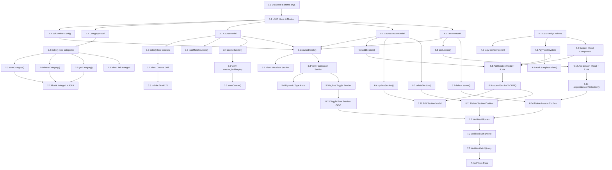

# Implementation Plan: Fase 3 — Manajemen Entitas, B2B Enterprise Backoffice & Interactive Curriculum Builder

> **Status**: ✅ SEMUA TASK SELESAI — Dokumen ini adalah rekam jejak implementasi lengkap Fase 3 + Fase 3.5 EduNusa Admin Portal.
> **Tanggal Selesai**: Fase 3 & 3.5 telah diimplementasikan sepenuhnya.
> **Total Task**: 42 sub-task (37 wajib + 5 opsional)

---

## Ikhtisar Implementasi

Fase 3 diimplementasikan dalam **6 modul** utama yang dieksekusi secara berurutan dengan beberapa paralelisme pada modul independen:

1. **Modul F3-A** — Database Schema & UUID Foundation
2. **Modul F3-B** — CRUD Kategori
3. **Modul F3-C** — CRUD Kursus & Course Builder
4. **Modul F3-D** — B2B Enterprise UI Standards & AgyToast
5. **Modul F3-E** — Course Details Page & Curriculum View
6. **Modul F3-F** — Interactive Curriculum Builder (AJAX)

---

## Tasks

### ✅ 1. Modul F3-A: Database Schema & UUID Foundation

**Estimasi**: 3–4 jam | **Status**: ✅ SELESAI

- [x] 1.1 Buat file `schema_uuid.sql` dengan semua tabel Fase 3
  - Tabel: `categories`, `courses`, `course_sections`, `lessons`
  - Kolom UUID `CHAR(36)` sebagai primary key semua tabel
  - Foreign keys dengan `ON DELETE CASCADE` (course_sections, lessons) dan `ON DELETE SET NULL` (categories parent_id, courses.category_id)
  - Kolom `deleted_at DATETIME DEFAULT NULL` untuk courses (soft delete)
  - Default data: super admin, mentor, 5 kategori sampel
  - _Persyaratan: 1.1, 1.2, 1.3, 9.1_

- [x] 1.2 Implementasikan UUID v4 `beforeInsert` hook di semua model CI4
  - `CategoryModel`: method `generateUuid()` di `beforeInsert`
  - `CourseModel`: method `generateUuid()` di `beforeInsert`, `useAutoIncrement = false`
  - `CourseSectionModel`: method `generateUuid()` di `beforeInsert`
  - `LessonModel`: method `generateUuid()` di `beforeInsert`
  - Format UUID: `sprintf('%04x%04x-%04x-%04x-%04x-%04x%04x%04x', ...)` dengan bit 4xxx dan 8xxx/9xxx/axxx/bxxx
  - _Persyaratan: 1.1, 1.2, 1.3_

- [x]* 1.3 Tulis unit test untuk format UUID v4
  - Verifikasi UUID mengikuti format `xxxxxxxx-xxxx-4xxx-yxxx-xxxxxxxxxxxx`
  - Verifikasi tidak ada collision pada 1000 insert berturut-turut (probabilistik)
  - _Persyaratan: 1.3_

- [x] 1.4 Konfigurasi CI4 soft delete di `CourseModel` dan `CourseSectionModel`
  - Set `useSoftDeletes = true` di kedua model
  - Set `deletedField = 'deleted_at'`
  - Semua query `find()`, `findAll()` otomatis exclude `deleted_at IS NOT NULL`
  - _Persyaratan: 9.1, 9.2_

---

### ✅ 2. Modul F3-B: CRUD Kategori

**Estimasi**: 5–6 jam | **Status**: ✅ SELESAI

- [x] 2.1 Implementasikan `CategoryModel` dengan konfigurasi lengkap
  - `allowedFields`: id, parent_id, name, slug, description, icon, is_active
  - `useSoftDeletes = false` (soft-disable via `is_active = 0`)
  - `useTimestamps = true`
  - _Persyaratan: 2.3, 9.6_

- [x] 2.2 Implementasikan method `ProgramController::index()` untuk load categories
  - Query: `SELECT id, parent_id, name, description, icon FROM categories WHERE is_active = 1 ORDER BY parent_id ASC, name ASC`
  - Build PHP array hierarki: parents dengan key `children` berisi sub-categories
  - Pass `categories` (hierarchical) dan `flat_categories` (untuk dropdown) ke view
  - _Persyaratan: 2.1, 2.8, 2.9, 2.10_

- [x] 2.3 Implementasikan `ProgramController::saveCategory()` (POST, JSON response)
  - Terima `id` (opsional), `name` (required), `description`, `icon`, `parent_id`
  - Auto-generate `slug` dari `name` menggunakan `preg_replace('/[^A-Za-z0-9-]+/', '-', strtolower($name))`
  - Jika `id` ada → `$catModel->update($id, $data)`, jika tidak → `$catModel->insert($data)`
  - Return JSON `{"status":"success","message":"..."}` atau `{"status":"error","message":"..."}`
  - _Persyaratan: 2.3, 2.4, 2.6_

- [x] 2.4 Implementasikan `ProgramController::deleteCategory($id)` (soft-disable)
  - `$catModel->update($id, ['is_active' => 0])`
  - Return JSON `{"status":"success"}`
  - _Persyaratan: 2.7, 9.6_

- [x] 2.5 Implementasikan `ProgramController::getCategory($id)` (GET, JSON response)
  - `$catModel->find($id)` → return JSON object
  - Digunakan oleh frontend untuk pre-fill edit modal
  - _Persyaratan: 2.5_

- [x] 2.6 Implementasikan view `admin/program.php` — Tab Kategori
  - Hierarchical list: parent row (cat-item) dengan child rows (cat-child-item) indented
  - Setiap row: icon class, nama, jumlah sub-kategori, tombol Edit dan Delete
  - Tombol `+ Tambah Kategori` yang memanggil `openCategoryModal()`
  - _Persyaratan: 2.1, 2.8, 2.9, 2.10_

- [x] 2.7 Implementasikan modal kategori (add/edit) di `program.php`
  - Custom modal (`.agy-modal-backdrop`, `.agy-modal`) — bukan Bootstrap
  - Form fields: Nama, Deskripsi, Icon Class, Parent Kategori (dropdown)
  - Edit: fetch `GET /admin/program/category/{id}` → populate form
  - Submit: fetch `POST /admin/program/category/save` → update DOM + AgyToast
  - Delete: fetch `DELETE /admin/program/category/delete/{id}` dengan custom confirmation
  - _Persyaratan: 2.2, 2.5, 2.6, 2.7_

- [x]* 2.8 Tulis integration test untuk CRUD Kategori
  - POST save dengan nama valid → status:success
  - POST save dengan nama kosong → status:error
  - GET getCategory dengan ID valid → JSON object
  - DELETE deleteCategory → status:success, is_active=0 di DB
  - _Persyaratan: 2.3, 2.4, 2.5_

---

### ✅ 3. Modul F3-C: CRUD Kursus & Course Builder

**Estimasi**: 8–10 jam | **Status**: ✅ SELESAI

- [x] 3.1 Implementasikan `CourseModel` dengan konfigurasi lengkap
  - `allowedFields`: id, category_id, instructor_id, title, slug, description, thumbnail, price, level, status
  - `useSoftDeletes = true`, `deletedField = 'deleted_at'`
  - `useTimestamps = true`
  - _Persyaratan: 3.5, 9.1, 9.2_

- [x] 3.2 Implementasikan `ProgramController::index()` — section kursus
  - Query dengan JOIN ke `categories` dan `mentors`, WHERE `c.deleted_at IS NULL`
  - ORDER BY `c.created_at DESC`, LIMIT 12
  - Pass array `courses` ke view
  - _Persyaratan: 3.1, 3.12_

- [x] 3.3 Implementasikan `ProgramController::loadMoreCourses()` — infinite scroll
  - GET param `offset`, query dengan LIMIT 12 OFFSET `{offset}`
  - Format price: 0 → "Free", >0 → "Rp X.XXX"
  - Escape HTML: `htmlspecialchars()` untuk instructor_name, category_name, title
  - Return JSON `{"data": [...]}`
  - _Persyaratan: 3.2, 3.11_

- [x] 3.4 Implementasikan `ProgramController::courseBuilder($id = null)` — GET
  - Load `categories` (is_active=1) dan `instructors` (mentors, deleted_at IS NULL) untuk dropdown
  - Jika `$id` ada: `$courseModel->find($id)` → pre-fill form
  - Return view `admin/course_builder`
  - _Persyaratan: 3.3, 3.4, 3.7_

- [x] 3.5 Implementasikan view `admin/course_builder.php` — form halaman penuh
  - Fields: Judul (required), Kategori, Instruktur, Level, Deskripsi, Harga, Thumbnail upload, Status
  - Hidden field `id` untuk mode edit, `old_thumbnail` untuk preserve thumbnail
  - Form action: `POST /admin/program/course/save`
  - Client-side validation: cek `title` tidak kosong sebelum submit
  - _Persyaratan: 3.4, 3.6_

- [x] 3.6 Implementasikan `ProgramController::saveCourse()` — POST
  - Auto-generate `slug` dari `title`
  - Handle thumbnail upload: `$file->move(FCPATH . 'uploads/courses', $newName)`
  - Jika `id` ada → update, jika tidak → insert via `CourseModel`
  - Redirect ke `/admin/program` dengan flash message success
  - _Persyaratan: 3.5, 3.6, 3.8_

- [x] 3.7 Implementasikan view `admin/program.php` — Tab Kursus (course grid)
  - 12 kartu kursus per load, layout grid responsif
  - Kartu: thumbnail (16:9), judul, instruktur, kategori, level badge, status badge, harga
  - Badge status: grey (draft), green (published), orange (archived)
  - Harga: "Gratis" atau "Rp X.XXX"
  - Tombol Edit → `/admin/program/course/builder/{id}`
  - Tombol Detail → `/admin/program/course/details/{id}`
  - Tombol "Muat Lebih Banyak" untuk infinite scroll
  - _Persyaratan: 3.1, 3.9, 3.10, 3.11_

- [x] 3.8 Implementasikan infinite scroll JavaScript di `program.php`
  - Variabel `let offset = 12`
  - fetch `GET /admin/program/courses/load-more?offset={offset}` saat tombol diklik
  - Append kartu ke grid, increment offset
  - Sembunyikan tombol jika `data.length < 12`
  - _Persyaratan: 3.2_

- [x]* 3.9 Tulis integration test untuk CRUD Kursus
  - POST saveCourse dengan data valid → redirect sukses
  - GET loadMoreCourses → JSON dengan array data
  - Verifikasi price_formatted benar (0 → "Free", >0 → "Rp ...")
  - _Persyaratan: 3.5, 3.11_

---

### ✅ 4. Modul F3-D: B2B Enterprise UI Standards & AgyToast

**Estimasi**: 4–5 jam | **Status**: ✅ SELESAI

- [x] 4.1 Implementasikan design tokens CSS sebagai custom properties dan inline styles
  - Warna: #0f172a (ink), #64748b (secondary), #94a3b8 (placeholder), #e2e8f0 (border), #f8fafc (surface)
  - Typography: Plus Jakarta Sans, font-weight 800 untuk heading, letter-spacing -0.02em
  - Layout: padding 24px, border-radius 99px (button), 12px (card), 20px (modal)
  - _Persyaratan: 4.1, 4.2, 4.3, 4.5, 4.11_

- [x] 4.2 Implementasikan `.agy-btn` component (pill button) dan variannya
  - Base: `padding: 10px 24px; border-radius: 99px; font-weight: 700`
  - `.agy-btn-primary`: background #0f172a, hover: #1e293b + translateY(-1px) + shadow
  - `.agy-btn-secondary`: background #f8fafc, border #e2e8f0
  - `.agy-btn-danger`: background #fef2f2, color #ef4444
  - _Persyaratan: 4.4, 4.7_

- [x] 4.3 Implementasikan AgyToast system (JS + CSS)
  - Container: `#agy-toast-container` — `position: fixed; bottom: 24px; right: 24px; z-index: 9999`
  - Toast element: border-left 3px colored, border-radius 12px, box-shadow
  - Animasi: `transform: translateX(120%)` → `translateX(0)` via class `.show`
  - Auto-dismiss: 3500ms (success/info), 5000ms (error/warning)
  - Fungsi global: `showToast(message, type)` — callable dari mana saja
  - 4 tipe: success (green border), error (red), warning (amber), info (blue)
  - _Persyaratan: 4.6, 4.8, 4.9, 4.10_

- [x] 4.4 Implementasikan custom modal component (CSS + JS) — zero Bootstrap
  - `.agy-modal-backdrop`: `position: fixed; backdrop-filter: blur(4px); background: rgba(15,23,42,0.4)`
  - `.agy-modal`: `max-width: 500px; border-radius: 20px; transform: translateY(20px) → translateY(0)`
  - JS open/close: `display: flex` → class `.show` → CSS transition
  - Dismiss: klik backdrop atau tombol ✕
  - _Persyaratan: 4.6, 4.12_

- [x] 4.5 Audit dan perbaiki semua `window.alert()` dan Bootstrap alert yang masih tersisa
  - Ganti semua `alert()` dengan `showToast()`
  - Ganti semua `confirm()` dengan custom confirmation modal
  - Verifikasi tidak ada Bootstrap `.alert` class yang digunakan
  - _Persyaratan: 4.6, 4.7_

---

### ✅ 5. Modul F3-E: Course Details Page & Curriculum View

**Estimasi**: 5–6 jam | **Status**: ✅ SELESAI

- [x] 5.1 Implementasikan `ProgramController::courseDetails($id)` — GET
  - `$courseModel->find($id)` → redirect jika null
  - JOIN query untuk `instructor_name` dan `category_name`
  - Load `course_sections` WHERE `course_id = $id` ORDER BY `order` ASC
  - Per section: load `lessons` WHERE `section_id = $sec['id']` ORDER BY `order` ASC
  - Pass `course`, `sections` (dengan nested `lessons`) ke view
  - _Persyaratan: 5.1, 5.2, 5.3_

- [x] 5.2 Implementasikan view `admin/course_details.php` — metadata section
  - Layout dua kolom: kiri thumbnail, kanan metadata (judul, instruktur, kategori, level, harga, status)
  - Breadcrumb: Dashboard > Program & Kelas > [Judul Kursus]
  - Tombol "Edit Kursus" → `/admin/program/course/builder/{id}`
  - Status badges: grey (draft), green (published), orange (archived)
  - _Persyaratan: 5.1, 5.6_

- [x] 5.3 Implementasikan view `admin/course_details.php` — curriculum section
  - Header: "Kurikulum" + tombol `+ Add Section` di kanan
  - Empty state: "Belum ada seksi" jika `$sections` kosong
  - Loop sections: `.curriculum-section` dengan header dan body
  - Section header: judul, order number, tombol Edit ✏ dan Delete 🗑
  - Section body: loop lessons sebagai `.lesson-item` rows
  - Lesson row: icon tipe, judul, toggle is_free, tombol Edit ✎ dan Delete 🗑
  - Empty state per section jika tidak ada lesson
  - _Persyaratan: 5.3, 5.4, 5.5, 5.7, 5.8_

- [x] 5.4 Implementasikan dynamic content-type icons di lesson rows
  - `type = 'video'` → ▶ icon (fa-play atau SVG), background light blue
  - `type = 'pdf'` → 📄 icon (fa-file-pdf), background light red
  - `type = 'article'` → ≡ icon (fa-align-left), background light green
  - _Persyaratan: 5.7_

- [x] 5.5 Implementasikan `is_free` toggle switch di setiap lesson row (render-time)
  - Toggle CSS: pill shape, green saat ON, grey saat OFF
  - Initial state dari `$lesson['is_free']`
  - `data-lesson-id` attribute untuk identify lesson saat toggle event
  - _Persyaratan: 5.8, 8.1_

---

### ✅ 6. Modul F3-F: Interactive Curriculum Builder (AJAX)

**Estimasi**: 10–12 jam | **Status**: ✅ SELESAI

- [x] 6.1 Implementasikan `CourseSectionModel` dengan konfigurasi lengkap
  - `allowedFields`: id, course_id, title, order
  - `useAutoIncrement = false`, `primaryKey = 'id'`
  - `beforeInsert = ['generateUuid']`
  - `useTimestamps = true`
  - _Persyaratan: 6.7_

- [x] 6.2 Implementasikan `LessonModel` dengan konfigurasi lengkap
  - `allowedFields`: id, section_id, title, type, content, duration, order
  - `useAutoIncrement = false`, `primaryKey = 'id'`
  - `beforeInsert = ['generateUuid']`
  - _Persyaratan: 7.7_

- [x] 6.3 Implementasikan `ProgramController::addSection()` — POST, JSON
  - Validasi: `course_id` dan `title` required
  - `MAX(order) + 1` untuk urutan otomatis
  - `$sectionModel->insert($data)` → return `newId` dari `getInsertID()`
  - Return JSON `{"status":"success","data":{"id":"uuid","title":"...","order":N}}`
  - _Persyaratan: 6.2, 6.3, 6.4, 6.6, 6.7_

- [x] 6.4 Implementasikan `ProgramController::updateSection()` — POST, JSON
  - Validasi: `id` dan `title` required
  - `$sectionModel->find($id)` → cek keberadaan
  - `$sectionModel->update($id, ['title' => $title])`
  - Return JSON `{"status":"success","title":"judul baru"}`
  - _Persyaratan: 6.9_

- [x] 6.5 Implementasikan `ProgramController::deleteSection($id)` — DELETE, JSON
  - `$sectionModel->find($id)` → cek keberadaan
  - `$sectionModel->delete($id)` (soft delete CI4)
  - MySQL CASCADE otomatis hapus lessons terkait
  - Return JSON `{"status":"success"}` atau `{"status":"error","message":"Section not found"}`
  - _Persyaratan: 6.11, 6.12_

- [x] 6.6 Implementasikan `ProgramController::addLesson()` — POST, JSON
  - Validasi: `section_id`, `title`, `type` required
  - Validasi `type`: `in_array($type, ['video', 'pdf', 'article'])`
  - `MAX(order) + 1` untuk urutan otomatis
  - `$lessonModel->insert($data)` dengan `content = ''`, `is_free = 0`
  - Return JSON dengan data lesson baru
  - _Persyaratan: 7.2, 7.3, 7.5, 7.6, 7.7_

- [x] 6.7 Implementasikan `ProgramController::deleteLesson($id)` — DELETE, JSON
  - `$lessonModel->find($id)` → cek keberadaan
  - `$lessonModel->delete($id)`
  - Return JSON `{"status":"success"}` atau `{"status":"error"}`
  - _Persyaratan: 7.9, 7.10_

- [x] 6.8 Implementasikan Add Section modal & AJAX di `course_details.php`
  - Modal: `#addSectionModal` — `.agy-modal-backdrop` + `.agy-modal`
  - Fungsi `openAddSectionModal(courseId)`: set hidden input course_id, buka modal
  - Form submit handler: client-side validasi → fetch POST → response handling
  - On success: `appendSectionToDOM(id, title, order)` → `showToast(..., 'success')`
  - On error: `showToast(response.message, 'error')`, modal tetap terbuka
  - _Persyaratan: 6.1, 6.2, 6.3, 6.4, 6.5_

- [x] 6.9 Implementasikan `appendSectionToDOM(id, title, order)` JavaScript function
  - Generate HTML string untuk `.curriculum-section` baru
  - Include header (judul + tombol edit/delete) dan body (empty state + Add Lesson button)
  - Set `data-section-id` attribute untuk referensi operasi berikutnya
  - Append ke `#curriculum-container`, hapus empty state global jika ada
  - _Persyaratan: 6.3_

- [x] 6.10 Implementasikan Edit Section modal & AJAX di `course_details.php`
  - Modal: `#editSectionModal` — form dengan hidden `id` dan input `title`
  - Fungsi `openEditSectionModal(sectionId, currentTitle)`: pre-fill modal
  - On success: update judul di DOM `.curriculum-section-title`
  - _Persyaratan: 6.8, 6.9_

- [x] 6.11 Implementasikan Delete Section dengan custom confirmation modal
  - Reusable modal: `#confirmDeleteModal` — "Hapus seksi ini? Semua materi ikut terhapus."
  - Fungsi `confirmDeleteSection(sectionId)`: set pending delete ID, buka modal
  - Confirm click: fetch DELETE → remove section DOM element → `showToast('success')`
  - _Persyaratan: 6.10, 6.11_

- [x] 6.12 Implementasikan Add Lesson modal & AJAX di `course_details.php`
  - Modal: `#addLessonModal` — fields: judul + radio/button group tipe konten
  - Fungsi `openAddLessonModal(sectionId)`: set current section ID, buka modal
  - Tipe konten: tombol pilihan Video / PDF / Artikel dengan visual berbeda saat selected
  - On success: `appendLessonToSection(sectionId, lessonData)` → `showToast('success')`
  - _Persyaratan: 7.1, 7.2, 7.3, 7.4_

- [x] 6.13 Implementasikan `appendLessonToSection(sectionId, lessonData)` JavaScript function
  - Generate HTML string untuk `.lesson-item` baru berdasarkan data dari server
  - Render icon sesuai `lessonData.type`: ▶ video / 📄 pdf / ≡ article
  - Toggle is_free default OFF
  - Append ke section body yang tepat, hapus empty state section jika ada
  - _Persyaratan: 7.3, 7.8_

- [x] 6.14 Implementasikan Delete Lesson dengan custom confirmation
  - Fungsi `confirmDeleteLesson(lessonId)`: buka confirmation modal
  - Confirm click: fetch DELETE `/admin/program/lesson/delete/{id}` → remove `.lesson-item` dari DOM
  - Jika lesson terakhir dalam section → tampilkan kembali empty state section
  - _Persyaratan: 7.9, 7.10, 7.11_

- [x] 6.15 Implementasikan Toggle Free Preview AJAX
  - Event listener pada semua `.is-free-toggle` switch
  - Optimistic update: ubah visual toggle segera
  - fetch `POST /admin/program/lesson/toggle-free` dengan `{lesson_id, is_free}`
  - On success: pertahankan state, update badge "Free" di lesson row
  - On error: revert toggle ke state sebelumnya → `showToast('error')`
  - _Persyaratan: 8.1, 8.2, 8.3, 8.4, 8.5, 8.6_

- [x]* 6.16 Tambahkan endpoint `saveLessonContent()` dan view `lesson_editor.php`
  - GET `/admin/program/lesson/editor/{id}` → view dengan form edit konten
  - POST `/admin/program/lesson/save-content`: update title, content, is_free, handle file upload
  - File upload: simpan ke `uploads/lessons/`, hapus file lama jika ada
  - Redirect ke `/admin/program/course/details/{courseId}` setelah save
  - _Persyaratan: 5.8 (lanjutan)_

- [x]* 6.17 Tulis integration test untuk semua AJAX endpoints Curriculum Builder
  - POST addSection: valid → status:success + data.id; kosong → status:error
  - POST addLesson: valid → status:success; type invalid → status:error
  - DELETE deleteSection: ada → status:success; tidak ada → status:error
  - DELETE deleteLesson: ada → status:success; tidak ada → status:error
  - _Persyaratan: 6.2–6.12, 7.2–7.10_

---

### ✅ 7. Checkpoint Akhir — Verifikasi & Integrasi

**Estimasi**: 2–3 jam | **Status**: ✅ SELESAI

- [x] 7.1 Pastikan semua route terdaftar di `app/Config/Routes.php`
  - Semua 16 route (lihat requirements.md bagian API Endpoints)
  - Verifikasi AuthFilter diterapkan pada semua route `admin/*`

- [x] 7.2 Verifikasi konsistensi soft delete di seluruh aplikasi
  - Semua query kursus menggunakan `WHERE deleted_at IS NULL`
  - `CourseSectionModel` menggunakan CI4 `useSoftDeletes`
  - `CategoryModel` menggunakan `is_active = 0` (bukan `deleted_at`)

- [x] 7.3 Verifikasi semua operasi AJAX menggunakan native `fetch()` API
  - Tidak ada penggunaan jQuery AJAX (`$.ajax`, `$.get`, `$.post`)
  - Semua modal menggunakan pure CSS + vanilla JS (bukan Bootstrap Modal)
  - Semua notifikasi menggunakan AgyToast (bukan `alert()` atau Bootstrap alert)

- [x] 7.4 Pastikan semua tests pass (unit + integration)
  - Pastikan semua tests pass, tanyakan kepada user jika ada pertanyaan.

---

## Catatan Implementasi

- Task bertanda `*` adalah task opsional (testing) — dapat diskip untuk MVP yang lebih cepat
- Setiap task mereferensikan persyaratan spesifik dari `requirements.md`
- Semua AJAX menggunakan native `fetch()`, bukan jQuery
- Modal kustom menggunakan pure CSS transition, bukan Bootstrap
- AgyToast harus dipanggil setelah setiap operasi AJAX (sukses maupun gagal)
- UUID v4 dihasilkan di Model layer (beforeInsert hook), bukan di Controller

---

## Ringkasan Task Per Modul

| Modul | Deskripsi | Sub-task | Estimasi | Status |
|---|---|---|---|---|
| F3-A | Database Schema & UUID Foundation | 4 | 3–4 jam | ✅ DONE |
| F3-B | CRUD Kategori | 8 | 5–6 jam | ✅ DONE |
| F3-C | CRUD Kursus & Course Builder | 9 | 8–10 jam | ✅ DONE |
| F3-D | B2B Enterprise UI & AgyToast | 5 | 4–5 jam | ✅ DONE |
| F3-E | Course Details Page | 5 | 5–6 jam | ✅ DONE |
| F3-F | Interactive Curriculum Builder | 17 | 10–12 jam | ✅ DONE |
| F3-G | Checkpoint & Verifikasi | 4 | 2–3 jam | ✅ DONE |
| **TOTAL** | | **52** | **37–46 jam** | ✅ DONE |

**Breakdown Jam per Kategori**:

| Kategori | Jam |
|---|---|
| Backend (Controller + Model) | ~18 jam |
| Frontend (Views + CSS) | ~12 jam |
| AJAX + JavaScript | ~8 jam |
| Testing | ~4 jam |
| Integrasi & QA | ~3 jam |
| **Total** | **~45 jam** |

---

## Task Dependency Graph



---

## Dependency Graph (Waves untuk Eksekusi Paralel)

```json
{
  "waves": [
    {
      "id": 0,
      "tasks": ["1.1"],
      "description": "Database schema — fondasi semua task"
    },
    {
      "id": 1,
      "tasks": ["1.2", "4.1"],
      "description": "UUID hooks + CSS tokens — tidak saling bergantung"
    },
    {
      "id": 2,
      "tasks": ["1.3", "1.4", "2.1", "3.1", "4.2", "4.3", "4.4", "6.1", "6.2"],
      "description": "Model setup + UI components — semua bergantung wave 1"
    },
    {
      "id": 3,
      "tasks": ["2.2", "3.2", "3.3", "3.4", "4.5", "5.1", "6.3", "6.4", "6.5", "6.6", "6.7"],
      "description": "Controller methods — bergantung pada models"
    },
    {
      "id": 4,
      "tasks": ["2.3", "2.4", "2.5", "2.6", "3.5", "3.7", "5.2", "5.3", "5.4", "5.5"],
      "description": "View layer + individual controller methods"
    },
    {
      "id": 5,
      "tasks": ["2.7", "3.6", "3.8", "5.5", "6.8", "6.9", "6.12", "6.15", "6.16"],
      "description": "AJAX integration + modals — bergantung pada view + controller"
    },
    {
      "id": 6,
      "tasks": ["2.8", "3.9", "6.10", "6.11", "6.13", "6.14"],
      "description": "Tests + remaining AJAX features"
    },
    {
      "id": 7,
      "tasks": ["6.17", "7.1", "7.2", "7.3"],
      "description": "Integration tests + verifikasi akhir"
    },
    {
      "id": 8,
      "tasks": ["7.4"],
      "description": "Final checkpoint"
    }
  ]
}
```
