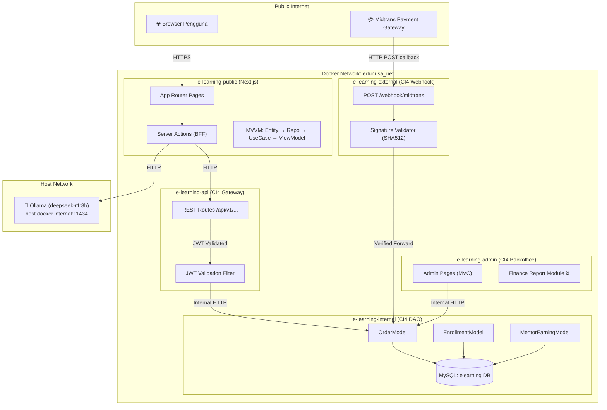
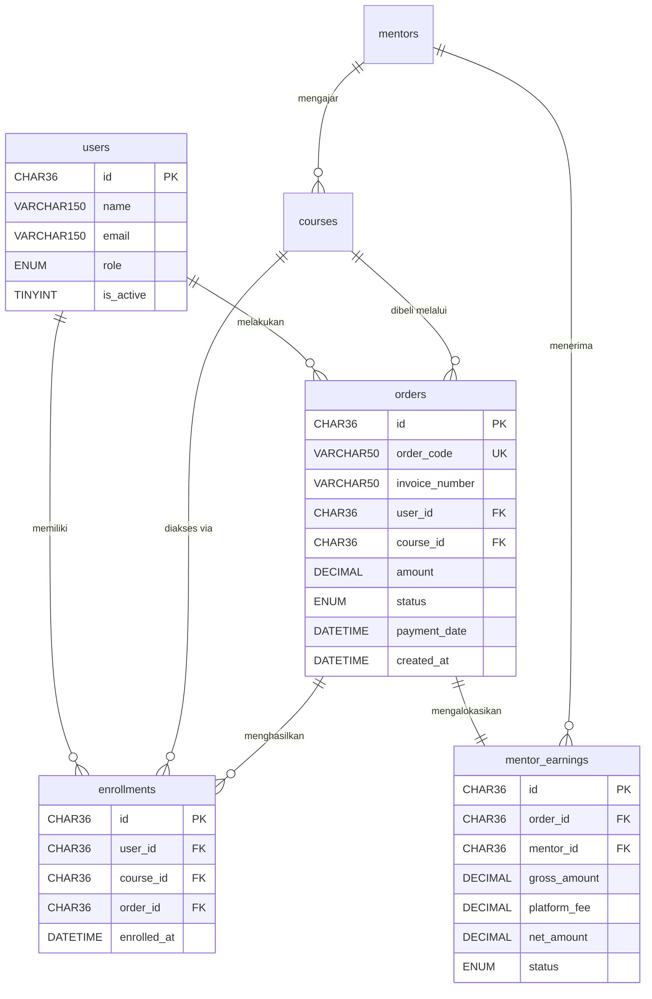
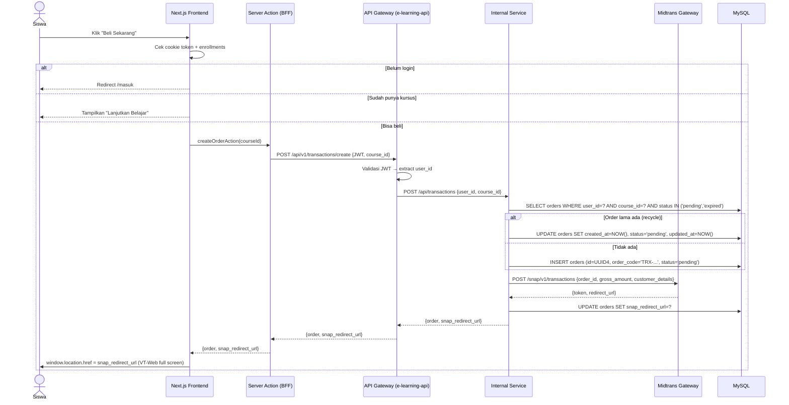
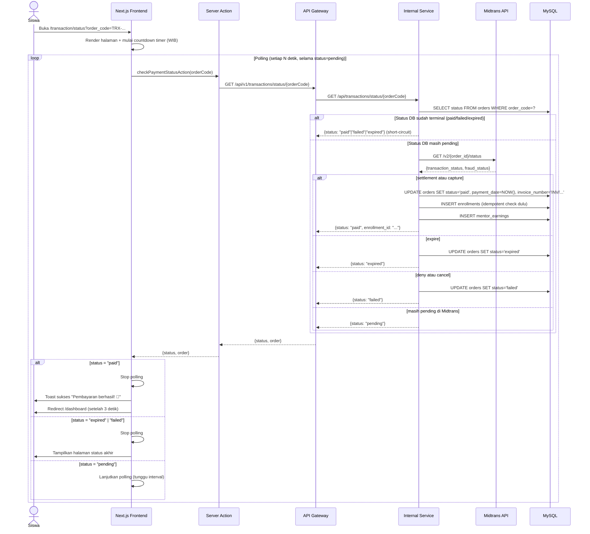
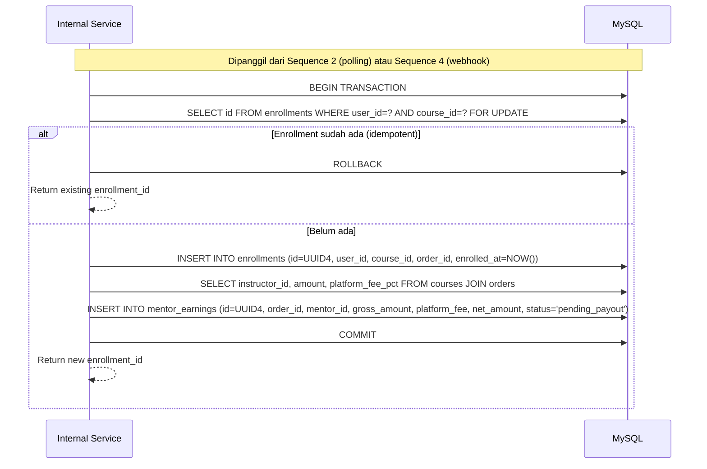
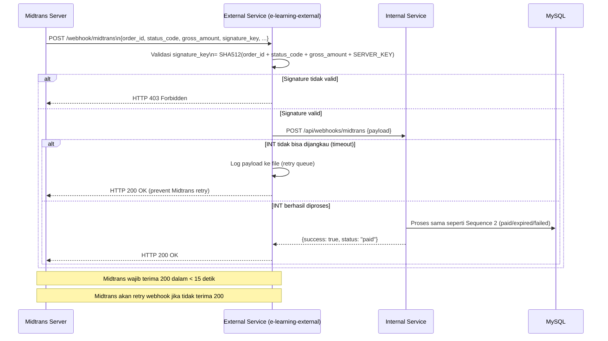
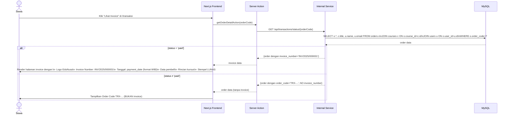
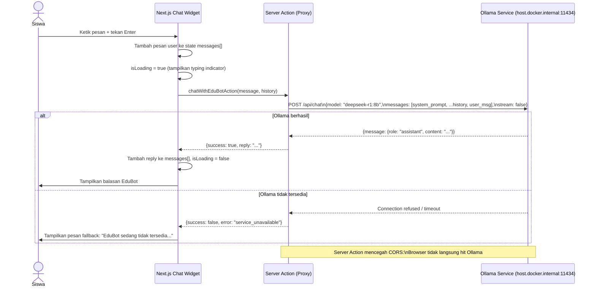
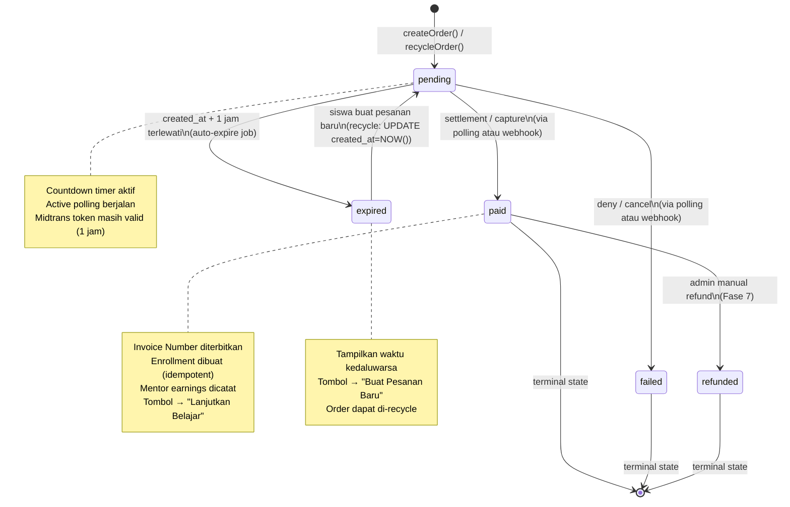

# Dokumen Desain — Fase 4: Sistem Enrollment, Pembayaran Midtrans & Dashboard Siswa

> **Status Fase**: Sebagian besar selesai. Dokumen ini adalah arsitektur definitif dan panduan untuk item pending.

---

## Overview

Fase 4 mengimplementasikan ekosistem transaksi lengkap pada platform EduNusa. Arsitektur dirancang dengan **multi-tier microservices** di mana setiap layanan memiliki tanggung jawab yang terisolasi:

- **Next.js** (`e-learning-public`): UI/UX, MVVM, Server Actions sebagai BFF (Backend for Frontend)
- **CodeIgniter 4 API Gateway** (`e-learning-api`): Validasi JWT, routing, sanitasi
- **CodeIgniter 4 Internal** (`e-learning-internal`): Satu-satunya lapisan DAO yang menyentuh MySQL
- **CodeIgniter 4 External** (`e-learning-external`): Penerima webhook dari Midtrans (akses publik)
- **CodeIgniter 4 Admin** (`e-learning-admin`): Backoffice Finance & Superadmin
- **Midtrans Gateway**: Pemrosesan pembayaran eksternal
- **Ollama Service**: Model AI lokal untuk EduBot

---

## Architecture

### Diagram Topologi Layanan



### Prinsip Arsitektur

| Prinsip | Implementasi |
|---|---|
| **Single Source of Truth** | Hanya `e-learning-internal` yang membaca/menulis DB |
| **Zero Direct DB Access** | `e-learning-public`, `e-learning-api`, `e-learning-external`, `e-learning-admin` TIDAK boleh konek langsung ke MySQL |
| **JWT Stateless Auth** | Token di HTTP-Only Cookie; API Gateway memvalidasi setiap request |
| **MVVM Clean Architecture** | Semua logika frontend: Entity → Repository → UseCase → ViewModel |
| **Idempotent Operations** | Auto-Enrollment dan Webhook processing harus aman dieksekusi berulang |
| **VT-Web Redirect Only** | Pembayaran selalu full-screen redirect, TIDAK pernah iframe/popup |

---

## Components and Interfaces

### Frontend MVVM Layers (Next.js)

#### Entity Layer (`src/core/entities/`)

```typescript
// Order Entity
interface Order {
  id: string;                    // UUID v4
  orderCode: string;             // TRX-{TIMESTAMP}-{RANDOM}
  invoiceNumber?: string;        // INV/{YEAR}/{SEQ} — hanya jika paid
  userId: string;
  courseId: string;
  courseName: string;
  courseThumbnail?: string;
  amount: number;
  status: OrderStatus;           // 'pending' | 'paid' | 'failed' | 'expired' | 'refunded'
  paymentMethod?: string;
  snapRedirectUrl?: string;
  createdAt: string;             // ISO 8601 UTC, di-parse dengan suffix Z
  paymentDate?: string;
  expiresAt: string;             // createdAt + 1 jam
}

// Enrollment Entity
interface Enrollment {
  id: string;                    // UUID v4
  userId: string;
  courseId: string;
  orderId: string;
  enrolledAt: string;
  course?: Course;               // Joined data
}

// Chat Entity (EduBot)
interface ChatMessage {
  id: string;
  role: 'user' | 'assistant' | 'system';
  content: string;
  timestamp: Date;
}
```

#### Repository Interfaces (`src/core/repositories/`)

```typescript
interface ITransactionRepository {
  createOrder(userId: string, courseId: string): Promise<{ order: Order; snapUrl: string }>;
  getOrderStatus(orderCode: string): Promise<Order>;
  getUserOrders(userId: string): Promise<Order[]>;
  checkAndUpdatePaymentStatus(orderCode: string): Promise<Order>;
}

interface IEnrollmentRepository {
  getUserEnrollments(userId: string): Promise<Enrollment[]>;
  isEnrolled(userId: string, courseId: string): Promise<boolean>;
}

interface IChatRepository {
  sendMessage(message: string, history: ChatMessage[]): Promise<string>;
}
```

#### Use Cases (`src/core/usecases/`)

```typescript
// Checkout flow
class CreateOrderUseCase {
  execute(userId: string, courseId: string): Promise<{ snapUrl: string; order: Order }>
}

// Polling engine
class CheckPaymentStatusUseCase {
  execute(orderCode: string): Promise<Order>
}

// Lifetime access check
class GetUserEnrollmentsUseCase {
  execute(userId: string): Promise<Enrollment[]>
}

// EduBot
class ChatWithEduBotUseCase {
  execute(message: string, history: ChatMessage[]): Promise<string>
}
```

#### ViewModel Layer (`src/viewmodels/`)

```typescript
// Checkout page state
interface CheckoutViewModel {
  course: Course | null;
  order: Order | null;
  isLoading: boolean;
  error: string | null;
  isOwned: boolean;
  createOrder: () => Promise<void>;
}

// Transaction status page state
interface TransactionStatusViewModel {
  order: Order | null;
  isLoading: boolean;
  pollingActive: boolean;
  countdown: string;            // "HH:MM:SS"
  startPolling: () => void;
  stopPolling: () => void;
}

// Transaction history page state
interface TransactionHistoryViewModel {
  orders: Order[];
  filteredOrders: Order[];
  isLoading: boolean;
  activeFilter: OrderStatus | 'all';
  setFilter: (status: OrderStatus | 'all') => void;
}

// EduBot widget state
interface EduBotViewModel {
  messages: ChatMessage[];
  isOpen: boolean;
  isLoading: boolean;
  inputValue: string;
  toggleOpen: () => void;
  sendMessage: (content: string) => Promise<void>;
}
```

### Backend API Endpoints

#### `e-learning-api` (API Gateway)

| Method | Path | Auth | Deskripsi |
|---|---|---|---|
| `POST` | `/api/v1/transactions/create` | JWT | Buat order baru |
| `GET` | `/api/v1/transactions/status/{order_code}` | Public | Cek status order |
| `GET` | `/api/v1/transactions/enrollments/{user_id}` | JWT | Daftar enrollment user |
| `GET` | `/api/v1/transactions/user` | JWT | Riwayat order user |
| `POST` | `/api/v1/transactions/auto-expire` | Internal | Ekspirasi order |
| `POST` | `/api/v1/webhooks/midtrans` | Internal | Forward webhook |

#### `e-learning-external` (Webhook Receiver) ⏳

| Method | Path | Auth | Deskripsi |
|---|---|---|---|
| `POST` | `/webhook/midtrans` | None (Public) | Terima callback Midtrans |

#### `e-learning-internal` (DAO Layer)

| Method | Path | Deskripsi |
|---|---|---|
| `POST` | `/api/transactions` | Buat/recycle order + Midtrans token |
| `GET` | `/api/transactions/status/{order_code}` | Cek status (DB + Midtrans polling) |
| `GET` | `/api/transactions/user/{user_id}` | Riwayat order user |
| `GET` | `/api/transactions/enrollments/{user_id}` | Daftar enrollment |
| `POST` | `/api/transactions/auto-expire` | Trigger expire job |
| `POST` | `/api/webhooks/midtrans` | Proses webhook payload |

### Server Actions (Next.js BFF)

```typescript
// src/app/actions/transactionActions.ts

export async function createOrderAction(courseId: string): Promise<ActionResult<Order>>

export async function checkPaymentStatusAction(orderCode: string): Promise<ActionResult<Order>>

export async function getUserEnrollmentsAction(): Promise<ActionResult<Enrollment[]>>

export async function getUserOrdersAction(): Promise<ActionResult<Order[]>>

// src/app/actions/chatActions.ts

export async function chatWithEduBotAction(
  message: string, 
  history: ChatMessage[]
): Promise<ActionResult<string>>
```

---

## Data Models

### Tabel `orders`

```sql
CREATE TABLE orders (
    id            CHAR(36)        PRIMARY KEY,             -- UUID v4
    order_code    VARCHAR(50)     NOT NULL UNIQUE,         -- TRX-{TIMESTAMP}-{RANDOM}
    invoice_number VARCHAR(50)    DEFAULT NULL,            -- INV/{YEAR}/{SEQ}, NULL jika belum paid
    user_id       CHAR(36)        NOT NULL,
    course_id     CHAR(36)        NOT NULL,
    amount        DECIMAL(12, 2)  NOT NULL,
    status        ENUM(
                    'pending',
                    'paid',
                    'failed',
                    'expired',
                    'refunded'
                  )               DEFAULT 'pending',
    payment_method VARCHAR(50)    DEFAULT NULL,            -- 'bank_transfer', 'qris', 'credit_card'
    payment_channel VARCHAR(50)   DEFAULT NULL,            -- 'bca', 'mandiri', 'gopay', dsb.
    midtrans_transaction_id VARCHAR(100) DEFAULT NULL,
    snap_redirect_url TEXT        DEFAULT NULL,
    payment_date  DATETIME        DEFAULT NULL,            -- Diisi saat status → paid
    created_at    DATETIME        DEFAULT CURRENT_TIMESTAMP,
    updated_at    DATETIME        DEFAULT CURRENT_TIMESTAMP ON UPDATE CURRENT_TIMESTAMP,
    FOREIGN KEY (user_id)   REFERENCES users(id)   ON DELETE CASCADE,
    FOREIGN KEY (course_id) REFERENCES courses(id) ON DELETE CASCADE,
    INDEX idx_user_course (user_id, course_id),
    INDEX idx_status_created (status, created_at)
);
```

### Tabel `enrollments`

```sql
CREATE TABLE enrollments (
    id            CHAR(36)  PRIMARY KEY,                   -- UUID v4
    user_id       CHAR(36)  NOT NULL,
    course_id     CHAR(36)  NOT NULL,
    order_id      CHAR(36)  NOT NULL,
    enrolled_at   DATETIME  DEFAULT CURRENT_TIMESTAMP,
    UNIQUE KEY uq_user_course (user_id, course_id),       -- Enforce lifetime access: 1 enrollment per user per course
    FOREIGN KEY (user_id)   REFERENCES users(id)   ON DELETE CASCADE,
    FOREIGN KEY (course_id) REFERENCES courses(id) ON DELETE CASCADE,
    FOREIGN KEY (order_id)  REFERENCES orders(id)  ON DELETE CASCADE
);
```

### Tabel `mentor_earnings`

```sql
CREATE TABLE mentor_earnings (
    id            CHAR(36)        PRIMARY KEY,             -- UUID v4
    order_id      CHAR(36)        NOT NULL UNIQUE,        -- 1 earning per order
    mentor_id     CHAR(36)        NOT NULL,
    course_id     CHAR(36)        NOT NULL,
    gross_amount  DECIMAL(12, 2)  NOT NULL,               -- orders.amount
    platform_fee  DECIMAL(12, 2)  NOT NULL,               -- gross * platform_fee_pct
    net_amount    DECIMAL(12, 2)  NOT NULL,               -- gross - platform_fee
    status        ENUM('pending_payout', 'paid_out', 'on_hold') DEFAULT 'pending_payout',
    created_at    DATETIME        DEFAULT CURRENT_TIMESTAMP,
    FOREIGN KEY (order_id)  REFERENCES orders(id)   ON DELETE CASCADE,
    FOREIGN KEY (mentor_id) REFERENCES mentors(id)  ON DELETE CASCADE,
    FOREIGN KEY (course_id) REFERENCES courses(id)  ON DELETE CASCADE
);
```

### Invoice Number Sequence

Karena tidak ada tabel sequence terpisah, `invoice_number` dihasilkan oleh `Internal_Service` saat order diupdate ke `paid`:

```sql
-- Generate invoice number: INV/{YEAR}/{AUTO_SEQ}
SELECT CONCAT(
    'INV/', YEAR(NOW()), '/',
    LPAD(
        (SELECT COUNT(*) + 1 FROM orders WHERE status = 'paid' AND YEAR(payment_date) = YEAR(NOW())),
        6, '0'
    )
) AS invoice_number;
```

> **Catatan**: Implementasi produksi sebaiknya menggunakan tabel sequence tersendiri untuk atomic increment. Saat ini menggunakan COUNT+1 yang cukup untuk volume transaksi awal.

### Entity Relationship Diagram (Fase 4)



---

## Sequence Diagrams

### Sequence 1 — Checkout & Pembuatan Order



### Sequence 2 — Active Polling Engine



### Sequence 3 — Auto-Enrollment Chain



### Sequence 4 — Webhook Flow ⏳ (TO-DO)



### Sequence 5 — Invoice Generation



### Sequence 6 — EduBot AI Chatbot



---

## State Machine — Order Status Lifecycle



### Status Badge Mapping (UI)

| Status | Warna Badge | Label Tampil | Nomor Referensi |
|---|---|---|---|
| `pending` | 🟡 Kuning | "Menunggu Pembayaran" | Order Code `TRX-...` |
| `paid` | 🟢 Hijau | "Lunas" | Invoice Number `INV/...` |
| `failed` | 🔴 Merah | "Gagal" | Order Code `TRX-...` |
| `expired` | ⚫ Abu-abu | "Kedaluwarsa" | Order Code `TRX-...` |
| `refunded` | 🔵 Biru | "Dikembalikan" | Invoice Number `INV/...` |

---

## Correctness Properties

*A property is a characteristic or behavior that should hold true across all valid executions of a system — essentially, a formal statement about what the system should do. Properties serve as the bridge between human-readable specifications and machine-verifiable correctness guarantees.*

### Property 1: Lifetime Access — Enrollment Uniqueness Invariant

*For any* user ID and course ID pair, at any point in time, the `enrollments` table SHALL contain **at most one** record for that combination.

**Validates: Requirements 3.2, 4.5, 12.4**

---

### Property 2: Invoice Exclusivity — Paid-Only Invoice Numbers

*For any* order record, if and only if `orders.status = 'paid'`, the record SHALL have a non-null `invoice_number` following the format `INV/{YEAR}/{SEQUENCE}`. For all other status values (`pending`, `failed`, `expired`, `refunded`), `invoice_number` SHALL be null or not displayed to the user.

**Validates: Requirements 6.3, 6.4**

---

### Property 3: Auto-Enrollment Idempotency

*For any* `(user_id, course_id)` pair, triggering the Auto-Enrollment process N times (N ≥ 1) SHALL result in exactly ONE enrollment record — identical to running it once. Subsequent runs SHALL return the existing record without error and without creating duplicates.

**Validates: Requirements 3.2, 9.7, 12.4**

---

### Property 4: Countdown Timer Correctness

*For any* `created_at` timestamp from an order with status `pending`, the remaining payment time displayed SHALL equal `max(0, (created_at + 3_600_000ms) - now())`, displayed in `HH:MM:SS` format using WIB (UTC+7) timezone. When remaining time reaches zero, the display SHALL show `00:00:00` — never a negative value.

**Validates: Requirements 5.1, 5.4**

---

### Property 5: Polling Short-Circuit for Terminal Orders

*For any* order with status `paid`, `failed`, or `expired` already stored in the database, calling `checkPaymentStatus(orderCode)` SHALL return the stored status **without** making an external HTTP request to the Midtrans API.

**Validates: Requirements 2.7**

---

### Property 6: Webhook Signature Rejection

*For any* HTTP POST to the webhook endpoint, if the computed `SHA512(order_id + status_code + gross_amount + SERVER_KEY)` does NOT match the `signature_key` field in the payload, the endpoint SHALL return HTTP `403 Forbidden` and SHALL NOT modify any database records.

**Validates: Requirements 9.2, 12.3**

---

### Property 7: Button State Reflects Enrollment

*For any* authenticated user viewing any course, the purchase button state SHALL be "Lanjutkan Belajar" (disabled for purchasing) if and only if there exists an enrollment record for `(user.id, course.id)`. Otherwise, the button SHALL show "Beli Sekarang" (enabled for purchasing).

**Validates: Requirements 1.2, 4.1, 4.2**

---

### Property 8: Order Recycle Resets Countdown

*For any* order recycled from `pending` or `expired` state, the `created_at` field after recycling SHALL be within 1 second of the server's current time at the moment of recycling. This ensures the frontend countdown timer always reflects a fresh 1-hour window.

**Validates: Requirements 1.5, 5.5**

---

## Error Handling

### Error Codes & Responses

| Skenario | HTTP Status | Respons | Handling Frontend |
|---|---|---|---|
| User belum login saat checkout | `401 Unauthorized` | `{error: "unauthenticated"}` | Redirect ke `/masuk` |
| Kursus sudah dimiliki (lifetime) | `409 Conflict` | `{error: "already_enrolled"}` | Toast info + tombol "Lanjutkan Belajar" |
| Midtrans gagal buat transaksi | `502 Bad Gateway` | `{error: "payment_gateway_error"}` | Toast error + tombol "Coba Lagi" |
| Order tidak ditemukan | `404 Not Found` | `{error: "order_not_found"}` | Halaman 404 |
| Webhook signature invalid | `403 Forbidden` | `{error: "invalid_signature"}` | Log ke sistem, tidak ada respons ke user |
| Ollama tidak tersedia | `503 Service Unavailable` | `{error: "ai_unavailable"}` | Pesan fallback di chat widget |
| DB timeout / error | `500 Internal Server Error` | `{error: "internal_error"}` | Toast error generik |

### Strategi Retry

- **Polling**: Jika request `checkPaymentStatus` gagal (timeout/network), frontend mencatat error di console dan mencoba lagi pada interval berikutnya. Maksimal 3 consecutive failures sebelum menampilkan pesan "Koneksi bermasalah, coba refresh halaman."
- **Webhook**: Jika `Internal_Service` tidak dapat dijangkau saat menerima webhook, `External_Service` harus:
  1. Menyimpan payload ke antrian/log file
  2. Mengembalikan HTTP `200` ke Midtrans (mencegah retry dari Midtrans)
  3. Mengimplementasikan mekanisme retry periodik untuk memproses payload yang tersimpan

---

## Testing Strategy

### Pendekatan Pengujian

Fase 4 menggunakan pendekatan **dual testing**: unit tests untuk skenario konkret + property-based tests untuk validasi kebenaran universal pada logika bisnis kritikal.

### Property-Based Testing

Library yang direkomendasikan:
- **TypeScript (Frontend)**: `fast-check`
- **PHP (Backend)**: `eris` (PHP property-based testing)

Setiap property dalam dokumen ini harus diimplementasikan sebagai **satu property-based test** dengan minimum 100 iterasi.

```typescript
// Contoh: Property 2 - Invoice Exclusivity
import fc from 'fast-check';

test('Feature: fase-4-enrollment-pembayaran, Property 2: Invoice Exclusivity', () => {
  fc.assert(
    fc.property(
      fc.record({
        status: fc.constantFrom('pending', 'paid', 'failed', 'expired', 'refunded'),
        invoice_number: fc.option(fc.string({ minLength: 10 }))
      }),
      (order) => {
        const display = getDisplayReference(order);
        if (order.status === 'paid') {
          expect(display).toMatch(/^INV\/\d{4}\/\d+$/);
        } else {
          expect(display).toMatch(/^TRX-\d+-[A-Z0-9]+$/);
          expect(display).not.toMatch(/^INV\//);
        }
      }
    ),
    { numRuns: 100 }
  );
});
```

### Unit Tests (Contoh Prioritas Tinggi)

| Komponen | Skenario Uji |
|---|---|
| `CreateOrderUseCase` | Buat order baru, recycle order lama, tolak jika sudah enrolled |
| `CheckPaymentStatusUseCase` | Status pending, settlement, expire, short-circuit terminal |
| `getDisplayReference()` | INV untuk paid, TRX untuk semua status lain |
| `formatCountdownTimer()` | Countdown akurat, tidak negatif, format HH:MM:SS |
| `formatToWIB()` | UTC → UTC+7, edge case DST |
| `Signature Validator` | Valid SHA512, invalid signature ditolak |
| `Auto-Enrollment` | Insert baru, idempotent skip, mentor_earnings created |

### Integration Tests

| Flow | Skenario |
|---|---|
| Checkout end-to-end | Frontend → API → Internal → Midtrans → redirect |
| Payment confirmation | Midtrans settlement → DB update → enrollment → dashboard |
| Webhook processing | POST webhook → validate → update DB → return 200 |
| Transaction history | Load `/transaksi` → client-side fetch → render dengan skeleton |

### Testing Infrastruktur — Tidak Menggunakan PBT

Berikut komponen yang **tidak** cocok untuk PBT dan menggunakan pendekatan alternatif:

| Komponen | Pendekatan |
|---|---|
| API Gateway routing | Integration test (1-3 contoh per endpoint) |
| Midtrans redirect URL | Smoke test (verifikasi format URL) |
| Skeleton Loading UI | Snapshot test / visual regression |
| EduBot widget rendering | Snapshot test |
| WIB timezone display | Unit test dengan contoh UTC datetime tertentu |
