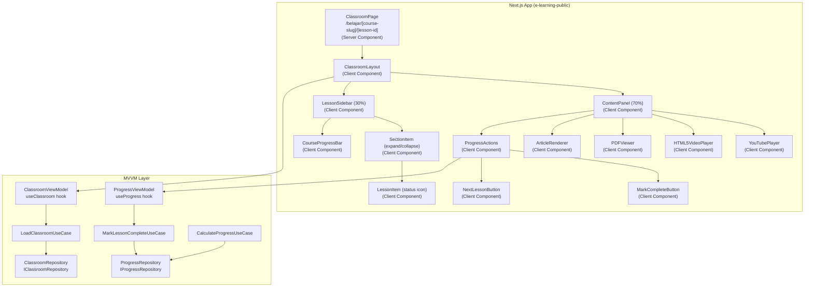
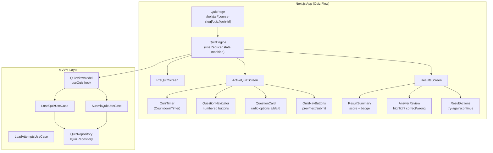
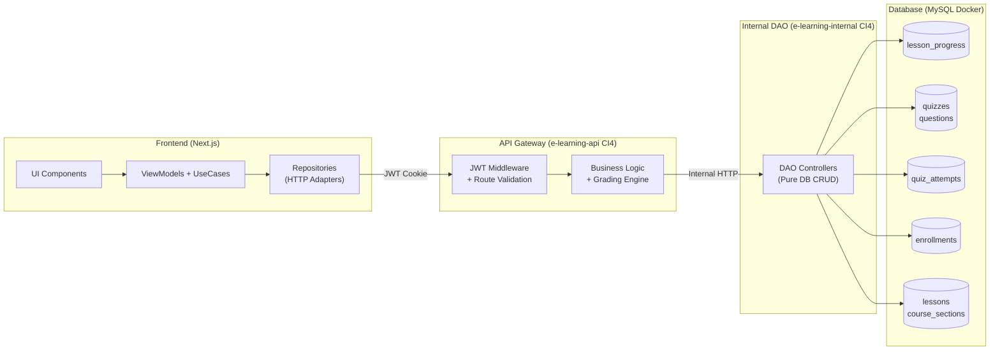
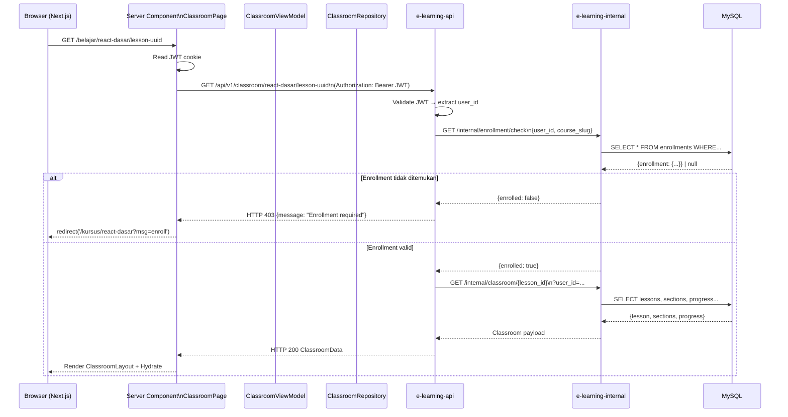
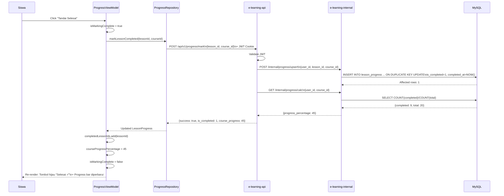
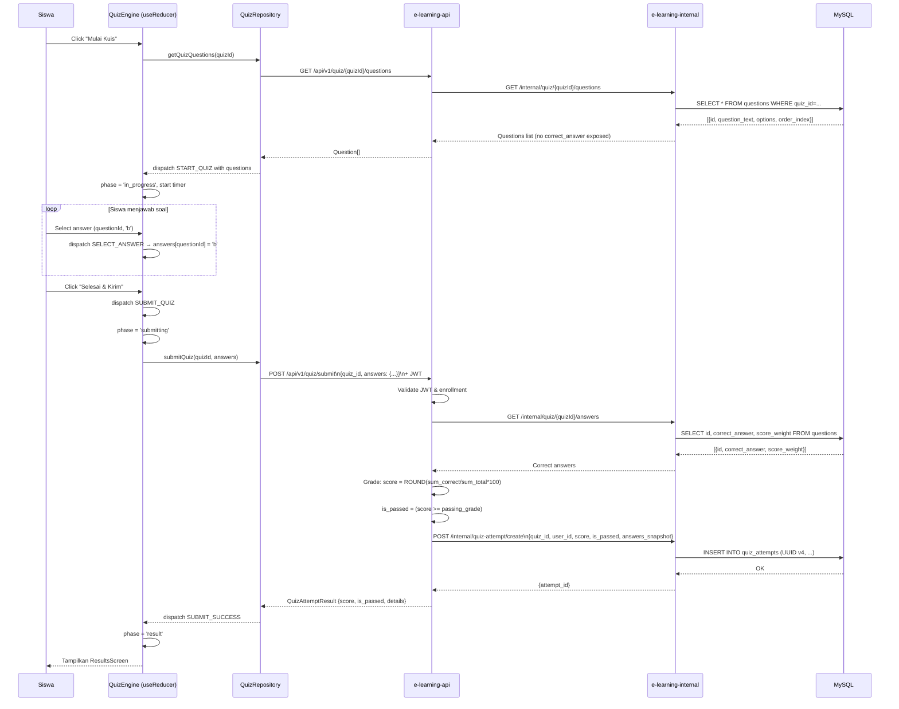
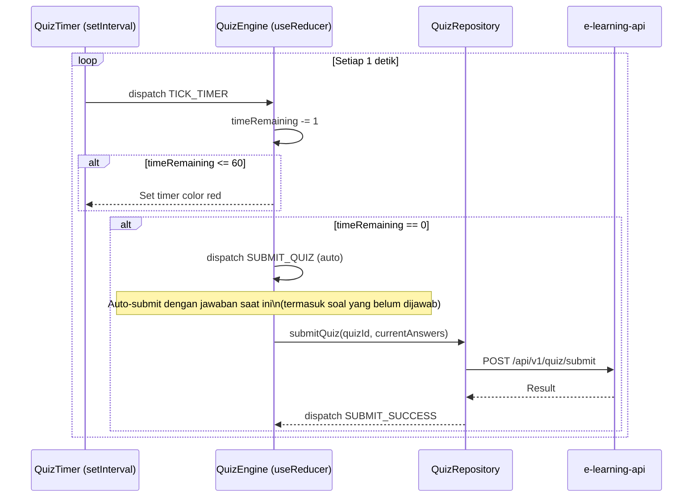
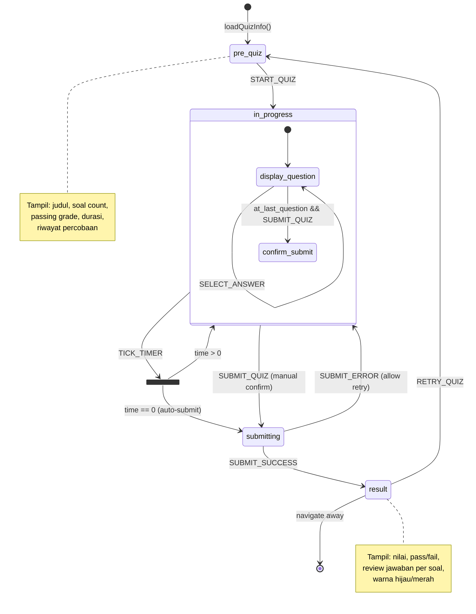
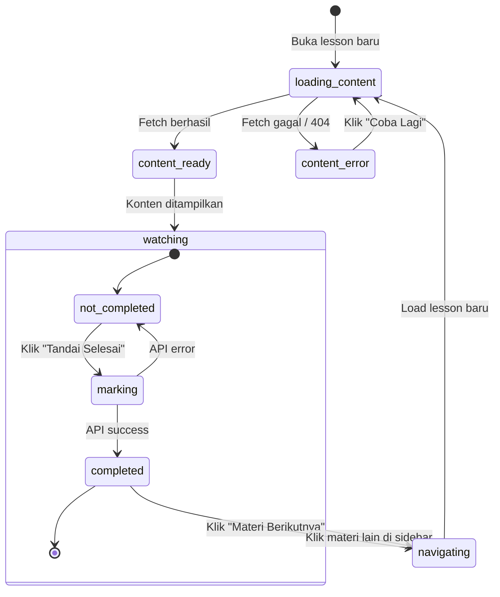

# Dokumen Desain — Fase 5: Interactive Learning Player & Evaluasi Siswa

> **Platform:** EduNusa E-Learning Platform  
> **Fase:** 5 dari 7  
> **Status:** ⏳ BELUM DIMULAI  
> **Tanggal:** 2025  

---

## Ringkasan (Overview)

Fase 5 membangun tiga lapisan interaktif yang saling bergantung:

1. **Learning Classroom** — halaman Next.js yang menyajikan konten (video/PDF/artikel) dalam layout split-screen dengan sidebar navigasi real-time
2. **Quiz Engine** — mesin kuis multi-state di frontend (pre-quiz → in-quiz dengan timer → auto-submit → grading → results) yang berinteraksi dengan backend grading
3. **Progress & Grade Book** — lapisan tracking dan pelaporan yang menghubungkan data dari `lesson_progress` dan `quiz_attempts` ke UI dasbor

Seluruh kode frontend mengikuti **MVVM Clean Architecture** (Entity → Repository → UseCase → ViewModel), sedangkan backend mengikuti pola tiga-lapis: `e-learning-api` (business logic + JWT validation) → `e-learning-internal` (DAO) → MySQL.

---

## Arsitektur (Architecture)

### Diagram Hierarki Komponen Learning Classroom



### Diagram Hierarki Komponen Quiz Engine



### Arsitektur Multi-Layer (End-to-End)



---

## Komponen dan Antarmuka (Components and Interfaces)

### 1. ClassroomViewModel (`useClassroom`)

```typescript
// src/features/classroom/viewmodels/useClassroom.ts

interface ClassroomState {
  isLoading: boolean;
  error: string | null;
  classroomData: ClassroomData | null;
  currentLessonId: string;
}

interface UseClassroomReturn extends ClassroomState {
  loadClassroom: (courseSlug: string, lessonId: string) => Promise<void>;
  navigateToLesson: (lessonId: string) => void;
}

export function useClassroom(
  courseSlug: string,
  initialLessonId: string
): UseClassroomReturn;
```

### 2. ProgressViewModel (`useProgress`)

```typescript
// src/features/classroom/viewmodels/useProgress.ts

interface ProgressState {
  completedLessonIds: Set<string>;
  courseProgressPercentage: number;
  isMarkingComplete: boolean;
  markCompleteError: string | null;
}

interface UseProgressReturn extends ProgressState {
  markAsComplete: (lessonId: string, courseId: string) => Promise<void>;
  isLessonCompleted: (lessonId: string) => boolean;
}

export function useProgress(initialProgressData: LessonProgressMap): UseProgressReturn;
```

### 3. QuizViewModel (`useQuiz`) dengan useReducer State Machine

```typescript
// src/features/quiz/viewmodels/useQuiz.ts

type QuizState =
  | { phase: 'pre_quiz'; quizInfo: QuizInfo; bestAttempt: QuizAttemptSummary | null }
  | { phase: 'in_progress'; questions: Question[]; answers: AnswerMap; timeRemaining: number | null; currentQuestionIndex: number }
  | { phase: 'submitting' }
  | { phase: 'result'; result: QuizAttemptResult };

type QuizAction =
  | { type: 'START_QUIZ' }
  | { type: 'SELECT_ANSWER'; questionId: string; answer: 'a' | 'b' | 'c' | 'd' }
  | { type: 'NAVIGATE_TO_QUESTION'; index: number }
  | { type: 'TICK_TIMER' }
  | { type: 'SUBMIT_QUIZ' }
  | { type: 'SUBMIT_SUCCESS'; result: QuizAttemptResult }
  | { type: 'SUBMIT_ERROR'; error: string }
  | { type: 'RETRY_QUIZ' };

function quizReducer(state: QuizState, action: QuizAction): QuizState;

export function useQuiz(quizId: string): {
  state: QuizState;
  dispatch: React.Dispatch<QuizAction>;
  handleStartQuiz: () => Promise<void>;
  handleSubmitQuiz: () => Promise<void>;
};
```

### 4. Spesifikasi Komponen VideoPlayer

```typescript
// src/features/classroom/components/VideoPlayer.tsx

interface VideoPlayerProps {
  contentUrl: string;
  contentType: 'video';
}

// Logika deteksi tipe video (pure function — dapat diuji)
export function detectVideoType(url: string): 'youtube' | 'html5' | 'invalid' {
  if (!url || url.trim() === '') return 'invalid';
  const youtubeRegex = /(?:youtube\.com\/(?:embed\/|watch\?v=)|youtu\.be\/)([a-zA-Z0-9_-]{11})/;
  if (youtubeRegex.test(url)) return 'youtube';
  const videoExtensions = /\.(mp4|webm|ogg)(\?.*)?$/i;
  if (videoExtensions.test(url)) return 'html5';
  return 'invalid';
}

// Ekstraksi YouTube Video ID (pure function — dapat diuji)
export function extractYoutubeVideoId(url: string): string | null {
  const match = url.match(/(?:youtube\.com\/(?:embed\/|watch\?v=)|youtu\.be\/)([a-zA-Z0-9_-]{11})/);
  return match ? match[1] : null;
}
```

### 5. Spesifikasi Komponen QuizTimer

```typescript
// src/features/quiz/components/QuizTimer.tsx

interface QuizTimerProps {
  durationSeconds: number;           // Total durasi dalam detik
  onTimeExpired: () => void;         // Callback auto-submit
  isWarningThreshold?: number;       // Default: 60 detik
}

// Komponen menampilkan MM:SS, merah saat <= isWarningThreshold
// Menggunakan setInterval via useEffect, cleanup on unmount
export function QuizTimer({ durationSeconds, onTimeExpired, isWarningThreshold = 60 }: QuizTimerProps): JSX.Element;
```

### 6. Spesifikasi Komponen QuestionNavigator

```typescript
// src/features/quiz/components/QuestionNavigator.tsx

interface QuestionNavigatorProps {
  totalQuestions: number;
  currentIndex: number;
  answeredQuestionIds: Set<string>;
  questionIds: string[];
  onNavigate: (index: number) => void;
}

// Status tombol: unanswered (grey) | current (blue) | answered (green)
export function QuestionNavigator(props: QuestionNavigatorProps): JSX.Element;
```

### 7. Spesifikasi Komponen GradeBook

```typescript
// src/features/gradebook/components/GradeBook.tsx

interface GradeBookProps {
  userId: string;
}

// Menggunakan useGradeBook viewmodel
// Menampilkan statistik ringkasan + daftar quiz_attempts
export function GradeBook({ userId }: GradeBookProps): JSX.Element;
```

---

## Model Data (Data Models)

### Entitas TypeScript (Frontend — MVVM Layer)

```typescript
// src/core/entities/LessonProgress.ts
export interface LessonProgress {
  lessonId: string;
  courseId: string;
  userId: string;
  isCompleted: boolean;
  completedAt: string | null;
  lastAccessedAt: string | null;
}

export type LessonProgressMap = Record<string, LessonProgress>;

// src/core/entities/ClassroomData.ts
export interface CourseInfo {
  id: string;
  title: string;
  slug: string;
  thumbnailUrl: string;
}

export interface LessonDetail {
  id: string;
  title: string;
  contentType: 'video' | 'pdf' | 'article';
  contentUrl: string | null;
  contentBody: string | null;
  durationMinutes: number;
  isFree: boolean;
}

export interface LessonListItem {
  id: string;
  title: string;
  contentType: 'video' | 'pdf' | 'article';
  durationMinutes: number;
  isFree: boolean;
  orderIndex: number;
  isCompleted: boolean;
}

export interface SectionWithLessons {
  id: string;
  title: string;
  orderIndex: number;
  lessons: LessonListItem[];
}

export interface ClassroomData {
  course: CourseInfo;
  lesson: LessonDetail;
  sections: SectionWithLessons[];
  progressPercentage: number;
  nextLessonId: string | null;
}

// src/core/entities/Quiz.ts
export interface QuizInfo {
  id: string;
  title: string;
  passingGrade: number;
  durationMinutes: number;
  totalQuestions: number;
  totalWeight: number;
}

export interface QuizAttemptSummary {
  attemptId: string;
  score: number;
  isPassed: boolean;
  submittedAt: string;
}

export interface Question {
  id: string;
  questionText: string;
  options: {
    a: string;
    b: string;
    c: string;
    d: string;
  };
  orderIndex: number;
}

export type AnswerMap = Record<string, 'a' | 'b' | 'c' | 'd'>;

export interface QuizAttemptDetail {
  questionId: string;
  questionText: string;
  options: { a: string; b: string; c: string; d: string };
  userAnswer: string | null;
  correctAnswer: string;
  isCorrect: boolean;
  scoreWeight: number;
}

export interface QuizAttemptResult {
  attemptId: string;
  score: number;
  isPassed: boolean;
  correctCount: number;
  totalQuestions: number;
  passingGrade: number;
  details: QuizAttemptDetail[];
}

// src/core/entities/GradeBookEntry.ts
export interface GradeBookEntry {
  attemptId: string;
  quizId: string;
  quizTitle: string;
  courseTitle: string;
  score: number;
  isPassed: boolean;
  submittedAt: string;
  attemptNumber: number;
}

export interface GradeBookStats {
  totalAttempts: number;
  averageScore: number;
  passedCount: number;
  failedCount: number;
}
```

### Skema Database (MySQL)

```sql
-- Sudah ada dari Fase 1; verifikasi kolom di bawah:

-- tabel: lesson_progress
-- id          CHAR(36) PK UUID v4
-- user_id     CHAR(36) FK -> users.id
-- lesson_id   CHAR(36) FK -> lessons.id
-- course_id   CHAR(36) FK -> courses.id
-- is_completed TINYINT(1) DEFAULT 0
-- completed_at DATETIME NULL
-- last_accessed_at DATETIME NULL
-- created_at  DATETIME DEFAULT CURRENT_TIMESTAMP
-- UNIQUE KEY uq_user_lesson (user_id, lesson_id)

-- tabel: quizzes
-- id               CHAR(36) PK UUID v4
-- course_id        CHAR(36) FK -> courses.id
-- section_id       CHAR(36) FK -> course_sections.id (NULL = course quiz)
-- title            VARCHAR(255)
-- quiz_type        ENUM('section', 'course') DEFAULT 'section'
-- passing_grade    TINYINT DEFAULT 70
-- duration_minutes SMALLINT DEFAULT 0  (0 = unlimited)
-- is_active        TINYINT(1) DEFAULT 1
-- created_at       DATETIME DEFAULT CURRENT_TIMESTAMP

-- tabel: questions
-- id            CHAR(36) PK UUID v4
-- quiz_id       CHAR(36) FK -> quizzes.id
-- question_text TEXT NOT NULL
-- option_a      TEXT NOT NULL
-- option_b      TEXT NOT NULL
-- option_c      TEXT NOT NULL
-- option_d      TEXT NOT NULL
-- correct_answer CHAR(1) CHECK (correct_answer IN ('a','b','c','d'))
-- score_weight   TINYINT DEFAULT 1
-- order_index    SMALLINT DEFAULT 0
-- created_at     DATETIME DEFAULT CURRENT_TIMESTAMP

-- tabel: quiz_attempts
-- id               CHAR(36) PK UUID v4
-- quiz_id          CHAR(36) FK -> quizzes.id
-- user_id          CHAR(36) FK -> users.id
-- score            TINYINT NOT NULL  (0-100)
-- is_passed        TINYINT(1) NOT NULL
-- answers_snapshot JSON NOT NULL
-- submitted_at     DATETIME DEFAULT CURRENT_TIMESTAMP
-- INDEX idx_user_quiz (user_id, quiz_id)
```

### Interface Repository (Frontend)

```typescript
// src/core/repositories/IClassroomRepository.ts
export interface IClassroomRepository {
  getClassroomData(courseSlug: string, lessonId: string): Promise<ClassroomData>;
}

// src/core/repositories/IProgressRepository.ts
export interface IProgressRepository {
  markLessonCompleted(lessonId: string, courseId: string): Promise<{ isCompleted: boolean; courseProgress: number }>;
  getCourseProgress(courseId: string): Promise<LessonProgressMap>;
}

// src/core/repositories/IQuizRepository.ts
export interface IQuizRepository {
  getQuizInfo(quizId: string): Promise<QuizInfo & { bestAttempt: QuizAttemptSummary | null }>;
  getQuizQuestions(quizId: string): Promise<Question[]>;
  submitQuiz(quizId: string, answers: AnswerMap): Promise<QuizAttemptResult>;
  getUserAttempts(): Promise<GradeBookEntry[]>;
  getAttemptDetail(attemptId: string): Promise<QuizAttemptResult>;
}
```

---

## Properti Kebenaran (Correctness Properties)

*Sebuah properti adalah karakteristik atau perilaku yang harus berlaku di seluruh eksekusi valid suatu sistem — secara esensial, pernyataan formal tentang apa yang harus dilakukan sistem. Properti berfungsi sebagai jembatan antara spesifikasi yang dapat dibaca manusia dan jaminan kebenaran yang dapat diverifikasi mesin.*

### Properti 1: Deteksi Tipe Video URL — Exhaustive Classification

*Untuk semua* URL string yang diberikan ke fungsi `detectVideoType`, fungsi tersebut harus mengembalikan tepat salah satu dari tiga nilai: `'youtube'`, `'html5'`, atau `'invalid'` — tidak pernah `undefined`, `null`, atau nilai lain — dan URL yang mengandung substring `youtube.com/embed/`, `youtube.com/watch?v=`, atau `youtu.be/` diikuti 11-karakter video ID harus selalu menghasilkan `'youtube'`.

**Memvalidasi: Persyaratan 2.1, 2.2**

---

### Properti 2: Sanitasi Konten Artikel — Tidak Ada Vektor XSS

*Untuk semua* string HTML yang mengandung tag `<script>`, atribut `onerror`, `javascript:` URI, atau vektor XSS lainnya, fungsi sanitasi konten artikel harus menghasilkan string output yang tidak mengandung tag `<script>` yang dapat dieksekusi atau event handler inline.

**Memvalidasi: Persyaratan 3.5**

---

### Properti 3: Kalkulasi Progres — Rentang dan Kebenaran Matematika

*Untuk semua* pasangan bilangan bulat non-negatif `(completed, total)` di mana `0 <= completed <= total` dan `total >= 0`, fungsi `calculateProgressPercentage(completed, total)` harus mengembalikan bilangan bulat dalam rentang `[0, 100]` inklusif; jika `total = 0` hasilnya adalah `0`; jika `total > 0` hasilnya adalah `Math.floor((completed / total) * 100)`.

**Memvalidasi: Persyaratan 6.1, 6.2, 6.4**

---

### Properti 4: Idempoten State Jawaban Quiz

*Untuk semua* urutan aksi `SELECT_ANSWER` pada `quizReducer`, state `answers` yang dihasilkan harus memiliki paling banyak satu jawaban per `questionId`, dan nilai jawaban untuk setiap `questionId` harus selalu sama dengan jawaban yang paling terakhir dipilih untuk soal tersebut (last-write-wins semantics).

**Memvalidasi: Persyaratan 9.7**

---

### Properti 5: Weighted Grading — Skor Tertimbang Konsisten dan Terbatas

*Untuk semua* daftar pasangan `(isCorrect: boolean, scoreWeight: number)` dengan `total_weight > 0`, fungsi `calculateQuizScore(details)` harus menghasilkan nilai integer dalam rentang `[0, 100]` yang sama dengan `Math.round((sumCorrectWeights / sumAllWeights) * 100)`. Jika semua jawaban benar maka skor harus 100; jika semua jawaban salah maka skor harus 0.

**Memvalidasi: Persyaratan 10.3, 10.6**

---

### Properti 6: Konsistensi is_passed terhadap Skor dan Passing Grade

*Untuk semua* pasangan `(score: number, passingGrade: number)`, nilai `isPassed` yang dihasilkan oleh grading logic harus selalu persis sama dengan evaluasi `score >= passingGrade` — tidak ada state di mana `isPassed = true` ketika `score < passingGrade` atau sebaliknya.

**Memvalidasi: Persyaratan 10.4**

---

### Properti 7: Round-Trip JSON Snapshot Jawaban

*Untuk semua* objek `AnswerMap` (mapping `questionId -> 'a'|'b'|'c'|'d'`) yang valid, melakukan `JSON.parse(JSON.stringify(answers))` harus menghasilkan objek yang ekuivalen secara struktural: kunci yang sama, nilai yang sama, tanpa kehilangan data atau perubahan tipe.

**Memvalidasi: Persyaratan 10.5**

---

## Penanganan Error (Error Handling)

| Skenario | Komponen | Penanganan |
|---|---|---|
| Enrollment tidak valid saat load classroom | `ClassroomRepository` | Throw `EnrollmentRequiredError`; ViewModel redirect ke `/kursus/[slug]` |
| API `progress/mark` gagal (5xx) | `ProgressViewModel` | `react-hot-toast` error; tombol Tandai Selesai kembali aktif |
| API `progress/mark` gagal (401) | `ProgressRepository` | Refresh token atau redirect ke `/masuk` |
| PDF gagal dimuat | `PDFViewer` | Tampilkan error state dengan tombol "Coba Lagi" |
| Video URL tidak valid | `VideoPlayer` | Tampilkan placeholder "Konten tidak tersedia" |
| Quiz submit gagal (network) | `QuizViewModel` | Toast error; allow re-submit; timer tetap berjalan (atau sudah expired) |
| Quiz submit gagal (409 conflict) | `QuizRepository` | Parse response, tampilkan "Terjadi konflik pengiriman, coba muat ulang" |
| Timer habis + submit gagal | `QuizEngine` | Simpan jawaban ke `sessionStorage`, retry submit, maksimal 3 kali |
| Grade book fetch gagal | `GradeBookViewModel` | Tampilkan error boundary dengan tombol "Muat Ulang" |
| HTML berbahaya di artikel | `ArticleRenderer` | Sanitasi via DOMPurify sebelum dangerouslySetInnerHTML |

---

## Strategi Pengujian (Testing Strategy)

### Pendekatan Pengujian Ganda

Fase 5 menggunakan kombinasi **unit tests** (untuk contoh spesifik dan edge case) dan **property-based tests** (untuk properti universal dari fungsi-fungsi murni yang menjadi inti logika bisnis).

**PBT sangat tepat** digunakan di sini karena:
- Fungsi `detectVideoType`, `extractYoutubeVideoId`, `sanitizeHtml`, `calculateProgressPercentage`, `calculateQuizScore`, dan `quizReducer` semuanya adalah fungsi murni dengan ruang input yang besar
- Bug tersembunyi muncul di edge case (URL dengan parameter tambahan, bobot soal tidak seragam, timer hampir habis)
- Biaya eksekusi rendah: semua fungsi di atas adalah operasi in-memory

### Library PBT yang Digunakan

**`fast-check`** untuk TypeScript/Jest — library property-based testing yang matang dan aktif dikembangkan.

```bash
npm install --save-dev fast-check
```

### Konfigurasi Setiap Property Test

```typescript
// Minimal 100 iterasi per properti
import * as fc from 'fast-check';

test('Property 1: detectVideoType exhaustive classification', () => {
  fc.assert(
    fc.property(fc.string(), (url) => {
      const result = detectVideoType(url);
      return ['youtube', 'html5', 'invalid'].includes(result);
    }),
    { numRuns: 100 }
  );
});
```

### Tag Format untuk Setiap Property Test

```
// Feature: fase-5-learning-player-evaluasi, Property {N}: {property_text}
```

### Distribusi Pengujian

| Tipe Test | Target | Tool |
|---|---|---|
| Property-based tests | Fungsi murni (detectVideoType, grading, progress calc, sanitizer, reducer) | `fast-check` + `Jest` |
| Unit tests | UseCase & ViewModel logic, Repository adapters (mocked) | `Jest` + `@testing-library/react` |
| Integration tests | API endpoints (progress/mark, quiz/submit, classroom load) | `Jest` + `supertest` (backend CI4) |
| Snapshot tests | UI komponen statis (PreQuizScreen, ResultScreen, GradeBookEntry) | `@testing-library/react` + inline snapshot |

---

## Diagram Sekuens (Sequence Diagrams)

### Seq 1 — Load Classroom



### Seq 2 — Mark as Completed



### Seq 3 — Start Quiz → Submit → Grade



### Seq 4 — Auto-Submit on Timer Timeout



---

## State Machine — Quiz Engine



### State Machine — Video Progress States



---

## Detail Algoritma (Algorithm Details)

### Algoritma Grading Kuis (Backend — CI4 API Gateway)

```php
// app/Controllers/Api/V1/QuizController.php
// Method: submitQuiz()

/**
 * Weighted quiz grading algorithm.
 * Testable property: 0 <= score <= 100
 * Testable property: is_passed = (score >= passing_grade)
 */
private function gradeQuiz(array $userAnswers, array $questions, int $passingGrade): array
{
    $accumulatedScore = 0;
    $totalWeight = 0;
    $details = [];

    foreach ($questions as $question) {
        $questionId = $question['id'];
        $correctAnswer = $question['correct_answer'];
        $scoreWeight = (int) $question['score_weight'];
        $userAnswer = $userAnswers[$questionId] ?? null;
        $isCorrect = ($userAnswer === $correctAnswer);

        $totalWeight += $scoreWeight;
        if ($isCorrect) {
            $accumulatedScore += $scoreWeight;
        }

        $details[] = [
            'question_id'   => $questionId,
            'question_text' => $question['question_text'],
            'user_answer'   => $userAnswer,
            'correct_answer'=> $correctAnswer,
            'is_correct'    => $isCorrect,
            'score_weight'  => $scoreWeight,
        ];
    }

    // Guard against division by zero
    $score = ($totalWeight > 0)
        ? (int) round(($accumulatedScore / $totalWeight) * 100)
        : 0;

    // Clamp to [0, 100] — defensive programming
    $score = max(0, min(100, $score));

    return [
        'score'    => $score,
        'is_passed'=> $score >= $passingGrade,
        'details'  => $details,
    ];
}
```

### Algoritma Kalkulasi Progres (Backend — CI4 Internal DAO)

```php
// app/Controllers/Internal/ProgressController.php

/**
 * Course progress calculation.
 * Testable property: 0 <= progress_percentage <= 100
 * Testable property: if total_lessons = 0, return 0
 */
public function calculateCourseProgress(string $userId, string $courseId): int
{
    $totalLessons = $this->lessonsModel
        ->where('course_id', $courseId)
        ->where('deleted_at IS NULL')
        ->countAllResults();

    if ($totalLessons === 0) {
        return 0;
    }

    $completedLessons = $this->lessonProgressModel
        ->where('user_id', $userId)
        ->where('course_id', $courseId)
        ->where('is_completed', 1)
        ->countAllResults();

    return (int) floor(($completedLessons / $totalLessons) * 100);
}
```

### Fungsi Murni Frontend (Testable via PBT)

```typescript
// src/core/utils/progressUtils.ts

/**
 * Pure function — dapat diuji dengan property-based testing.
 * Property: For all (completed >= 0, total >= 0, completed <= total):
 *   result in [0, 100] && result === (total === 0 ? 0 : Math.floor((completed/total)*100))
 */
export function calculateProgressPercentage(
  completedLessons: number,
  totalLessons: number
): number {
  if (totalLessons <= 0) return 0;
  const raw = (completedLessons / totalLessons) * 100;
  return Math.min(100, Math.max(0, Math.floor(raw)));
}

// src/core/utils/quizGrading.ts

/**
 * Pure function — dapat diuji dengan property-based testing.
 * Property: For all details with total_weight > 0:
 *   result in [0, 100] && consistent with is_passed
 */
export function calculateQuizScore(
  details: Array<{ isCorrect: boolean; scoreWeight: number }>
): number {
  const totalWeight = details.reduce((sum, d) => sum + d.scoreWeight, 0);
  if (totalWeight === 0) return 0;
  const correctWeight = details
    .filter(d => d.isCorrect)
    .reduce((sum, d) => sum + d.scoreWeight, 0);
  return Math.min(100, Math.max(0, Math.round((correctWeight / totalWeight) * 100)));
}

// src/core/utils/videoUtils.ts

/**
 * Pure function — dapat diuji dengan property-based testing.
 * Property: For all url strings: result ∈ {'youtube', 'html5', 'invalid'}
 */
export function detectVideoType(url: string): 'youtube' | 'html5' | 'invalid' {
  if (!url || url.trim() === '') return 'invalid';
  const youtubePattern = /(?:youtube\.com\/(?:embed\/|watch\?v=)|youtu\.be\/)([a-zA-Z0-9_-]{11})/;
  if (youtubePattern.test(url)) return 'youtube';
  const html5Pattern = /\.(mp4|webm|ogg)(\?.*)?$/i;
  if (html5Pattern.test(url)) return 'html5';
  return 'invalid';
}
```
