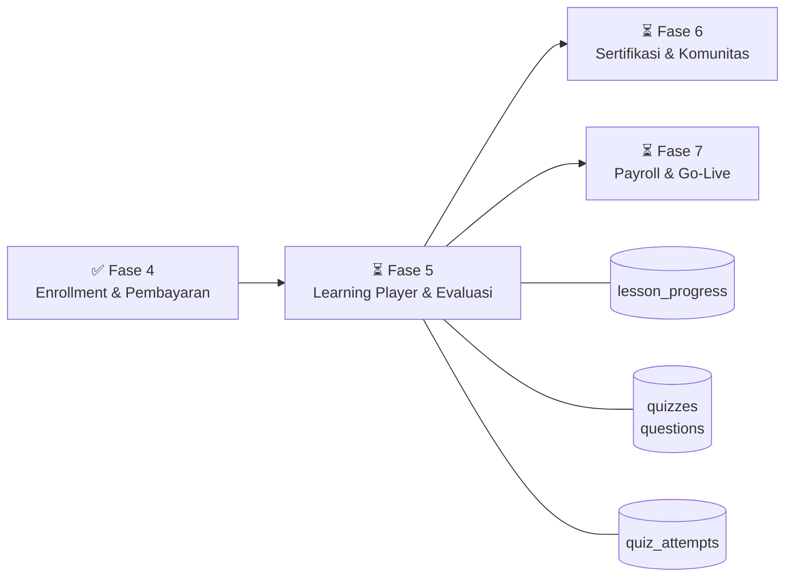
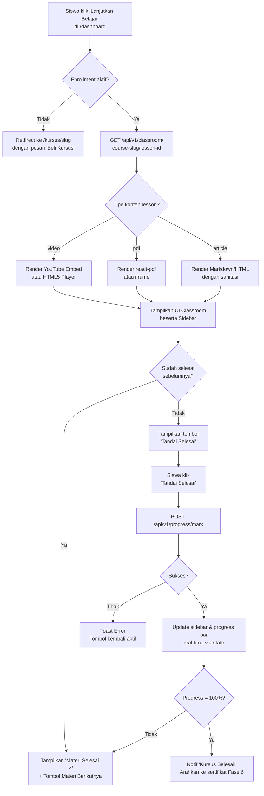
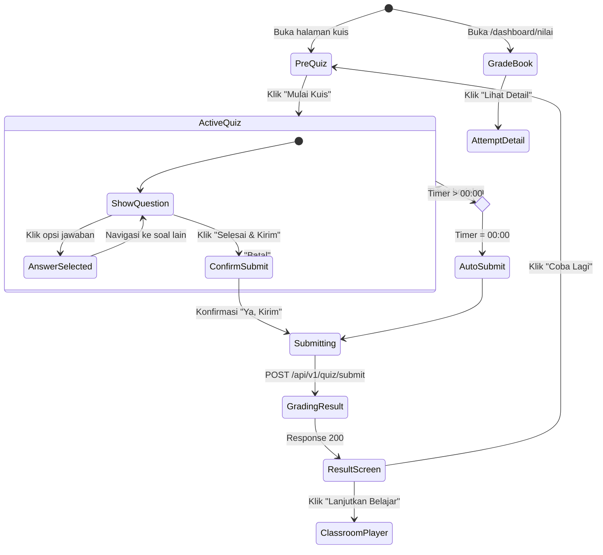
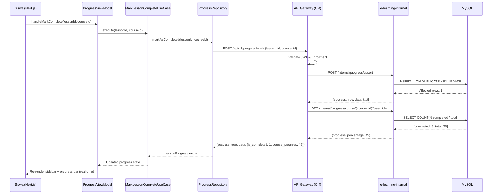

# Dokumen Persyaratan — Fase 5: Interactive Learning Player & Evaluasi Siswa

> **Platform:** EduNusa E-Learning Platform  
> **Fase:** 5 dari 7  
> **Status:** ⏳ BELUM DIMULAI  
> **Tanggal:** 2025  
> **Penulis:** Tim Engineering EduNusa  

---

## Pendahuluan

Fase 5 membangun inti pengalaman belajar EduNusa: ruang kelas virtual interaktif tempat siswa mengonsumsi materi (video, PDF, artikel), melacak progres belajar mereka, dan mengerjakan kuis evaluasi berformat pilihan ganda. Di sisi mentor, fase ini menghadirkan antarmuka pembuatan kuis yang terintegrasi dengan portal mentor (`teacher.edunusa.edu.id`). Di sisi orang tua, tersedia dasbor pantauan buku nilai dan progres anak. Fase ini merupakan fondasi bagi penerbitan sertifikat digital (Fase 6) karena `lesson_progress` dan `quiz_attempts` adalah prasyarat kelulusan.

### Cakupan

| Modul | Deskripsi |
|---|---|
| **A** | Learning Classroom Player — ruang belajar split-screen di Next.js |
| **B** | Progress Tracking Engine — pelacakan & kalkulasi progres kursus |
| **C** | Quiz Builder — antarmuka pembuatan kuis di portal mentor (CI4) |
| **D** | Quiz Engine — mesin pengerjaan & penilaian kuis siswa |
| **E** | Grade Book — buku nilai dan rapor percobaan kuis |

### Hubungan Antar-Fase



---

## Glosarium

| Istilah | Definisi |
|---|---|
| **Learning_Player** | Halaman ruang belajar interaktif Next.js di rute `/belajar/[course-slug]/[lesson-id]` |
| **Progress_Engine** | Komponen backend + frontend yang menghitung dan menyimpan progres belajar siswa |
| **Quiz_Builder** | Antarmuka di portal mentor untuk membuat dan mengelola kuis |
| **Quiz_Engine** | Mesin di frontend Next.js yang menjalankan kuis: timer, navigasi soal, auto-submit, dan penilaian |
| **Grade_Book** | Halaman riwayat nilai kuis siswa di `/dashboard/nilai` |
| **Lesson** | Unit materi pembelajaran dalam sebuah seksi kursus; memiliki tipe konten (video, pdf, article) |
| **Section** | Kelompok materi dalam satu kursus, setara dengan "bab" atau "modul" |
| **Quiz** | Satu set soal evaluasi yang terikat ke sebuah `section` atau `course`, memiliki `passing_grade` dan opsional `duration_minutes` |
| **Question** | Satu soal pilihan ganda dalam `Quiz` dengan 4 pilihan (a/b/c/d) dan `correct_answer` |
| **Quiz_Attempt** | Satu percobaan pengerjaan kuis oleh siswa; menyimpan snapshot jawaban JSON dan skor akhir |
| **Lesson_Progress** | Catatan penyelesaian satu materi oleh satu siswa; `is_completed` + `completed_at` |
| **Progress_Percentage** | Persentase = (jumlah lesson `is_completed=1` milik siswa) / (total lesson dalam kursus) × 100 |
| **Passing_Grade** | Ambang batas nilai minimum kuis (default 70 dari skala 0–100) untuk dinyatakan lulus |
| **Free_Preview** | Materi dengan `is_free = 1` yang dapat diakses tanpa enrollment aktif |
| **Enrollment** | Catatan kepemilikan kursus seorang siswa setelah transaksi sukses (dari Fase 4) |
| **CI4_Mentor_Portal** | Aplikasi CodeIgniter 4 `e-learning-mentor` untuk portal instruktur |
| **API_Gateway** | Aplikasi CodeIgniter 4 `e-learning-api` sebagai pintu gerbang validasi JWT dan bisnis proses |
| **Internal_DAO** | Aplikasi CodeIgniter 4 `e-learning-internal` sebagai satu-satunya lapisan akses database |
| **MVVM** | Pola arsitektur frontend: Entity → Repository → UseCase → ViewModel → View |
| **JWT** | JSON Web Token disimpan di HTTP-Only Cookie `token`; divalidasi di API_Gateway |
| **UUID_v4** | Format ID unik `CHAR(36)` yang digunakan pada seluruh Primary Key dan Foreign Key |

---

## Persyaratan

---

### Persyaratan 1 — Akses Ruang Belajar (Learning Classroom)

**User Story:** Sebagai siswa yang sudah terdaftar, saya ingin membuka materi kursus di ruang belajar interaktif, sehingga saya dapat mengonsumsi konten video, PDF, atau artikel secara nyaman.

#### Kriteria Penerimaan

1. WHEN siswa mengakses URL `/belajar/[course-slug]/[lesson-id]`, THE Learning_Player SHALL memverifikasi bahwa siswa memiliki enrollment aktif untuk kursus tersebut sebelum menampilkan konten.

2. IF siswa tidak memiliki enrollment aktif dan materi memiliki `is_free = 0`, THEN THE Learning_Player SHALL mengalihkan siswa ke halaman detail kursus (`/kursus/[slug]`) dengan pesan "Daftar kursus ini untuk mengakses materi".

3. WHERE materi memiliki `is_free = 1`, THE Learning_Player SHALL mengizinkan siapa saja yang sudah login untuk mengakses materi tersebut tanpa memeriksa enrollment.

4. WHEN Learning_Player berhasil dimuat, THE Learning_Player SHALL menampilkan layout split-screen dengan area konten utama (lebar 70% pada desktop) di sisi kiri dan sidebar navigasi seksi-materi (lebar 30%) di sisi kanan.

5. WHILE siswa mengakses Learning_Player di perangkat mobile (lebar layar < 768px), THE Learning_Player SHALL menampilkan tata letak vertikal dengan area konten di atas dan sidebar materi di bawah.

6. WHEN Learning_Player dimuat, THE Learning_Player SHALL menyorot materi yang sedang aktif di sidebar dengan indikator visual yang berbeda dari materi lainnya.

7. WHEN Learning_Player dimuat, THE Learning_Player SHALL menampilkan judul kursus, judul seksi aktif, dan judul materi aktif di bagian atas halaman.

---

### Persyaratan 2 — Pemutar Konten Video

**User Story:** Sebagai siswa, saya ingin menonton video materi langsung di ruang belajar, sehingga saya tidak perlu berpindah halaman dan tetap terfokus.

#### Kriteria Penerimaan

1. WHEN materi memiliki tipe konten `video` dan URL mengandung `youtube.com` atau `youtu.be`, THE Learning_Player SHALL menampilkan YouTube embed dengan format URL `https://www.youtube.com/embed/{videoId}?autoplay=0&rel=0&modestbranding=1`.

2. WHEN materi memiliki tipe konten `video` dan URL bukan dari domain YouTube, THE Learning_Player SHALL menampilkan HTML5 `<video>` player dengan kontrol bawaan browser sebagai fallback.

3. WHEN video HTML5 player digunakan, THE Learning_Player SHALL mendukung format file `.mp4`, `.webm`, dan `.ogg`.

4. IF URL video kosong atau tidak valid, THEN THE Learning_Player SHALL menampilkan placeholder dengan pesan "Konten video tidak tersedia. Hubungi mentor Anda."

5. THE Learning_Player SHALL menampilkan video dengan rasio aspek 16:9 yang responsif tanpa distorsi pada semua ukuran layar.

---

### Persyaratan 3 — Penampil PDF dan Artikel

**User Story:** Sebagai siswa, saya ingin membaca materi PDF dan artikel teks langsung di ruang belajar, sehingga pengalaman belajar saya tetap terpadu.

#### Kriteria Penerimaan

1. WHEN materi memiliki tipe konten `pdf`, THE Learning_Player SHALL menampilkan penampil PDF menggunakan komponen `react-pdf` atau embed `<iframe>` dengan toolbar minimal (navigasi halaman dan zoom).

2. WHEN penampil PDF dimuat, THE Learning_Player SHALL menampilkan skeleton loading animation selama proses pengambilan file PDF berlangsung.

3. IF file PDF gagal dimuat (HTTP 404 atau error jaringan), THEN THE Learning_Player SHALL menampilkan pesan error "Dokumen tidak dapat dimuat. Coba lagi." beserta tombol "Coba Lagi".

4. WHEN materi memiliki tipe konten `article`, THE Learning_Player SHALL me-render konten HTML/Markdown menggunakan area teks dengan tipografi yang optimal (font `Plus Jakarta Sans`, `line-height: 1.8`, lebar baca maksimum 720px).

5. THE Learning_Player SHALL men-sanitasi seluruh konten HTML artikel sebelum di-render untuk mencegah serangan XSS.

---

### Persyaratan 4 — Sidebar Navigasi Seksi dan Materi

**User Story:** Sebagai siswa, saya ingin melihat seluruh daftar seksi dan materi kursus di sidebar, sehingga saya dapat dengan mudah menavigasi antar-materi dan memantau progres saya.

#### Kriteria Penerimaan

1. WHEN Learning_Player dimuat, THE Learning_Player SHALL menampilkan seluruh seksi kursus di sidebar dengan kemampuan expand/collapse per seksi.

2. WHEN seksi dalam sidebar diklik, THE Learning_Player SHALL toggle tampilan daftar materi di dalam seksi tersebut (expand jika tertutup, collapse jika terbuka).

3. THE Learning_Player SHALL menampilkan setiap item materi di sidebar dengan informasi: ikon tipe konten (video/pdf/artikel), judul materi, estimasi durasi, dan status penyelesaian.

4. THE Learning_Player SHALL menampilkan ikon status untuk setiap materi:
   - ✓ (hijau `#22c55e`) = materi sudah diselesaikan (`is_completed = 1`)
   - ▶ (biru `#6C47FF`) = materi yang sedang aktif/dibuka
   - 🔒 (abu-abu) = materi terkunci (siswa belum punya enrollment)

5. THE Learning_Player SHALL menampilkan progress bar per seksi yang menunjukkan persentase materi selesai dari total materi dalam seksi tersebut.

6. WHEN siswa mengklik nama materi di sidebar yang bukan materi terkunci, THE Learning_Player SHALL menavigasi ke materi tersebut dengan memperbarui URL ke `/belajar/[course-slug]/[lesson-id]` tanpa full page reload.

7. WHILE siswa tidak memiliki enrollment aktif, THE Learning_Player SHALL menampilkan materi dengan `is_free = 0` sebagai terkunci di sidebar dan memunculkan tooltip "Beli kursus ini untuk akses penuh" saat di-hover.

---

### Persyaratan 5 — Pelacakan Progres Belajar (Progress Tracking)

**User Story:** Sebagai siswa, saya ingin menandai materi sebagai selesai, sehingga saya dapat melacak progres belajar saya dan sistem mengetahui sejauh mana saya sudah belajar.

#### Kriteria Penerimaan

1. WHEN Learning_Player menampilkan materi, THE Learning_Player SHALL menampilkan tombol "✓ Tandai Selesai" di bagian bawah area konten jika materi belum diselesaikan.

2. WHEN siswa mengklik tombol "Tandai Selesai", THE Progress_Engine SHALL mengirim `POST /api/v1/progress/mark` dengan payload `{ "lesson_id": "<uuid>", "course_id": "<uuid>" }` menggunakan JWT dari cookie.

3. WHEN API `/api/v1/progress/mark` menerima request, THE API_Gateway SHALL melakukan upsert ke tabel `lesson_progress` dengan kolom `user_id`, `lesson_id`, `course_id`, `is_completed = 1`, `completed_at = NOW()`.

4. WHEN upsert `lesson_progress` berhasil, THE Progress_Engine SHALL memperbarui ikon status materi di sidebar secara real-time dari ▶ menjadi ✓ tanpa full page reload.

5. WHEN upsert `lesson_progress` berhasil, THE Progress_Engine SHALL memperbarui progress bar per seksi dan persentase progres keseluruhan kursus secara real-time.

6. IF request `POST /api/v1/progress/mark` gagal (network error atau server error 5xx), THEN THE Progress_Engine SHALL menampilkan toast error "Gagal menyimpan progres. Coba lagi." via `react-hot-toast` dan tombol "Tandai Selesai" kembali aktif.

7. THE Progress_Engine SHALL menampilkan tombol "Materi Selesai ✓" (disabled, hijau) ketika materi sudah dalam status `is_completed = 1`, sehingga tidak ada aksi yang bisa dilakukan ulang.

8. WHEN materi sudah ditandai selesai dan ada materi berikutnya dalam kursus, THE Learning_Player SHALL menampilkan tombol "Materi Berikutnya →" yang mengarahkan ke materi selanjutnya secara otomatis.

---

### Persyaratan 6 — Kalkulasi Progres Kursus

**User Story:** Sebagai siswa, saya ingin melihat persentase progres belajar saya per kursus, sehingga saya termotivasi untuk menyelesaikan kursus.

#### Kriteria Penerimaan

1. THE Progress_Engine SHALL menghitung `progress_percentage` menggunakan formula: `FLOOR((COUNT(lesson_progress WHERE user_id=? AND course_id=? AND is_completed=1) / COUNT(lessons WHERE course_id=?)) * 100)`.

2. WHEN progress_percentage dihitung, THE Progress_Engine SHALL mengembalikan nilai integer antara 0 dan 100 inklusif.

3. WHEN progress_percentage berhasil dihitung, THE Progress_Engine SHALL menampilkan nilai tersebut di sidebar kursus, di dasbor siswa (`/dashboard`), dan di kartu kursus di profil belajar.

4. IF kursus tidak memiliki lesson aktif (total_lessons = 0), THEN THE Progress_Engine SHALL mengembalikan `progress_percentage = 0` tanpa melakukan pembagian.

5. WHEN progress_percentage mencapai 100, THE Progress_Engine SHALL mencatat `completion_date` di tabel `enrollments` dan memunculkan notifikasi "Selamat! Anda telah menyelesaikan kursus ini." yang memandu siswa ke halaman sertifikat (Fase 6).

6. THE Learning_Player SHALL menampilkan last accessed lesson di dasbor siswa sebagai "Lanjutkan: [Judul Materi]" dengan menyimpan `lesson_id` terakhir yang dibuka di tabel `lesson_progress` kolom `last_accessed_at`.

---

### Persyaratan 7 — Quiz Builder (Portal Mentor)

**User Story:** Sebagai mentor/instruktur, saya ingin membuat kuis evaluasi per seksi atau per kursus, sehingga saya dapat mengukur pemahaman siswa secara terstruktur.

#### Kriteria Penerimaan

1. WHEN mentor membuka halaman pembuatan kuis di portal mentor, THE Quiz_Builder SHALL menampilkan form dengan field: Judul Kuis, Target (Section Quiz / Final Course Quiz), `section_id` (jika Section Quiz), `passing_grade` (default 70, range 1–100), `duration_minutes` (default 0 = tidak terbatas, range 0–300).

2. WHEN mentor menyimpan kuis baru, THE CI4_Mentor_Portal SHALL mengirim `POST /mentor/quiz/save` dengan payload tervalidasi ke API_Gateway, yang kemudian meneruskan insert ke tabel `quizzes` melalui Internal_DAO dengan UUID v4.

3. WHEN kuis berhasil disimpan, THE Quiz_Builder SHALL menampilkan halaman manajemen soal kuis yang baru dibuat.

4. WHEN mentor menambahkan soal, THE Quiz_Builder SHALL menyediakan form dengan field: `question_text`, empat pilihan jawaban (`option_a`, `option_b`, `option_c`, `option_d`), `correct_answer` (radio: a/b/c/d), `score_weight` (default 1, range 1–10).

5. WHEN mentor menyimpan soal, THE CI4_Mentor_Portal SHALL mengirim `POST /mentor/quiz/question/add` dengan validasi bahwa `correct_answer` adalah salah satu dari ['a','b','c','d'] dan `question_text` tidak kosong.

6. WHEN soal berhasil disimpan, THE Quiz_Builder SHALL menampilkan soal tersebut dalam daftar soal kuis dengan ikon edit dan hapus.

7. WHEN mentor menghapus soal, THE Quiz_Builder SHALL menampilkan dialog konfirmasi "Hapus soal ini? Tindakan tidak dapat dibatalkan." sebelum eksekusi DELETE.

8. THE Quiz_Builder SHALL mendukung pengaturan ulang urutan soal via `order_index` yang dapat diubah secara manual (input angka) atau via drag-and-drop.

9. WHEN mentor mengakses daftar soal kuis yang sudah ada, THE CI4_Mentor_Portal SHALL memuat `GET /mentor/quiz/{id}/questions` dan menampilkan seluruh soal beserta pilihan jawaban dan jawaban benar.

10. THE Quiz_Builder SHALL memvalidasi bahwa setiap kuis memiliki minimal 1 soal sebelum kuis dapat diaktifkan.

---

### Persyaratan 8 — Layar Pra-Kuis (Pre-Quiz Screen)

**User Story:** Sebagai siswa, saya ingin melihat informasi kuis sebelum mulai mengerjakan, sehingga saya bisa mempersiapkan diri dengan baik.

#### Kriteria Penerimaan

1. WHEN siswa membuka kuis yang tersedia, THE Quiz_Engine SHALL menampilkan layar pra-kuis dengan informasi: judul kuis, nama kursus/seksi, jumlah soal, passing grade, durasi (atau "Tidak ada batas waktu" jika `duration_minutes = 0`), dan jumlah percobaan sebelumnya.

2. THE Quiz_Engine SHALL menampilkan tombol "Mulai Kuis" yang prominent (pill-shaped, warna ungu `#6C47FF`).

3. WHEN siswa sudah pernah mengerjakan kuis dan skornya ≥ passing_grade, THE Quiz_Engine SHALL menampilkan badge "Lulus ✓" di layar pra-kuis beserta skor terbaik sebelumnya.

4. WHEN siswa sudah pernah mengerjakan kuis dan skornya < passing_grade, THE Quiz_Engine SHALL menampilkan pesan "Anda belum lulus. Skor terbaik: [skor]. Coba lagi untuk meningkatkan nilai Anda."

5. THE Quiz_Engine SHALL memungkinkan siswa mengerjakan kuis berkali-kali tanpa batas, dengan setiap percobaan menghasilkan `quiz_attempt` baru yang independen.

---

### Persyaratan 9 — Pengerjaan Kuis (During Quiz)

**User Story:** Sebagai siswa, saya ingin mengerjakan kuis dengan antarmuka yang intuitif dan timer yang jelas, sehingga pengalaman evaluasi terasa adil dan terstruktur.

#### Kriteria Penerimaan

1. WHEN siswa memulai kuis dengan `duration_minutes > 0`, THE Quiz_Engine SHALL menampilkan timer hitung mundur (format `MM:SS`) yang berjalan sejak kuis dimulai.

2. WHILE timer kuis berjalan dan waktu tersisa ≤ 60 detik, THE Quiz_Engine SHALL mengubah warna timer menjadi merah (`#ef4444`) sebagai peringatan visual.

3. WHEN timer mencapai 00:00, THE Quiz_Engine SHALL secara otomatis mengirim jawaban yang sudah dipilih siswa ke endpoint submit tanpa interaksi manual (auto-submit).

4. THE Quiz_Engine SHALL menampilkan navigator soal berupa tombol bernomor (1, 2, 3, ...) yang menampilkan status setiap soal:
   - Abu-abu = belum dijawab
   - Biru `#6C47FF` = soal aktif/sedang dibuka
   - Hijau `#22c55e` = sudah dijawab

5. WHEN siswa mengklik nomor soal di navigator, THE Quiz_Engine SHALL menampilkan soal yang sesuai tanpa kehilangan jawaban yang sudah dipilih di soal lain.

6. THE Quiz_Engine SHALL menampilkan setiap soal dengan opsi jawaban sebagai styled radio card (a/b/c/d) yang berubah tampilan saat dipilih (border biru, background ungu muda).

7. WHEN siswa memilih jawaban pada satu soal, THE Quiz_Engine SHALL menyimpan pilihan tersebut di state lokal React (`useReducer`) tanpa mengirim ke server.

8. THE Quiz_Engine SHALL menampilkan tombol "Soal Sebelumnya" dan "Soal Berikutnya" untuk navigasi linear antar soal.

9. WHEN siswa berada di soal terakhir, THE Quiz_Engine SHALL menampilkan tombol "Selesai & Kirim" sebagai pengganti tombol "Soal Berikutnya".

10. WHEN siswa mengklik "Selesai & Kirim" dengan ada soal yang belum dijawab, THE Quiz_Engine SHALL menampilkan dialog konfirmasi: "Masih ada [N] soal yang belum dijawab. Yakin ingin mengirim?"

---

### Persyaratan 10 — Submit dan Penilaian Kuis (Grading Engine)

**User Story:** Sebagai siswa, saya ingin hasil kuis saya dinilai secara otomatis dan akurat oleh sistem, sehingga saya tidak perlu menunggu penilaian manual dari mentor.

#### Kriteria Penerimaan

1. WHEN kuis disubmit, THE Quiz_Engine SHALL mengirim `POST /api/v1/quiz/submit` dengan payload `{ "quiz_id": "<uuid>", "answers": { "<question_id>": "a" | "b" | "c" | "d" } }` menggunakan JWT dari cookie.

2. WHEN API_Gateway menerima submit kuis, THE API_Gateway SHALL memvalidasi bahwa `quiz_id` valid dan `user_id` dari JWT memiliki enrollment di kursus terkait.

3. WHEN validasi berhasil, THE API_Gateway SHALL menghitung skor menggunakan formula: `score = ROUND((SUM(score_weight WHERE answer_correct) / SUM(score_weight_all)) * 100)`.

4. THE API_Gateway SHALL menentukan `is_passed = (score >= quiz.passing_grade)`.

5. WHEN kalkulasi skor selesai, THE Internal_DAO SHALL menginsert record baru ke tabel `quiz_attempts` dengan kolom: `id` (UUID v4), `quiz_id`, `user_id`, `score`, `is_passed`, `answers_snapshot` (JSON seluruh jawaban), `submitted_at`.

6. IF request submit gagal karena duplikasi (attempt sedang diproses), THEN THE API_Gateway SHALL mengembalikan HTTP 409 Conflict dengan pesan yang informatif.

7. WHEN submit berhasil, THE API_Gateway SHALL mengembalikan response dengan `{ "attempt_id", "score", "is_passed", "correct_count", "total_questions", "details": [{question_id, user_answer, correct_answer, is_correct, score_weight}] }`.

---

### Persyaratan 11 — Layar Hasil Kuis (Results Screen)

**User Story:** Sebagai siswa, saya ingin melihat hasil kuis secara detail setelah submit, sehingga saya tahu di mana saya harus belajar lebih giat.

#### Kriteria Penerimaan

1. WHEN submit kuis berhasil, THE Quiz_Engine SHALL menampilkan layar hasil dengan: nilai akhir (angka besar), persentase kelulusan, badge "LULUS" (hijau) atau "BELUM LULUS" (merah), dan jumlah jawaban benar dari total soal.

2. WHEN layar hasil ditampilkan, THE Quiz_Engine SHALL menampilkan review setiap soal dengan highlight:
   - Jawaban benar yang dipilih siswa: latar belakang hijau muda `#f0fdf4`, border hijau
   - Jawaban salah yang dipilih siswa: latar belakang merah muda `#fff1f2`, border merah
   - Jawaban benar yang tidak dipilih: tanda centang kecil untuk menunjukkan opsi yang seharusnya dipilih

3. WHEN layar hasil ditampilkan, THE Quiz_Engine SHALL menampilkan tombol "Coba Lagi" yang memulai attempt baru dengan kembali ke layar pra-kuis.

4. WHEN layar hasil ditampilkan, THE Quiz_Engine SHALL menampilkan tombol "Lanjutkan Belajar" yang mengarahkan siswa ke materi berikutnya atau ke sidebar navigasi.

5. WHEN `is_passed = true`, THE Quiz_Engine SHALL menampilkan animasi konfeti singkat dan pesan motivasi "Hebat! Anda telah menguasai materi ini."

---

### Persyaratan 12 — Buku Nilai Siswa (Grade Book)

**User Story:** Sebagai siswa, saya ingin melihat riwayat seluruh kuis yang pernah saya kerjakan, sehingga saya bisa memantau perkembangan nilai saya.

#### Kriteria Penerimaan

1. WHEN siswa membuka halaman `/dashboard/nilai`, THE Grade_Book SHALL menampilkan daftar seluruh `quiz_attempts` siswa tersebut, diurutkan berdasarkan `submitted_at DESC`.

2. THE Grade_Book SHALL menampilkan setiap entri riwayat dengan informasi: nama kuis, nama kursus, tanggal pengerjaan (format `DD MMMM YYYY, HH:mm WIB`), nilai (angka), badge Lulus/Belum Lulus, dan nomor percobaan ke-N.

3. WHEN siswa mengklik entri riwayat kuis, THE Grade_Book SHALL menampilkan halaman detail percobaan dengan setiap soal, jawaban siswa, jawaban benar, dan skor per soal.

4. IF siswa belum pernah mengerjakan kuis apapun, THEN THE Grade_Book SHALL menampilkan empty state dengan ilustrasi dan pesan "Belum ada nilai. Mulai kerjakan kuis dari materi kursus Anda."

5. THE Grade_Book SHALL menampilkan ringkasan statistik di bagian atas: total kuis dikerjakan, rata-rata nilai, jumlah kuis lulus, dan jumlah kuis belum lulus.

---

### Persyaratan 13 — Pemantauan Orang Tua (Parent Observer)

**User Story:** Sebagai orang tua, saya ingin memantau progres belajar dan nilai kuis anak saya, sehingga saya bisa mendukung proses belajar mereka.

#### Kriteria Penerimaan

1. WHEN orang tua membuka dasbor `/dashboard` dengan peran `parent`, THE Learning_Player SHALL menampilkan antarmuka pantauan yang berisi: daftar kursus aktif anak, persentase progres per kursus, dan nilai kuis terbaru.

2. THE Learning_Player SHALL menampilkan grafik batang sederhana yang menunjukkan aktivitas belajar anak dalam 7 hari terakhir (jumlah materi diselesaikan per hari).

3. WHEN orang tua mengklik detail kursus anak, THE Learning_Player SHALL menampilkan breakdown progres per seksi dan riwayat attempt kuis anak di kursus tersebut.

4. IF akun anak belum dikaitkan dengan akun orang tua, THEN THE Learning_Player SHALL menampilkan panduan cara menghubungkan akun anak via kode referral atau email anak (fitur linkage dasar).

---

### Persyaratan 14 — API Contract

**User Story:** Sebagai developer, saya membutuhkan kontrak API yang jelas untuk seluruh endpoint baru Fase 5, sehingga frontend dan backend dapat dikembangkan secara paralel.

#### Kriteria Penerimaan — Endpoint Progress

1. **`POST /api/v1/progress/mark`** (JWT Required)
   - Request Body: `{ "lesson_id": "uuid", "course_id": "uuid" }`
   - Validasi: `lesson_id` dan `course_id` harus UUID v4 valid; `course_id` harus memiliki enrollment aktif untuk user JWT
   - Response 200: `{ "success": true, "data": { "lesson_id": "uuid", "is_completed": 1, "completed_at": "ISO8601", "course_progress": 45 } }`
   - Response 401: JWT tidak valid atau expired
   - Response 403: Tidak memiliki enrollment di kursus
   - Response 422: Validasi gagal

2. **`GET /api/v1/progress/course/{course_id}`** (JWT Required)
   - Response 200: `{ "success": true, "data": { "course_id": "uuid", "total_lessons": 20, "completed_lessons": 9, "progress_percentage": 45, "last_lesson_id": "uuid", "lessons": [{ "lesson_id", "is_completed", "completed_at" }] } }`

3. **`GET /api/v1/classroom/{course_slug}/{lesson_id}`** (JWT Required)
   - Response 200: `{ "success": true, "data": { "course": { ... }, "lesson": { "id", "title", "content_type", "content_url", "content_body", "duration_minutes" }, "sections": [{ "id", "title", "order_index", "lessons": [{ "id", "title", "content_type", "is_free", "is_completed", "order_index" }] }], "progress_percentage": 45, "next_lesson_id": "uuid" | null } }`

#### Kriteria Penerimaan — Endpoint Quiz

4. **`GET /api/v1/quiz/{quiz_id}`** (JWT Required)
   - Response 200: `{ "success": true, "data": { "id", "title", "passing_grade", "duration_minutes", "total_questions", "total_weight", "best_attempt": { "score", "is_passed" } | null } }`

5. **`POST /api/v1/quiz/submit`** (JWT Required)
   - Request Body: `{ "quiz_id": "uuid", "answers": { "<question_uuid>": "a" | "b" | "c" | "d" } }`
   - Validasi: Semua `question_id` harus milik `quiz_id`; setiap jawaban harus 'a', 'b', 'c', atau 'd'
   - Response 200: `{ "success": true, "data": { "attempt_id": "uuid", "score": 85, "is_passed": true, "correct_count": 8, "total_questions": 10, "passing_grade": 70, "details": [{ "question_id", "question_text", "user_answer", "correct_answer", "is_correct", "score_weight" }] } }`
   - Response 422: Jawaban tidak valid

6. **`GET /api/v1/quiz/attempts`** (JWT Required)
   - Response 200: `{ "success": true, "data": [{ "attempt_id", "quiz_id", "quiz_title", "course_title", "score", "is_passed", "submitted_at", "attempt_number" }] }`

7. **`GET /api/v1/quiz/attempt/{attempt_id}`** (JWT Required)
   - Response 200: `{ "success": true, "data": { "attempt_id", "quiz_title", "score", "is_passed", "submitted_at", "answers_snapshot": [{ "question_id", "question_text", "options": { "a", "b", "c", "d" }, "user_answer", "correct_answer", "is_correct", "score_weight" }] } }`

#### Kriteria Penerimaan — Endpoint Mentor (Portal CI4)

8. **`POST /mentor/quiz/save`** (Mentor Session Required)
   - Request Body: `{ "title": "string", "quiz_type": "section"|"course", "section_id": "uuid"|null, "course_id": "uuid", "passing_grade": 70, "duration_minutes": 0 }`

9. **`POST /mentor/quiz/question/add`** (Mentor Session Required)
   - Request Body: `{ "quiz_id": "uuid", "question_text": "string", "option_a": "string", "option_b": "string", "option_c": "string", "option_d": "string", "correct_answer": "a"|"b"|"c"|"d", "score_weight": 1 }`

10. **`GET /mentor/quiz/{id}/questions`** (Mentor Session Required)
    - Response 200: `{ "success": true, "data": [{ "id", "question_text", "option_a", "option_b", "option_c", "option_d", "correct_answer", "score_weight", "order_index" }] }`

---

### Persyaratan 15 — Entitas MVVM Frontend

**User Story:** Sebagai developer frontend, saya membutuhkan definisi entitas TypeScript yang konsisten untuk seluruh data Fase 5, sehingga implementasi MVVM berjalan dengan type-safety penuh.

#### Kriteria Penerimaan

1. THE Learning_Player SHALL mendefinisikan entitas `LessonProgress` dengan properti: `lessonId: string`, `courseId: string`, `userId: string`, `isCompleted: boolean`, `completedAt: string | null`, `lastAccessedAt: string | null`.

2. THE Quiz_Engine SHALL mendefinisikan entitas `Quiz` dengan properti: `id: string`, `title: string`, `passingGrade: number`, `durationMinutes: number`, `totalQuestions: number`, `totalWeight: number`, `bestAttempt: QuizAttemptSummary | null`.

3. THE Quiz_Engine SHALL mendefinisikan entitas `Question` dengan properti: `id: string`, `questionText: string`, `options: { a: string; b: string; c: string; d: string }`, `orderIndex: number`.

4. THE Quiz_Engine SHALL mendefinisikan entitas `QuizAttempt` dengan properti: `id: string`, `quizId: string`, `quizTitle: string`, `courseTitle: string`, `score: number`, `isPassed: boolean`, `correctCount: number`, `totalQuestions: number`, `passingGrade: number`, `submittedAt: string`, `attemptNumber: number`, `details: QuizAttemptDetail[]`.

5. THE Quiz_Engine SHALL mendefinisikan entitas `QuizAttemptDetail` dengan properti: `questionId: string`, `questionText: string`, `options: { a: string; b: string; c: string; d: string }`, `userAnswer: string | null`, `correctAnswer: string`, `isCorrect: boolean`, `scoreWeight: number`.

6. THE Learning_Player SHALL mendefinisikan entitas `ClassroomData` dengan properti: `course: CourseInfo`, `lesson: LessonDetail`, `sections: SectionWithLessons[]`, `progressPercentage: number`, `nextLessonId: string | null`.

---

## Wireframe ASCII

### A. Learning Classroom Player — Desktop

```
┌──────────────────────────────────────────────────────────────────────┐
│  EduNusa    [Judul Kursus: React.js dari Nol]          [User ▼]      │
├──────────────────────────────────────────────────────────────────────┤
│  ← Kembali ke Kursus                                                  │
├─────────────────────────────────────────┬────────────────────────────┤
│                                         │  📚 DAFTAR MATERI          │
│  ┌───────────────────────────────────┐  │  ── Progres: 45% ──────    │
│  │                                   │  │                            │
│  │                                   │  │  ▼ BAB 1: Pengenalan (2/3) │
│  │     [ YouTube / HTML5 Player ]    │  │    ✓ Apa itu React?  5m    │
│  │         16:9 Aspect Ratio         │  │    ▶ Instalasi Node  8m    │
│  │                                   │  │    ○ Hello World    10m    │
│  └───────────────────────────────────┘  │                            │
│                                         │  ► BAB 2: Komponen (0/4)  │
│  Judul: Instalasi Node.js dan npm       │    🔒 Props & State        │
│  Bagian: BAB 1 — Pengenalan React       │    🔒 Hooks Dasar          │
│                                         │    🔒 useEffect            │
│  ┌─────────────────────────────────┐    │    🔒 Context API          │
│  │  [  ✓ Tandai Selesai  ]         │    │                            │
│  │  [ → Materi Berikutnya ]        │    │  ► BAB 3: State Mgmt (0/3) │
│  └─────────────────────────────────┘    │    🔒 Redux Basics         │
│                                         │    🔒 Zustand              │
│                                         │    🔒 React Query          │
└─────────────────────────────────────────┴────────────────────────────┘
```

### B. Learning Classroom Player — Mobile

```
┌────────────────────────────────┐
│  ← Kembali    [Judul Kursus]   │
├────────────────────────────────┤
│  ┌──────────────────────────┐  │
│  │  [ YouTube / HTML5 ]     │  │
│  │    16:9 Aspect Ratio     │  │
│  └──────────────────────────┘  │
│  Instalasi Node.js dan npm     │
│  BAB 1 — Pengenalan React      │
│  [ ✓ Tandai Selesai ]          │
├────────────────────────────────┤
│  📚 DAFTAR MATERI  45% ████░░ │
│  ▼ BAB 1 (2/3) ─────────────  │
│    ✓ Apa itu React?    5m      │
│    ▶ Instalasi Node    8m      │
│    ○ Hello World       10m     │
│  ► BAB 2 (0/4) ─────────────  │
│  ► BAB 3 (0/3) ─────────────  │
└────────────────────────────────┘
```

### C. Quiz Pre-Screen

```
┌──────────────────────────────────────────┐
│           🧪 KUIS EVALUASI               │
│                                          │
│  ┌──────────────────────────────────┐    │
│  │  Judul: Uji Kompetensi BAB 1     │    │
│  │  Kursus: React.js dari Nol       │    │
│  │                                  │    │
│  │  📋 Jumlah Soal:    10 soal      │    │
│  │  🎯 Passing Grade:  70%          │    │
│  │  ⏱️  Durasi:         30 menit     │    │
│  │  🔄 Percobaan ke:   1            │    │
│  │                                  │    │
│  │  [Skor terbaik sebelumnya: 65    │    │
│  │   Belum Lulus — Coba Lagi!  ]    │    │
│  └──────────────────────────────────┘    │
│                                          │
│         [ ▶ Mulai Kuis ]                 │
│                                          │
└──────────────────────────────────────────┘
```

### D. During Quiz Screen

```
┌──────────────────────────────────────────────────────┐
│  Uji Kompetensi BAB 1              ⏱️ 28:45  🔴      │
├──────────────────────────────────────────────────────┤
│  Soal: 3 / 10                                        │
│                                                      │
│  Apakah yang dimaksud dengan Virtual DOM di React?   │
│                                                      │
│  ┌──────────────────────────────────────────────┐    │
│  │ A  Dokumen HTML yang sebenarnya di browser  │    │
│  └──────────────────────────────────────────────┘    │
│  ┌──────────────────────────────────────────────┐    │
│  │ B  Representasi ringan dari DOM di memori ◉ │    │ ← dipilih
│  └──────────────────────────────────────────────┘    │
│  ┌──────────────────────────────────────────────┐    │
│  │ C  Database virtual untuk React state        │    │
│  └──────────────────────────────────────────────┘    │
│  ┌──────────────────────────────────────────────┐    │
│  │ D  CSS yang dihasilkan secara otomatis        │    │
│  └──────────────────────────────────────────────┘    │
│                                                      │
│  Navigator: [1✓][2✓][3●][4 ][5 ][6 ][7 ][8 ][9 ][10]│
│                                                      │
│  [ ← Sebelumnya ]              [ Berikutnya → ]      │
└──────────────────────────────────────────────────────┘
```

### E. Quiz Results Screen

```
┌──────────────────────────────────────────────────────┐
│              🎉 HASIL KUIS                           │
│                                                      │
│              ╔══════════════╗                        │
│              ║     85       ║  ← Nilai Akhir         │
│              ║  dari 100    ║                        │
│              ╚══════════════╝                        │
│                                                      │
│         ┌─────────────────────┐                     │
│         │   ✅  L U L U S     │  ← Badge Hijau       │
│         └─────────────────────┘                     │
│                                                      │
│   Benar: 8/10 soal  |  Passing Grade: 70             │
│                                                      │
│  ── REVIEW JAWABAN ──────────────────────────────    │
│  ┌────────────────────────────────────────────┐      │
│  │ 1. Apa itu Virtual DOM?                    │      │
│  │    ✅ B - Representasi ringan di memori    │      │
│  ├────────────────────────────────────────────┤      │
│  │ 2. Apa itu useState?                       │      │
│  │    ❌ A - (Salah) → Benar: C               │      │
│  └────────────────────────────────────────────┘      │
│                                                      │
│  [ 🔄 Coba Lagi ]    [ → Lanjutkan Belajar ]         │
└──────────────────────────────────────────────────────┘
```

### F. Grade Book / Buku Nilai

```
┌──────────────────────────────────────────────────────┐
│  📊 BUKU NILAI SAYA                                  │
│                                                      │
│  ┌──────────┬──────────┬────────┬──────────┐         │
│  │ Total    │ Rata-Rata│ Lulus  │ Belum    │         │
│  │ 8 Kuis   │ 78,5     │ 6 ✓   │ 2 ✗      │         │
│  └──────────┴──────────┴────────┴──────────┘         │
│                                                      │
│  ─── RIWAYAT KUIS ────────────────────────────────  │
│  ┌──────────────────────────────────────────────┐    │
│  │ Uji Kompetensi BAB 1                         │    │
│  │ React.js dari Nol  | 15 Jan 2025, 14:30 WIB  │    │
│  │ Percobaan ke-2     | ✅ LULUS  | Nilai: 85   │    │
│  │                              [ Lihat Detail ] │    │
│  ├──────────────────────────────────────────────┤    │
│  │ Kuis Akhir Kursus — React Advanced           │    │
│  │ React.js Advanced  | 10 Jan 2025, 09:15 WIB  │    │
│  │ Percobaan ke-1     | ❌ BELUM LULUS | Nilai: 55│   │
│  │                              [ Lihat Detail ] │    │
│  └──────────────────────────────────────────────┘    │
└──────────────────────────────────────────────────────┘
```

---

## Diagram Alur (Mermaid)

### Alur Sesi Belajar (Learning Session Flow)



### Alur Eksekusi Kuis (Quiz Execution Flow)



### Alur Progress Tracking (Progress Tracking Flow)



### Alur Kalkulasi Nilai (Grade Calculation Flow)

```mermaid
flowchart TD
    A[POST /api/v1/quiz/submit] --> B[Validasi JWT\n& Enrollment]
    B -- Invalid --> C[HTTP 401 / 403]
    B -- Valid --> D[Load quiz + questions\ndari DB via DAO]
    D --> E[Iterasi setiap question]
    E --> F{Jawaban user\n== correct_answer?}
    F -- Ya --> G[accumulated_score\n+= score_weight]
    F -- Tidak --> H[accumulated_score\n+= 0]
    G --> I{Masih ada\nsoal?}
    H --> I
    I -- Ya --> E
    I -- Tidak --> J["score = ROUND(\n(accumulated_score / total_weight) * 100\n)"]
    J --> K{score >=\npassing_grade?}
    K -- Ya --> L[is_passed = true]
    K -- Tidak --> M[is_passed = false]
    L --> N[INSERT quiz_attempts\nUUID v4, answers_snapshot JSON]
    M --> N
    N --> O[Return response\n{score, is_passed, details}]
```

---

## Properti Kebenaran (Correctness Properties)

### Properti 1 — Kalkulasi Progres Tidak Pernah di Luar Rentang

*Untuk semua* nilai `completed_lessons` antara 0 dan `total_lessons`, nilai `progress_percentage` yang dikembalikan oleh Progress_Engine harus selalu berupa bilangan bulat dalam rentang [0, 100] inklusif.

**Memvalidasi: Persyaratan 6.1, 6.2, 6.4**

---

### Properti 2 — Penilaian Kuis Deterministik

*Untuk semua* kombinasi jawaban siswa yang valid terhadap soal kuis yang sama, jika jawaban yang diberikan identik maka skor yang dihasilkan oleh Grading_Engine harus selalu identik pula (deterministic grading).

**Memvalidasi: Persyaratan 10.3, 10.4**

---

### Properti 3 — Snapshot Jawaban Round-Trip

*Untuk semua* set jawaban kuis yang disubmit siswa, setelah disimpan ke `quiz_attempts.answers_snapshot` sebagai JSON dan kemudian di-parse kembali, set jawaban yang dihasilkan harus ekuivalen dengan set jawaban yang asli (round-trip JSON serialization).

**Memvalidasi: Persyaratan 10.5, 14.5**

---

### Properti 4 — Kebenaran is_passed Konsisten dengan Skor

*Untuk semua* quiz_attempts yang tersimpan di database, nilai `is_passed` harus selalu konsisten dengan perbandingan `score >= passing_grade` dari kuis yang terkait (tidak ada inkonsistensi antara skor dan status lulus).

**Memvalidasi: Persyaratan 10.3, 10.4, 10.5**

---

### Properti 5 — Idempoten Mark-as-Complete

*Untuk semua* kombinasi `(user_id, lesson_id)`, memanggil operasi mark-as-complete sebanyak apapun harus menghasilkan satu dan hanya satu record di `lesson_progress` dengan `is_completed = 1` (operasi upsert adalah idempoten).

**Memvalidasi: Persyaratan 5.3**

---

### Properti 6 — Kalkulasi Skor Tertimbang

*Untuk semua* kuis dengan soal-soal berbobot berbeda (`score_weight`), total skor yang dihitung harus sama dengan `ROUND((SUM(score_weight di mana jawaban benar) / SUM(semua score_weight)) * 100)`, dan tidak pernah melebihi 100 atau di bawah 0.

**Memvalidasi: Persyaratan 10.3**
